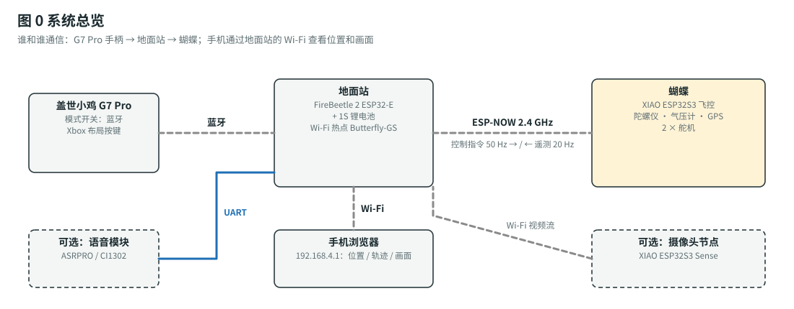

# 6 自由度机械臂（Arduino Uno R3 版）

最常见的**黑色铝合金 6 舵机机械臂**（底座旋转 + 大臂 + 小臂 + 手腕俯仰 + 手腕旋转 + 机械爪），用 **Arduino Uno R3** 控制，**盖世小鸡 G7 Pro** 手柄操控（经 USB Host Shield）。两种模式：

- **关节模式**：每根摇杆转一个关节。
- **XYZ 模式**：推摇杆，夹爪沿**上下、左右、前后**走直线（逆运动学自动算各关节角度）。

另外还有：动作自动平滑、示教回放（路点存 EEPROM）、急停。电脑 / AI / 语音模块可以通过串口发文字指令。

| 从这里开始 | 内容 |
|---|---|
| 📋 [`docs/build-plan.md`](docs/build-plan.md) | **总计划**：材料清单（名称 / 规格 / 型号 / 价格）、分阶段步骤、验收标准、故障排查、安全规则 |
| 🔌 [`docs/assembly-guide.md`](docs/assembly-guide.md) | **组装指南**：电源和信号接线图、焊接、机械装配、标定，每一步都有注意事项和检查点 |
| 🧮 [`docs/motion-control.md`](docs/motion-control.md) | 运动控制原理：正 / 逆运动学、平滑轨迹、保护、舵机扭矩校核 |
| 🔎 [`docs/robot-arm-research.md`](docs/robot-arm-research.md) | GitHub 开源项目调研与选型 |
| 🔧 [`firmware/README.md`](firmware/README.md) | 固件：开发环境、引脚、手柄连接、指令、标定程序 |
| 🧩 [`cad/README.md`](cad/README.md) | 3D 打印件：电控托板、舵机线夹 |
| 🤖 [`tools/arm_client.py`](tools/arm_client.py) | 电脑 / AI 通过 USB 串口发指令 |

## 硬件一览

| 部分 | 型号 |
|---|---|
| 主控 | Arduino Uno R3 + USB Host Shield 2.0 |
| 舵机 | 套件自带 6 × MG996R（可选：J2 换 DS3225MG，手臂能伸得更远） |
| 电源 | 12 V 5 A 适配器 → 20 A 降压 6.0 V（舵机，经急停）+ MP1584 5 V（Uno） |
| 手柄 | 盖世小鸡 G7 Pro（PC / XInput 模式，USB 线） |
| 结构 | 6 自由度铝合金机械臂支架套件 + 400 × 300 mm 底板 |

## 仓库里的另一个项目：仿生蝴蝶 🦋

[`butterfly/`](butterfly/README.md)：ESP32-S3 扑翼仿生蝴蝶（G7 Pro 手柄、陀螺仪增稳、Type-C 充电、GPS 返航）。翅膀用**仿生蝴蝶材料包**做。

> 以前的版本：ESP32 无线版机械臂在提交 `fe0b446`（`git checkout fe0b446` 查看）。
