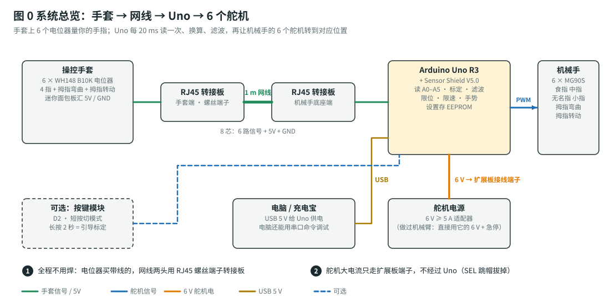
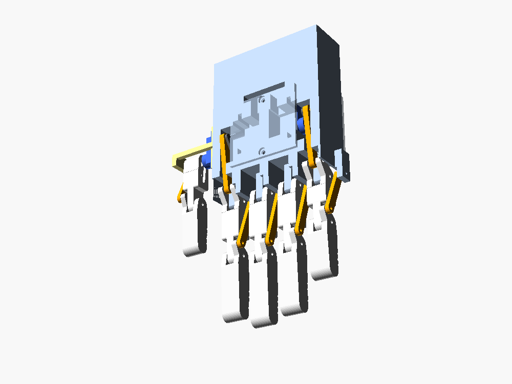
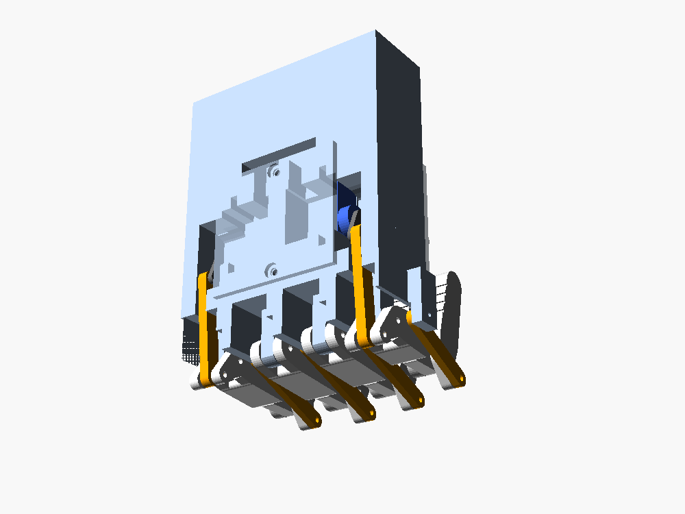
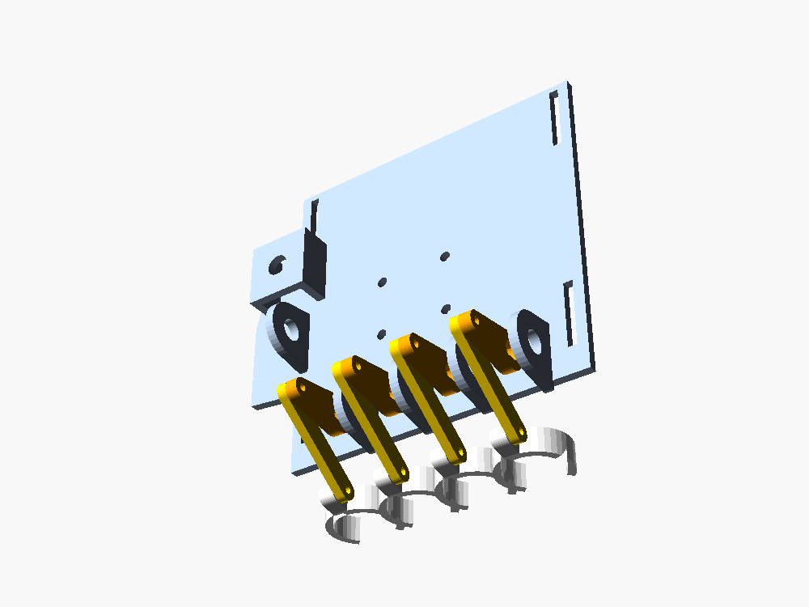

# 手套操控仿生手 (Glove-controlled Bionic Hand)

> 这个文件夹是仿生手项目（仓库根目录是 6 自由度机械臂项目）。

戴上一只 3D 打印的外骨骼手套，你怎么动手指，机械手就怎么动。**6 个自由度**：食指、中指、无名指、小指、拇指弯曲、拇指转动。

- **主控**：一块 Arduino Uno R3，就用学习套件里的那块，加 Sensor Shield V5.0 扩展板。手套和机械手之间用 1 m 网线有线连接。**全程不用焊接**。
- **机械手全部 3D 打印**，驱动是 6 个 MG90S。每根手指只用 1 个舵机：驱动连杆带近节转动，联动杆让远节跟着一起弯。连杆尺寸由程序解四连杆算出并做过校核，零件也做过干涉检查。
- **手套**：每根手指一个电位器，通过曲柄连杆接到指环上；拇指另有一个电位器测转动。
- **固件**：三点标定、滤波防抖、每个舵机单独限位 / 限速、10 个预设手势、演示模式；拔掉网线机械手会自动张开。设置存在 EEPROM。

| 张开 | 握拳 + 拇指对掌 | 手套 |
|---|---|---|
|  |  |  |

| 从这里开始 | 内容 |
|---|---|
| 📋 [`docs/build-plan.md`](docs/build-plan.md) | **总计划**：材料清单（名称 / 规格 / 型号 / 价格）、分阶段步骤、验收标准、故障排查、安全 |
| 🔌 [`docs/assembly-guide.md`](docs/assembly-guide.md) | **组装指南**：接线图、手指和手掌装配、舵盘对中、限位、手套标定，每步都有检查点 |
| 🧮 [`docs/principles.md`](docs/principles.md) | 原理：电位器读数、标定、滤波、四连杆、扭矩校核、延迟和电源预算（带公式） |
| 🖨️ [`print/下单清单.md`](print/下单清单.md) | **直接下单打印**：29 个 STL（文件名带数量）+ 材料建议，[一键打包下载](print/bionic_hand_print_files.zip)，可以直接发给嘉立创 |
| 🧩 [`cad/README.md`](cad/README.md) | 3D 打印件：参数化模型、打印方向、螺丝清单 |
| 🔧 [`firmware/README.md`](firmware/README.md) | 固件：引脚、模式、串口命令、单元测试 |
| 📐 [`tools/finger_linkage.py`](tools/finger_linkage.py) | 四连杆设计 / 校核工具，生成 `cad/linkage_params.scad` |

## 硬件一览

| 部分 | 型号 |
|---|---|
| 主控 | Arduino Uno R3 + Sensor Shield V5.0 |
| 舵机 | 6 × MG90S 金属齿（指尖力约 1 N，能抓 100 g 以内的轻物） |
| 手套传感器 | 6 × WH148 B10K 电位器（卖家焊好杜邦线）+ 迷你面包板 |
| 连接 | 1 m 网线 + 2 块 RJ45 螺丝端子转接板（8 芯：6 路信号 + 5V + GND） |
| 电源 | 舵机：6 V ≥ 5 A 适配器（做过机械臂的话，直接用它的 6 V + 急停）；Uno：USB |
| 结构 | 全部 3D 打印，PETG 约 250 g；M2 螺丝当销轴 |
| 尺寸 | 约 1.2 倍真人手：手掌 92 × 114 mm，中指长 96 mm |
