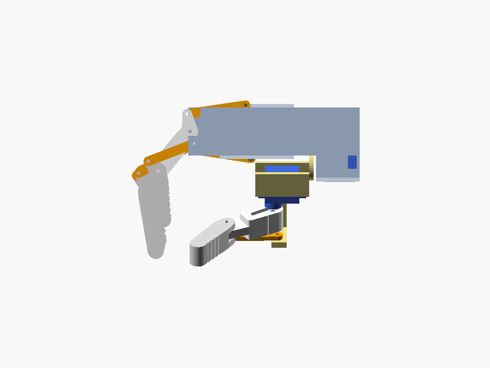
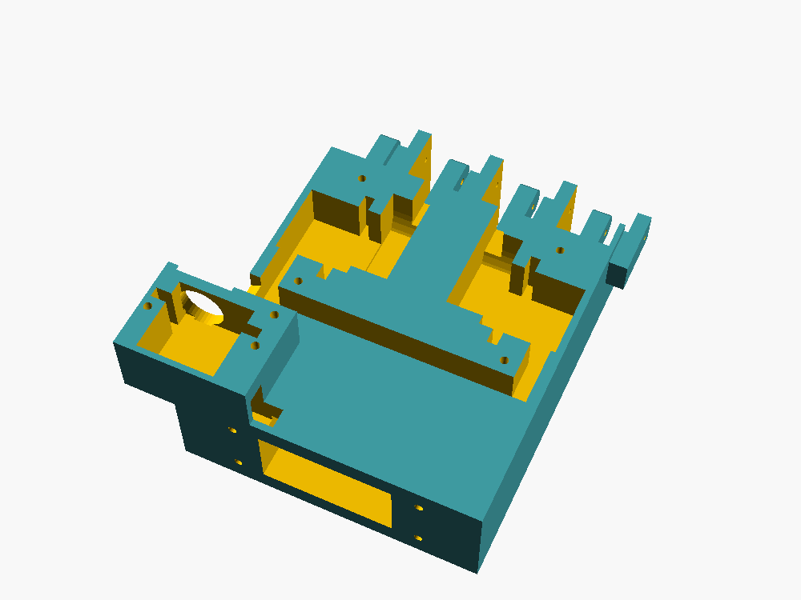

# 3D 打印件：机械手 + 操控手套

> 🖨️ **只想下单打印？** 直接用 [`../print/`](../print/下单清单.md)：已经整理好的 29 个 STL（文件名带数量）、材料建议和打包下载，可以直接发给嘉立创。

全部零件都是 **OpenSCAD 参数化模型**。连杆长度、销孔位置不是手画的，由 [`../tools/finger_linkage.py`](../tools/finger_linkage.py) 解四连杆、校核之后写进 [`linkage_params.scad`](linkage_params.scad)。所以**不要手改这个文件**：改脚本里的参数，再运行 `python3 tools/finger_linkage.py --scad`。

| 总装：张开 | 总装：握拳 + 拇指对掌 | 侧视（半握） |
|---|---|---|
|  |  |  |

> ⚠️ **STL 按默认尺寸导出**：MG90S 机身 22.8 × 12.2 × 22.5 mm，安装耳总长 32.2 mm；手套按指关节间距 20 mm。不同品牌的舵机差 0.5–1 mm 很常见，**到货后先量**，改 [`common.scad`](common.scad) 的 [舵机尺寸] 一节，再运行 `./export_all.sh` 重新导出。

---

## 1. 零件清单

打印参数：PETG（首选）或 PLA，层高 0.2 mm，4 圈壁（手套 3 圈），填充 30–40 %。重量按 PETG、约 60 % 实心估算。

### 机械手

| 文件 | 零件 | 数量 | 外形 (mm) | 重量 | 打印方向 |
|---|---|---|---|---|---|
| `palm.stl` | 手掌：上下两层舵机槽 + 大鱼际 + 手腕 | 1 | 114 × 120 × 47 | ≈ 160 g | 已摆好：手背面贴热床。槽顶靠桥接，**支撑：仅从热床生成** |
| `cover_dorsal.stl` | 手背盖板（压住食指、小指舵机） | 1 | 56 × 50 × 4 | 7 g | 平面朝下 |
| `cover_palmar.stl` | 手心盖板（压住中指 / 无名指舵机） | **2** | 28 × 50 × 4 | 3 g | 平面朝下 |
| `thenar_cover.stl` | 大鱼际盖板（压住拇指转动舵机） | 1 | 40 × 30 × 3 | 2 g | 平面朝下 |
| `thumb_bracket.stl` | 拇指支架（圆盘 + 弯曲舵机托架 + G 点侧板） | 1 | 68 × 24 × 39 | 4 g | 圆盘朝下 |
| `index_proximal.stl` … `pinky_proximal.stl` | 四指近节（叉子 + 驱动销凸耳） | 各 1 | 51–59 × 19 × 15 | 4–6 g | 已摆好：侧躺，销孔竖直 |
| `index_distal.stl` … `pinky_distal.stl` | 四指远节（中节 + 指尖一体，带 C 点凸耳） | 各 1 | 48–60 × 16 × 15 | 5–7 g | 侧躺 |
| `index_link.stl` … `pinky_link.stl` | 联动杆（G → C） | 各 1 | 3 mm 厚 | < 1 g | 平放 |
| `index_rod.stl` … `pinky_rod.stl` | 驱动连杆（舵盘 → D 点） | 各 1 | 4 mm 厚 | < 1 g | 平放 |
| `thumb_proximal.stl` | 拇指近节（内侧有单臂舵盘槽，直接装在舵盘上） | 1 | 48 × 13 × 15 | 5 g | 侧躺 |
| `thumb_distal.stl` / `thumb_link.stl` | 拇指远节 / 联动杆 | 各 1 | — | — | 同上 |

> 四指的联动杆、驱动连杆长度各不相同，**每根手指用自己的那一组**。文件名前缀就是手指名，打印完用记号笔写上。

### 操控手套

| 文件 | 零件 | 数量 | 说明 |
|---|---|---|---|
| `glove_plate.stl` | 手背板：6 个电位器支架 + 拇指翼 + 带子槽 + 扎带孔 | 1 | 右手版；左手用 `-D 'left=true'` 导出 |
| `glove_crank.stl` | 曲柄（D 形孔套电位器轴） | 6 | |
| `glove_link.stl` | 连杆 | 6 | |
| `glove_ring_S/M/L.stl` | 指环，内径 17 / 19 / 21 mm | 4 | 量近节指骨最粗处，选合适的号 |
| `glove_thumb_ring.stl` | 拇指指环（侧面多一个凸台接拇指转动连杆） | 1 | 内径 22 mm |


---

## 2. 螺丝（五金）

| 位置 | 螺丝 | 数量 |
|---|---|---|
| MCP 销、PIP 销、D 点（穿过叉子） | M2×20 内六角 + M2 防松螺母 | 4 + 5 + 4 = 13 |
| 驱动连杆 ↔ 舵盘 | M2×8 + M2 螺母 | 4 |
| C 点、G 点（联动杆两头） | PA 2×8 自攻 | 10 |
| 拇指弯曲舵机安装耳 | PA 2×8 自攻 | 2 |
| 盖板（手背 2、手心 4、大鱼际 3） | PA 3×10 自攻 | 9 |
| 手掌 → 底座盒盖 | PA 3×12 自攻 | 4 |
| 手套：曲柄 ↔ 连杆 | M2×12 + M2 螺母 | 6 |
| 手套：连杆 ↔ 指环 | PA 2×8 自攻 | 6 |
| 舵盘 ↔ 拇指支架 / 拇指近节 | 舵机附带的小自攻螺丝 | 6 |

---

## 3. 设计要点



- **舵机分两层**：手背层放食指、小指，手心层放中指、无名指。输出轴都横着，舵盘和连杆正好落在对应手指的中心平面上，所以驱动是纯平面运动。四个舵机各自错开，互不重叠。
- **四连杆全部校核过**：不卡死；传动角 ≥ 34°；舵机行程 107°；指尖 1 N 时需要的扭矩 ≤ MG90S 堵转扭矩的 58 %。详见 [`../docs/principles.md`](../docs/principles.md)。
- **干涉检查**：用 [`assembly.scad`](assembly.scad) 摆出姿态，再用 OpenSCAD 求交集。结果：
  - 手指（张开 / 半握 / 握拳）与手掌、与盖板不相交；
  - 舵机与手掌不相交；
  - 拇指支架在 $\psi = 0\text{–}120^\circ$、弯曲 $0\text{–}85^\circ$ 范围内与手掌、与盖板都不相交。

  **$\psi = 135^\circ$ 时支架会碰手掌**，所以拇指转动的限位不要超过对掌位置。
- **拇指**：拇指转动舵机的轴沿手掌长轴。支架上的弯曲舵机输出轴沿径向，拇指近节直接装在它的舵盘上，没有连杆。

---

## 4. 文件

| 文件 | 作用 |
|---|---|
| [`common.scad`](common.scad) | 公共尺寸：舵机、销孔、手指截面、间隙；小工具（`side`、`x_hole`、`bar`） |
| [`linkage_params.scad`](linkage_params.scad) | **自动生成**：四连杆尺寸（手指 + 手套） |
| [`hand_lib.scad`](hand_lib.scad) | 所有机械手零件的模块 |
| [`finger.scad`](finger.scad) / [`palm.scad`](palm.scad) / [`glove.scad`](glove.scad) | 导出入口：选 `finger`、`part` |
| [`assembly.scad`](assembly.scad) | 总装预览：`-D close=0.5 -D psi=90 -D tflex=40` |
| [`export_all.sh`](export_all.sh) | 一次导出全部 31 个 STL 到 `stl/`（CI 也用它，有任何警告就失败） |

重新生成预览图（需要 `xvfb-run`）：

```bash
xvfb-run -a openscad -D close=1 -D psi=110 -D tflex=60 --viewall --autocenter \
  --camera=0,0,0,-65,0,-35,0 --imgsize=1000,750 -o img/hand_fist.png assembly.scad
```
