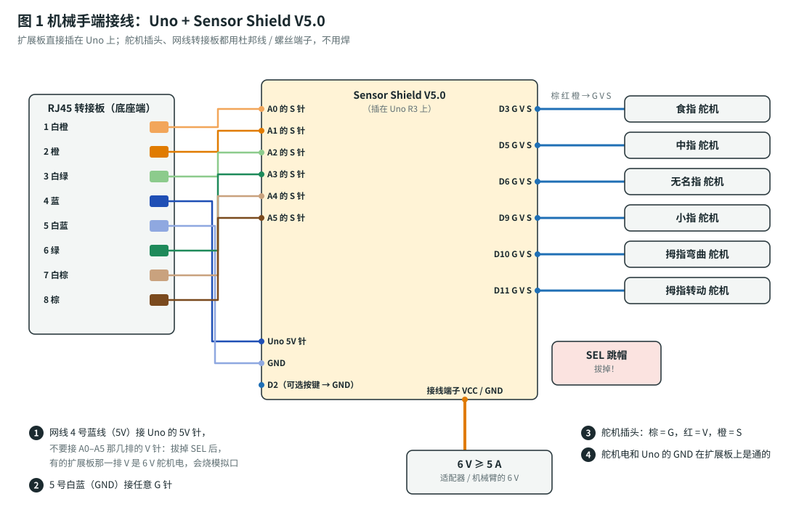
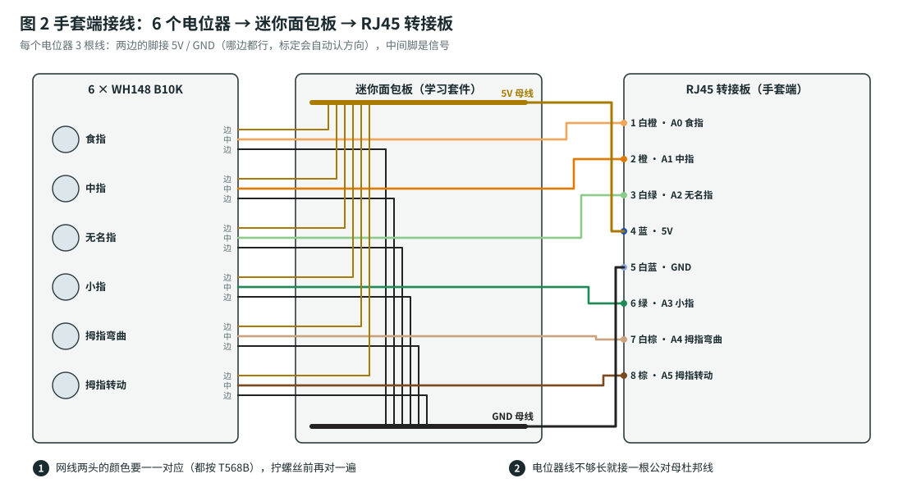

# 组装指南：接线、机械装配、限位与标定

> 材料清单和整体进度见 [`build-plan.md`](build-plan.md)，打印件见 [`../cad/README.md`](../cad/README.md)，串口命令见 [`../firmware/README.md`](../firmware/README.md)。
> 全程**不用焊接**。每一节结尾都有 ✅ 检查点：通过了再往下做。

---

## 0. 先认识一下

| 名称 | 在哪 | 作用 |
|---|---|---|
| MCP 关节 | 手指和手掌之间 | 舵机通过**驱动连杆**带它转 |
| PIP 关节 | 近节和远节之间 | 由**联动杆**带着和 MCP 一起弯，没有单独的舵机 |
| 手背层 / 手心层 | 手掌里上下两层舵机槽 | 手背层装食指、小指舵机；手心层装中指、无名指舵机 |
| 大鱼际块 | 手掌根部、手心一侧、拇指那边 | 装拇指转动舵机 |
| 拇指支架 | 装在拇指转动舵机的舵盘上 | 上面装拇指弯曲舵机，拇指直接装在它的舵盘上 |


---

## 1. 工具

- 十字螺丝刀 PH0 / PH1，M2 / M3 内六角扳手（看你买的螺丝是什么头）
- 尖嘴钳（拧防松螺母时夹住螺母）
- 1.5 mm、2 mm 麻花钻头（可以手拧）：用来清理打印件的销孔
- 游标卡尺（量舵机、量手指粗细）
- 电脑 + Arduino IDE 2.x + Uno 的 USB 线

---

## 2. 机械手端接线



1. 把 **Sensor Shield V5.0** 对准插在 Uno 上。所有针脚都要插到底，不能错位一排。
2. **拔掉扩展板上的 SEL 跳帽**。拔掉以后，舵机电只从接线端子进，不经过 Uno。
3. 6 V 电源的 + / − 接扩展板接线端子 **VCC / GND**。先别通电。
4. 舵机插头按下表插到对应数字口那一排，**棕线朝 G**：

   | 舵机 | 口 | 电位器 | 口 |
   |---|---|---|---|
   | 食指 | D3 | 食指 | A0 |
   | 中指 | D5 | 中指 | A1 |
   | 无名指 | D6 | 无名指 | A2 |
   | 小指 | D9 | 小指 | A3 |
   | 拇指弯曲 | D10 | 拇指弯曲 | A4 |
   | 拇指转动 | D11 | 拇指转动 | A5 |

5. 网线的 RJ45 转接板（底座端）用 8 根杜邦线接到扩展板上：1、2、3、6、7、8 号线分别接 A0–A5 那一排的 **S 针**；4 号线（蓝）接 Uno 的 **5V 针**；5 号线（白蓝）接任意 **G 针**。
6. （可选）按键模块：S 接 **D2**，另一脚接 **GND**。

> ⚠️ **电位器的 5V 一定取自 Uno 的 5V 针**，不要用 A0–A5 那几排的 V 针。有些扩展板拔掉 SEL 以后，那一排 V 连的是 6 V 舵机电；6 V 进模拟口会烧坏 Uno。
>
> ⚠️ 舵机电的 + 绝对不能碰到 Uno 的 5V / VIN。

✅ **检查点 2**：先**不**接 6 V，只插 USB，Uno 的电源灯亮。万用表打到直流电压档，量扩展板接线端子 VCC–GND，应该接近 0 V（说明 SEL 确实拔了）。

---

## 3. 手套端接线



1. 迷你面包板背面有双面胶，贴在手套底板后部的空位上；RJ45 转接板用 2 根扎带绑在底板的 4 个小孔上。
2. 每个电位器的两个**边上**的脚：一根插面包板的 5V 母线，一根插 GND 母线。哪根接哪边都行，标定时固件会自动识别方向。
3. **中间**脚（信号）插到面包板中间的一列；同一列再插一根杜邦线，拧到 RJ45 转接板对应的端子上（食指 1、中指 2、无名指 3、小指 6、拇指弯曲 7、拇指转动 8）。
4. 面包板的 5V 母线接转接板 4 号，GND 母线接 5 号。
5. 网线两头都是 T568B 线序（买现成的网线就是）。两头转接板上的**端子号**要一一对应。

✅ **检查点 3**：网线插上，Uno 接电脑，串口监视器 115200，输入 `STREAM` 回车。串口会打印 6 列数字；逐个转动电位器，对应那一列应该在 50–1000 之间平滑变化。拔掉网线，6 列都应该跳到 1015 以上（掉线检测）。再输入一次 `STREAM` 关掉打印。

---

## 4. 打印

零件清单、数量、打印方向见 [`../cad/README.md`](../cad/README.md)。打印完：

- 所有 **Ø2.3 销孔**用 2 mm 钻头手拧通一遍，M2 螺丝要能自由转动。
- 所有 **Ø1.7 自攻孔**（C 点、G 点、舵盘螺丝孔）不要扩孔，自攻螺丝要靠它咬住。
- 撕掉手掌手心那面的支撑，舵机槽里的毛刺用小刀修干净，舵机能**推进去不晃**就对了。

✅ **检查点 4**：把一个 MG90S 放进每个舵机槽试一下，安装耳能落进耳槽，机身不高出槽口。

---

## 5. 机械手组装

### 5.1 手指（每根手指重复一次）

1. 远节 M 的叉子套住近节 P 的舌头，**PIP 销**：M2×20 螺丝穿过去，另一头拧防松螺母。拧到**刚好不晃**，远节能靠自重垂下来。太紧就退半圈。
2. 联动杆的一头用 **M2×8 自攻螺丝**拧到远节 +X 侧的 C 点凸耳上（凸耳就在 PIP 销后面，偏手背那边）。不要拧死，要能转动。
3. 除拇指外，驱动连杆先不装。

### 5.2 舵机装进手掌

1. **先通电把 6 个舵机都回中**：Uno 刚上电时所有舵机都是 1500 µs（默认限位都是 1500/1500）。通电前舵盘先不装，等舵机转到中位再断电。
2. 食指、小指的舵机从**手背**那面放进手背层的槽；中指、无名指的舵机从**手心**那面放进手心层的槽。输出轴要朝着对应手指的那一侧，也就是朝舵盘缺口。
3. 舵机线顺着机身尾部的走线槽走，进手腕空腔，从手掌底面出去。
4. 盖上手背盖板（1 块）和手心盖板（2 块，形状一样，左边那块在盖板平面内转 180°），每块用 2 颗 **M3×10 自攻螺丝**固定。盖板上的垫块正好压住舵机侧面；压不紧就贴一层 1 mm 泡棉双面胶。

### 5.3 舵盘和驱动连杆

舵机在中位（1500 µs）时，舵盘的**单臂**方向如下：

| 舵机 | 舵盘单臂朝向（1500 µs 时） | 伸直时（设计值） | 握拳时（设计值） |
|---|---|---|---|
| 食指、小指（手背层） | 垂直手掌，**朝手背** | 136° | 29° |
| 中指、无名指（手心层） | 垂直手掌，**朝手心** | −30° | −137° |

> 角度的含义：在手指平面里，从"指尖方向"转到"手背方向"为正。整个行程约 107°，中位正好在中间，所以舵盘单臂垂直手掌时，手指大约是半握状态。

1. 单臂舵盘按上表方向套上输出轴，拧中心螺丝。
2. 驱动连杆一头用 **M2×8 螺丝 + 螺母**装在舵盘上**离中心 10 mm 的孔**（通常是第 2 个孔）。另一头先空着。

### 5.4 手指装上手掌

1. 近节的叉子套住手掌的舌头，**MCP 销**：M2×20 + 防松螺母。
2. 驱动连杆的另一头伸进近节叉子里的 D 点，用 **M2×20 + 防松螺母**穿过去。
3. 联动杆的另一头对准手掌隔板上的 G 点（MCP 后下方），用 **M2×8 自攻螺丝**拧进去，同样不要拧死。
4. 用手慢慢把手指从伸直掰到握拳：全程不能卡住，远节要跟着弯。卡住的话，最常见的原因是销孔太紧，或者螺丝拧得太死。

### 5.5 拇指

1. 拇指转动舵机从大鱼际块的手心那面放进槽里，输出轴朝指尖方向，装上大鱼际盖板（3 颗 M3×10 自攻螺丝）。
2. 圆舵盘用 4 颗舵盘自带的小自攻螺丝拧在**拇指支架**的圆盘背面（孔位对不上就用 1.5 mm 钻头现钻）。舵机在中位时，把支架套上输出轴，托架朝**手掌外侧斜下方**（对应 $\psi \approx 60^\circ$），然后从圆盘中心孔拧中心螺丝。
3. 拇指弯曲舵机从外侧放进托架，安装耳用 2 颗 M2×8 自攻螺丝拧在托架端面上。
4. 单臂舵盘先用 2 颗小自攻螺丝拧进拇指近节内侧的舵盘槽里。舵机在中位时，把近节套上输出轴，让拇指**半弯**（约 40°），再从近节外侧的大孔伸螺丝刀拧中心螺丝。
5. 拇指远节、联动杆的装法和其他手指一样。联动杆的 G 点在支架外侧的侧板上。

### 5.6 装到底座

手掌底面有 4 个 M3 自攻孔（间距 56 × 18 mm）。底座用一个塑料接线盒（约 150 × 100 × 70 mm），在盒盖上钻 4 个 Ø3.4 孔、1 个 Ø15 穿线孔，用 4 颗 M3×12 把手掌竖着固定在盒盖上。Uno、扩展板、网线转接板放在盒子里。

✅ **检查点 5**：断电状态下，每根手指都能用手轻轻掰动，全程不卡；拇指支架能从侧面转到手心下方。

---

## 6. 通电调试

### 6.1 第一次上电

1. 在 Arduino IDE 里打开 `firmware/bionic_hand_uno/bionic_hand_uno.ino`，开发板选 **Arduino Uno**，上传。
2. 打开串口监视器，115200，行尾选"换行"。
3. 接上 6 V。所有舵机应该停在 1500 µs（中位），手指半握。

### 6.2 一次只动一个舵机

`SERVO ch us` 让单个舵机转到指定脉宽（输入这条命令会进入 MANUAL 模式）。每次只改 **50 µs**，一边改一边看：

```
SERVO 0 1450
SERVO 0 1400
...
```

先弄清楚每个舵机往哪个方向是"伸直"，往哪个方向是"弯"。

### 6.3 设置舵机限位 LIM

对每个通道 `ch` 做一遍：

1. 用 `SERVO ch us` 找到手指**刚好伸直**的脉宽 $u_o$。继续往外转时连杆会开始顶住，退回来 30 µs。
2. 找到手指**刚好握紧**的脉宽 $u_c$。同样，顶住的位置退回 30 µs。
3. 输入 `LIM ch uo uc`，例如 `LIM 0 2010 960`。$u_c$ 比 $u_o$ 小也没关系，那就表示这个舵机是反向的。

> ⚠️ **拇指转动（通道 5）**：$u_c$ 设在**拇指刚好转到手心下方、和食指相对**的位置，**不要再往里转**。再往里转约 15°，支架就会碰到手掌（见 [原理 §10](principles.md#10-拇指的两个自由度和限位)）。

全部设完后输入 `SAVE`。`SHOW` 可以随时查看。

✅ **检查点 6.3**：输入 `G paper`，手全张开；输入 `G rock`，握拳。每个舵机都不应该有持续的"嗡嗡"声（嗡嗡响说明顶住了，要把那个通道的 LIM 往回收 30 µs）。

### 6.4 手套组装

1. 6 个电位器从电位器支架的**外侧**穿进去，M7 螺母从里侧拧紧。引脚朝手腕方向。
2. 电位器轴伸出来的这一侧套上**曲柄**（D 形孔对准轴的平面），曲柄朝上。
3. 连杆一头用 M2×12 螺丝 + 螺母装在曲柄末端，另一头用 M2×8 自攻螺丝拧进**指环**顶上的凸台。
4. 指环按手指粗细选 S / M / L，戴在近节指骨的中间。开口朝手心。
5. 手背板用两条 20 mm 魔术贴绑带穿过带子槽，绑在手掌上。手背和底板之间垫 2 mm EVA 泡棉。

### 6.5 手套标定

有按键：按住 D2 按键 2 秒，然后按串口提示，每做好一个手势就短按一下。
没有按键：在串口依次输入

```
CAL OPEN       ← 手完全张开、拇指贴着食指
CAL HALF       ← 每根手指弯一半，拇指转到一半
CAL CLOSED     ← 握拳，拇指压在四指上
SAVE
```

做完 `CAL CLOSED`，串口会检查每个通道。显示 `calibration OK` 就可以 `SAVE`；如果某个通道报 `not monotonic or range < 60`，就去检查那一路的电位器和曲柄有没有打滑、连杆有没有装反。

✅ **检查点 6.5**：输入 `MODE MIRROR`（开机默认就是这个模式），慢慢握拳再张开，机械手应该跟着做。`SHOW` 里每个通道的 `n` 应该在 0 到 1000 之间变化。

### 6.6 玩起来

- `G scissors`、`G ok`、`G like`、`G one`…… 让机械手摆出手势；`MODE MIRROR` 回到跟随手套。
- `MODE DEMO` 每 1.5 秒自动换一个手势。按键短按也能在 MIRROR / DEMO 之间切换。
- 拔掉手套网线：机械手先保持 0.5 秒，然后慢慢张开；插回去立刻恢复跟随。
