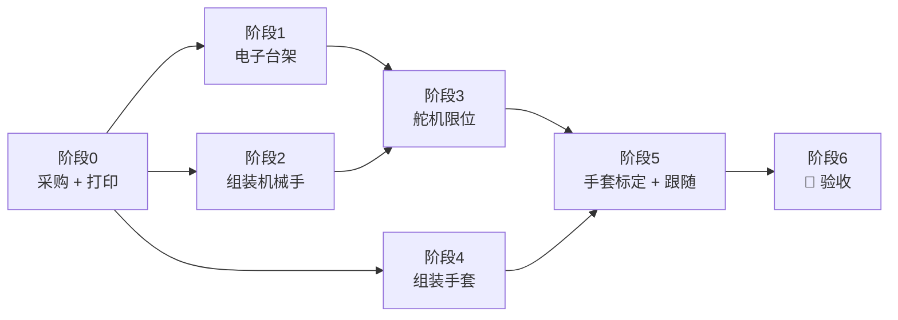

# 手套操控仿生手：总计划

> **最终目标（验收标准）**：戴上手套，机械手的 5 根手指跟着你的手动：四指弯曲、拇指弯曲、拇指转动，一共 6 个自由度，延迟 ≤ 0.2 s。能做出石头 / 剪刀 / 布、OK、点赞和数 1–4；能用拇指和四指握住 100 g 以内的轻物（纸杯、乒乓球、空塑料瓶）保持 10 秒；拔掉手套网线后，机械手 1 秒内自己张开。**连续 3 次**都做到。
>
> 其他文档：
> - 接线、组装、限位、标定：[`assembly-guide.md`](assembly-guide.md)
> - 原理（公式、四连杆、扭矩、滤波）：[`principles.md`](principles.md)
> - 打印件：[`../cad/README.md`](../cad/README.md)
> - 固件和串口命令：[`../firmware/README.md`](../firmware/README.md)

---

## 0. 路线图

| 阶段 | 内容 | 预计耗时（业余时间） | 出口条件 |
|---|---|---|---|
| 0 | 买材料、打印全部零件（约 25 小时机时） | 1 周（主要是等快递和打印） | 物料到齐，打印件修整完 |
| 1 | Uno + 扩展板 + 6 个舵机在桌上跑通 | 半天 | 串口 `SERVO` 能单独转每个舵机 |
| 2 | 手指、手掌、拇指组装 | 1–2 天 | 断电时每根手指能掰动、不卡 |
| 3 | 舵盘对中、装连杆、设 LIM | 半天 | `G paper` / `G rock` 没有嗡嗡声 |
| 4 | 手套：电位器、曲柄、连杆、指环、接线 | 半天 | `STREAM` 里 6 路读数都随手指变化 |
| 5 | 标定 + 跟随调试 | 半天 | 跟随流畅，没有明显抖动 |
| 6 | 验收 | 1 小时 | 上面的验收标准全部通过 |

总计大约 **1.5–2 周**。

---

## 1. 材料清单 (BOM)

价格是 2026 年淘宝常见价，仅供参考。

### 1.1 已经有的（学习套件 / 机械臂项目）

| 名称 | 规格 | 用在哪 |
|---|---|---|
| Arduino Uno R3 + USB 线 | ATmega328P | 主控 |
| 杜邦线 | 公对母、公对公各 20 根，20 cm | 网线转接板 ↔ 扩展板，电位器 ↔ 面包板 |
| 迷你面包板 | 170 孔（SYB-170） | 手套上汇集 5V / GND |
| 按键模块（可选） | 3 脚轻触按键模块 | D2：切模式、引导标定 |
| 6 V 10 A 适配器 + 急停（做过机械臂的话） | 见机械臂 BOM | 舵机电源。有这个就**不用买 1.2 里的电源** |

### 1.2 还要买的

| # | 名称 | 规格 / 型号 | 数量 | 单价 | 小计 |
|---|---|---|---|---|---|
| 1 | 金属齿数字舵机 | **MG90S**，4.8–6 V，180°，堵转 2.0–2.2 kg·cm，附单臂 / 圆盘舵盘和螺丝 | 6（建议买 7 个，留 1 个备用） | ¥9 | ¥63 |
| 2 | 传感器扩展板 | **Arduino Sensor Shield V5.0**（每个数字口都有 G/V/S 排针，带外部电源端子和 SEL 跳帽） | 1 | ¥6 | ¥6 |
| 3 | 旋转电位器 | **WH148 B10K**，单联，M7 螺纹套，6 mm D 形轴，轴长 15 mm，**卖家焊好 20 cm 杜邦线** | 6（+2 备用） | ¥2.5 | ¥20 |
| 4 | RJ45 转接板 | 8P 母座转 8 位螺丝端子 | 2 | ¥5 | ¥10 |
| 5 | 网线 | 超五类，1 m（手套到底座的距离，按需要选 1–2 m） | 1 | ¥5 | ¥5 |
| 6 | 舵机电源（没做过机械臂才买） | 6 V 5 A 适配器，DC 5.5×2.1 + DC 母座转接线端子 | 1 套 | ¥25 | ¥25 |
| 7 | M2 螺丝套装 | 内六角 M2×8 / 12 / 16 / 20 + M2 防松螺母（尼龙圈），盒装 | 1 盒 | ¥15 | ¥15 |
| 8 | M2 自攻螺丝 | PA 2×8（C 点、G 点、舵机安装耳、手套指环） | 30 颗 | — | ¥4 |
| 9 | M3 自攻螺丝 | PA 3×10 / 3×12（盖板、底座） | 15 颗 | — | ¥4 |
| 10 | 魔术贴绑带 | 20 mm 宽，背对背，2 m | 1 | ¥6 | ¥6 |
| 11 | EVA 泡棉 | 2 mm 背胶（手套垫手背）+ 1 mm 双面泡棉胶（盖板压舵机） | 各 1 小张 | ¥5 | ¥5 |
| 12 | 塑料接线盒 | ABS，约 150 × 100 × 70 mm（底座） | 1 | ¥12 | ¥12 |
| 13 | 3D 打印耗材 | PETG（首选）或 PLA，约 250 g | — | ¥20 | ¥20 |
| | | | | **合计** | **约 ¥170–195** |

> 没有 3D 打印机：把 [`cad/stl/`](../cad/stl/) 里的文件发给淘宝上的"3D 打印代打"，PETG 大约 ¥80–150。
>
> 买舵机时注意：**MG90S 必须是金属齿**，SG90 塑料齿会被联动机构打坏。不同品牌尺寸会差 0.5–1 mm，到货后先量一下，数字写进 `cad/common.scad` 的 [舵机尺寸] 再导出 STL。

### 1.3 打印件

全部零件见 [`../cad/README.md`](../cad/README.md)：手指 5 套（近节、远节、联动杆；四指另有驱动连杆）、手掌、3 块盖板、拇指支架，手套底板、6 个曲柄、6 根连杆、5 个指环。

---

## 2. 各阶段步骤

### 阶段 0：采购 + 打印

- [ ] 下单 1.2 里的材料
- [ ] 量舵机：机身长 / 宽 / 高、安装耳总长、安装耳高度，改 `cad/common.scad`，运行 `cad/export_all.sh` 重新导出 STL（尺寸和默认值一样就不用改）
- [ ] 量手：相邻两个指关节的中心距（默认 20 mm）、近节指骨最粗处的直径（选指环 S/M/L），改 `cad/glove.scad` 开头的参数
- [ ] 打印：先打一根**食指**（近节 + 远节 + 两根杆）试装，确认销孔配合合适，再打其余零件

### 阶段 1：电子台架

- [ ] 按 [组装指南 §2](assembly-guide.md#2-机械手端接线) 接线，SEL 跳帽拔掉
- [ ] 上传固件，串口显示 `no saved settings: DEFAULTS`
- [ ] 接 6 V：6 个舵机转到中位并保持
- [ ] `SERVO 0 1300` … `SERVO 5 1700`：每个舵机都能单独转

### 阶段 2：组装机械手

- [ ] 按 [组装指南 §5](assembly-guide.md#5-机械手组装) 组装。**舵盘一定要在舵机中位时装**
- [ ] 检查点 5：断电掰手指不卡

### 阶段 3：舵机限位

- [ ] 按 [§6.3](assembly-guide.md#63-设置舵机限位-lim) 逐个设置 `LIM` 并 `SAVE`
- [ ] `G paper` / `G rock` / `G scissors`：动作正确，没有嗡嗡声

### 阶段 4：手套

- [ ] 按 [§3](assembly-guide.md#3-手套端接线) 接线，按 [§6.4](assembly-guide.md#64-手套组装) 组装
- [ ] `STREAM`：6 列读数都随对应手指变化；拔掉网线后全部 > 1015

### 阶段 5：标定 + 跟随

- [ ] `CAL OPEN` → `CAL HALF` → `CAL CLOSED` → `SAVE`
- [ ] `MODE MIRROR`：握拳、张开、单独动每根手指都能跟上
- [ ] 手静止时舵机不抖；抖的话见故障排查

### 阶段 6：🎯 验收

| # | 项目 | 标准 | 结果 |
|---|---|---|---|
| 1 | 6 路跟随 | 单独弯每根手指，只有对应那根动 | ☐ |
| 2 | 延迟 | 快速握拳，机械手 ≤ 0.2 s 跟上（手机慢动作录像数帧） | ☐ |
| 3 | 手势 | 石头 / 剪刀 / 布 / OK / 点赞 / 1–4 都能做出来 | ☐ |
| 4 | 握物 | 握住纸杯 / 乒乓球 / 空塑料瓶，保持 10 秒不掉 | ☐ |
| 5 | 掉线保护 | 拔网线 → 保持约 0.5 s → 1 s 内张开 | ☐ |
| 6 | 静止 | 手不动时 10 秒内舵机没有抖动、没有嗡嗡声 | ☐ |
| 7 | 重复 | 1–6 连续 3 次通过 | ☐ |

---

## 3. 故障排查

| 现象 | 可能原因 | 怎么办 |
|---|---|---|
| 一接 6 V，Uno 就重启 | SEL 跳帽没拔，舵机电流走了 Uno | 拔掉 SEL；舵机电只接扩展板端子 |
| 舵机不动，串口正常 | 6 V 没接，或接线端子正负接反 | 量扩展板端子电压；检查舵机插头方向（棕 = G） |
| 某个手指卡在半路 | 销孔太紧、螺丝太紧，或舵盘没在中位装 | 2 mm 钻头通孔，螺丝退半圈；舵机回中重装舵盘 |
| 握拳时某个舵机一直嗡嗡响 | LIM 超过了机构极限，舵机在顶 | 这个通道的 $u_c$ 往回收 30 µs，`SAVE` |
| 远节不跟着弯 | 联动杆没装，或 C / G 点螺丝拧死了 | 装上联动杆；自攻螺丝退到能转为止 |
| `STREAM` 里某一列一直 1023 | 那一路信号线没接上，或电位器 GND 断了 | 查面包板和 RJ45 端子，对照图 2 |
| 所有列都是 1023，机械手自己张开 | 网线没插，或 5 号线（GND）断了 | 插好网线；两头端子号是否一一对应 |
| 标定提示 `not monotonic` | 曲柄在轴上打滑，或连杆装在了曲柄另一面 | 曲柄 D 形孔对准平面压紧；重新 `CAL` |
| 跟随时抖动 | 网线太长、电位器接触不良 | 电位器换备用的；`SLEW 25` 降速；实在不行把 `hand_core.h` 里的 `DEADBAND` 改大 |
| 拇指转动时碰到手掌 | 通道 5 的 $u_c$ 设过头了 | 按 [§6.3](assembly-guide.md#63-设置舵机限位-lim) 重设，停在对掌位置 |
| 抓东西没力气 | MG90S 指尖力只有约 1 N（见[原理 §7.3](principles.md#73-扭矩校核虚功原理)） | 抓轻物；需要大力气要换 25 kg 级舵机，手掌要重新设计 |

---

## 4. 安全

- **夹手**：舵机力气不大，但手指根部的连杆和舵盘会夹手。调试 `LIM` 时手指不要伸进手掌缝里。
- **堵转发热**：舵机长时间顶着（嗡嗡响）会发热、烧毁。听到嗡嗡声就马上收 LIM，或者断开 6 V。
- **电源**：6 V 适配器用正规的（带过流保护）。接线端子拧紧，裸线不能外露。有机械臂的急停就串上。
- **如果用 18650 电池代替适配器**：必须用带保护板的电芯，2 节串联后再用降压模块降到 5.5–6 V，**不要**把 8.4 V 直接接舵机。充电时有人看着。
