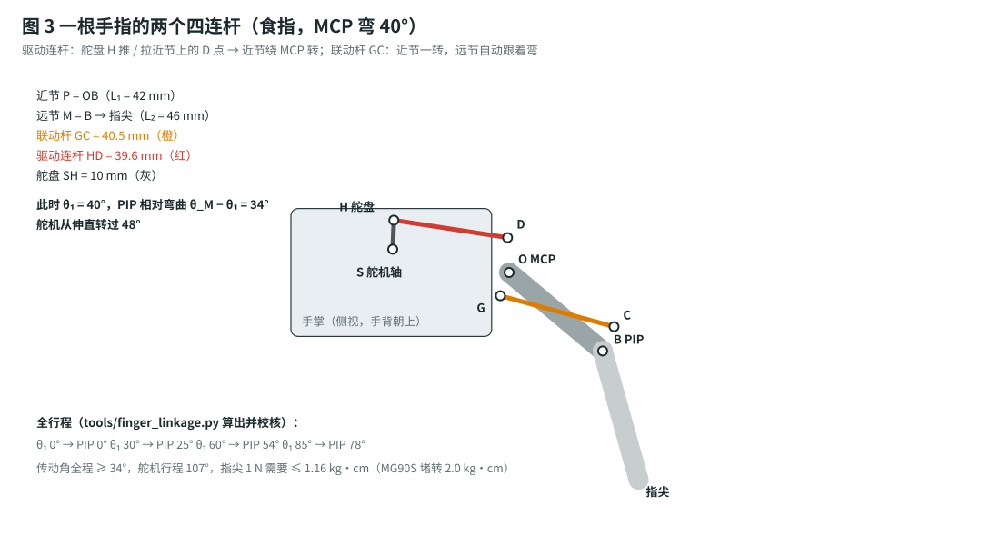

# 原理：信号链、标定滤波、手指四连杆、扭矩与电源

> 这份文档解释"为什么这么设计"。只想做出来的话，看 [`build-plan.md`](build-plan.md) 和 [`assembly-guide.md`](assembly-guide.md) 就够了。
> 文中的数字都来自 [`tools/finger_linkage.py`](../tools/finger_linkage.py)（机构）和 [`firmware/bionic_hand_uno/hand_core.h`](../firmware/bionic_hand_uno/hand_core.h)（固件），改了参数重新跑一遍即可。

---

## 1. 信号链 (signal chain)

每 20 ms（50 Hz）Uno 做一遍：

$$
\underbrace{r_i}_{\text{ADC } 0\ldots1023}
\xrightarrow{\ \text{calibrate}\ }
\underbrace{n_i}_{0\ldots1000}
\xrightarrow{\ \text{EMA + deadband}\ }
\bar n_i
\xrightarrow{\ \text{limits}\ }
u_i^{*}\ [\mu\text{s}]
\xrightarrow{\ \text{slew}\ }
u_i
\longrightarrow \text{servo } i
$$

通道 $i = 0\ldots5$ 依次是：食指、中指、无名指、小指、拇指弯曲、拇指转动。
$n = 0$ 表示手指伸直 / 拇指靠在手掌旁边，$n = 1000$ 表示握紧 / 拇指对掌。

---

## 2. 电位器读数：分压 + 内部上拉

电位器两端接 5 V 和 GND，滑动端（中间脚）接模拟口。设滑动端到 GND 这一侧占全程的比例为 $\alpha \in [0, 1]$，电位器阻值 $R = 10\,\mathrm{k\Omega}$。
从模拟口看进去，电位器等效成戴维南电源：

$$
V_{\text{th}} = \alpha V_{cc}, \qquad R_{\text{th}} = \alpha (1 - \alpha) R .
$$

固件把 A0–A5 设成 `INPUT_PULLUP`（芯片内部上拉 $R_{pu} \approx 35\,\mathrm{k\Omega}$，接到 $V_{cc}$），于是

$$
V = V_{\text{th}} + \left(V_{cc} - V_{\text{th}}\right)\frac{R_{\text{th}}}{R_{\text{th}} + R_{pu}},
\qquad
r = \left\lfloor 1023 \cdot \frac{V}{V_{cc}} \right\rfloor .
$$

- **单调**：$\alpha$ 增大时 $V$ 一定增大，所以标定之后仍然一一对应。
- **误差很小**：$R_{\text{th}}$ 在 $\alpha = 0.5$ 时最大，为 $2.5\,\mathrm{k\Omega}$，此时读数偏高 $0.5 \times \dfrac{2.5}{2.5 + 35} \approx 3.3\,\%$，而且三点标定会把它吸收掉。
- **白捡一个功能**：网线没插时，6 个口都被上拉到 $r \approx 1023$。固件看到**6 路同时** $r \ge 1015$ 持续 $200\,\mathrm{ms}$，就判定"手套掉线"：先保持 $0.5\,\mathrm{s}$，再慢慢张开手。正常使用时 6 个电位器不可能同时转到头（每个只用约 $130^\circ$ 的行程，见第 6 节），所以不会误判。

---

## 3. 三点分段线性标定

每个人手的大小、手套戴的松紧都不一样，所以每个通道记下 3 个读数：张开 $r_o$、半握 $r_h$、握拳 $r_c$。

$$
n(r) =
\begin{cases}
\operatorname{clamp}\!\left(500 \cdot \dfrac{r - r_o}{r_h - r_o},\ 0,\ 500\right), & r \text{ 在 } r_o \text{ 与 } r_h \text{ 之间（含外侧）} \\[2ex]
\operatorname{clamp}\!\left(500 + 500 \cdot \dfrac{r - r_h}{r_c - r_h},\ 500,\ 1000\right), & r \text{ 越过 } r_h
\end{cases}
$$

- 电位器装反了（$r_c < r_o$）也没关系，公式对两个方向都成立。
- 为什么要"半握"这一点？手套四连杆和上拉电阻都让 $r$ 与手指角度之间**不是直线关系**。用两段折线去逼近，中间那一段的误差能减小一半以上。
- 有效性检查：$(r_h - r_o)(r_c - r_h) > 0$（单调），并且 $|r_c - r_o| \ge 60$（行程够大）。不满足时这个通道输出 $n = 0$（张开，最安全），串口会提示是哪一路。

---

## 4. 滤波：指数滑动平均 + 滞回死区

**EMA**（exponential moving average，指数滑动平均）：

$$
y_k = y_{k-1} + \alpha\,(x_k - y_{k-1}), \qquad \alpha = \tfrac14 .
$$

固件里用整数实现：累加器 $a_k = 4y_k$，更新式为 $a_k = a_{k-1} + x_k - \lfloor a_{k-1}/4 \rfloor$，全程不用浮点。
等效的一阶低通时间常数和截止频率（采样周期 $T = 20\,\mathrm{ms}$）：

$$
\tau = \frac{-T}{\ln(1 - \alpha)} = \frac{20\,\mathrm{ms}}{0.288} \approx 70\,\mathrm{ms},
\qquad
f_c \approx \frac{1}{2\pi\tau} \approx 2.3\,\mathrm{Hz}.
$$

手指动作一般在 $1\text{–}2\,\mathrm{Hz}$ 以内，所以不会被削弱；电位器的毛刺、网线上的干扰则被压下去。

**滞回死区**：输出 $\bar n$ 只在下面两种情况下更新：

$$
|y_k - \bar n| > 6 \qquad \text{或} \qquad y_k = x_k \ (\text{EMA 已经追平输入}).
$$

- 第一条：手静止时，$\pm 4$ 以内的抖动不会传到舵机，舵机就不会"嗡嗡"地来回找位置。
- 第二条：慢慢移动到某个位置停下后，输出最终**正好**等于输入，不会差几个单位停住。单元测试验证了这两点（`testSmooth`）。

---

## 5. 舵机：限位映射 + 限速

每个舵机有两个脉宽：伸直时 $u_o$、握紧时 $u_c$，单位 µs。映射是

$$
u^{*} = u_o + (u_c - u_o)\,\frac{\bar n}{1000}, \qquad u^{*} \in [500, 2500]\ \mu\text{s}.
$$

$u_c < u_o$ 就等于"反向"，所以不需要单独的反向开关。

**限速**（slew limit）：每个周期最多变化 $s$：

$$
u_k = u_{k-1} + \operatorname{clamp}\!\left(u^{*} - u_{k-1},\ -s,\ s\right),\qquad s = 40\ \mu\text{s} / 20\ \text{ms}.
$$

MG90S 大约 $10\ \mu\text{s}$ 对应 $1^\circ$，所以最快约 $2000\ \mu\text{s/s} \approx 200^\circ/\text{s}$。好处有两个：手套突然甩动时机械手不会"抽"一下；6 个舵机不会同时满电流起步，把电源拉垮。

---

## 6. 延迟预算

| 环节 | 时间 |
|---|---|
| 读 6 路 ADC，每路平均 4 次（每次约 $112\ \mu\text{s}$） | $\approx 2.7\ \text{ms}$ |
| 控制周期（最坏等一整个周期） | $\le 20\ \text{ms}$ |
| EMA 时间常数 $\tau$ | $\approx 70\ \text{ms}$ |
| 舵机 PWM 帧 | $\le 20\ \text{ms}$ |
| MG90S 转 $60^\circ$（6 V 空载 $0.1\ \text{s}/60^\circ$） | $\approx 100\ \text{ms}$ |
| **合计（手指明显动作到机械手跟上）** | $\approx 0.15\text{–}0.2\ \text{s}$ |

人眼几乎感觉不到这点延迟。想要更跟手，可以把 `EMA_SHIFT` 改成 1（$\alpha = \tfrac12$，$\tau \approx 29\ \text{ms}$），代价是抖动变多。

---

## 7. 机械手手指：两个四连杆

每根手指由两节组成：近节 P（长 $L_1$）和远节 M（中节和指尖做成一体，长 $L_2$），只用 **1 个舵机**驱动。
用复数表示手指平面上的点（实部 $z$ 沿手指方向，虚部 $y$ 朝手背），原点放在 MCP 销上，弯曲角 $\theta$ 朝手心为正：

$$
e(\theta) = e^{-i\theta}.
$$

### 7.1 联动杆：让 PIP 跟着 MCP 一起弯（交叉四连杆）

- 手掌上的固定点 $G = -3 - 8i$（MCP 后面 3 mm、偏手心 8 mm）。
- 远节上的点 $C$，在远节自己的坐标里是 $c = -7 + 6i$（PIP 后面 7 mm、偏手背 6 mm）。
- 两点之间是一根长度固定为 $\ell$ 的联动杆。

$$
B = L_1\,e(\theta_1), \qquad C = B + e(\theta_M)\,c, \qquad |C - G| = \ell = \bigl|L_1 + c - G\bigr| .
$$

给定 MCP 角 $\theta_1$，就能解出远节的绝对角 $\theta_M$，也就是两个圆的交点：以 $B$ 为圆心、半径 $|c|$ 的圆，和以 $G$ 为圆心、半径 $\ell$ 的圆。PIP 的相对弯曲是 $\theta_M - \theta_1$：

| MCP $\theta_1$ | 0° | 45° | 85° |
|---|---|---|---|
| 食指 PIP $\theta_M - \theta_1$ | 0° | 39.2° | 78.3° |
| 中指 PIP | 0° | 39.8° | 77.8° |
| 小指 PIP | 0° | 37.3° | 80.1° |

两个关节的比例约为 $0.9 : 1$，接近人手的自然握拳。$G$ 和 $C$ 分别在手指中线的两侧，所以这是"交叉"四连杆；如果放在同一侧（平行四边形），远节只会平移，不会弯曲。

### 7.2 驱动连杆：舵盘 → 近节

- 舵机轴 $S = -40 \pm 8i$：手背层 $+$，手心层 $-$。
- 舵盘孔半径 $h = 10$ mm，舵盘孔的位置是 $H(\varphi) = S + h\,e^{i\varphi}$。
- 近节上的驱动销 $D(\theta_1) = e(\theta_1)\,D_0$，其中 $|D_0| = 12$ mm。
- 两点之间是长度固定为 $\rho$ 的连杆：$\bigl|D(\theta_1) - H(\varphi)\bigr| = \rho$。

**传动角** $\mu$ 是连杆与曲柄之间的夹角，取锐角那一侧。$\mu$ 越接近 $90^\circ$，力传得越顺；小于 $30^\circ$ 就容易"顶死"。
$D_0$ 的方向按下式选取，让近节摆动的 $85^\circ$ **对称地**分布在"垂直于连杆"的方向两侧：

$$
\arg D_0 = \pm 90^\circ + \tfrac{85^\circ}{2}.
$$

舵盘在伸直位置的角度 $\varphi_0$ 由程序搜索得到，目标是让全程最小的 $\mu$ 最大。结果：

| 手指 | 舵机层 | 连杆 $\rho$ | 舵机行程 | 最小传动角 |
|---|---|---|---|---|
| 食指 / 小指 | 手背（推） | 39.6 mm | 107° | 35° |
| 中指 / 无名指 | 手心（拉） | 39.7 mm | 107° | 34° |
| 拇指 | 直接装在舵盘上 | — | 85° | 90° |

四根手指的舵机分上下两层、左右错开，所以**每个舵盘和连杆都正好落在对应手指的中心平面里**，是纯平面运动，不会别劲。每组零件都用 OpenSCAD 做过干涉检查：张开、半握、握拳三个姿态都互不相碰。

### 7.3 扭矩校核（虚功原理）

设指尖受到一个垂直于远节的力 $F$，舵机转过 $\delta\varphi$ 时指尖移动 $\delta\mathbf p$。能量守恒给出

$$
\tau\,\delta\varphi = \mathbf F \cdot \delta\mathbf p
\quad\Longrightarrow\quad
\tau = F \left|\,\mathbf n_M \cdot \frac{\partial \mathbf p_{\text{tip}}}{\partial \varphi}\right| .
$$

程序在全行程上每 $5^\circ$ 算一次，取最大值。指尖 $F = 1\ \text{N}$（约 100 g）时：

| 手指 | 需要的最大扭矩 | MG90S 堵转扭矩（4.8 V） | 占比 |
|---|---|---|---|
| 中指（最长） | 1.16 kg·cm | 2.0 kg·cm | 58 % |
| 食指 | 1.09 kg·cm | 2.0 kg·cm | 55 % |
| 小指 | 0.89 kg·cm | 2.0 kg·cm | 45 % |
| 拇指（直驱） | 1.11 kg·cm | 2.0 kg·cm | 56 % |

所以每根手指能稳定提供约 1 N 的指尖力（校核要求不超过堵转扭矩的 70 %）。用来抓纸杯、乒乓球、空塑料瓶这类 100 g 以内的东西没问题；抓重物要换大扭矩的舵机。
直觉上的理由：联动让指尖速度大约是 $L_1 + 1.9 L_2$，手指越长，同样的舵机扭矩在指尖上产生的力就越小。

---

## 8. 手套：每根手指一个四连杆

电位器轴 $P$ 固定在手背板上，位置在 MCP 关节**正上方** 26 mm。曲柄长 18 mm，连杆长 34.4 mm，另一端接到套在近节指骨上的指环销 $R$（离 MCP 20 mm，高 16 mm）。
手指从伸直弯到 $90^\circ$：

| 手指 MCP | 0° | 45° | 90° |
|---|---|---|---|
| 电位器转角 | 0° | −75° | −130° |
| 传动角 | 35° | 70° | 35° |

- 转角全程**单调**，所以标定后一一对应。
- 行程 $130^\circ$，WH148 的电气行程是 $300^\circ$，对应 $\dfrac{130}{300} \times 1023 \approx 445$ 个 ADC 读数。分辨率约 $0.2^\circ$ / 读数，远超舵机本身的分辨率。
- 行程没用满，两头各留约 $85^\circ$。所以电位器装的时候不用对得很准，只要手指伸直时轴大致在中间就行。

---

## 9. 电源预算

| 状态 | 单个 MG90S | 6 个 |
|---|---|---|
| 静止保持 | 约 10 mA | 约 60 mA |
| 正常动作 | 150–250 mA | 约 1 A |
| 堵转（握住东西，最坏） | 约 700 mA | 约 4.2 A |

- 所以舵机电源要 **6 V ≥ 5 A**。做过机械臂的话，那个 6 V 10 A 适配器 + 急停可以直接拿来用。
- 舵机电只接扩展板的接线端子，并且**拔掉 SEL 跳帽**，大电流就不会经过 Uno 的稳压器。Uno 用 USB 供电。
- 手套上 6 个电位器共 $6 \times \dfrac{5\ \text{V}}{10\ \text{k}\Omega} = 3\ \text{mA}$，从 Uno 的 5 V 取电完全没问题。

---

## 10. 拇指的两个自由度和限位

拇指装在一个支架上，支架由"拇指转动"舵机带着绕手掌长轴（$z$ 轴）转 $\psi$。弯曲舵机随支架一起转，拇指近节直接装在它的舵盘上。

- $\psi = 0^\circ$：拇指张开在手掌侧面。
- $\psi \approx 120^\circ$：拇指转到手心下面，和四指相对（对掌），可以捏东西。
- **$\psi$ 超过约 $120^\circ$，支架会碰到手掌的手心盖板**（干涉检查：$\psi = 120^\circ$ 不碰，$\psi = 135^\circ$ 已经相交）。所以标定拇指转动舵机的限位时，握紧那一端**不要超过对掌位置**，见[组装指南](assembly-guide.md#63-设置舵机限位-lim)。
