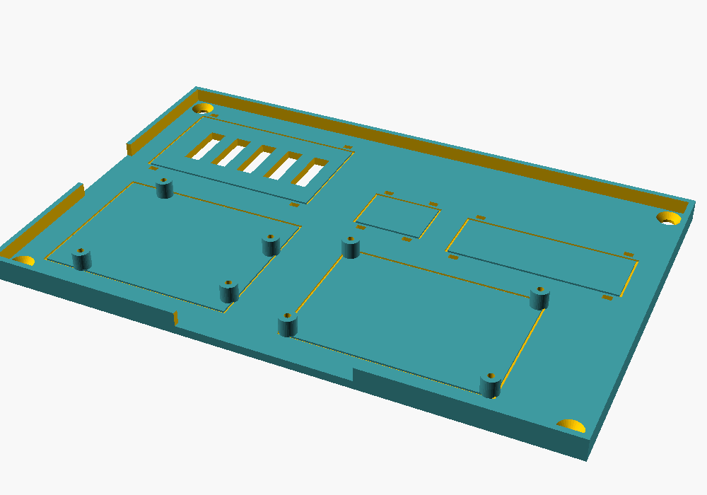

# 3D 打印件：电控托板 + 舵机线夹

机械臂本体用**铝合金支架套件**（材料清单 M1），不需要打印。这里的两个零件是辅助件：把电控模块整齐地固定住，把舵机线固定在支架上。两个都是 **OpenSCAD 参数化模型**：改文件开头的数字，就能重新导出 STL。

| 文件 | 零件 | 数量 | 外形尺寸 | 打印重量（约） |
|---|---|---|---|---|
| [`electronics_tray.scad`](electronics_tray.scad) → [`stl/electronics_tray.stl`](stl/electronics_tray.stl) | 电控托板：Arduino Uno（官方 4 个孔位）和舵机分线板用立柱固定，两个降压模块、WAGO 端子用扎带固定 | 1 | 200 × 130 × 9 mm | 55–60 g |
| [`cable_clip.scad`](cable_clip.scad) → [`stl/cable_clip.stl`](stl/cable_clip.stl) | 舵机线夹：卡在 2 mm 厚的支架板边上，能放 3 根并排的舵机线 | 10 左右 | 11.5 × 14.6 × 8 mm | 0.5 g / 个 |




## 1. 打印前先量尺寸

**不同店铺的模块孔距不一样。** 先用游标卡尺量，再改 `.scad` 开头的参数：

| 零件 | 参数 | 含义 | 默认值 |
|---|---|---|---|
| 托板 | `uno` / `uno_holes` | Uno 的位置和 4 个安装孔（官方尺寸，一般不用改） | 68.6 × 53.3 |
| 托板 | `perf` | 舵机分线板（洞洞板）：`[x, y, 长, 宽, 孔距x, 孔距y]` | 50 × 70 板，孔距 65 × 45 |
| 托板 | `buck` / `mp1584` / `wago` | 扎带固定区：`[x, y, 长, 宽]` | 见文件 |
| 托板 | `post_hole` | 立柱底孔（M2.5 自攻螺丝用 2.2） | 2.2 mm |
| 线夹 | `sheet_t` | 支架板厚 | 2.0 mm |
| 线夹 | `cables` / `cable_w` / `cable_h` | 并排几根线 / 线宽 / 线厚 | 3 / 3.6 / 1.3 mm |

改完以后：OpenSCAD 里按 **F6** 渲染，**F7** 导出 STL。也可以用命令行：

```bash
cd cad
openscad -o stl/electronics_tray.stl electronics_tray.scad
openscad -o stl/cable_clip.stl cable_clip.scad
```

## 2. 打印设置

| 项目 | 托板 | 线夹 |
|---|---|---|
| 材料 | PETG（PLA 也行） | **PETG**（要有弹性，PLA 容易断） |
| 层高 | 0.2 mm | 0.2 mm |
| 墙 / 填充 | 3 圈 / 20% | 3 圈 / 100% |
| 支撑 | 不需要 | 不需要 |
| 摆放 | 大平面贴热床（STL 已经摆好） | 按 STL 方向平放 |

没有打印机：把 STL 发给淘宝搜索 `PETG 3D打印代打` 的店铺。

## 3. 安装

**托板**：

1. 四角用 4 颗 **M4 × 16 木螺丝**固定在底板上，位置在机械臂底座**正后方**（图 6）。
2. Uno（上面叠着 USB Host Shield）和舵机分线板用 **M2.5 × 6 自攻螺丝**拧在立柱上。
3. 20 A 降压模块、MP1584、WAGO 端子：底面贴一层双面胶，再用 3 mm 扎带从托板下面的扎带孔穿上来绑紧。降压模块下面有通风孔，**散热片朝上**。
4. 线从托板边上的缺口出去，不要压在模块下面。

**线夹**：

1. 沿着支架的板边，每隔 5–8 cm 卡一个，把舵机线塞进线槽：线**竖着**塞进窄缝，进去以后放平，就不会掉出来。
2. **关节附近不要卡**：留出一段松弛的线，关节转到两头时线都不能被拉紧。
3. 太松就把 `grip_fit` 改成 0.2 重新打印；太紧、卡不进去就改成 0。
