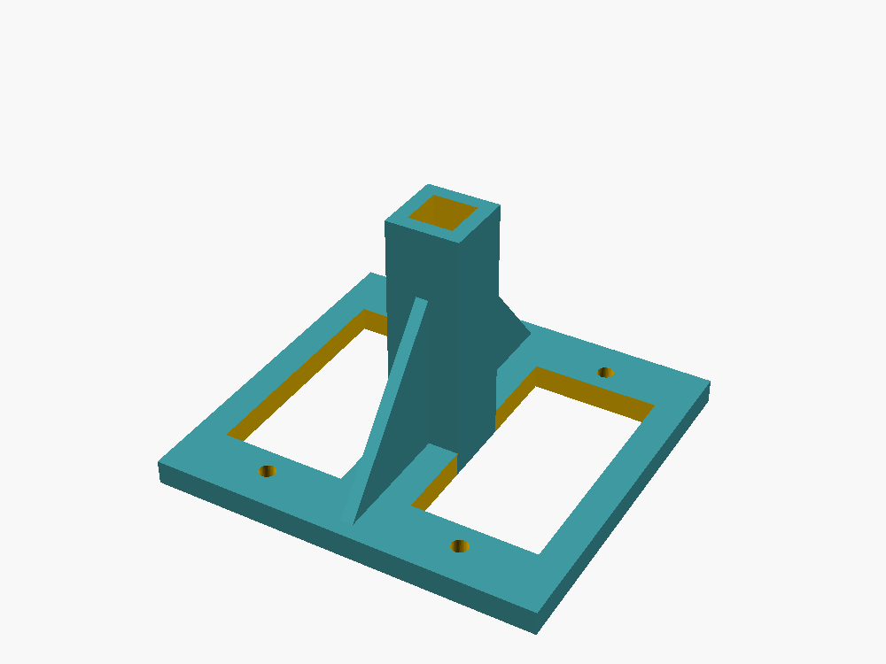
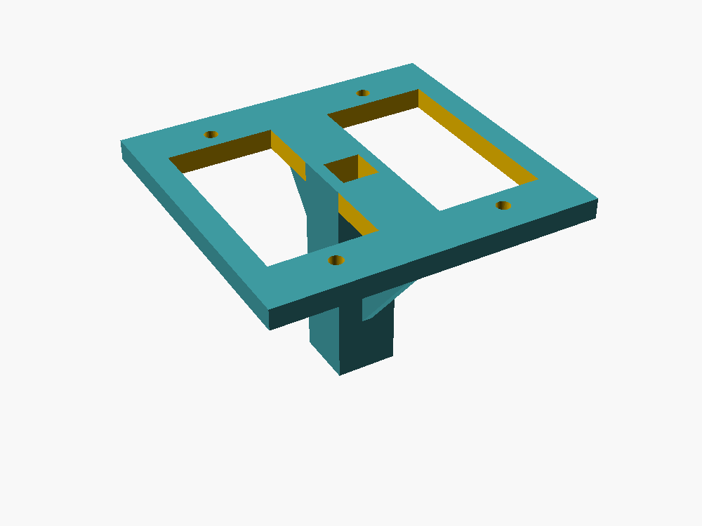
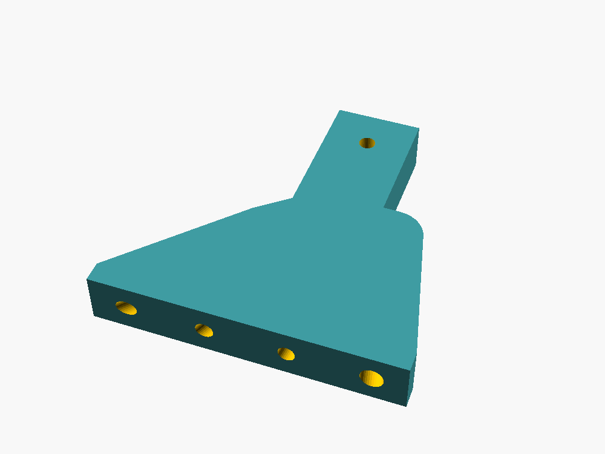
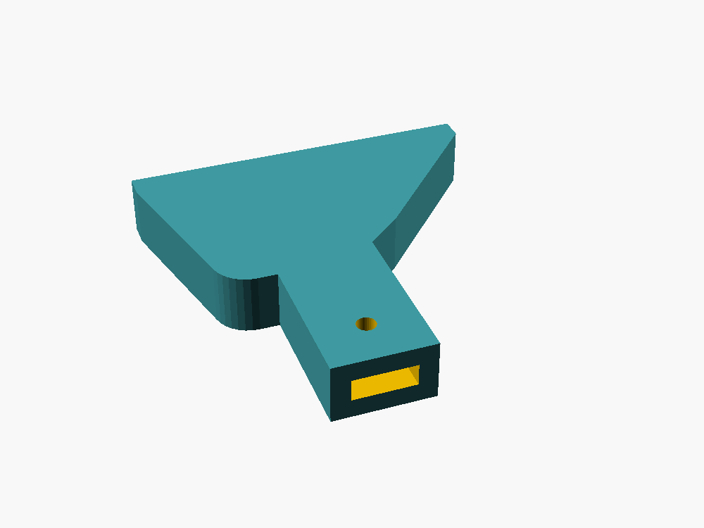
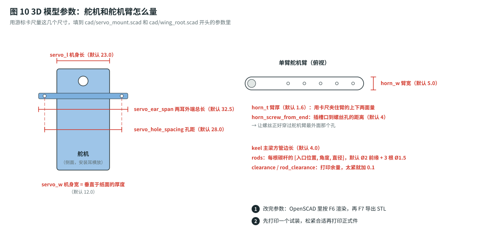

# 3D 打印件：舵机座 + 翼根座

两个零件都是 **OpenSCAD 参数化模型**。所有尺寸都写在 `.scad` 文件开头：量好自己的舵机和舵机臂，改几个数字，就能重新导出 STL。

| 文件 | 零件 | 数量 | 外形尺寸 | 打印重量* |
|---|---|---|---|---|
| [`servo_mount.scad`](servo_mount.scad) → [`stl/servo_mount.stl`](stl/servo_mount.stl) | 舵机座：同时夹住两个舵机，套在 4 × 4 mm 碳管主梁上 | 1 | 37.7 × 35.5 × 24.4 mm | ≈ 2.6 g |
| [`wing_root.scad`](wing_root.scad) → [`stl/wing_root_left.stl`](stl/wing_root_left.stl) | 左翼根座：一侧翅膀的 4 根碳杆都插在这里，插槽套在舵机臂上 | 1 | 29.8 × 30 × 5 mm | ≈ 2.1 g |
| 同上 → [`stl/wing_root_right.stl`](stl/wing_root_right.stl) | 右翼根座（左翼根座的镜像） | 1 | 29.8 × 30 × 5 mm | ≈ 2.1 g |

\* 按 PETG、3 圈壁、25% 填充估算；实际重量以切片软件显示为准。

> ⚠️ **STL 里是默认尺寸**，按常见的 8–9 g 级数字舵机（机身 23 × 12 mm、安装耳总长 32.5 mm、孔距 28 mm）画的。**不同品牌的舵机差 1–2 mm 很常见**，打印前一定先量一下，数字不对就改参数、重新导出。

---

## 1. 零件长什么样

### 舵机座

| 正面（舵机从这面插进去） | 背面（套筒 + 加强筋） |
|---|---|
|  |  |

- **前面板**：两个舵机方孔左右并排，每个方孔上下各有一个 M2 螺丝孔，对准舵机的安装耳。
- **中间套筒**：方孔贯穿面板和套筒，主梁从前往后穿过去，套筒长 22 mm，用 AB 胶粘牢。
- **上下两块三角加强筋**：把面板和套筒连成一体，扑翼的反作用力不会把面板掰弯。

### 翼根座

| 顶面（扇形块 + 插槽段） | 插槽口（套舵机臂的一端） |
|---|---|
|  |  |

- **扇形块**：外侧面上有 4 个斜孔，从前到后依次是前缘（Ø2 mm）、前翅翅脉 1、前翅翅脉 2、后翅杆（Ø1.5 mm），孔深 15 mm。孔的角度和翅膀模板上碳杆的走向一致。
- **插槽段**：内侧是一个扁方槽，舵机臂插进去 12 mm；一个竖直的 M2 螺丝孔穿过插槽，对准舵机臂最外面的孔。
- 左、右零件互为镜像，**不要打印两个一样的**。

---

## 2. 量尺寸、改参数



用游标卡尺量下面这些尺寸（图 10 标出了位置），填进 `.scad` 文件开头对应的变量：

| 零件 | 变量 | 含义 | 默认值 |
|---|---|---|---|
| 舵机座 | `servo_w` | 舵机机身宽度（窄的那边） | 12.0 mm |
| 舵机座 | `servo_l` | 舵机机身长度（沿安装耳方向，不含耳朵） | 23.0 mm |
| 舵机座 | `servo_ear_span` | 两个安装耳外端之间的总长 | 32.5 mm |
| 舵机座 | `servo_hole_spacing` | 两个安装孔的中心距 | 28.0 mm |
| 舵机座 | `keel` | 碳纤维方管主梁的边长 | 4.0 mm |
| 舵机座 | `clearance` | 方孔比实物大多少 | 0.3 mm |
| 翼根座 | `horn_w` / `horn_t` | 舵机臂（单臂）的宽度 / 厚度，量插进槽里那一段 | 5.0 / 1.6 mm |
| 翼根座 | `horn_screw_from_end` | 螺丝孔到插槽口的距离，对准舵机臂最外面的孔 | 4 mm |
| 翼根座 | `rods` | 每根碳杆的 `[入口位置 X, 角度, 直径]` | 见文件 |
| 翼根座 | `rod_clearance` | 碳杆孔比碳杆大多少 | 0.1 mm |

**怎么改**：

1. 安装 [OpenSCAD](https://openscad.org/)（免费），打开 `.scad` 文件。
2. 菜单 **窗口 → 定制器（Customizer）** 会列出所有参数，直接改数字；或者直接改文件开头的数字。
3. 按 **F6** 渲染，再按 **F7** 导出 STL。
4. 翼根座要导出两次：`side = "left"` 导出一次，`side = "right"` 再导出一次。

也可以用命令行一次导出三个文件：

```bash
cd cad
openscad -o stl/servo_mount.stl servo_mount.scad
openscad -o stl/wing_root_left.stl  -D 'side="left"'  wing_root.scad
openscad -o stl/wing_root_right.stl -D 'side="right"' wing_root.scad
```

> 💡 改完舵机座后，OpenSCAD 控制台会打印一行 `面板尺寸 …；两个舵机中心距 …`，可以用来核对。

---

## 3. 打印设置

| 项目 | 设置 | 说明 |
|---|---|---|
| 材料 | **PETG** | 比 PLA 韧，摔了不容易裂；没有 PETG 时先用 PLA 试装 |
| 层高 | 0.2 mm | 0.12–0.16 mm 孔会更圆，但更慢 |
| 墙 | 3 圈 | 螺丝孔和碳杆孔周围要实心 |
| 填充 | 20–30% | 网格或回旋体 |
| 支撑 | **不需要** | |
| 摆放 | 舵机座：**前面板平贴热床**，套筒朝上<br>翼根座：**大平面平贴热床** | STL 已经按这个方向导出，切片软件里不用旋转 |
| 热床附着 | 裙边（Skirt）即可 | 翼根座很小，如果翘边就加 3 mm 的 Brim |

**没有打印机**：把 3 个 STL 发给淘宝搜索 `PETG 3D打印代打` 的店，说明“PETG、3 圈壁、25% 填充、不需要支撑”。一般十几块钱。

> ✅ **强烈建议先打一套试装**：用 PLA 或 PETG 先打一套，试一下舵机、主梁、碳杆、舵机臂能不能装进去，松紧合适了再打正式件。

---

## 4. 打印后的处理

| 问题 | 处理 |
|---|---|
| 舵机方孔太紧 | 用锉刀修一下；或者把 `clearance` 改成 0.4 重新打印 |
| 主梁插不进套筒 | 方孔四个角有打印的圆角，用小方锉修一下角；不要硬砸，会把套筒撑裂 |
| 碳杆孔太紧 | 用 **Ø1.5 / Ø2.0 mm 麻花钻**手拧着铰一遍（不要上电钻），或者 `rod_clearance` 改成 0.15–0.2 |
| 碳杆孔太松、晃 | 没关系，后面用 502 灌满；太松就 `rod_clearance` 改成 0.05 |
| 舵机臂插不进插槽 | 插槽太薄：`horn_t` 加 0.1 重新打；或者把舵机臂两面用砂纸磨一点 |
| M2 螺丝拧不进 | 底孔是 Ø1.6 mm，用 Ø1.5 mm 钻头先扩一下再拧自攻螺丝 |

---

## 5. 装配

### 舵机座

1. **舵机从前面插进方孔**（输出轴朝前），安装耳贴在面板前面；左右两个舵机的输出轴要在**同一个高度**。
2. 每个舵机用 **2 颗 M2 × 6 mm 螺丝**固定（自攻螺丝直接拧进 Ø1.6 底孔；普通机牙螺丝就在背面加螺母）。拧到贴紧就停，PETG 拧滑丝就不牢了。
3. **主梁从面板前面穿进方孔**，一直穿过套筒，前端和面板平齐或者稍微露出 1 mm。
4. 主梁表面先用砂纸打毛，涂 **5 分钟 AB 胶**再插进去；胶固化前检查：**从正前方看，两个舵机的轴要和主梁垂直**、左右对称。
5. ✅ 胶干后（至少 30 分钟），用手拧舵机座，主梁不能转也不能滑。

> ⚠️ 舵机线从方孔后面引出，沿主梁往后走，用细线绑在主梁上，**不要被翅膀扫到**。

### 翼根座

1. 先把**舵机回中**：串口输入 `servo 0 0`（见 [组装指南 4.1](../docs/assembly-guide.md#41-舵机中位装翅膀之前一定要先做)），再装舵机臂：舵机臂朝外、水平，左右对称。
2. **碳杆插进翼根座**：杆头用砂纸打毛，插到孔底（约 15 mm）；孔口用细线缠 6–8 圈，滴 502 让胶渗进去（见 [组装指南 4.3](../docs/assembly-guide.md#43-翅膀连接舵机)）。
3. **翼根座插槽套在舵机臂上**：舵机臂插到底，从上面拧一颗 **M2 × 6 mm 螺丝**穿过插槽和舵机臂最外面的孔（块高 5 mm，6 mm 刚好穿透，背面可加螺母）；最后在插槽口点一滴 502。
4. ⚠️ **左、右不要装反**：装好后前缘（最粗的 Ø2 mm 杆）必须在**前面**（机头方向）。
5. ✅ 用 `bench 1.0` 让翅膀慢慢扑，看翼根座在最高点和最低点都**不碰机身、电线、另一侧的翼根座**。

---

## 6. 坐标约定（改模型时用）

| 零件 | X | Y | Z |
|---|---|---|---|
| 舵机座 | 左右 | 上下 | 前后（Z+ 朝机尾，Z = 0 是面板前面） |
| 翼根座 | 前后（X+ 朝机头） | 向外（Y+ 朝翼尖，Y = 0 是扇形块内侧） | 向上 |

`rods` 里的角度：**正数 = 杆往前偏**，0° = 垂直于机身往外伸。想改翅膀形状时，把模板上每根碳杆和“垂直于机身的线”之间的夹角量出来填进去就行。
