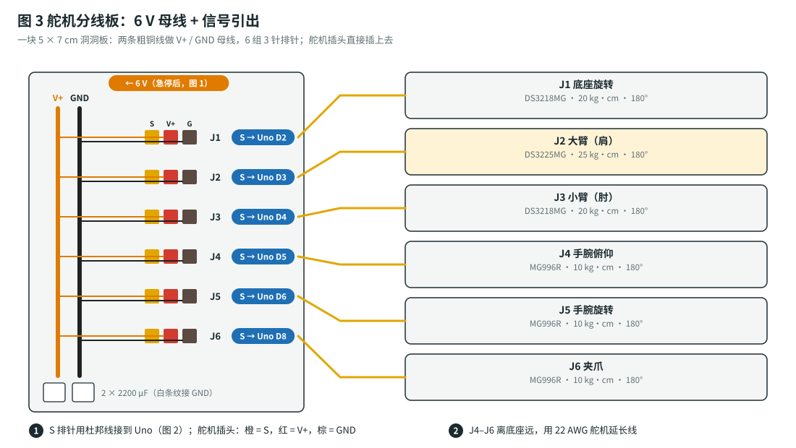
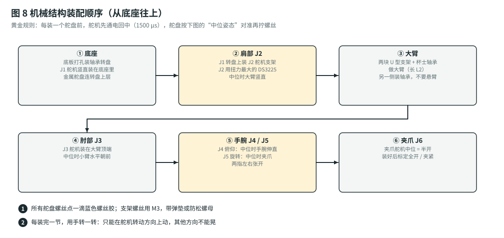

# 6 自由度机械臂（Uno R3 版）：组装指南（接线 · 装配 · 标定）

> 按顺序做，每一步末尾都有 ✅ **检查点**，通过了再做下一步。⚠️ 是容易出错、或者可能损坏零件 / 伤到人的地方。
> 材料编号（E1、P5、M1 …）对应[总计划的材料清单](build-plan.md#1-材料清单bom)。

## 图例（所有接线图通用）

| 颜色 | 含义 |
|---|---|
| 🟥 红 | 12 V 输入 |
| 🟧 橙 | 6 V 舵机电源（大电流，18 AWG） |
| 🟫 深黄 | 5 V（Uno） |
| ⬛ 黑 | GND（地） |
| 🟦 蓝 | 信号 |

**彩色圆角标签**（例如 `GND`、`→ Uno A3`）表示“接到同名的那根线上”。

## 系统总览

- G7 Pro 用 **USB 线**插在 USB Host Shield 上。扩展板叠插在 Uno 上面。
- Uno 的 **D2–D6、D8** 直接输出 6 路舵机信号，送到**舵机分线板**。
- 舵机的大电流从 **12 V → 6 V 大降压模块**来，经过**急停开关**到分线板，**不经过** Uno。

---

## 第 0 步：准备

### 工具和耗材

万用表、电烙铁（320–350 °C）、0.8 mm 焊锡丝、剥线钳、热缩管、游标卡尺、十字和内六角螺丝刀、手机水平仪 App。

### 焊接要点（第一次焊接的人请先看）

1. **先上锡**：线头剥 5 mm，拧紧，烙铁加热后送锡，让锡渗进铜丝里。焊盘也先上一层薄锡。
2. **再对焊**：两边都上好锡，贴在一起，用烙铁一碰就熔在一起。2 秒内完成。
3. **好的焊点**：光亮、呈小山丘形。发灰、呈球形、一碰就动的是虚焊，要重焊。
4. 每个焊点都套**热缩管**。

### 软件

1. 安装 **Arduino IDE 2.x**。
2. **工具 → 管理库**：搜索并安装 **USB Host Shield Library 2.0** 和 **Servo**。
3. 打开 `firmware/arm_uno/arm_uno.ino`，开发板选 **Arduino Uno**，点“验证”：应该显示程序空间约 96%、全局变量约 55%。

---

## 第 1 步：电源

### 1.1 先调好两个降压模块（非常重要）

1. 两个降压模块都**先不接负载**，输入端接 12 V。
2. **大电流降压模块（P5）**：转 **CV** 电位器，用万用表把输出调到 **6.0 V**；**CC** 电位器调到最大（顺时针转到头）。
3. **MP1584（P6）**：调到 **5.3 V**（经过 SS14 二极管后约 5.0 V）。
4. 断电，再通电，重新量一遍。

> ⚠️ 新买的降压模块，出厂输出电压是随机的，可能超过 12 V。**没调好就接舵机或 Uno，会直接烧掉。**
> ⚠️ 舵机电压**不要超过 6.8 V**。

✅ **检查点**：大降压模块 6.0 V（±0.1 V），MP1584 5.3 V（±0.1 V）。

### 1.2 输入部分：DC 母座 → 保险丝 → 开关

1. DC 母座的中心针是正极。**先用万用表量适配器插头确认。**
2. 正极：DC 母座 + → 7.5 A 保险丝 → 船型开关 → 分两路，接两个降压模块的 IN+。
3. 负极：DC 母座 − 分两路，接两个降压模块的 IN−。

⚠️ 开关和保险丝只串在**正极**上。

### 1.3 6 V 舵机支路：降压 → 急停 → 分线板

1. 大降压模块 **OUT+** → **急停开关**（只用**常闭 NC** 触点）→ 舵机分线板的 **V+ 母线**。
2. 大降压模块 **OUT−** → 分线板的 **GND 母线**。
3. 全程用 **18 AWG** 线。

⚠️ **先用万用表通断档确认急停接的是 NC**：没按下时通，按下时断。接成 NO 就反了。

### 1.4 急停检测分压（A3）

两个 10 kΩ 电阻串联，接在**分线板 V+ 母线**和 **GND** 之间，中点接 Uno 的 **A3**：

$$
V_{A3} = V_{\text{舵机}}\cdot\frac{10\,\text{k}\Omega}{10\,\text{k}\Omega + 10\,\text{k}\Omega} = \frac{6.0\ \text{V}}{2} = 3.0\ \text{V}
$$

拍下急停时 A3 变成 0 V，Uno 就知道舵机断电了，会同时停掉舵机信号。这样松开急停时，手臂不会突然乱动。

⚠️ 分压一定要接在**急停后面**（分线板上），接在急停前面就检测不到急停了。

### 1.5 Uno 的 5 V 供电

1. MP1584 **OUT+** → **SS14 正极**（没有白色条纹的一端）→ SS14 负极（有白色条纹的一端）→ Uno 的 **5V 引脚**。
2. MP1584 **OUT−** → Uno 的 **GND**。

⚠️ **不要用 Uno 的 DC 圆口**（VIN）供电：G7 Pro 插在 USB Host Shield 上要从 5 V 取电（还会给手柄充电），Uno 板载的线性稳压器会过热。
⚠️ **不要用 6 V 舵机电给 Uno 供电**：舵机一动电压就跌，Uno 会重启。
💡 调试时 USB 线和 MP1584 同时接着也没关系：SS14 会挡住反向电流。

### 1.6 接地

所有 GND（两个降压模块、分线板、Uno）必须**连在一起**，最好都汇到大降压模块的 OUT− 这一点（星形接地）。

✅ **检查点**（通电前，万用表通断档）：12 V、6 V、5 V 对 GND **都不短路**；急停没按下时导通，按下时断开。
✅ **检查点**（通电后）：Uno 5V 引脚约 5.0 V；分线板 6.0 V；A3 对 GND 约 3.0 V；按下急停后 A3 约 0 V。

---

## 第 2 步：舵机分线板和信号接线

### 2.1 焊舵机分线板

1. 5 × 7 cm 洞洞板上，用 1 mm 镀锡铜线焊两条长母线：**V+** 和 **GND**。
2. 焊 6 组 3 针排针，每组的顺序是 **S · V+ · GND**，和舵机插头**橙 · 红 · 棕**对应。
3. 每组的 V+ 针连到 V+ 母线，GND 针连到 GND 母线。S 针单独引出，用杜邦线接 Uno。
4. 两个 **2200 µF** 电容并在两条母线之间：**白色条纹（负极）接 GND**。

⚠️ 电解电容接反会鼓包甚至爆开。焊之前再看一眼白色条纹。

### 2.2 信号接到 Uno

| 关节 | Uno 引脚 |
|---|---|
| J1 底座 | D2 |
| J2 大臂 | D3 |
| J3 小臂 | D4 |
| J4 手腕俯仰 | D5 |
| J5 手腕旋转 | D6 |
| J6 夹爪 | D8 |
| 急停检测 | A3 |
| 语音模块 TX（可选） | D0 |

⚠️ **D9–D13 被 USB Host Shield 占用，D7 也要留空**（有些扩展板用它复位芯片）。
⚠️ USB Host Shield **先插在 Uno 上**，信号线插在扩展板上对应的排母里（扩展板的引脚和 Uno 一一对应）。
⚠️ 语音模块接在 D0 上时，**上传程序前必须拔掉**：D0 也是下载口，不拔会上传失败。

✅ **检查点**：接线和图 2、图 3 一致。万用表检查：每个 S 针只和对应的 Uno 引脚相通。

---

## 第 3 步：舵机测试和回中（装支架之前必须做）

1. 打开 `firmware/arm_uno/config.h`，把 `#define SETUP_MODE 0` 改成 **`1`**，上传。这是**标定程序**：没有手柄功能，但有全部标定命令。
2. 打开串口监视器（**9600**，行尾选“换行”），看到 `CALIBRATION build`。
3. 6 个舵机插到分线板上，**先不装到支架上**。
4. 输入 **`CENTER`**，再输入 **`ON`**：所有舵机转到中位（1500 µs）。
5. 每个舵机试一下：`PULSE 1 1000` 往一边转，`PULSE 1 2000` 往另一边转，最后 `PULSE 1 1500` 回中。
6. 全部回到 1500 以后，输入 `OFF`。**舵机停在中位，保持别动。**

> 💡 **为什么一定要先回中？** 舵机只能转 180°。舵盘装歪了，关节就会一边能转 170°、另一边只能转 10°。

⚠️ 舵机转动时“咯咯”响、明显卡顿，或者很烫，就是坏的或假货，换掉。

✅ **检查点**：6 个舵机都能正反转，最后都停在中位。

---

## 第 4 步：机械装配

### 4.1 每个关节的“中位姿态”

装舵盘时，舵机停在中位（1500 µs），关节摆成下面的姿态，再拧舵盘螺丝：

| 关节 | 中位时应该是 |
|---|---|
| J1 底座 | 手臂正对前方 |
| J2 大臂 | 大臂**竖直**朝上 |
| J3 小臂 | 小臂**水平**朝前（和大臂成 90°） |
| J4 手腕俯仰 | 手腕和小臂在一条直线上（夹爪水平朝前） |
| J5 手腕旋转 | 夹爪两指**左右**张开 |
| J6 夹爪 | 半开 |

这就是固件的 **HOME 姿态**（按 Y 回到这里）。

### 4.2 装配顺序（对照你图里的套件）

1. **底座（J1）**：J1 舵机竖直装进套件的底座框里，输出轴朝上，金属舵盘连上层转盘。底座用 4 颗 M4 螺丝固定在 400 × 300 mm 的大底板上。
2. **肩部（J2）**：转盘上装多功能舵机支架，J2 舵机横着装，输出轴连**长 U 型支架**（大臂）。**对侧装杯士轴承**，不要只靠舵机轴悬臂受力。
3. **肘部（J3）**：J3 舵机装在大臂顶端，连**小臂**（套件里的铝管或 U 型支架）。同样对侧装轴承。
4. **手腕俯仰（J4）**：J4 舵机装在小臂末端。
5. **手腕旋转（J5）**：J5 舵机装在 J4 的输出支架上，输出轴朝前（朝夹爪）。
6. **机械爪（J6）**：夹爪装在 J5 的舵盘上，夹爪舵机也在中位装（半开）。

⚠️ **所有舵盘螺丝**（舵机中心那颗）点一滴**蓝色螺丝胶**再拧紧，不然用几小时就松。
⚠️ 支架螺丝用 M3 + **防松螺母**。拧到关节转动顺滑为止：太紧会卡，太松会晃。
⚠️ 装的时候**舵机不通电**，也不要用手硬掰通电的舵机。
⚠️ 舵机线沿支架走，每隔 5–8 cm 用扎带或线夹固定，**关节处留余量**：关节转到两头时线都不能被拉紧。

✅ **检查点**：断电时用手慢慢转每个关节：只能在转动方向上动，其他方向不晃；任何姿态下线都不被拉紧。

---

## 第 5 步：桌面布局

- **大底板**：400 × 300 mm，后边用两把 F 型夹夹在桌边。手臂伸直抓东西时，没固定的底板会翘起来。
- **电控托板**（Uno + 扩展板、两个降压模块、分线板）：放在底座**正后方**，J1 只转 ±90°，手臂够不到。可以用 3D 打印的托板（[`cad/`](../cad/README.md)），也可以用亚克力板 + 铜柱。
- **急停盒**：单独放，离底座 35 cm 以上，放在操作者**右手边**。
- **G7 Pro 的 USB 线**从托板引出，用扎带固定一下，防止被一拽就把扩展板扯歪。

✅ **检查点**：手臂转到任何角度、伸到最远，都碰不到电控托板、急停盒和线。

---

## 第 6 步：标定（每个关节都要做）

还是用**标定程序**（`SETUP_MODE 1`）。

### 6.1 量 4 个尺寸

用游标卡尺量（单位 mm，**转轴中心到转轴中心**）：

| 尺寸 | 量什么 |
|---|---|
| $d_1$ | 桌面到 J2 转轴中心的高度 |
| $L_2$ | J2 转轴到 J3 转轴 |
| $L_3$ | J3 转轴到 J4 转轴 |
| $L_4$ | J4 转轴到**夹爪两指指尖的中点** |

输入 `GEO d1 L2 L3 L4`，例如 `GEO 110 104 96 130`。

### 6.2 两点标定

先 `CENTER`、`ON`（所有舵机 1500 µs，手臂在中位姿态）。

方法：用 `PULSE <关节> <脉宽>` 一点点调，把关节摆到参考姿态 A，输入 `MARK <关节> <角度A>`；再调到参考姿态 B，输入 `MARK <关节> <角度B>`。第二次 MARK 以后，固件会打印算出来的 `us0` 和 `usdeg`。**两个参考姿态至少相差 20°。**

按这个**顺序**做（后面的关节要用到前面已经标好的）：

| 顺序 | 关节 | 姿态 A → 命令 | 姿态 B → 命令 | 怎么判断 |
|---|---|---|---|---|
| 1 | J2 大臂 | 大臂竖直 → `MARK 2 90` | 大臂前倾 45° → `MARK 2 45` | 手机水平仪贴在大臂侧面 |
| 2 | J1 底座 | 手臂正对前方 → `MARK 1 0` | 手臂转到正左方 → `MARK 1 90` | 对齐底板的边 |
| 3 | J3 小臂 | 先 `PULSE OFF`、`J 2 90`；小臂水平 → `MARK 3 -90` | 小臂上翘 45° → `MARK 3 -45` | 水平仪贴在小臂上 |
| 4 | J4 手腕俯仰 | 先 `PULSE OFF`、`J 3 -90`；夹爪水平 → `MARK 4 0` | 夹爪竖直朝下 → `MARK 4 -90` | 水平仪贴在夹爪侧面 |
| 5 | J5 手腕旋转 | 两指左右张开 → `MARK 5 0` | 转 90°，两指上下张开 → `MARK 5 90` | 目测 |
| 6 | J6 夹爪 | 完全张开 → `MARK 6 0` | 刚好合拢 → `MARK 6 100` | 目测 |

> 💡 J3 的角度是**相对大臂**的：$\theta_3 = (\text{小臂和水平面的夹角}) - \theta_2$。大臂竖直（$\theta_2 = 90^\circ$）、小臂水平时，$\theta_3 = 0^\circ - 90^\circ = -90^\circ$。

⚠️ 夹爪的 `MARK 6 100` 要在“**刚好合拢、不用力**”的位置记。记在用力夹紧的位置，每次闭合舵机都会堵转发热。

### 6.3 限位、停放姿态、保存

1. `PULSE OFF`。逐个关节用 `J <关节> <角度>` 走到限位附近（`J 2 15`、`J 2 165`、`J 3 -155` …），看会不会撞到底座或自己。会撞就改小，例如 `LIM 2 25 160`。
2. 用 `J` 命令把手臂摆到一个**低、稳、断电后不会倒**的折叠姿态，输入 **`POSE PARK`**，它就是以后每次上电、断电时的停放姿态。
3. 输入 **`SAVE`**，所有标定数据存进 EEPROM。`SHOW` 可以查看。

### 6.4 验证，然后换回正常程序

1. `HOME`：手臂回到 4.1 节的中位姿态。
2. `MOVE 160 0 40 -90`：夹爪竖直朝下，指尖离桌面约 40 mm，在底座正前方 160 mm。用尺子量，误差 ≤ 10 mm 就合格。
3. `LEFT 50`、`RIGHT 50`、`UP 50`：夹爪应该走直线。
4. `OFF`，`config.h` 改回 **`SETUP_MODE 0`**，上传正常程序。标定数据在 EEPROM 里，不会丢。

✅ **检查点**：以上都通过。

---

## 第 7 步：上电前检查清单（每次改完接线都要做）

- [ ] 大降压模块 6.0 V，MP1584 5.3 V（空载量）。
- [ ] 电解电容、二极管方向正确。
- [ ] 舵机信号在 D2–D6、D8，没有用 D7、D9–D13。
- [ ] 急停没按下时导通、按下时断开；A3 分压接在急停后面。
- [ ] 所有 GND 都连在一起。
- [ ] 语音模块的 D0 线在上传程序时已拔掉。
- [ ] 手臂在停放姿态附近，工作半径内没有手和杂物。

## 常见组装错误

| 错误 | 后果 | 怎么避免 |
|---|---|---|
| 降压模块没调就接负载 | 舵机 / Uno 烧毁 | 第 1.1 步 |
| Uno 用 DC 圆口供电 | 稳压器过热，手柄掉线 | 5 V 从 MP1584 进 5V 引脚 |
| Uno 和舵机共用 6 V | 舵机一动 Uno 就重启 | 分开两个降压模块 |
| 6 V 用细杜邦线 | 舵机抖动，线发烫 | 18 AWG 硅胶线 |
| 舵机信号接到 D9–D13 | 手柄失灵 | 只用 D2–D6、D8 |
| 舵机没回中就装舵盘 | 某个方向转不到位 | 第 3 步 |
| 大臂只靠舵机轴悬臂 | 齿轮磨损、手臂晃 | 对侧装杯士轴承 |
| 舵盘螺丝没上螺丝胶 | 关节松动、掉角度 | 蓝色螺丝胶 |
| 急停接成 NO | 急停无效 | 万用表确认 NC |
| 底板没夹住 | 手臂伸直时整台翻倒 | F 型夹 × 2 |
