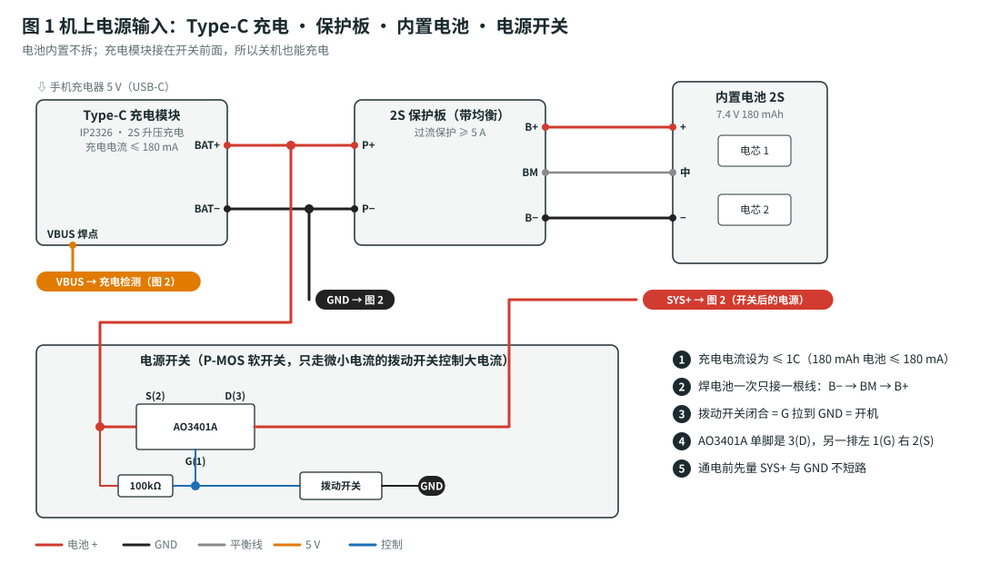
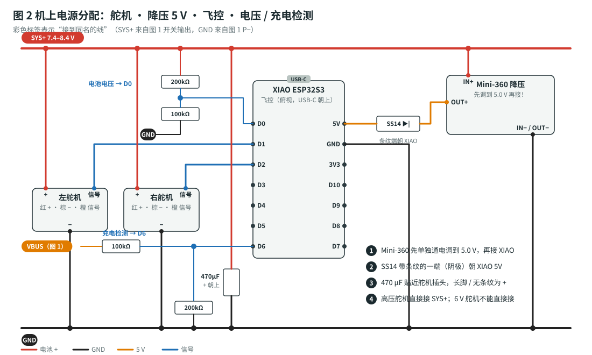
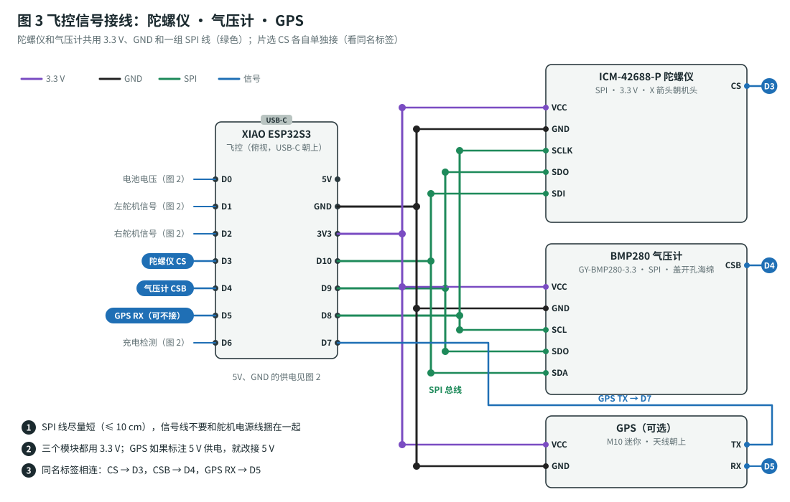
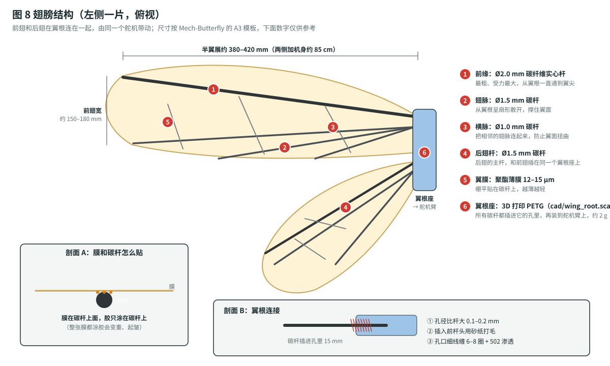
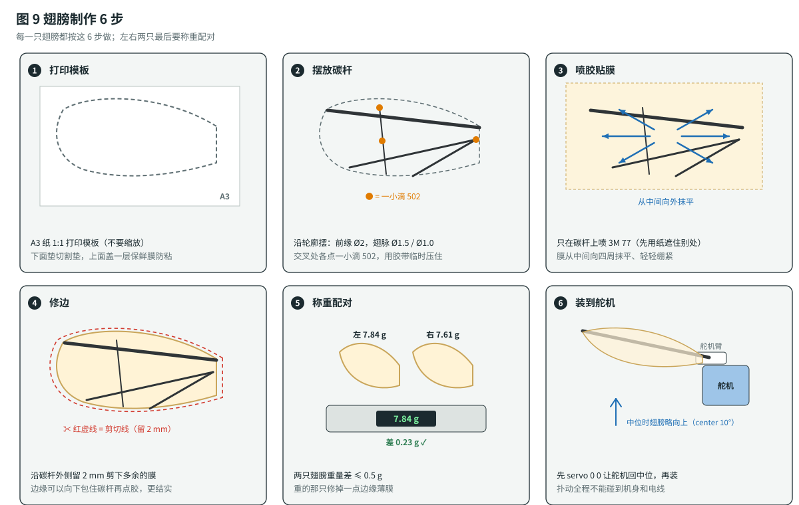
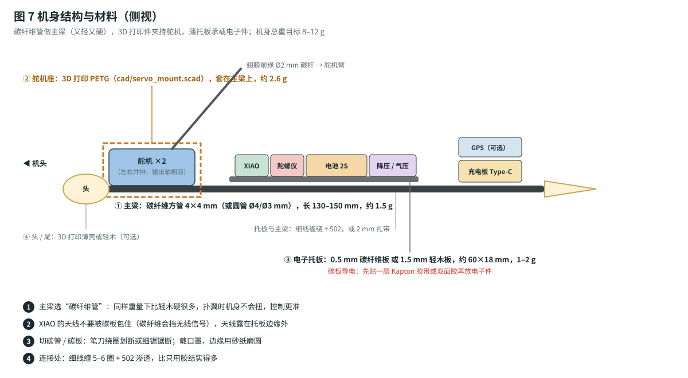
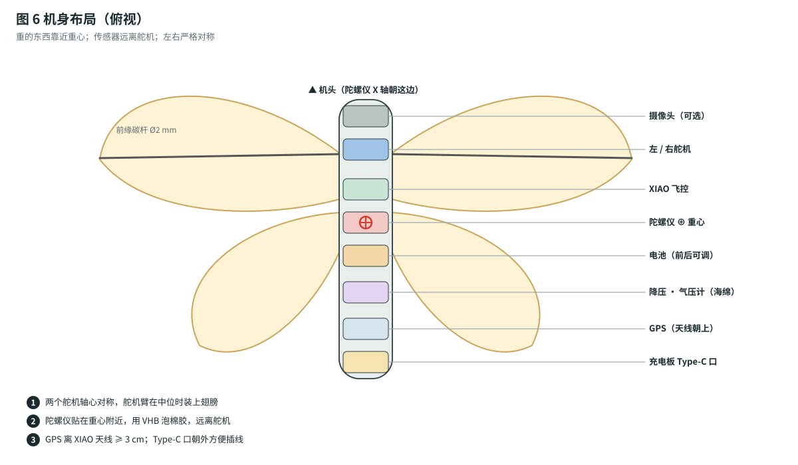
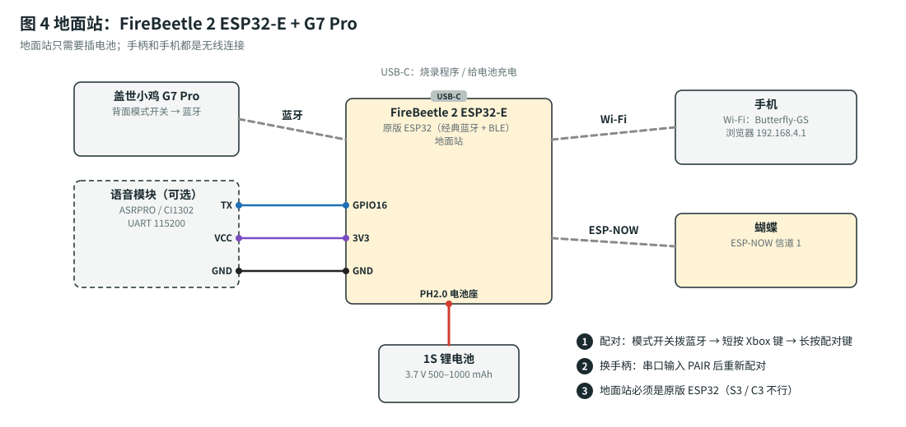
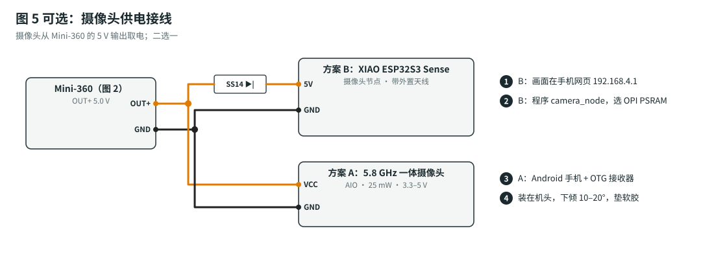

# 仿生蝴蝶：安装组装指南（含接线图）

> 这份指南讲**怎么装、怎么接线、要注意什么**。每一步都配有接线图、操作方法、⚠️ 注意事项和 ✅ 检查点。
> **做完一步、检查通过，再做下一步。** 调试和试飞的顺序见 [`build-plan.md`](build-plan.md)，固件命令见 [`../firmware/README.md`](../firmware/README.md)。

---

## 图例（所有接线图通用）

| 颜色 | 含义 |
|---|---|
| 🟥 红色 | 电池正极 / SYS+（7.4–8.4 V） |
| 🟧 橙色 | 5 V |
| 🟪 紫色 | 3.3 V |
| ⬛ 黑色 | GND（地） |
| 🟦 蓝色 | 信号线 |
| 🟩 绿色 | SPI 总线（陀螺仪和气压计共用） |
| ⬜ 灰色虚线 | 无线连接 |
| 彩色圆角标签 | **“接到同名的线”**：两个写着相同名字的标签，表示这两处要连在一起 |

## 系统总览

- **手柄 → 地面站**：G7 Pro 通过蓝牙连接地面站。
- **地面站 → 蝴蝶**：地面站通过 ESP-NOW 把控制指令发给蝴蝶，蝴蝶把遥测数据发回来。
- **手机**：连接地面站的 Wi-Fi 热点，在浏览器里看位置、轨迹和摄像头画面。

---

## 第 0 步：准备工作

### 工具和耗材

| 工具 | 用途 |
|---|---|
| 恒温电烙铁（尖头）、0.6 mm 焊锡丝、助焊剂 | 焊接 |
| 万用表 | 量电压，量通断 |
| 0.01 g 电子秤 | 称重 |
| 笔刀、剪刀、镊子 | 修剪和夹持 |
| 热缩管（1.5 mm / 3 mm）、打火机或热风枪 | 绝缘 |
| 耐火垫、USB 电流表 | 充电 |

### 焊接基本方法（第一次焊接的人请先看）

1. **温度**：烙铁调到 **330–350 °C**。太低焊不透，太高容易烫坏焊盘。
2. **先上锡**：线头剥 2–3 mm，先蘸一点锡（叫“镀锡”）；焊盘也先上一点锡。
3. **再贴合**：把镀锡的线头贴在焊盘上，用烙铁加热 1–2 秒，锡熔化后移开烙铁，**保持不动 2 秒**让锡凝固。
4. **好焊点的样子**：表面光亮，呈小圆锥形，把线包住。灰暗、呈球状的是虚焊，要补焊。
5. **绝缘**：凡是裸露的接头，都要套热缩管。**先套管，再焊接**，焊完把管子推过去加热收缩。
6. **线长**：信号线留够就行，不要太长。多余的线只会增加重量，还会带来干扰。

### 线色约定（建议）

- 红色 = 正极，黑色 = GND，其他颜色 = 信号。
- 舵机线原本的颜色：**红 = +，棕 / 黑 = −，橙 / 黄 / 白 = 信号**。

> ⚠️ **锂电池安全**：电池正负极一旦短路，会瞬间发热甚至起火。焊电池时，**电池线一次只剥开、只焊一根**，其他线头先用胶带包好。

---

## 第 1 步：电源输入部分（充电、保护板、电池、开关）

### 1.1 设置充电模块的充电电流

- **方法**：不同商家的 IP2326 模块，设置电流的方式不一样（换一个电阻，或者短接一个焊盘）。**按商家的说明书**，设到 **≤ 180 mA**（180 mAh 电池的 1C）。
- ✅ 检查：后面第 1.5 步会用 USB 电流表实测充电电流。

### 1.2 保护板接电池

1. 先确认两节电芯串联好：电芯 1 的负极接电芯 2 的正极，这个连接点就是平衡线“中”。成品 2S 电池已经串好了，平衡头上三根线依次是：负、中、正。
2. 按 **B− → BM → B+** 的顺序焊到保护板上：
   - B− ← 电池总负
   - BM ← 平衡线“中”
   - B+ ← 电池总正
3. ⚠️ 每焊完一根，就把这个焊点用热缩管或 Kapton 胶带包好，再焊下一根。
4. ✅ 检查：万用表量 **P+ 和 P− 之间 = 电池电压（7.4–8.4 V）**。

### 1.3 充电模块接保护板

- 充电模块 **BAT+ → 保护板 P+**，**BAT− → 保护板 P−**。
- 充电模块的 **VBUS 焊点**（Type-C 5 V 输入）引一根细线出来，第 2 步接充电检测用。
- ⚠️ 充电模块必须接在**开关前面**，这样关机状态下也能充电。

### 1.4 电源开关（P-MOS 软开关）

为什么这样做：舵机的峰值电流有好几安，小拨动开关承受不了。所以让 AO3401A（MOS 管）来通断大电流，拨动开关只控制它的栅极，只走微安级的电流。

**AO3401A 引脚（SOT-23，字面朝上）**：单独一只脚那一边是 **3 号 = D（漏极）**；另一排两只脚，左边 **1 号 = G（栅极）**，右边 **2 号 = S（源极）**。

**接线**：
1. **S（2）** ← 保护板 P+
2. **D（3）** → 引出一根红线，这根线就是 **SYS+**（开关后的电源）
3. **G（1）** 和 S 之间焊一个 **100 kΩ** 电阻。它的作用是平时把栅极拉高，让 MOS 管保持关断。
4. **G（1）** → 拨动开关 → GND。开关闭合时 G 被拉到地，MOS 管导通，也就是开机。

**方法**：SOT-23 很小，焊的时候：
1. 先在一个焊盘上点一点锡。
2. 用镊子夹住 MOS 管对准位置，加热这一个焊盘，把管子“定住”。
3. 再焊另外两只脚。
4. 可以把 MOS 管焊在一小块洞洞板上，或者买现成的“MOS 管开关模块”。

✅ 检查：
- 开关**断开**：SYS+ 对 GND = **0 V**。
- 开关**闭合**：SYS+ 对 GND = **电池电压**。

### 1.5 充电测试

1. 中间串一个 USB 电流表，插上手机充电器。
2. 充电电流应该 **≤ 180 mA**。
3. 充满后，电池电压约 8.4 V；用万用表量两节电芯，**各约 4.2 V**（相差 < 0.05 V）。
4. ⚠️ 第一次充电时全程看着。如果模块或电池烫手（> 45 °C），立即拔掉。

---

## 第 2 步：电源分配（舵机、降压、飞控、检测电路）

### 2.1 先调好降压模块（非常重要）

1. **Mini-360 先不要接 XIAO。**
2. 把 IN+ 和 IN− 接到 SYS+ 和 GND，打开电源开关。
3. 万用表量 OUT+ 和 OUT−，用小螺丝刀**慢慢**转模块上的电位器，调到 **5.0 V**。
   - 这类电位器可能要转很多圈，电压才会明显变化，要有耐心。
4. 断电，**点一滴指甲油或胶**把电位器固定住，防止振动后电压漂移。

> ⚠️ Mini-360 出厂时的输出电压不确定，可能高到 10 V 以上。**直接接上 XIAO 可能当场烧坏。**

### 2.2 降压 → 二极管 → XIAO

- OUT+ → **SS14 二极管** → XIAO **5V** 引脚。SS14 有**条纹的一端（阴极）朝 XIAO**。
- OUT−（也就是 IN−）→ GND。XIAO 的 **GND** 引脚也接 GND。
- ✅ 检查：XIAO 5V 引脚上的电压约 **4.6–4.8 V**，比 5.0 V 低一点是正常的，因为二极管有压降。

### 2.3 舵机供电

- 两个舵机的**红线**都接 **SYS+**，**棕线**都接 **GND**。
- **橙色信号线**：左舵机接 **D1**，右舵机接 **D2**。
- **470 µF 电容**：**+（长脚，外壳上没有条纹的一侧）接 SYS+**，− 接 GND。尽量焊在靠近舵机插头的位置。
- ⚠️ 舵机必须是能用 **7.4 V（2S）** 的高压舵机。6 V 舵机直接接 SYS+ 会烧坏。

### 2.4 电池电压检测（D0）和充电检测（D6）

两处都是“两个电阻串联，取中间点”的**分压电路**：

| 用途 | 上面的电阻（接电源） | 中间点接 | 下面的电阻（接 GND） |
|---|---|---|---|
| 电池电压 | 200 kΩ，接 SYS+ | **D0** | 100 kΩ |
| 充电检测 | 100 kΩ，接充电模块 **VBUS** | **D6** | 200 kΩ |

- **方法**：把两个电阻的一端直接对焊在一起（中间点），从这里引出信号线；然后整体套热缩管。
- ⚠️ **不要把两组电阻的阻值装反**：D0 这组是 200k 在上面，D6 这组是 100k 在上面。装反的话，引脚电压可能超过 3.3 V。
- ✅ 检查：电池满电 8.4 V 时，D0 对 GND 约 **2.8 V**；插上充电线时，D6 对 GND 约 **3.3 V**，拔掉后约 **0 V**。

---

## 第 3 步：信号接线（陀螺仪、气压计、GPS）

### 3.1 SPI 总线（陀螺仪和气压计共用）

| XIAO | 陀螺仪 ICM-42688-P | 气压计 BMP280 |
|---|---|---|
| 3V3 | VCC | VCC |
| GND | GND | GND |
| D8（SCK） | SCLK | SCL |
| D9（MISO） | SDO | SDO |
| D10（MOSI） | SDI | SDA |
| **D3** | **CS** | — |
| **D4** | — | **CSB** |

- **一分二的方法**：从 XIAO 引一根线，在中途剥开一小段绝缘皮，把第二根线绕上去焊牢，再套热缩管，做成 Y 型接头。也可以用一小条洞洞板做“分线排”。
- ⚠️ **SPI 线尽量短（≤ 10 cm）**，不要和舵机电源线捆在一起，否则会读数出错。
- ⚠️ 两个模块的 **CS 必须分别接**：陀螺仪 CS → D3，气压计 CSB → D4。接反了会读不到数据。
- 模块上的丝印可能写成 `SCL/SCLK`、`SDA/SDI`、`SAO/SDO`、`CS/CSB`，意思一样。

### 3.2 GPS（可选）

| GPS | 接到 |
|---|---|
| VCC | 3V3（如果模块标注 5 V 供电，就改接 5 V） |
| GND | GND |
| **TX** | **D7** |
| RX | D5（可以不接） |

### 3.3 第一次上电自检（先不装到机身上）

1. **不插舵机**，只接好电源和传感器，USB 连电脑。
2. 上传 `firmware/butterfly_fc`，打开串口监视器（115200，行尾选 Newline），应该看到：
   - `IMU ICM-42688-P: OK (WHO_AM_I=0x47)`
   - `baro BMP280: OK (chip id 0x58)`
   - 装了 GPS 时，输入 `gps`，显示已识别到波特率
3. 按 [`build-plan.md`](build-plan.md) 阶段 1 的表格，**核对陀螺仪的四个方向**。
- ⚠️ `NOT FOUND`：先查 CS 线，再查 3.3 V 供电；其次检查 SDO / SDI 有没有接反。

---

## 第 4 步：舵机和翅膀

### 4.1 舵机中位（装翅膀之前一定要先做）

1. **先把舵机臂拆下来**，再插上舵机。
2. 串口输入 `servo 0 0`，两个舵机转到中位。
3. 在中位把舵机臂**垂直于机身**装上，左右对称。
4. 输入 `servo 20 20`，两个舵机臂都应该**向上**转。哪边向下转，就把那边的 `servo_dir_l` 或 `servo_dir_r` 改成相反的符号，然后 `save`。

### 4.2 做翅膀

**先看结构**：每侧一片翅膀，由前翅和后翅组成，两者在翼根连在一起，由同一个舵机带动。

**再按 6 步制作**：

1. 用 A3 纸打印 Mech-Butterfly 的翅膀模板，放在切割垫下面。
2. **前缘**用 Ø2 mm 碳杆，**翅脉**用 Ø1–1.5 mm 碳杆，沿模板轮廓摆好。
3. 薄膜平铺在碳杆上，用喷胶或双面胶贴牢，**绷平不起皱**，沿边缘留 2 mm 修剪。
4. 碳杆交叉的地方，点**一小滴** 502 固定。胶多了会增加重量。
5. ✅ **两只翅膀称重，相差 ≤ 0.5 g**。重的那只可以修掉一点边缘薄膜。

**做翅膀的注意事项**：

- ⚠️ 模板要按 **1:1 打印**（打印设置里选“实际大小”，不要选“适合页面”），打完用尺子量一下模板上的尺寸对不对。
- ⚠️ **胶只涂在碳杆上**（见图 8 剖面 A）。整张膜都涂胶会变重，还容易起皱。
- ⚠️ 喷胶时用纸把模板上碳杆以外的地方盖住，不然膜会粘在模板上揭不下来。
- ⚠️ 左右两只翅膀要**镜像**：做第二只时把模板翻过来再用。
- 膜不要绷得太紧，否则碳杆会被拉弯；**表面平整、没有褶子就可以了**。

### 4.3 翅膀连接舵机

- 所有碳杆（前缘、翅脉、后翅杆）先插进 **3D 打印的翼根座**，再把翼根座装到舵机臂上（见图 8 剖面 B）。
- **插杆方法**：翼根座的孔径比碳杆大 0.1–0.2 mm；杆头先用砂纸打毛，插进去约 15 mm；孔口用细线缠 6–8 圈，再滴 502 让胶渗进去。
- ⚠️ 翅膀扑到最高点（`center + amp_max` ≈ 50°）和最低点时，都**不能碰到机身、电线或另一只翅膀**。用 `bench 1.0` 慢慢检查一遍。

---

## 第 5 步：机身组装与布局

### 机身主体材料

**推荐做法：碳纤维管做主梁，3D 打印 PETG 做舵机座，0.5 mm 碳板（或轻木板）做电子托板。** 机身目标重量 8–12 g。

| 材料 | 约重（本机身用量） | 刚性 | 抗摔 | 加工难度 | 结论 |
|---|---|---|---|---|---|
| **碳纤维方管 / 圆管** | 1.5 g | ★★★★★ | ★★★★ | 容易（切断、打磨） | ✅ **主梁首选** |
| 碳纤维板 0.5 mm | 1–2 g | ★★★★ | ★★★★ | 中等（要切割、会导电） | ✅ 托板首选 |
| 轻木（巴尔沙木）板 1.5 mm | 1 g | ★★ | ★★ | 很容易（笔刀就能切） | ⭕ 托板可以用，不适合做主梁 |
| 3D 打印 PETG | 3–4 g（舵机座） | ★★★ | ★★★★ | 需要打印机或代打 | ✅ 舵机座首选（PLA 更脆，摔了容易裂） |
| EPP / EPO 泡沫 | 2–3 g | ★ | ★★★★★ | 容易 | ❌ 太软，扑翼时机身会扭，影响控制 |
| 铝管 | 4–6 g | ★★★★ | ★★★ | 容易 | ❌ 太重 |

**为什么主梁一定要“硬”**：舵机每秒扑翼 3–5 次，每次都会把反作用力传到机身上。机身一软，扭动就会把一部分扑翼能量吃掉，陀螺仪也会测到额外的晃动，增稳效果变差。碳纤维管在同样重量下刚性最好。

**制作步骤**：

1. **截主梁**：用笔刀绕着碳管划一圈，再轻轻掰断；或者用细齿锯锯断。截到 130–150 mm，断口用砂纸磨平。
2. **打印舵机座**：用 Mech-Butterfly 的 3D 打印件，或者按自己的舵机尺寸改模型。材料选 **PETG**，层高 0.2 mm，3 圈壁，20–30% 填充。舵机座上留一个卡住 4 × 4 mm 主梁的方孔。
3. **舵机座装到主梁前端**：主梁插进方孔，用 **5 分钟 AB 胶**固定，这里受力最大。
4. **切电子托板**：0.5 mm 碳板切成约 60 × 18 mm。**先在上面贴一层 Kapton 胶带绝缘**，再贴电子件。
5. **托板固定到主梁**：用细线缠绕 5–6 圈，再滴 502 让胶渗透进去；或者用 2 mm 宽的小扎带固定。
6. **头、尾（可选）**：3D 打印薄壳，或者用轻木削出形状，只用来做外观和保护，越轻越好。

> ⚠️ **碳纤维导电**：碳板或碳管碰到焊点会造成短路。电子件下面一定要垫 Kapton 胶带或双面胶。
> ⚠️ **碳纤维挡无线信号**：XIAO 的天线要露在托板边缘外面，不要被碳板上下夹住，否则控制距离会明显变短。
> ⚠️ **碳纤维粉尘刺激皮肤和呼吸道**：切割、打磨时戴口罩，最好蘸水打磨；做完洗手。

### 部件布局

| 部件 | 位置 | 固定方法 | 注意 |
|---|---|---|---|
| 摄像头（可选） | 机头 | 软垫 + 胶 | 向下倾斜 10–20° |
| 两个舵机 | 机身前部，左右对称 | M2 螺丝 + 3D 打印座 | 转轴在同一条直线上 |
| XIAO 飞控 | 舵机后面 | 双面胶 | 天线露在外面，不要被碳板挡住 |
| **陀螺仪** | **重心附近** | **VHB 泡棉胶**（软安装） | X 箭头朝机头，远离舵机 |
| 电池 | 重心附近，可前后移动 | 先用魔术贴，调好重心后再固定 | 电池线不要被翅膀夹到 |
| 降压模块、气压计 | 机身中后部 | 双面胶；气压计盖上开孔海绵 | 气压计不要对着翅膀扇出的风 |
| GPS（可选） | 机身后上方 | 双面胶 | 天线朝上，离 XIAO ≥ 3 cm |
| 充电板 | 机尾 | 双面胶 | Type-C 口朝外，方便插线 |

- **走线方法**：电线顺着机身龙骨走，每隔 2–3 cm 用细线或一小段胶带固定。**焊点附近留一点余量**，防止振动把焊点扯断（这叫“应力释放”）。
- ✅ 整机称重 **≤ 85 g**，把重量填进 [`build-plan.md`](build-plan.md) §1.6 的表格。
- ✅ 用两根手指在翅膀根部托起整机，左右不应该明显倾斜（说明左右对称）。

---

## 第 6 步：地面站组装（FireBeetle 2 + G7 Pro）

1. 1S 锂电池（PH2.0 插头）插到 FireBeetle 2 的**电池座**。⚠️ 插之前**核对正负极**：板子上的丝印要和插头的红线（+）对应。有些电池的插头线序是反的。
2. Arduino IDE 添加 **esp32_bluepad32** 开发板包，开发板选 **FireBeetle 2 ESP32-E**，上传 `firmware/ground_station`。
3. **G7 Pro 配对**：背面中间的模式开关拨到**蓝牙** → 短按 Xbox 键开机 → **长按配对键**，直到指示灯循环闪烁。串口显示 `gamepad connected` 就表示连上了。
4. 可选的语音模块：TX → **GPIO16**，VCC → 3V3，GND → GND。
5. 装进小盒子或绑在手柄背面。**不要用金属盒**，会挡住无线信号。
- ✅ 输入 `STATUS`：显示手柄型号和电量；推摇杆时，数值方向正确。

---

## 第 7 步：可选的摄像头

- 两种方案都从 **Mini-360 的 5 V 输出**取电。方案 B（XIAO ESP32S3 Sense）的 5V 引脚前面**也要串一个 SS14**。
- 方案 B 上传 `firmware/camera_node` 时，Tools 菜单里的 **PSRAM 选 “OPI PSRAM”**。
- ⚠️ 加摄像头会增重 4–7 g。加之前先确认升力余量，见 [`gps-and-camera.md`](gps-and-camera.md)。

---

## 第 8 步：上电前检查清单（每次改完接线都要做）

- [ ] 万用表通断档：**SYS+ 和 GND 之间不通**（电阻 > 1 kΩ）
- [ ] 万用表通断档：**5V 和 GND、3V3 和 GND 之间不通**
- [ ] 舵机插头方向正确：棕线接 GND
- [ ] 470 µF 电容和 SS14 二极管的极性正确
- [ ] 所有裸露接头都套了热缩管
- [ ] 翅膀在整个扑动范围内不碰任何东西
- [ ] 第一次上电时手放在开关上；闻到焦味、看到冒烟，**立即关开关**

---

## 常见组装错误

| 现象 | 原因 | 解决 |
|---|---|---|
| 一上电 XIAO 就发烫 | Mini-360 没调到 5 V；或者 5V 和 GND 短路 | 立即断电，重新做第 2.1 步，量通断 |
| 舵机不动或乱抖 | 信号线接错（D1 / D2）；舵机 GND 没和 XIAO 共地 | 查线；确认所有 GND 连在一起 |
| 陀螺仪 `NOT FOUND` | CS 没接；SDO / SDI 接反 | 按 §3.1 的表格逐根核对 |
| `status` 一直显示 `CHARGING` | D6 分压电阻没焊，或者阻值装反 | 按 §2.4 的表格核对 |
| 电池电压读数明显偏差 | 分压电阻阻值不对 | 量实际阻值后，设置参数 `vbat_ratio` |
| 一扑翼就复位 | 电容没接或接反；保护板过流保护值太小 | 查 470 µF；换 ≥ 5 A 的保护板 |
| 开关断开时 SYS+ 仍有电压 | MOS 管 S 和 D 接反；100 kΩ 没接 | 按 §1.4 核对引脚 |

---

> 接线图由 [`img/make_diagrams.py`](img/make_diagrams.py) 生成。需要修改时，改脚本后重新运行 `python docs/img/make_diagrams.py` 即可。
