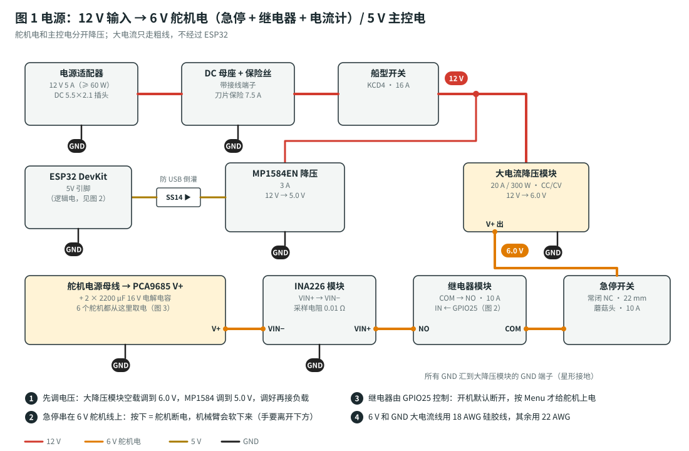

# 6 自由度机械臂（Arduino Uno R3 版）：总计划

> 📋 本文：**材料清单 + 分阶段步骤 + 验收标准 + 故障排查**
> 🔌 接线、装配、标定的详细方法：[组装指南](assembly-guide.md)
> 🧮 逆运动学、平滑轨迹的原理：[运动控制原理](motion-control.md)
> 🔧 固件、命令、参数：[firmware/README.md](../firmware/README.md)

## 这台机械臂能做什么

外形就是最常见的**黑色铝合金 6 舵机机械臂**：底座旋转、大臂、小臂、手腕俯仰、手腕旋转、机械爪。

| 关节 | 在机械臂上的位置 | 作用 |
|---|---|---|
| J1 | 底板里竖着装的舵机 | **旋转**：整条手臂左右转 |
| J2 | 底座上方（肩） | 大臂前后摆 |
| J3 | 大臂顶端（肘） | 小臂上下摆 |
| J4 | 小臂末端 | 夹爪抬头 / 低头 |
| J5 | 夹爪上方 | 夹爪转动（拧、翻） |
| J6 | 机械爪 | 张开 / 闭合 |

两种操控方式：

- **关节模式**：每根摇杆直接转一个关节，最直观。
- **XYZ 模式**：推摇杆，夹爪就沿**上下、左右、前后**走直线。固件用逆运动学自动算出 J1–J4 应该转多少，你不需要自己去协调几个关节。

## 最终目标（验收标准）

1. **手柄操控**：用盖世小鸡 G7 Pro，在 XYZ 模式下让夹爪上下、左右、前后走直线，并能旋转底座和手腕。
2. **抓取搬运**：30 秒内把一个约 30 g 的小方块（比如橡皮），从 A 点搬到 150 mm 外的 B 点，放稳。
3. **示教回放**：示教一段“抓起 → 搬运 → 放下 → 回原位”（6 个以上路点），**循环回放 10 次全部成功**。断电再上电，路点还在。
4. **安全**：急停测试通过（阶段 7）。
5. **扩展接口**：电脑通过 USB 串口发 `MOVE` / `GRIP` 指令，机械臂能执行（阶段 9 可选：语音）。

## 为什么选这套硬件（Uno R3 的取舍）

Arduino Uno R3 只有 **32 KB 程序空间、2 KB 内存**，而且**没有蓝牙和 Wi-Fi**。所以和“全功能版”相比做了这些取舍：

| 功能 | Uno 版怎么做 |
|---|---|
| 手柄连接 | 加一块 **USB Host Shield 2.0**（叠插在 Uno 上），G7 Pro 用 **USB 线**连接。也可以试试插 G7 Pro 自带的 2.4G 接收器 |
| 舵机驱动 | 现成的 **PCA9685 舵机驱动板**：Uno 只用 A4、A5 两根线（I2C）控制它，6 个舵机直接插在板上，不用焊分线板 |
| 逆运动学、XYZ 直线运动、平滑、示教回放 | ✅ **全部保留** |
| 路点存储 | 存在 Uno 的 EEPROM 里，最多 60 个，断电不丢 |
| 急停 | ✅ 保留：急停开关断舵机电源，Uno 通过 A3 测到后同时停掉舵机信号 |
| 标定命令 | 放进单独的“**标定模式**”程序（改一行 `SETUP_MODE 1` 再上传），平时的程序装不下 |
| 去掉的 | 手机网页（没有 Wi-Fi）、电流检测（过载冻结、夹爪夹到自动停）、继电器软开关、蜂鸣器 |
| 夹爪保护 | 没有电流检测，改成：**松开 RT 后夹爪自动退 3%**，夹着东西时舵机就不会一直顶死 |

编译后大约占 Uno **96% 的程序空间、53% 的内存**。以后想加功能，换成 **Arduino Mega 2560**（引脚兼容，程序空间 256 KB），代码不用改。

---

## 手柄怎么操控

| 按键 | 关节模式 | XYZ 模式 |
|---|---|---|
| 左摇杆 左 / 右 | J1 底座**旋转** | 夹爪**左移 / 右移** |
| 左摇杆 上 / 下 | J2 大臂 | 夹爪**前进 / 后退** |
| 右摇杆 上 / 下 | J3 小臂 | 夹爪**上升 / 下降** |
| 右摇杆 左 / 右 | J4 手腕抬头 / 低头 | 夹爪抬头 / 低头 |
| 十字键 ← / → | J5 手腕旋转 | J5 手腕旋转 |
| RT / LT | 夹爪闭合 / 张开（按得越深越快） | 同左 |
| **Menu（≡）** | 舵机上电；再按：回停放姿态后断电 | 同左 |
| **View（⧉）** | 切换 关节 / XYZ 模式 | 同左 |
| Y | 回原位（HOME） | 同左 |
| B | 停止 | 同左 |
| A | 记录路点；**长按 2 秒**清空全部 | 同左 |
| X | 播放一次；**长按 1 秒**循环播放 | 同左 |
| LB / RB | 速度 慢 ↔ 中 ↔ 快 | 同左 |
| 十字键 ↓ | 删除最后一个路点 | 同左 |

**稳定性怎么保证**（原理见 [运动控制原理](motion-control.md)）：

- 松开摇杆，关节就停在原位。舵机自带位置闭环，会顶住外力。
- 每个关节都有速度和加速度上限：起步、停下都很柔和，不会甩。
- XYZ 模式由逆运动学协调 J1–J4：夹爪走直线，俯仰角保持不变。
- 碰到关节限位、桌面、底座就自动停下，并沿着边界滑动。

---

## 1. 材料清单（BOM）

价格是 2026 年淘宝常见价，仅供参考；“搜索关键词”可以直接复制到淘宝或拼多多。

### 1.1 已经有的（不用买）

**6 自由度铝合金机械臂套件**（带 6 个 MG996R 舵机）和 **盖世小鸡 G7 Pro**。套件到货后，对照下表点一遍零件：

| 零件 | 数量 | 大致用途（以卖家的安装视频为准） |
|---|---|---|
| 横梁（底座板，9 × 8.4 cm） | 2 | 底座，夹住 J1 舵机 |
| 多功能支架 | 4 | 固定 J2、J3、J4、J5 舵机 |
| 长 U 支架 | 2 | 大臂（J2 → J3） |
| 异型支架 | 1 | J1 转盘和肩部的连接 |
| 法兰杆 | 1 | 小臂（J3 → J4） |
| L 型支架 | 2 | 手腕连接 |
| 手爪（机械爪） | 1 | J6 夹爪 |
| 金属舵盘 | 6 | 每个舵机一个 |
| 法兰杯式轴承 | 若干 | 关节对侧支撑 |
| M3 × 6 / M3 × 8 / M3 × 10 螺丝 | 40 / 45 / 5 | 支架连接 |
| M3 螺母 | 55 | — |
| **MG996R** 金属齿舵机（180°） | 6 | J1–J6 |
| **盖世小鸡 G7 Pro** 手柄 | 1 | 操控（还需要一根 USB-C 数据线） |

套件参数（卖家图）：净重 875 g，竖直伸直总高 50.5 cm（肩到爪尖约 43 cm），底座 9 × 8.4 cm。固件的默认尺寸就按这套设置：$d_1 = 75$、$L_2 = 120$、$L_3 = 130$、$L_4 = 180\ \text{mm}$，装好后还要自己量一遍（`GEO` 命令）。

> ⚠️ **MG996R 做 J2（肩）很吃力**：手臂完全水平伸直时，光自重就需要约 $11.7\ \text{kg·cm}$，而 MG996R 在 6 V 时只有约 $10$–$11\ \text{kg·cm}$（见[扭矩校核](motion-control.md#8-舵机扭矩校核)）。所以固件默认把 J2 限制在 **40°–170°**（大臂最多前倾到离水平 40°），**负载 ≤ 30 g**。想让手臂伸得更远、抓更重的东西，就把 J2 换成 DS3225MG（见 1.5）。

**Arduino UNO 学习套件（顶配豪华版）+ 电子元件包**：里面用得上的零件如下。其余的（LCD、点阵、超声波、RFID、步进电机、继电器、元件包里的电阻电容等）这台机械臂用不到。

| 编号 | 零件 | 从哪来 | 数量 | 用在哪 |
|---|---|---|---|---|
| E1 | **Arduino Uno R3** + USB 线（A 转 B） | 学习套件 | 1 | 主控；USB 线同时给 Uno 供电、上传程序 |
| E4 | **电压检测模块**（0–25 V，蓝色小板，`S` `+` `−` 三针） | 学习套件 | 1 | 急停检测：测舵机电压，接 A3 |
| E6 | 杜邦线 公对母 | 学习套件 | 7 根 | PCA9685、电压检测模块接 Uno |
| — | **SG90** 小舵机 | 学习套件 | 1 | 先插在 PCA9685 通道 0 试一下，能转再上 MG996R |
| — | 小一字螺丝刀 | 学习套件 | 1 | 拧接线端子 |
| — | 充电宝或手机充电头 | 家里现成的 | 1 | Uno 的 5 V 电源（5 V ≥ 1 A） |

> ⚠️ 学习套件里有几样东西**不要**用在机械臂上：
> - **Sensor Shield V5.0 扩展板**：舵机改用 PCA9685 驱动板，用不到它。它的细走线和小端子也扛不住 6 个 MG996R 的电流（$5$–$10\ \text{A}$）。
> - **9 V 电池、面包板电源模块（MB102）**：电流太小，带不动舵机。

### 1.2 还要买：主控和电子

**原则：全部买现成模块，不用焊接。** 下单时问卖家“排针焊好了吗”，选已经焊好的。

| 编号 | 名称 | 规格 / 型号 | 数量 | 用途 | 搜索关键词 | 约价（元） |
|---|---|---|---|---|---|---|
| E2 | USB 主机扩展板 | **USB Host Shield 2.0**（MAX3421E，标准 Uno 尺寸，带 USB-A 口）；**排针已焊好、上面带排母**，杜邦线才能插在上面 | 1 | 让 Uno 能读 USB 手柄 | `USB Host Shield 2.0 UNO` | 25–35 |
| E3 | USB-C 数据线 | USB-A 转 USB-C，1.5–2 m，**能传数据**（不是只能充电的线）。先看 G7 Pro 盒子里有没有，有就不用买 | 1 | G7 Pro 接扩展板 | `USB-A转Type-C 数据线 2米` | 0–10 |
| E5 | **舵机驱动板** | **PCA9685 16 路 12 位 PWM 舵机驱动板**（I2C，地址 0x40），带蓝色电源接线端子，**排针已焊好** | 1 | 6 个舵机直接插在上面；Uno 只用 A4、A5 两根线控制它 | `PCA9685 16路舵机驱动板` | 10–20 |
| E8 | 舵机延长线 | 22 AWG，30 cm × 3、50 cm × 1 | 4 | J4–J6 的线够不到驱动板时用 | `舵机延长线 22AWG` | 10 |

### 1.3 电源

舵机用一个 **6 V 适配器**直接供电（插上就是 6 V，不用调降压模块）；Uno 用**充电宝或手机充电头**通过 USB 供电。所有接头用 WAGO 或螺丝端子，**不用焊**。

| 编号 | 名称 | 规格 / 型号 | 数量 | 用途 | 搜索关键词 | 约价（元） |
|---|---|---|---|---|---|---|
| P1 | 电源适配器 | **6 V 10 A（60 W）**，桌面式（像笔记本电源），DC 5.5 mm 插头，**带 3C 认证**；最少 6 V 5 A | 1 | 舵机电 | `6V10A 电源适配器` | 35–60 |
| P2 | DC 母座转接线端子 | DC 母头 → 螺丝端子，**内径和 P1 的插头一致**（5.5 × 2.1 或 5.5 × 2.5，买之前问清楚） | 1 | 适配器接线，不用焊 | `DC母头 转接线端子` | 2 |
| P3 | 带线保险丝座 | 刀片式，自带引线，配 **10 A** 保险丝 | 1 套 | 短路保护 | `带线 刀片保险丝座 10A` | 5 |
| P4 | 急停开关 | 22 mm 蘑菇头，**常闭 NC**，自锁旋转复位，10 A；配 1 孔按钮盒。**兼总开关** | 1 | 一拍就断舵机电 | `急停开关 22mm 常闭 按钮盒` | 10–20 |
| P5 | 电解电容 | **2200 µF 16 V**（PCA9685 板上已经焊了大电容就不用） | 1 | 舵机电源稳压，拧在 PCA9685 端子上 | `电解电容 2200uF 16V` | 2 |
| P6 | 硅胶线 | **18 AWG** 红黑各 2 m | 1 套 | 6 V / GND 大电流线 | `18AWG 硅胶线` | 10 |
| P7 | WAGO 接线端子 | **221-413**（3 孔，一进二出，按压式） | 4 | 6 V / GND 分线，不用焊 | `WAGO 221-413` | 6 |

> 💡 **为什么不用充电宝给舵机供电？** 充电宝 USB 口一般最多 $2$–$3\ \text{A}$、$5\ \text{V}$，6 个 MG996R 一起动时峰值 $5$–$10\ \text{A}$，充电宝会保护断电，手臂直接掉下来。
> 💡 **为什么不用铝壳开关电源？** 那种要自己接 220 V，接线柱露在外面，新手容易触电。桌面适配器的高压部分封在壳里。

### 1.4 安装辅料

| 编号 | 名称 | 规格 | 数量 | 用途 | 约价（元） |
|---|---|---|---|---|---|
| M2 | 底板 | 多层板 400 × 300 × 12 mm | 1 | 固定机械臂和电控 | 15–30 |
| M3 | F 型夹 | 夹口 ≥ 80 mm | 2 | 底板夹在桌边 | 15 |
| M4 | 螺丝套装 | M3 螺丝 + 防松螺母；M4 × 20 × 4；M3 铜柱 | 1 套 | 支架、底座、模块固定 | 15 |
| M5 | 螺丝胶 | 中强度蓝色（243 型） | 1 | 舵盘螺丝防松 | 8 |
| M6 | 3D 打印件 | 电控托板 + 线夹（[`cad/`](../cad/README.md)），PETG；没有打印机就用亚克力板 + 铜柱 | 1 套 | 固定 Uno、PCA9685、理线 | 20–40 |
| M7 | 理线 | 螺旋缠绕管 6 mm + 扎带 | 1 套 | — | 8 |

### 1.5 可选：升级和扩展

| 编号 | 名称 | 规格 | 用途 | 约价（元） |
|---|---|---|---|---|
| U1 | **J2 升级舵机** | **DS3225MG**，25 kg·cm，**180° 版本**（270° 版本外观一样，别买错），标准尺寸，套件支架直接装 | 换掉 J2 的 MG996R：手臂能伸得更远，负载可到约 50 g；换好后 `LIM 2 10 170`、`SAVE` | 70–90 |
| X1 | 离线语音模块 | 启英泰伦 **CI-03T** 或天问 **ASR-PRO**，串口输出，设成 9600 波特率 | 语音控制 | 15–30 |
| X2 | Arduino Mega 2560 | 以后想加功能时替换 Uno | 程序空间 × 8 | 45–80 |

### 1.6 工具

万用表（✅ 必需）、剥线钳（✅ 必需）、游标卡尺（✅ 必需）、手机水平仪 App（✅ 必需，标定用）、螺丝刀（十字 PH1 / PH2、内六角、小一字）。**不需要电烙铁。**

### 1.7 费用汇总（还要买的）

| 部分 | 约价（元） |
|---|---|
| 主控和电子（E2、E3、E5、E8） | 45–75 |
| 电源（P1–P7） | 70–105 |
| 安装辅料（M2–M7） | 80–130 |
| **合计** | **约 195–310** |
| 可选：J2 换 DS3225MG（U1） | + 70–90 |
| 可选：语音模块（X1） | + 15–30 |

Uno、电压检测模块、杜邦线从学习套件里拿，充电宝用现成的，上面的价格已经扣掉。

---

## 2. 分阶段步骤

每个阶段都有**出口条件**，达不到就先别往下做，按第 3 节排查。

### 阶段 0：准备（半天）

- [ ] 按 1.2–1.4 节下单（机械臂套件、手柄、Uno 学习套件已经有了）。按 1.1 节把要用的零件挑出来放一起。
- [ ] 电脑装 **Arduino IDE 2.x**；**库管理器**里安装 **USB Host Shield Library 2.0**（PCA9685 的代码已经在程序里，不用另装库）。
- [ ] 打开 `firmware/arm_uno/arm_uno.ino`，开发板选 **Arduino Uno**，点“验证”能编译通过。

**出口**：编译通过，显示程序空间约 96%。

### 阶段 1：Uno + 手柄（半天）

- [ ] USB Host Shield 叠插在 Uno 上（针脚对齐，全部插到底）。
- [ ] 只用 USB 线连电脑，上传程序。打开串口监视器（**9600**，换行符选“换行”），看到 `ready`。
- [ ] G7 Pro：模式开关拨到 **PC（XInput）** 模式，用 USB-C 线插到扩展板的 USB-A 口。串口显示 `gamepad connected`。
- [ ] 连不上：按 [firmware/README.md](../firmware/README.md#3-连接-g7-pro) 查 USB ID，把 G7 Pro 的 ID 加进库里。

**出口**：串口显示 `gamepad connected`。

### 阶段 2：电源（半天）

按[组装指南第 1 步](assembly-guide.md#第-1-步电源)操作。

- [ ] 6 V 适配器**空载**量一下：中心为正，5.9–6.3 V。
- [ ] 按图 1 接线：DC 母座转接端子 → 保险丝 → 急停（NC）→ WAGO → PCA9685 蓝色端子 + 电压检测模块端子；GND 用另一个 WAGO 分过去。
- [ ] 2200 µF 电容拧在 PCA9685 蓝色端子上（**白条纹在 GND 那边**；板上已有大电容就跳过）。
- [ ] Uno 用 USB 线插充电宝或手机充电头。
- [ ] 通电前量：6 V 对 GND **不短路**。

**出口**：PCA9685 端子约 6.0 V；急停按下时变成 0 V。

### 阶段 3：PCA9685 和信号（1 小时）

- [ ] 按图 2 接 4 根杜邦线：PCA9685 的 GND → Uno GND，SCL → **A5**，SDA → **A4**，VCC → **5V**。**排针上的 V+ 和 OE 不接**。
- [ ] 电压检测模块：`S` → **A3**，`−` → GND，`+` 不接。
- [ ] 先把学习套件的 **SG90** 插在 PCA9685 通道 0（棕色线对准 GND），阶段 4 用它先试 `CENTER` / `PULSE`，能转再换 MG996R。

**出口**：Uno 上电后串口**没有** `PCA9685 NOT found`；A3 对 GND 约 1.2 V（按下急停变 0 V）。

### 阶段 4：舵机回中（半天）

- [ ] `config.h` 里改成 `SETUP_MODE 1`，上传**标定程序**。
- [ ] 6 个舵机插到 PCA9685 的通道 0–5（J1–J6），**先不装到支架上**。
- [ ] 可选：万用表有 Hz 档就量一下舵机信号的频率，输入 `OSC <读数>`、`SAVE`，让 1500 µs 更准（[组装指南第 3 步](assembly-guide.md#第-3-步舵机测试和回中装支架之前必须做)）。
- [ ] 串口依次输入：`CENTER`、`ON`，所有舵机转到中位（1500 µs）。
- [ ] 每个舵机试一下：`PULSE 1 1000`、`PULSE 1 2000`，然后 `PULSE 1 1500` 回中。
- [ ] 全部回到 1500 以后输入 `OFF`。**舵机停在中位，保持别动。**

**出口**：6 个舵机都能转，最后都停在中位。

### 阶段 5：机械装配（1–2 天）

按[组装指南第 4 步](assembly-guide.md#第-4-步机械装配)和图 8 操作。

- [ ] 底座 → J1 → J2 肩部 → 大臂 → J3 → 小臂 → J4 → J5 → 夹爪。
- [ ] 每个舵盘都在舵机中位时，按“中位姿态”装：J2 中位大臂竖直，J3 中位小臂水平朝前，J4 中位手腕伸直，J5 中位两指左右张开，J6 中位半开。
- [ ] 舵盘螺丝点螺丝胶；有法兰杯式轴承的一侧不要漏装。
- [ ] 底板用 4 颗 M4 螺丝固定在大底板上，大底板用 F 型夹夹在桌边（图 6）。

**出口**：断电时每个关节只能在转动方向上动，其他方向不晃。

### 阶段 6：标定（半天）

按[组装指南第 6 步](assembly-guide.md#第-6-步标定每个关节都要做)和图 7 操作（还是在标定程序里）。

- [ ] 量尺寸：`GEO d1 l2 l3 l4`（图 4）。
- [ ] `CENTER`、`ON`，然后按 J2 → J1 → J3 → J4 → J5 → J6 的顺序两点标定（`PULSE` 调姿态 → `MARK` 两次）。
- [ ] `PULSE OFF`，检查限位（`J 2 45`、`J 3 -150` 等），会撞的用 `LIM` 改小。
- [ ] 把手臂摆到喜欢的折叠姿态，`POSE PARK` 记为停放姿态；`SAVE`。
- [ ] 验证：`HOME`、`MOVE 220 0 40 -60`（夹爪斜向下 60°，指尖离桌面约 40 mm，在正前方 220 mm）。
- [ ] `config.h` 改回 `SETUP_MODE 0`，上传**正常程序**。标定数据在 EEPROM 里，不会丢。

**出口**：`MOVE 220 0 40 -60` 误差 ≤ 10 mm。

### 阶段 7：手柄操控和急停测试（1 天）

- [ ] 按 Menu 上电，LB 调到“慢”；关节模式下逐个关节确认方向（图 5）。
- [ ] View 切到 XYZ 模式：左摇杆推上，夹爪**水平直线前进**；右摇杆推上，夹爪**竖直上升**；左摇杆推左，夹爪**向左移**。
- [ ] 推到够不到的地方：夹爪停住，手柄震一下，并沿边界滑动。
- [ ] 夹一个纸盒：按住 RT 夹紧，松开后夹爪自动退一点，舵机不再嗡嗡响。
- [ ] **急停测试**：运动中拍急停 → 手臂软下来，串口显示 `EMERGENCY STOP`；松开急停，手臂**不会**自己动；扶到停放姿态附近，按 Menu 恢复。
- [ ] 完成验收第 2 项：30 秒内搬运方块。

**出口**：以上全部通过。

### 阶段 8：示教回放（半天）

- [ ] 用手柄走到“抓取上方 → 下降 → 夹紧 → 抬起 → 移到放置点 → 下降 → 松开 → 抬起”，每一步按一次 A（路点自动存进 EEPROM）。
- [ ] 按 X 播放一次，不对的用 ↓ 删掉重录。
- [ ] 断电重启：串口显示 `8 waypoints in EEPROM`。
- [ ] 长按 X 循环播放，**连续 10 次成功**。

**出口**：验收标准 1–4 全部达成 🎉

### 阶段 9（可选）：电脑 / AI / 语音

- [ ] **电脑 / AI**：`python3 tools/arm_client.py COM5 ON "MOVE 220 0 40 -60" CLOSE "UP 50" HOME`（COM5 换成你的串口）。AI 智能体只需要一个“发送文字指令”工具，指令表见 [firmware/README.md](../firmware/README.md#4-文字指令电脑--ai--语音)。
- [ ] **语音模块**：设成 9600 波特率，TX 接 Uno 的 **D0**，每个词条配置一行输出（例：“向上” → `UP 30\r\n`）。⚠️ **上传程序时先拔掉这根线。**

---

## 3. 故障排查

| 现象 | 可能原因 | 解决 |
|---|---|---|
| 串口显示 `USB Host Shield NOT found` | 扩展板没插到底；克隆板 5 V 没接通 | 重新插；用库自带示例 `board_qc` 自检；部分克隆板的 5V 焊盘出厂没接通，下单前问卖家“5V 已经接通了吗” |
| 一直没有 `gamepad connected` | G7 Pro 不在 XInput 模式；USB ID 不在库的名单里 | 模式开关拨到 PC；按住 Xbox + Share 3 秒切换 XInput / GIP；按 README 查 ID 加进库里 |
| 上传失败 `avrdude: stk500_recv()` | 语音模块接在 D0 上 | 上传时拔掉 D0 的线 |
| 程序空间超过 100% | 库版本不同；改了代码 | 用 README 里的库版本；或者换 Mega 2560 |
| 串口显示 `PCA9685 NOT found` | SDA / SCL 接反；VCC 或 GND 没接；板上地址焊盘被短接 | SDA → A4，SCL → A5，VCC → 5V，GND → GND；A0–A5 焊盘都不短接 |
| Uno 反复重启（一直打印 `ready`） | 充电宝电流太小自动断电；手柄插线充电电流大；Uno 和舵机共用了电源 | 充电宝开“小电流模式”或换手机充电头；手柄先充满电或改用 2.4G 接收器；Uno 只用 USB 供电 |
| 上电舵机乱抖 | 舵机电压跌落；没共地 | 加 2200 µF 电容；6 V 和 GND 用 18 AWG；PCA9685 排针的 GND 接到 Uno GND |
| 一开机就显示 E-STOP | 只插了 USB、没接 6 V；电压检测模块没接 | 正常现象（没有舵机电）；或者按图 2 接好电压检测模块 |
| 某个关节方向反了 | 标定时两个 MARK 的角度写反了 | 重新做这个关节的两点标定 |
| XYZ 走的不是直线 | 尺寸没量准；标定误差大 | 重新 `GEO`；用水平仪重新标定 |
| 大臂下垂、抖动、舵机发烫 | J2 的 MG996R 扭矩不够 | 手臂别伸太远（保持 J2 ≥ 40°）；负载 ≤ 30 g；最好把 J2 换成 DS3225MG |
| 夹爪够不到“正上方竖直朝下”的姿态 | J4 只能转 ±90°，这套手臂的手腕又比较长 | 正常现象：用斜向下 45°–60° 去抓（`MOVE x y z -60`） |
| 夹住东西后舵机嗡嗡响、发烫 | 标定时“合拢”点记在了用力夹紧的位置 | 重新 `MARK 6 100`，记在刚好合拢不用力的位置 |

## 4. 安全规则

1. **每次上电前**，先把手臂扶到停放姿态附近：舵机没有位置反馈，上电瞬间会全速转到停放姿态。
2. 第一次运行用**最低速度**（LB）。手和脸不要进入工作半径（约 330 mm，见图 6）。
3. **急停开关**放在伸手就能拍到的地方。拍下后手臂失去力量软下来，下方不要放易碎物品。
4. 断电用 **Menu（停放后断电）**，不要直接拔电源。
5. 舵机和 PCA9685 长时间工作会发热。连续运行 30 分钟以上要检查温度，烫手就停下来休息。
6. 用正规的带认证 **6 V** 桌面适配器，**不要**用露出 220 V 接线柱的开关电源。
