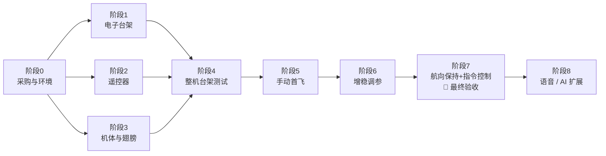

# 仿生蝴蝶从零到受控起飞：总计划

> **最终目标（验收标准）**：蝴蝶从手上起飞，在 STABILIZE / HEADING_HOLD 增稳模式下持续飞行 **≥ 30 秒**，能按遥控器或电脑指令完成**左转、右转、升降、降落**，机体无损；**连续成功 3 次**。
>
> 这份计划是总入口，其他文档分工如下：
> - 项目调研：[`bionic-butterfly-research.md`](bionic-butterfly-research.md)
> - 增稳与降噪原理：[`gyro-stabilization-and-noise-reduction.md`](gyro-stabilization-and-noise-reduction.md)
> - 固件接线、命令和参数：[`../firmware/README.md`](../firmware/README.md)

---

## 0. 全局路线图



| 阶段 | 内容 | 预计耗时（业余时间） | 出口条件 |
|---|---|---|---|
| 0 | 采购、装软件、学习锂电池安全 | 1–2 周（主要是等快递） | 物料到齐，Arduino IDE 能编译 |
| 1 | 飞控 + IMU + 舵机在桌面上跑通 | 2–3 天 | IMU 方向全部正确，台架扑翼正常 |
| 2 | 遥控器制作 + 无线链路 | 1–2 天 | 能解锁，失控保护正常 |
| 3 | 机体、翅膀制作 | 3–7 天 | 整机重量达标，左右对称 |
| 4 | 整机台架测试 + 频谱分析 + 吊线测试 | 1–2 天 | 频谱符合预期，吊线测试方向正确 |
| 5 | MANUAL 手动首飞 | 1–3 天 | 能直飞 10 秒并完成转向 |
| 6 | STABILIZE 增稳调参 | 2–5 天 | 松杆后自动回平，无发散振荡 |
| 7 | HEADING_HOLD + 文本指令 | 1–2 天 | **最终验收通过** |

总计大约 **4–8 周**。

---

## 1. 材料清单 (BOM)

> 价格是估算用的参考区间，实际以商家为准。**带 ★ 的是关键件**，不要随意替换规格。

### 1.1 机上电子

| # | 名称 | 规格 / 型号 | 数量 | 参考价 (¥) | 备注 |
|---|---|---|---|---|---|
| 1 | ★ 主控 | **Seeed Studio XIAO ESP32S3** | 1（建议多买 1 块备用） | 40–70 / 块 | 约 21 × 17.5 mm，Arduino 直接支持 |
| 2 | ★ 陀螺仪 | **ICM-42688-P 模块（SPI）** | 1（+1 备用） | 15–40 | 买引出 CS 引脚的小板，WHO_AM_I 应为 `0x47` |
| 3 | ★ 舵机 | **高速数字金属齿微型舵机** | 2（+1 备用） | 40–150 / 个 | 选型见 §1.5 |
| 4 | ★ 内置电池 | **2S 7.4 V 150–200 mAh LiPo**（放电倍率 ≥ 30C，带平衡线） | 1（+1 备用） | 20–35 | 内置在机身，不用拆。见 §1.7 |
| 4a | ★ Type-C 充电模块 | **2S 升压充电板**（Type-C 5 V 输入 → 8.4 V，IP2326 一类），**充电电流可设为 ≤ 1C** | 1（+1 备用） | 5–15 | 这就是蝴蝶的 Type-C 充电口 |
| 4b | ★ 电池保护板 | **2S BMS，带均衡**，过流保护 ≥ 5 A | 1（+1 备用） | 3–8 | 防止过充、过放、短路；保证两节电芯电压一致 |
| 4c | 电源开关 | P-MOS **AO3401**（SOT-23）+ 100 kΩ 电阻 + 超小拨动开关 | 各 2 | 3 | 开关只控制 MOS 管，所以用很小的拨动开关就行 |
| 5 | 降压模块 | Mini-360 可调降压，调到 **5.0 V** | 2 | 3–5 | 给 XIAO 供电 |
| 6 | 二极管 | SS14 肖特基二极管 | 5 | 1 | 防止 USB 和电池之间倒灌 |
| 7 | 电容 | 470 µF / 16 V 低 ESR 电解电容；10 µF 和 100 nF 陶瓷电容 | 各 3 | 5 | 470 µF 贴近舵机，吸收电流尖峰 |
| 8 | 电阻 | 200 kΩ 和 100 kΩ，1% 精度 | 各 4 | 2 | 电池电压分压 + 充电检测分压 |
| 9 | 磁珠 | 0805 或插件 | 若干 | 2 | 可选，隔离电源噪声 |
| 10 | 线材 | 28–30 AWG 硅胶线、热缩管、JST-PH2.0 插头 | 若干 | 15 | 舵机信号线建议双绞 |
| 11 | 减震 | 3M VHB 泡棉双面胶，或减震硅胶垫 | 1 | 10 | IMU 软安装用 |

### 1.2 遥控器 / 地面站

| # | 名称 | 规格 | 数量 | 参考价 (¥) |
|---|---|---|---|---|
| 1 | 主控 | XIAO ESP32S3 | 1 | 40–70 |
| 2 | 摇杆 | 双轴摇杆模块（KY-023 / PS2 摇杆） | 2 | 3–6 / 个 |
| 3 | 油门 | 10 kΩ 线性电位器（滑动式手感更好） | 1 | 2–5 |
| 4 | 开关 | 小型拨动开关（ARM、MODE） | 2 | 2 |
| 5 | 结构 | 洞洞板 / 面包板 + 外壳（也可以 3D 打印） | 1 | 10–20 |
| 6 | 供电 | 1S LiPo 300–500 mAh，焊到 XIAO 的 BAT 焊盘（**XIAO 自带充电电路，直接用 Type-C 充电**） | 1 | 10–20 |
| 7 | 可选 | 离线语音模块（ASRPRO / CI1302），留给阶段 8 | 1 | 15–40 |

### 1.3 机体与翅膀

| # | 名称 | 规格 | 数量 | 参考价 (¥) | 备注 |
|---|---|---|---|---|---|
| 1 | 碳纤维杆 | Ø1.0 / Ø1.5 / Ø2.0 mm，长 50 cm–1 m | 各 3–5 根 | 20–40 | 前缘用粗杆，翅脉用细杆 |
| 2 | 碳纤维片 / 条 | 0.5–1 mm 厚 | 1–2 | 10–20 | 做机身龙骨 |
| 3 | 翼面材料 | 超轻薄膜（聚酯 / OPP，10–20 µm），或风筝用超轻尼龙布 | 1 卷 | 10–20 | 越轻越好 |
| 4 | 3D 打印件 | 舵机座、机身连接件（来自 Mech-Butterfly） | 1 套 | 20–60 | 用 PLA 或 PETG；也可以找打印服务代打 |
| 5 | 胶 | 502（CA 胶）+ 固化剂、双面胶、热熔胶 | 各 1 | 20–40 | |
| 6 | 螺丝 | M2 小螺丝 | 1 包 | 5 | |

### 1.4 工具

| 工具 | 必要性 | 参考价 (¥) |
|---|---|---|
| 电烙铁 + 焊锡 + 助焊剂 | 必须 | 50–150 |
| 万用表 | 必须 | 50–100 |
| USB 充电头（5 V / 2 A）+ USB-C 线 | 必须（手机充电器即可） | — |
| USB 电流电压表（Type-C 型） | 建议，用来看充电电流和进度 | 15–30 |
| 2S 平衡充电器 | 可选，只在电池需要维护时用 | 80–250 |
| 耐火充电垫 / 陶瓷盘 | 必须，充电时把蝴蝶放在上面 | 15 |
| **0.01 g 精度电子秤**（珠宝秤） | **必须**，控制重量全靠它 | 20–40 |
| 笔刀、钢尺、切割垫、剪刀 | 必须 | 20–40 |
| USB-C 数据线（要能传数据） | 必须 ×2 | 20 |
| 3D 打印机 | 可选 | — |

**预算合计**：不含工具约 **¥550–1100**，工具约 ¥250–500。

### 1.5 舵机选型要点

舵机决定了蝴蝶能不能飞起来：

$$
\text{舵机选型} = \underbrace{\text{速度} \le 0.08\ \text{s}/60^\circ}_{\text{扑翼频率够高}}
\;+\; \underbrace{\text{扭矩} \gtrsim 1\ \text{kg·cm}}_{\text{带得动翅膀}}
\;+\; \underbrace{\text{重量} \le 8\ \text{g}}_{\text{整机够轻}}
\;+\; \text{金属齿、数字舵机}
$$

| 方案 | 供电 | 舵机示例（来自 2ServoFlapOrnithopter 的推荐） | 说明 |
|---|---|---|---|
| **A（推荐）** | 2S 电池直接给舵机供电 | **高压 (HV) 舵机**，例如 PTK 7465（7.4–8.4 V） | 线路最简单 |
| B | 2S 电池 → **6 V BEC** → 舵机 | 6 V 舵机，例如 BLUEARROW AF D43S-6.0-MG、PTK 7350 | 多一个 BEC，大约多 2–3 g |

> 买之前一定要核对卖家标注的工作电压。**6 V 舵机直接接 2S 电池会烧掉。**
> 如果买的是模拟舵机，要把 `config.h` 里的 `SERVO_PWM_HZ` 改成 50。

### 1.6 重量预算

起飞条件是 $L > mg$，而升力近似满足 $L \propto f^{2} A^{2} S$。所以**每一克都很重要**。

| 部件 | 估计重量 (g) |
|---|---|
| 舵机 ×2 | 12–16 |
| 2S 180 mAh 电池（内置） | 10–13 |
| Type-C 充电模块 + 保护板 + MOS 开关 | 3–5 |
| XIAO ESP32S3 | 约 3 |
| IMU 模块 + 减震胶 | 1.5–2.5 |
| 降压模块、二极管、电容、分压电阻 | 2–3 |
| 线材和插头 | 2–4 |
| 机身（碳杆 + 3D 打印件） | 8–15 |
| 翅膀 ×2 | 15–25 |
| **合计目标** | $\le 75 \sim 85\ \text{g}$ |

每做完一个部件就称一次，把实际重量记下来。如果超重 10 g 以上，先减重再往下做。

### 1.7 为什么还需要电池？内置电池 + Type-C 充电方案

**真正“不带电池”在现阶段做不到。** 按实测数据估算：2S 180 mAh 电池能飞 3–5 分钟，由此反推飞行功率

$$
P \approx \frac{0.8 \times 7.4\ \text{V} \times 0.18\ \text{Ah}}{4\ \text{min}} \approx 16\ \text{W},
\qquad
E_{4\,\text{min}} = P\,t \approx 16\ \text{W} \times 240\ \text{s} \approx 3.8\ \text{kJ} \approx 1.07\ \text{Wh}
$$

| 储能方式 | 能量密度（约） | 存下 $1.07\ \text{Wh}$ 需要的质量 | 结论 |
|---|---|---|---|
| **LiPo 锂电池** | $150 \sim 200\ \text{Wh/kg}$ | 电芯约 $5 \sim 7\ \text{g}$（成品电池包 10–13 g） | ✅ 唯一可行 |
| 超级电容 | $\approx 5\ \text{Wh/kg}$ | $\approx 200\ \text{g}$，比整只蝴蝶还重 | ❌ |
| 拖线供电 | — | 电线的重量和拖拽都太大，不能自由飞 | ❌ |
| 太阳能薄膜 | 满阳光下约 $100 \sim 200\ \text{W/m}^2 \times 20\%$ 效率 | 翅膀全贴满也只有几瓦，而且翅膀一直在扇动 | ❌ |

所以采用的方案是：**电池内置在机身里，从外面看不到、不用拆，插 Type-C 线就能充电，用起来和手机一样。**

```
 Type-C ─► 2S 升压充电模块 ─► 2S 保护板（均衡）─► 内置电池
                                   │
                              P-MOS 电源开关（关机也能充电）
                                   │
                         舵机 / 降压模块 / 飞控
 充电模块 VBUS ─► 分压 ─► 飞控 D6：检测到正在充电 → 锁定，不能解锁
```

- **充电电流**：设成 $\le 1\text{C}$。180 mAh 的电池就是不超过 180 mA；0.5C 更有利于延长电池寿命。
- **充电时间**：$t \approx 1.2 \times \dfrac{Q}{I}$。1C 充电约 1.2 小时，0.5C 约 2.4 小时。
- **充电锁**：只要插着充电线，飞控就拒绝解锁（台架模式也不行），LED 以 1 秒亮、1 秒灭闪烁。拔掉充电线后，要把 ARM 开关关掉再打开才能解锁。
- **遥控器**也内置 1S 电池，直接用 XIAO 的 Type-C 口充电。
- **调重心**：电池现在不能拆，可以先用魔术贴临时固定，找到合适的重心位置后再用胶固定；之后需要微调时，用小块配重就行。

---

## 2. 软件准备（阶段 0）

- [ ] 安装 **Arduino IDE 2.x**，加入 ESP32 开发板地址，安装 **esp32 by Espressif 3.x**（步骤见 [`firmware/README.md`](../firmware/README.md) §1）。
- [ ] 开发板选 `XIAO_ESP32S3`，**USB CDC On Boot = Enabled**。
- [ ] 安装 Python 3，然后运行 `pip install pyserial numpy matplotlib`（画频谱用）。
- [ ] 把仓库下载到本地：`git clone` 本仓库。
- [ ] 学习锂电池安全：
  - 用 Type-C 充电时有人看着，蝴蝶放在耐火垫上；充电模块或电池发烫就立即拔掉。
  - 单节电压：充满 4.2 V；长期不用时存成 3.8 V 左右；飞行中不要低于 3.5 V（固件会在低于 `vcell_warn` 时报警）。
  - 电池鼓包、摔破了，立即停用。

---

## 3. 阶段 1：电子台架（先不装到机身上）

**目的**：在桌面上把飞控、陀螺仪、舵机全部跑通，确认方向都对。

### 1.1 烧录飞控

- [ ] XIAO 只插 USB，上传 `firmware/butterfly_fc`。
- [ ] 打开串口监视器（115200，行尾选 Newline）。应该能看到 `butterfly_fc 0.1.0`；此时 IMU 还没接，所以会显示 `IMU ... NOT FOUND`。输入 `help` 能列出命令。

### 1.2 接 IMU 并检查方向（关键）

- [ ] 按 [`firmware/README.md`](../firmware/README.md) §2 接好 SPI（CS→D3、SCLK→D8、SDO→D9、SDI→D10、3V3、GND）。
- [ ] 重启，应该看到 `IMU ICM-42688-P: OK (WHO_AM_I=0x47)` 和 `gyro calibrated`。
- [ ] 把 IMU 板平放，丝印面朝上、X 轴箭头朝前。反复输入 `imu`，逐项核对下表：

| 操作 | 期望读数 |
|---|---|
| 水平静止 | `acc z ≈ -1.00`，`roll ≈ 0`，`pitch ≈ 0` |
| 抬起机头（前端向上） | `pitch` 为**正**，`acc x` 为正 |
| 右侧向下倾斜 | `roll` 为**正** |
| 从上往下看，顺时针转动（机头向右） | 转动过程中 `r` 为**正**，`yaw` 增大 |

- [ ] 如果不对：
  - 前后左右对应错了 → `set imu_yaw_quarter 1`（依次试 1、2、3）。
  - Z 轴反了（水平静止时 `acc z ≈ +1`）→ `set imu_flip 1`。
  - 改好后输入 `save`，再重新核对一遍表格。

### 1.3 电源、充电与舵机

- [ ] **组装电源板**：按 [`firmware/README.md`](../firmware/README.md) §2 的“机上电源”图，焊接充电模块、保护板、MOS 开关和电池。
  - 焊电池时**一次只接一根线**，避免正负极短路。
  - 先接保护板的 B−，最后接 B+。
- [ ] **开关测试**：开关断开时，SYS+ 应为 0 V；闭合后，SYS+ 等于电池电压（7.4–8.4 V）。
- [ ] **充电测试**（中间串一个 USB 电流表）：
  - 充电电流 ≤ 1C（180 mAh 的电池不超过 180 mA）。
  - 充满后电池电压约 8.4 V，两节电芯各约 4.2 V（用万用表量平衡线）。
  - 充电过程中模块和电池温度 < 45 °C（手摸只是微温）。
- [ ] 用万用表把降压模块调到 **5.0 V**，再接上二极管，然后接到 XIAO 的 5V 引脚。
- [ ] **充电锁测试**：开机后插上 Type-C 充电线，`status` 应显示 `CHARGING (arming locked)`，LED 1 秒亮、1 秒灭；此时输入 `bench 0.3` 也不会扑翼。拔掉充电线后，再用 `bench` 就能正常扑翼。
- [ ] 先把舵机臂**拆下来**，把舵机电源接到 SYS+（方案 A 高压舵机直接接），并装好 470 µF 电容。
- [ ] 输入 `servo 0 0`，两个舵机回到中位。**在中位装上舵机臂**，左右对称。
- [ ] 输入 `servo 20 20`，两侧翅膀杆都应该**向上**转。哪一侧向下转，就把对应的 `servo_dir_l` / `servo_dir_r` 改成相反的符号。
- [ ] 如果中位不对称，用 `trim_l` / `trim_r` 微调。调好后 `save`。
- [ ] 用 `status` 看电池电压，和万用表读数对比；有偏差就调整 `vbat_ratio`。

### 1.4 台架扑翼

- [ ] 输入 `bench 0.3`：开始低频扑翼（约 3 Hz）。`bench 1.0`：最高频率 5 Hz、幅值 ±40°。
- [ ] `bench stick 1 0 0`：两翼的扑动中心应该反向偏移（横滚）。`bench stick 0 0 1`：左右幅度应该不同（偏航）。
- [ ] 输入 `status`，确认 `loop max` < 900 µs，全程没有复位重启。最后 `bench off`。

**✅ 出口条件**：IMU 四项方向检查全部正确；Type-C 充电和充电锁正常；舵机方向和中位正确；台架扑翼 2 分钟不复位。

---

## 4. 阶段 2：遥控器

### 2.1 制作与烧录

- [ ] 按 [`firmware/README.md`](../firmware/README.md) §2 焊接两个摇杆、油门电位器和两个开关。
- [ ] 上传 `firmware/ground_station`。**上电时两个摇杆要回中。**
- [ ] 输入 `STATUS`，逐个拨动摇杆，核对方向：
  - 右摇杆向右 → `roll` 为 +
  - 右摇杆**向后拉** → `pitch` 为 +（抬头）
  - 左摇杆向右 → `yaw` 为 +
  - 油门推到底 → `thr` 接近 1.00
  - 方向不对就改 `INV_*` 常量，重新上传。

### 2.2 无线链路与安全逻辑

- [ ] 两边都上电，在遥控器上输入 `STATUS`，应该显示 `butterfly: state 0 ... link ~50 pkt/s`。
- [ ] **解锁测试**：油门拉到最低，打开 ARM 开关 → 飞控 LED 常亮（ARMED）；推油门 → 开始扑翼；关 ARM 开关 → 停止扑翼。
- [ ] **防误解锁测试 1**：先把油门推高，再打开 ARM 开关 → 应该**拒绝解锁**（飞控的 `status` 显示 `BLOCKED`）。
- [ ] **防误解锁测试 2**：ARM 开关保持打开，给飞控断电再上电 → 应该**拒绝解锁**，必须把开关关掉再打开。
- [ ] **失控保护测试**：扑翼时直接断开遥控器电源 → 0.5 秒内停止扑翼，翅膀回到滑翔姿态，LED 快闪。
- [ ] **距离测试**：拿着遥控器走到 30 m 外，`link` 仍然大于 40 pkt/s。

**✅ 出口条件**：以上五项测试全部通过。

---

## 5. 阶段 3：机体与翅膀

- [ ] 下载 [Mech-Butterfly](https://github.com/Tzenthin/Mech-Butterfly) 的 `3, 翅膀`（A3 翅膀模板）和 `5, 3D打印件`。
- [ ] 3D 打印舵机座：打印前先核对舵机尺寸。如果不匹配，改模型的舵机槽（Fusion 360、Onshape 或 FreeCAD 都可以）。
- [ ] **翅膀**：
  1. 用 A3 纸打印模板，垫在切割垫下面。
  2. 沿模板外形粘碳杆：前缘用粗杆，翅脉用细杆。
  3. 把薄膜绷平后粘上，四周修边。
  4. **左右两只翅膀的重量差要 ≤ 0.5 g**，前缘刚度也要一致。
- [ ] **机身**：碳片或碳杆做龙骨；两个舵机**严格对称**安装；舵机臂直接连接翅膀前缘根部。
- [ ] **电子部分**：
  - XIAO、降压模块等尽量集中放在重心附近。
  - IMU 用 VHB 泡棉胶贴在**重心附近**，X 轴朝前，远离舵机。
  - 电池用魔术贴固定，这样可以前后移动来调重心。
  - 舵机信号线做双绞；470 µF 电容贴近舵机插头。
- [ ] **称重**：把整机重量和各部件重量填进 §1.6 的表格。

**✅ 出口条件**：整机重量 ≤ 85 g；翅膀左右对称；舵机转动时翅膀不碰机身、不碰线。

---

## 6. 阶段 4：整机台架测试

### 4.1 扑翼耐久

- [ ] 用软夹具固定机身（手扶也可以），`bench 0.6` 扑翼 1 分钟。检查：不复位、舵机不过热、结构不松动。

### 4.2 频谱分析（验证降噪）

- [ ] `bench 0.6` 保持扑翼，同时在电脑上运行：

```bash
python tools/gyro_fft.py capture --port COM5 --mode fft --seconds 20 --out fft.csv
python tools/gyro_fft.py plot fft.csv --out fft.png
```

- [ ] 在 `fft.png` 里应该看到：
  - 蓝线（滤波前）在 $f$、$2f$ 处有明显尖峰。
  - 橙线（陷波后）在这两处被压下去。
- [ ] 再用 `--mode raw` 采集一次，看 100–400 Hz 的舵机噪声。如果噪声很大：
  - 先检查 IMU 的软安装，把泡棉胶加厚。
  - 再适当降低 `gyro_lpf_hz`（比如 40）。

### 4.3 吊线测试（确认混控方向和升力）

- [ ] 在重心处系一根细线，把蝴蝶吊起来。模式设为 MANUAL，油门推到 0.7：
  - 细线明显变松或被往上拉 → 升力足够。
  - 横滚杆向右 → 机体向右倾斜 / 向右转；偏航杆向右 → 机头向右；拉杆 → 抬头。
  - 方向相反，就在遥控器上执行 `SET mix_roll_dir -1`（对应的轴同理），然后 `SAVE`。
- [ ] 切到 STABILIZE，手拨机体让它向右倾，看它会不会自己往回修正（`log att` 里的 `ur` 应该为负）。

**✅ 出口条件**：频谱符合预期；吊线测试时细线变松；三个轴的方向都正确。

---

## 7. 阶段 5：手动首飞 (MANUAL)

**场地**：无风的室内（体育馆、大厅），或者无风的草地（清晨最好）。周围不要有人。

- [ ] **滑翔测试**：上电但不解锁，此时翅膀保持在 `center` 滑翔姿态。平推出手，理想状态是平缓下降。
  - 一出手就扎头 → 重心往后调：还没固定电池时，把电池往后挪；已经固定了，就在机尾加小配重。
  - 一出手就抬头失速 → 重心往前调：电池往前挪，或者在机头加小配重。
  - 下降太快 → 适当加大 `center`（上反角）。
- [ ] **短跳**：解锁，油门推到 0.7 左右，微微向上推出手。飞 3–5 秒后收油门滑翔落地。
- [ ] **修正持续偏航**：如果总往一边偏，用 `trim_l` / `trim_r` 做反向微调（比如 `SET trim_l 2`、`SET trim_r -2`），调到能直飞。
- [ ] **转向**：小幅度打横滚和偏航杆，确认方向正确（反了就回到 4.3 改 `mix_*_dir`）。
- [ ] 记下平飞油门，这个值后面要用：
  - 把 `ground_station.ino` 里的 `TAKEOFF_THR` 常量改成比平飞油门略高的值，重新上传遥控器固件。
  - 如果满油门都飞不起来，用 `SET` 提高 `f_max` / `amp_max`。

**✅ 出口条件**：在 MANUAL 模式下能直飞 10 秒，并分别完成一次左转和一次右转。

---

## 8. 阶段 6：增稳调参 (STABILIZE)

- [ ] 在 MANUAL 模式下飞稳后，拨 MODE 开关切到 **STABILIZE**，比较两种模式的手感。
- [ ] 调参顺序：每次只改一个参数，每改一次飞一次。参数可以在飞行间隙用遥控器 `SET` 修改，确认后再 `SAVE`。

| 现象 | 调整方法 |
|---|---|
| 以几 Hz 的频率快速左右摇摆，而且频率 ≠ 扑翼频率 | 降低 `rate_p_roll` / `rate_p_pitch`（每次 −20%） |
| 松杆后回平很慢、姿态发飘 | 提高 `ang_p_roll` / `ang_p_pitch`（每次 +20%） |
| 长时间稳定地偏向一侧 | 提高 `rate_i_*`，或者检查 `trim` |
| 打杆后反应迟钝 | 提高 `ff`（0.5 → 0.7） |
| 随扑翼节奏抖动 | 确认 `notch_on 1`、`stroke_avg_on 1`，并回到 4.2 看频谱 |

- [ ] 对比实验：分别设置 `notch_on 0` 和 `notch_on 1` 各飞一次，体会陷波滤波的效果。
- [ ] 飞行数据记录：遥控器输入 `TEL ON`，把串口输出保存成 CSV，方便复盘。

**✅ 出口条件**：STABILIZE 模式下松杆后 1–2 秒内回平；30 秒飞行中没有越来越大的振荡。

---

## 9. 阶段 7：航向保持 + 指令控制（🎯 最终验收）

- [ ] 在遥控器上输入 `MODE HOLD`。松开偏航杆后，蝴蝶应该保持当前航向直飞。
- [ ] 飞行中在电脑串口输入 `RIGHT 45`，蝴蝶应右转约 45°；输入 `LEFT 90`，应左转约 90°。
- [ ] **完整剧本**：用电脑串口依次输入

```
TAKEOFF        → 手上放飞，油门缓升到 0.75，进入 HOLD
RIGHT 90       → 右转
LEFT 90        → 左转
UP / DOWN      → 升降
LAND           → 收油门，滑翔落地
```

- [ ] 测试人工接管：执行文本指令的过程中动一下摇杆，控制权应该立刻回到手上。

**🏁 最终验收**：手上起飞 → 持续飞行 ≥ 30 秒 → 按指令完成左转、右转、升降 → 降落无损。**连续成功 3 次。**

---

## 10. 阶段 8：语音 / AI 扩展（验收之后再做）

两者都复用遥控器已有的**文本指令接口**，飞控固件不需要改动：

- **语音**：把离线语音模块（ASRPRO / CI1302）的 TX 接到遥控器的 **D7**。在模块里把“起飞 / 降落 / 左转 / 右转 / 升高 / 降低”分别配置成输出 `TAKEOFF\n`、`LAND\n`、`LEFT 30\n`、`RIGHT 30\n`、`UP\n`、`DOWN\n`。
- **AI**：在电脑上用 Python 通过串口给遥控器发同样的指令。例如用大模型的 function calling，把 `turn(deg)`、`takeoff()` 这些函数映射成串口文本；也可以换成 ESP32-S3 + [xiaozhi-esp32](https://github.com/78/xiaozhi-esp32) 这类方案。
- **安全边界不变**：实体 ARM 开关是总开关；动一下摇杆就能人工接管；链路中断时飞控自动进入失控保护。

---

## 11. 故障排查

| 现象 | 可能原因 | 处理 |
|---|---|---|
| `IMU NOT FOUND` / `WHO_AM_I` 不是 `0x47` | 接线错误、CS 没接、模块不是 ICM-42688-P | 对照接线图检查；量 3V3 电压；确认模块型号 |
| 一扑翼就复位 | 舵机电流冲击导致电压跌落 | 检查 470 µF 电容和二极管；换放电倍率更高的电池，并确认保护板的过流保护值 ≥ 5 A；降压模块的输入端也加电容 |
| 舵机抖动、发烫 | 模拟舵机被驱动在 333 Hz | 在 `config.h` 里把 `SERVO_PWM_HZ` 改成 50 |
| 遥控器显示 `NO TELEMETRY` | `NET_ID` 不一致；距离太远 | 核对遥控器的 `NET_ID` 和飞控的 `net_id` 参数 |
| 解锁被拒绝（`BLOCKED`） | 油门没到最低，或者开关上电前就是开的 | 油门拉到最低，把 ARM 开关关掉再打开 |
| 一出手就翻 | 重心不对；翅膀不对称；混控方向错 | 重做滑翔测试；称两只翅膀；重做吊线测试 |
| 升力不够 | 太重；扑翼频率或幅值不够 | 减重；提高 `f_max` / `amp_max`；把 `squareness` 调到 0.5；先用 Type-C 充满电再飞 |
| 增稳模式下振荡 | P 太大；陷波没生效 | 降低 `rate_p_*`；做 FFT 检查 |
| HOLD 模式下航向慢慢漂移 | 陀螺零偏 | 起飞前放在地上静止，执行 `CALIB` |
| 没插充电线，`status` 却一直显示 `CHARGING`；或者解锁时好时坏 | D6 悬空，或者分压电阻没焊好 | 焊好 100 kΩ / 200 kΩ 分压电阻；暂时不用充电检测时，D6 通过 100 kΩ 接 GND |
| 插上 Type-C 充不进电 | 电池过放，保护板进入锁定；充电模块损坏 | 用万用表量电芯电压；单节低于 2.5 V 的电芯不要再用；更换模块 |
| 充电时模块很烫 | 充电电流太大 | 把充电电流调到 0.5–1C；检查充电模块的散热 |
| 串口输出一堆乱码 | 波特率或行尾设置不对 | 设成 115200，行尾选 Newline |

---

## 12. 安全守则

1. **首次测试舵机时，先拆掉舵机臂或翅膀**，避免机械撞击损坏。
2. 解锁之前，手指要离开翅膀的运动范围。
3. 不在人群附近飞，不对着人脸飞。
4. 用 Type-C 充电时有人看着，蝴蝶放在耐火垫上。**摔机后先检查电池有没有鼓包或破损，有问题就不要再充电。**
5. 每次起飞前做三项检查：**电池电压、IMU 状态（LED 慢闪 = 正常）、各舵面方向**。
