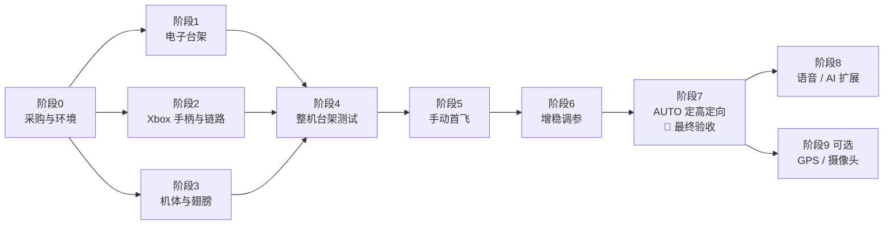

# 仿生蝴蝶从零到受控起飞：总计划

> **最终目标（验收标准）**：用 **Xbox 手柄**操控，蝴蝶从手上起飞，在 **AUTO 模式**下持续飞行 **≥ 30 秒**。能按手柄或文本指令完成**加速 / 减速、左转 / 右转、爬升 / 下降、掉头、降落**；松开摇杆后，自动保持姿态、航向和高度（高度波动 ≤ ±1 m）；机体无损，**连续成功 3 次**。
>
> 这份计划是总入口，其他文档分工如下：
> - 项目调研：[`bionic-butterfly-research.md`](bionic-butterfly-research.md)
> - 增稳与降噪原理：[`gyro-stabilization-and-noise-reduction.md`](gyro-stabilization-and-noise-reduction.md)
> - 固件接线、命令和参数：[`../firmware/README.md`](../firmware/README.md)
> - GPS 与摄像头扩展（可选）：[`gps-and-camera.md`](gps-and-camera.md)

---

## 0. 全局路线图



| 阶段 | 内容 | 预计耗时（业余时间） | 出口条件 |
|---|---|---|---|
| 0 | 采购、装软件、学习锂电池安全 | 1–2 周（主要是等快递） | 物料到齐，Arduino IDE 能编译 |
| 1 | 飞控 + IMU + 气压计 + 舵机在桌面上跑通 | 2–3 天 | 传感器方向全部正确，台架扑翼正常 |
| 2 | Xbox 手柄配对 + 无线链路 | 1 天 | 能解锁，失控保护正常 |
| 3 | 机体、翅膀制作 | 3–7 天 | 整机重量达标，左右对称 |
| 4 | 整机台架测试 + 频谱分析 + 吊线测试 | 1–2 天 | 频谱符合预期，吊线测试方向正确 |
| 5 | MANUAL 手动首飞 | 1–3 天 | 能直飞 10 秒并完成转向 |
| 6 | STABILIZE 增稳调参 | 2–5 天 | 松杆后自动回平，无发散振荡 |
| 7 | HEADING_HOLD → AUTO 定高 | 2–4 天 | **最终验收通过** |
| 9（可选） | GPS 定位 / 摄像头 | 1–3 天 | 手机上能看到位置或画面，`thr_hover` 仍 ≤ 0.8 |

总计大约 **5–9 周**。

---

## ✈️ 飞行能力与 Xbox 手柄操控

### 扑翼蝴蝶能做哪些动作？

蝴蝶扑翼机和四旋翼无人机的物理原理不同。它靠**向前飞时翅膀产生的升力和推力**维持飞行，所以动作是这样对应的：

| 你想要的动作 | 蝴蝶实际怎么做 | 用什么控制 |
|---|---|---|
| **前进 / 加速** | 低头，飞得更快 | 右摇杆向前推 |
| **减速** | 抬头，飞得更慢 | 右摇杆向后拉 |
| **后退** | ❌ 物理上做不到持续倒飞 → 用**原地掉头 180°** 代替 | **Y 键** |
| **左 / 右** | 压坡度转弯，或者原地改变航向 | 右摇杆左右（压坡度）/ 左摇杆左右（转航向）/ LB、RB（各转 45°） |
| **上升 / 下降** | 加大 / 减小扑翼频率和幅度 | AUTO：左摇杆上下（松手就定高）；其他模式：RT 扳机 |
| **悬停不动** | ❌ 做不到，它必须一直向前飞 | 想在一个区域里待着，可以用 LB / RB 让它绕圈 |

### 飞行途中自动保持稳定（AUTO 模式）

| 自动保持的量 | 靠什么传感器 | 松开摇杆后的效果 |
|---|---|---|
| **姿态**（横滚、俯仰） | 陀螺仪 ICM-42688-P + 扑翼同步滤波 | 自动回平，抵抗阵风 |
| **航向** | 陀螺仪积分 | 保持直线飞行；LB / RB / Y 触发精确转弯 |
| **高度** | 气压计 BMP280 + 整周期平均 | 保持当前高度，自动调整扑翼强度 |
| 位置 / 速度 | ❌ 没有 GPS 和空速计 | 会随风漂移，需要人来修正方向 |

$$
\underbrace{h_{\text{err}} = h^{*} - \bar h}_{\text{高度误差}}
\;\xrightarrow{\;K_{p,h}\;}\;
\dot h^{*}
\;\xrightarrow{\;\text{PI}\;}\;
\text{throttle} = T_{\text{hover}} + K_{p,v}\,(\dot h^{*} - \dot{\bar h}) + K_{i,v}\!\int(\dot h^{*} - \dot{\bar h})\,dt
$$

这里 $h^{*}$ 是目标高度，$\bar h$ 是整周期平均后的实测高度，$\dot h^{*}$ 是目标爬升率，$T_{\text{hover}}$ 是参数 `thr_hover`（大致能维持高度的油门）。

### Xbox 手柄按键表

```
            LB 左转45°                               RB 右转45°
            LT (不用)                                RT 油门（非 AUTO 模式）
      ┌──────────────────────────────────────────────────────────┐
      │   左摇杆                               Y  掉头 180°      │
      │   ↑↓ 爬升/下降（AUTO，松手定高）      X  返航  B  上锁   │
      │   ←→ 转航向                            A  长按 1 秒解锁  │
      │                                                          │
      │   十字键 ↑ AUTO   → HOLD            右摇杆               │
      │          ↓ STAB   ← MANUAL          ↑ 前推 = 低头加速    │
      │                                     ↓ 后拉 = 抬头减速    │
      │   View 键：陀螺仪校准（上锁时）      ←→ 压坡度转弯        │
      └──────────────────────────────────────────────────────────┘
```

**连接方式**：Xbox 手柄 ⇢ 低功耗蓝牙（BLE）⇢ 地面站 XIAO ESP32S3 ⇢ ESP-NOW ⇢ 蝴蝶。
地面站同时保留了**文本指令接口**（语音 / AI / 电脑都可以用）。**手柄断开连接时，地面站立刻停止发送控制指令**，蝴蝶会自动进入失控保护：保持水平，滑翔降落。

---

## 1. 材料清单 (BOM)

> 价格是估算用的参考区间，实际以商家为准。**带 ★ 的是关键件**，规格不要随意更改。
> “搜索关键词”可以直接复制到淘宝或京东搜索。**型号后面标“例”的，表示满足规格的任意型号都可以。**

### 1.1 机上电子

| 编号 | 名称 | 型号 | 关键规格（必须满足） | 数量 | 用途 | 搜索关键词 | 参考价 (¥) |
|---|---|---|---|---|---|---|---|
| E1 | ★ 主控板 | **Seeed Studio XIAO ESP32S3**（不要 Sense 版） | ESP32-S3 双核 240 MHz，8 MB PSRAM + 8 MB Flash，Wi-Fi + BLE 5，USB-C，21 × 17.5 mm，约 3 g | 1 + 1 备用 | 飞控 | `XIAO ESP32S3` | 40–70 |
| E2 | ★ 陀螺仪 | **ICM-42688-P** 模块 | 6 轴，**SPI**（引出 CS），3.3 V，WHO_AM_I = `0x47`，陀螺 ±2000 dps | 1 + 1 | 姿态测量 | `ICM42688P 模块 SPI` | 15–40 |
| E3 | ★ 气压计 | **BMP280**（模块 **GY-BMP280-3.3**） | 3.3 V，SPI（引出 CSB、SDO），300–1100 hPa，相对精度约 ±0.12 hPa（≈ ±1 m），chip id `0x58`（`0x60` 的 BME280 也能用） | 1 + 1 | 定高 | `GY-BMP280-3.3` | 5–10 |
| E4 | ★ 舵机 | **PTK 7465**（例），高压数字金属齿微型舵机 | 工作电压含 **7.4 V（2S）**，速度 ≤ 0.08 s/60°，扭矩 ≥ 1 kg·cm，重量 ≤ 8 g，支持 333 Hz PWM | 2 + 1 | 驱动左右翅膀 | `PTK7465 舵机` / `HV 数字 金属齿 微型舵机` | 40–150 / 个 |
| E5 | ★ 电池 | 2S 7.4 V **180 mAh 30C** 锂聚合物（例） | 150–200 mAh，放电 ≥ 30C，带平衡头，约 10–13 g | 1 + 1 | 内置动力电池 | `2S 7.4V 180mAh 30C 锂电池` | 20–35 |
| E6 | ★ Type-C 充电板 | **IP2326** 方案 2S 升压充电模块（例） | USB-C 5 V 输入 → 8.4 V 恒流/恒压，**充电电流可设 ≤ 180 mA（≤ 1C）**，有充电指示灯 | 1 + 1 | 蝴蝶的 Type-C 充电口 | `IP2326 Type-C 2串 升压充电模块` | 5–15 |
| E7 | ★ 电池保护板 | 2S 锂电保护板（带均衡）（例） | 持续电流 ≥ 5 A，过充约 4.25–4.3 V/节，过放约 2.5–3.0 V/节，带均衡 | 1 + 1 | 防止过充、过放、短路 | `2S 7.4V 保护板 均衡 5A` | 3–8 |
| E8 | 电源开关 MOS | **AO3401A**（P-MOS，SOT-23） | V<sub>DS</sub> −30 V，I<sub>D</sub> −4 A，R<sub>DS(on)</sub> 约 50 mΩ | 2 | 软电源开关 | `AO3401A SOT-23` | 1 |
| E9 | 拨动开关 | **SK12D07**（例）超小拨动开关 | 只走 MOS 管栅极的微小电流，越小越好 | 2 | 开机 / 关机 | `SK12D07 拨动开关` | 1 |
| E10 | 降压模块 | **Mini-360**（MP2307 方案） | 输入 4.75–23 V，输出可调（**调到 5.0 V**），1.8 A，约 17 × 11 mm | 2 | 给 XIAO 供电 | `Mini360 降压模块` | 3–5 |
| E11 | 肖特基二极管 | **SS14**（SMA 封装） | 1 A，40 V | 5 | XIAO 5V 引脚防倒灌 | `SS14 贴片二极管` | 1 |
| E12 | 大电容 | 470 µF / 16 V **低 ESR** 电解电容 | 直径 ≤ 8 mm | 3 | 吸收舵机电流尖峰 | `470uF 16V 低阻 电解电容` | 3 |
| E13 | 去耦电容 | 10 µF 0805 + 100 nF 0603 陶瓷电容 | 耐压 ≥ 10 V | 各 5 | IMU / 气压计电源去耦 | `0805 10uF` `0603 100nF` | 3 |
| E14 | 电阻 | 100 kΩ、200 kΩ（1%，0603 或直插） | — | 各 5 | 电池电压 / 充电检测分压，MOS 栅极上拉 | `100K 200K 1% 电阻` | 2 |
| E15 | 线材 | 30 AWG（信号）/ 26 AWG（电源）硅胶线，JST-PH2.0 2P 插头，热缩管 | — | 若干 | 连接 | `30AWG 硅胶线` `PH2.0 端子线` | 15 |
| E16 | 减震泡棉 | 3M VHB 泡棉双面胶（1 mm）+ 开孔海绵小块 | — | 1 | IMU 软安装、气压计防风罩 | `3M VHB 泡棉胶 1mm` | 10 |

### 1.2 遥控器 / 地面站（推荐：Xbox 手柄）

| 编号 | 名称 | 型号 | 关键规格 | 数量 | 用途 | 搜索关键词 | 参考价 (¥) |
|---|---|---|---|---|---|---|---|
| R1 | ★ 游戏手柄 | **Xbox 无线控制器（Series X\|S，型号 Model 1914）** | 固件 **≥ 5.x（支持 BLE）**；在电脑的 “Xbox 配件” 应用里可以升级固件 | 1 | 操控 | `Xbox Series 无线手柄` | 300–450（已有就不用买） |
| R2 | ★ 桥接主控 | **Seeed Studio XIAO ESP32S3** | 同 E1 | 1 | 手柄 BLE ⇢ ESP-NOW 桥接，同时提供文本指令接口 | `XIAO ESP32S3` | 40–70 |
| R3 | 地面站电池 | 1S 3.7 V 300–500 mAh 锂聚合物（例） | 焊到 XIAO 背面的 BAT 焊盘，**直接用 XIAO 的 Type-C 充电** | 1 | 地面站供电 | `3.7V 400mAh 锂电池 PH2.0` | 10–20 |
| R4 | 外壳 | 3D 打印小盒，或者直接绑在手柄背面 | — | 1 | 保护电路 | — | — |
| R5 | 可选：自制摇杆方案 | KY-023 摇杆 ×2 + 10 kΩ 线性电位器 + SK12D07 ×2 | 编译时设置 `USE_XBOX=0` | — | 没有 Xbox 手柄时用 | `KY-023 摇杆模块` | 15 |
| R6 | 可选：语音 | 天问 **ASRPRO** 核心板 或 **CI1302** 模块 | UART 115200 输出文本指令 | 1 | 阶段 8 | `ASRPRO 语音识别` | 15–40 |

> 其他型号的 Xbox 手柄（例如 One S 的 Model 1708、Elite 2）升级到 BLE 固件后，理论上也能用，但没有验证过。**Series X|S（Model 1914）是验证路径。**

### 1.3 机体与翅膀

| 编号 | 名称 | 型号 / 规格 | 数量 | 用途 | 搜索关键词 | 参考价 (¥) |
|---|---|---|---|---|---|---|
| A1 | 碳纤维实心杆 Ø2.0 mm | 长 500 mm | 4 | 翅膀前缘（主梁） | `碳纤维实心杆 2mm` | 10 |
| A2 | 碳纤维实心杆 Ø1.5 mm | 长 500 mm | 4 | 翅脉 | `碳纤维实心杆 1.5mm` | 8 |
| A3 | 碳纤维实心杆 Ø1.0 mm | 长 500 mm | 6 | 翅脉、翼尖 | `碳纤维实心杆 1mm` | 8 |
| A4 | 碳纤维板 | 厚 0.8 mm，约 100 × 50 mm | 1 | 机身龙骨、舵机座加强 | `碳纤维板 0.8mm` | 10–20 |
| A5 | 翼膜 | 聚酯薄膜（Mylar）12–15 µm，或 OPP 15–20 µm（彩色、半透明都行） | A3 大小 × 4 张 | 翼面 | `聚酯薄膜 12微米` | 10–20 |
| A6 | 3D 打印件 | Mech-Butterfly 的舵机座和机身件，PLA，层高 0.2 mm，2 圈壁，15–20% 填充 | 1 套 | 结构 | — | 20–60（代打） |
| A7 | 胶 | 502 / CA 胶（低白化）+ 固化剂；3M 77 喷胶（贴膜用） | 各 1 | 粘接 | `低白化502` `3M77喷胶` | 30–50 |
| A8 | 紧固件 | M2 × 6 螺丝和螺母；舵机自带的小螺丝 | 1 包 | 固定舵机 | `M2 螺丝 套装` | 5 |
| A9 | 魔术贴 | 10 mm 宽 | 1 小段 | 调重心阶段临时固定电池 | — | 2 |

### 1.4 工具

| 工具 | 规格 | 必要性 | 参考价 (¥) |
|---|---|---|---|
| 电烙铁 + 焊锡 + 助焊剂 | 恒温，尖头；0.6 mm 焊锡丝 | 必须 | 50–150 |
| 万用表 | 能测直流电压、电流、通断 | 必须 | 50–100 |
| USB 充电头 + USB-C 线 | 5 V / 2 A（手机充电器即可） | 必须 | — |
| USB 电流电压表 | Type-C 口 | 建议，用来看充电电流 | 15–30 |
| 耐火充电垫 / 陶瓷盘 | — | 必须，充电时把蝴蝶放在上面 | 15 |
| **0.01 g 精度电子秤**（珠宝秤） | 量程 ≥ 200 g | **必须**，控制重量全靠它 | 20–40 |
| 笔刀、钢尺、切割垫、剪刀 | — | 必须 | 20–40 |
| USB-C 数据线 | 要能传数据，不能只是充电线 | 必须 ×2 | 20 |
| 2S 平衡充电器 | — | 可选，只在电池需要维护时用 | 80–250 |
| 3D 打印机 | — | 可选（也可以找代打） | — |

**预算合计**：不含工具和 Xbox 手柄，约 **¥550–1100**；工具约 ¥250–500；如果还没有 Xbox 手柄，再加 ¥300–450。

### 1.5 舵机选型要点

舵机决定了蝴蝶能不能飞起来：

$$
\text{舵机选型} = \underbrace{\text{速度} \le 0.08\ \text{s}/60^\circ}_{\text{扑翼频率够高}}
\;+\; \underbrace{\text{扭矩} \gtrsim 1\ \text{kg·cm}}_{\text{带得动翅膀}}
\;+\; \underbrace{\text{重量} \le 8\ \text{g}}_{\text{整机够轻}}
\;+\; \text{金属齿、数字舵机}
$$

| 方案 | 供电 | 舵机示例（来自 2ServoFlapOrnithopter 的推荐） | 说明 |
|---|---|---|---|
| **A（推荐）** | 2S 电池直接给舵机供电 | **高压 (HV) 舵机**，例如 PTK 7465（7.4–8.4 V） | 线路最简单 |
| B | 2S 电池 → **6 V BEC** → 舵机 | 6 V 舵机，例如 BLUEARROW AF D43S-6.0-MG、PTK 7350 | 多一个 BEC，大约多 2–3 g |

> 买之前一定要核对卖家标注的工作电压。**6 V 舵机直接接 2S 电池会烧掉。**
> 如果买的是模拟舵机，要把 `config.h` 里的 `SERVO_PWM_HZ` 改成 50。

### 1.6 重量预算

起飞条件是 $L > mg$，而升力近似满足 $L \propto f^{2} A^{2} S$。所以**每一克都很重要**。

| 部件 | 估计重量 (g) |
|---|---|
| 舵机 ×2 | 12–16 |
| 2S 180 mAh 电池（内置） | 10–13 |
| Type-C 充电模块 + 保护板 + MOS 开关 | 3–5 |
| XIAO ESP32S3 | 约 3 |
| IMU 模块 + 减震胶 | 1.5–2.5 |
| 气压计模块 + 防风海绵 | 0.5–1 |
| 降压模块、二极管、电容、分压电阻 | 2–3 |
| 线材和插头 | 2–4 |
| 机身（碳杆 + 3D 打印件） | 8–15 |
| 翅膀 ×2 | 15–25 |
| **合计目标** | $\le 75 \sim 85\ \text{g}$ |
| 可选：GPS / 摄像头 | +3 / +4–7 g，见 [`gps-and-camera.md`](gps-and-camera.md) |

每做完一个部件就称一次，把实际重量记下来。如果超重 10 g 以上，先减重再往下做。

### 1.7 为什么还需要电池？内置电池 + Type-C 充电方案

**真正“不带电池”在现阶段做不到。** 按实测数据估算：2S 180 mAh 电池能飞 3–5 分钟，由此反推飞行功率

$$
P \approx \frac{0.8 \times 7.4\ \text{V} \times 0.18\ \text{Ah}}{4\ \text{min}} \approx 16\ \text{W},
\qquad
E_{4\,\text{min}} = P\,t \approx 16\ \text{W} \times 240\ \text{s} \approx 3.8\ \text{kJ} \approx 1.07\ \text{Wh}
$$

| 储能方式 | 能量密度（约） | 存下 $1.07\ \text{Wh}$ 需要的质量 | 结论 |
|---|---|---|---|
| **LiPo 锂电池** | $150 \sim 200\ \text{Wh/kg}$ | 电芯约 $5 \sim 7\ \text{g}$（成品电池包 10–13 g） | ✅ 唯一可行 |
| 超级电容 | $\approx 5\ \text{Wh/kg}$ | $\approx 200\ \text{g}$，比整只蝴蝶还重 | ❌ |
| 拖线供电 | — | 电线的重量和拖拽都太大，不能自由飞 | ❌ |
| 太阳能薄膜 | 满阳光下约 $100 \sim 200\ \text{W/m}^2 \times 20\%$ 效率 | 翅膀全贴满也只有几瓦，而且翅膀一直在扇动 | ❌ |

所以采用的方案是：**电池内置在机身里，从外面看不到、不用拆，插 Type-C 线就能充电，用起来和手机一样。**

```
 Type-C ─► 2S 升压充电模块 ─► 2S 保护板（均衡）─► 内置电池
                                   │
                              P-MOS 电源开关（关机也能充电）
                                   │
                         舵机 / 降压模块 / 飞控
 充电模块 VBUS ─► 分压 ─► 飞控 D6：检测到正在充电 → 锁定，不能解锁
```

- **充电电流**：设成 $\le 1\text{C}$。180 mAh 的电池就是不超过 180 mA；0.5C 更有利于延长电池寿命。
- **充电时间**：$t \approx 1.2 \times \dfrac{Q}{I}$。1C 充电约 1.2 小时，0.5C 约 2.4 小时。
- **充电锁**：只要插着充电线，飞控就拒绝解锁（台架模式也不行），LED 以 1 秒亮、1 秒灭闪烁。拔掉充电线后必须重新解锁：Xbox 手柄上先按 B 上锁，再长按 A。
- **遥控器**也内置 1S 电池，直接用 XIAO 的 Type-C 口充电。
- **调重心**：电池现在不能拆，可以先用魔术贴临时固定，找到合适的重心位置后再用胶固定；之后需要微调时，用小块配重就行。

---

## 2. 软件准备（阶段 0）

- [ ] 安装 **Arduino IDE 2.x**，加入 ESP32 开发板地址，安装 **esp32 by Espressif 3.x**（步骤见 [`firmware/README.md`](../firmware/README.md) §1）。
- [ ] 开发板选 `XIAO_ESP32S3`，**USB CDC On Boot = Enabled**。
- [ ] 安装 Python 3，然后运行 `pip install pyserial numpy matplotlib`（画频谱用）。
- [ ] 把仓库下载到本地：`git clone` 本仓库。
- [ ] 学习锂电池安全：
  - 用 Type-C 充电时有人看着，蝴蝶放在耐火垫上；充电模块或电池发烫就立即拔掉。
  - 单节电压：充满 4.2 V；长期不用时存成 3.8 V 左右；飞行中不要低于 3.5 V（固件会在低于 `vcell_warn` 时报警）。
  - 电池鼓包、摔破了，立即停用。

---

## 3. 阶段 1：电子台架（先不装到机身上）

**目的**：在桌面上把飞控、陀螺仪、舵机全部跑通，确认方向都对。

### 1.1 烧录飞控

- [ ] XIAO 只插 USB，上传 `firmware/butterfly_fc`。
- [ ] 打开串口监视器（115200，行尾选 Newline）。应该能看到 `butterfly_fc 0.1.0`；此时 IMU 还没接，所以会显示 `IMU ... NOT FOUND`。输入 `help` 能列出命令。

### 1.2 接 IMU 并检查方向（关键）

- [ ] 按 [`firmware/README.md`](../firmware/README.md) §2 接好 SPI（CS→D3、SCLK→D8、SDO→D9、SDI→D10、3V3、GND）。
- [ ] 重启，应该看到 `IMU ICM-42688-P: OK (WHO_AM_I=0x47)` 和 `gyro calibrated`。
- [ ] 把 IMU 板平放，丝印面朝上、X 轴箭头朝前。反复输入 `imu`，逐项核对下表：

| 操作 | 期望读数 |
|---|---|
| 水平静止 | `acc z ≈ -1.00`，`roll ≈ 0`，`pitch ≈ 0` |
| 抬起机头（前端向上） | `pitch` 为**正**，`acc x` 为正 |
| 右侧向下倾斜 | `roll` 为**正** |
| 从上往下看，顺时针转动（机头向右） | 转动过程中 `r` 为**正**，`yaw` 增大 |

- [ ] 如果不对：
  - 前后左右对应错了 → `set imu_yaw_quarter 1`（依次试 1、2、3）。
  - Z 轴反了（水平静止时 `acc z ≈ +1`）→ `set imu_flip 1`。
  - 改好后输入 `save`，再重新核对一遍表格。

### 1.2b 接气压计并检查

- [ ] 把 GY-BMP280-3.3 接到同一组 SPI 线上：SCL→D8，SDA→D10，SDO→D9，**CSB→D4**，VCC→3V3，GND。
- [ ] 重启，应该看到 `baro BMP280: OK (chip id 0x58)`；如果是 `0x60`，说明是 BME280，也能用。
- [ ] 输入 `status`，记下 `alt`。把板子举高 1 m 静止几秒，`alt` 应该增加约 1.0 m（±0.3 m）。
- [ ] 用一小块**开孔海绵**把气压计盖住（防止扑翼气流直接吹到它），固定在机身内部。

### 1.3 电源、充电与舵机

- [ ] **组装电源板**：按 [`firmware/README.md`](../firmware/README.md) §2 的“机上电源”图，焊接充电模块、保护板、MOS 开关和电池。
  - 焊电池时**一次只接一根线**，避免正负极短路。
  - 先接保护板的 B−，最后接 B+。
- [ ] **开关测试**：开关断开时，SYS+ 应为 0 V；闭合后，SYS+ 等于电池电压（7.4–8.4 V）。
- [ ] **充电测试**（中间串一个 USB 电流表）：
  - 充电电流 ≤ 1C（180 mAh 的电池不超过 180 mA）。
  - 充满后电池电压约 8.4 V，两节电芯各约 4.2 V（用万用表量平衡线）。
  - 充电过程中模块和电池温度 < 45 °C（手摸只是微温）。
- [ ] 用万用表把降压模块调到 **5.0 V**，再接上二极管，然后接到 XIAO 的 5V 引脚。
- [ ] **充电锁测试**：开机后插上 Type-C 充电线，`status` 应显示 `CHARGING (arming locked)`，LED 1 秒亮、1 秒灭；此时输入 `bench 0.3` 也不会扑翼。拔掉充电线后，再用 `bench` 就能正常扑翼。
- [ ] 先把舵机臂**拆下来**，把舵机电源接到 SYS+（方案 A 高压舵机直接接），并装好 470 µF 电容。
- [ ] 输入 `servo 0 0`，两个舵机回到中位。**在中位装上舵机臂**，左右对称。
- [ ] 输入 `servo 20 20`，两侧翅膀杆都应该**向上**转。哪一侧向下转，就把对应的 `servo_dir_l` / `servo_dir_r` 改成相反的符号。
- [ ] 如果中位不对称，用 `trim_l` / `trim_r` 微调。调好后 `save`。
- [ ] 用 `status` 看电池电压，和万用表读数对比；有偏差就调整 `vbat_ratio`。

### 1.4 台架扑翼

- [ ] 输入 `bench 0.3`：开始低频扑翼（约 3 Hz）。`bench 1.0`：最高频率 5 Hz、幅值 ±40°。
- [ ] `bench stick 1 0 0`：两翼的扑动中心应该反向偏移（横滚）。`bench stick 0 0 1`：左右幅度应该不同（偏航）。
- [ ] 输入 `status`，确认 `loop max` < 900 µs，全程没有复位重启。最后 `bench off`。

**✅ 出口条件**：IMU 四项方向检查全部正确；气压计读数正常；Type-C 充电和充电锁正常；舵机方向和中位正确；台架扑翼 2 分钟不复位。

---

## 4. 阶段 2：Xbox 手柄与无线链路

### 2.1 地面站烧录与手柄配对

- [ ] 在 Arduino IDE 的**库管理器**中安装：`XboxSeriesXControllerESP32_asukiaaa`（会自动安装依赖 `NimBLE-Arduino` 和 `XboxControllerNotificationParser`）。
- [ ] 手柄固件升级到**支持 BLE 的版本**：在 Windows 上打开 “Xbox 配件” 应用，连接手柄后升级。
- [ ] 第二块 XIAO 焊好 1S 电池（BAT 焊盘），上传 `firmware/ground_station`（默认 `USE_XBOX 1`）。
- [ ] 按 Xbox 键开机，再**长按手柄顶部的配对键**，直到 Xbox 标志快速闪烁。地面站会自动连接；连接成功后标志常亮。
- [ ] 在串口输入 `STATUS`，应该显示 `Xbox connected (battery xx%)`。逐个推摇杆，核对方向：
  - 右摇杆向右 → `roll` 为 +
  - 右摇杆**向后拉** → `pitch` 为 +（抬头）
  - 左摇杆向右 → `yaw` 为 +
  - 左摇杆向前推 → `climb` 为 +
  - RT 按到底 → `thr` 接近 1.00

### 2.2 无线链路与安全逻辑

- [ ] 两边都上电，输入 `STATUS`，应该显示 `butterfly: state 0 ... link ~50 pkt/s`。
- [ ] **解锁测试（MANUAL）**：十字键 ← 选 MANUAL，松开 RT，**长按 A 1 秒** → 串口显示 `ARMED`，飞控 LED 常亮；按 RT → 开始扑翼；按 **B** → 立即停止扑翼。
- [ ] **防误解锁测试 1**：按住 RT 的同时长按 A → 应该显示 `arm refused: release RT`。
- [ ] **防误解锁测试 2**：十字键 ↑ 选 AUTO，把左摇杆往上推着长按 A → 应该显示 `arm refused: centre the left stick`。
- [ ] **AUTO 起飞手势测试**（台架上，手扶住机身）：在 AUTO 模式下，左摇杆回中后长按 A 解锁 → **不应该扑翼**；左摇杆推过一半 → 开始扑翼（这就是“起飞手势”）。
- [ ] **失控保护测试**：扑翼时长按 Xbox 键把手柄关机 → 0.5 秒内停止扑翼，翅膀回到滑翔姿态，LED 快闪。手柄重新开机连上后 → 自动恢复控制。
- [ ] **距离测试**：拿着手柄和地面站走到 30 m 外，`link` 仍然大于 40 pkt/s。（BLE 只负责手柄到地面站这段，通常 ≤ 10 m；地面站和手柄要放在一起。）

**✅ 出口条件**：以上测试全部通过。

---

## 5. 阶段 3：机体与翅膀

- [ ] 下载 [Mech-Butterfly](https://github.com/Tzenthin/Mech-Butterfly) 的 `3, 翅膀`（A3 翅膀模板）和 `5, 3D打印件`。
- [ ] 3D 打印舵机座：打印前先核对舵机尺寸。如果不匹配，改模型的舵机槽（Fusion 360、Onshape 或 FreeCAD 都可以）。
- [ ] **翅膀**：
  1. 用 A3 纸打印模板，垫在切割垫下面。
  2. 沿模板外形粘碳杆：前缘用粗杆，翅脉用细杆。
  3. 把薄膜绷平后粘上，四周修边。
  4. **左右两只翅膀的重量差要 ≤ 0.5 g**，前缘刚度也要一致。
- [ ] **机身**：碳片或碳杆做龙骨；两个舵机**严格对称**安装；舵机臂直接连接翅膀前缘根部。
- [ ] **电子部分**：
  - XIAO、降压模块等尽量集中放在重心附近。
  - IMU 用 VHB 泡棉胶贴在**重心附近**，X 轴朝前，远离舵机。
  - 电池用魔术贴固定，这样可以前后移动来调重心。
  - 舵机信号线做双绞；470 µF 电容贴近舵机插头。
- [ ] **称重**：把整机重量和各部件重量填进 §1.6 的表格。

**✅ 出口条件**：整机重量 ≤ 85 g；翅膀左右对称；舵机转动时翅膀不碰机身、不碰线。

---

## 6. 阶段 4：整机台架测试

### 4.1 扑翼耐久

- [ ] 用软夹具固定机身（手扶也可以），`bench 0.6` 扑翼 1 分钟。检查：不复位、舵机不过热、结构不松动。

### 4.2 频谱分析（验证降噪）

- [ ] `bench 0.6` 保持扑翼，同时在电脑上运行：

```bash
python tools/gyro_fft.py capture --port COM5 --mode fft --seconds 20 --out fft.csv
python tools/gyro_fft.py plot fft.csv --out fft.png
```

- [ ] 在 `fft.png` 里应该看到：
  - 蓝线（滤波前）在 $f$、$2f$ 处有明显尖峰。
  - 橙线（陷波后）在这两处被压下去。
- [ ] 再用 `--mode raw` 采集一次，看 100–400 Hz 的舵机噪声。如果噪声很大：
  - 先检查 IMU 的软安装，把泡棉胶加厚。
  - 再适当降低 `gyro_lpf_hz`（比如 40）。

### 4.3 吊线测试（确认混控方向和升力）

- [ ] 在重心处系一根细线，把蝴蝶吊起来。模式设为 MANUAL（十字键 ←），RT 按到约 70%：
  - 细线明显变松或被往上拉 → 升力足够。
  - 横滚杆向右 → 机体向右倾斜 / 向右转；偏航杆向右 → 机头向右；拉杆 → 抬头。
  - 方向相反，就在遥控器上执行 `SET mix_roll_dir -1`（对应的轴同理），然后 `SAVE`。
- [ ] 切到 STABILIZE，手拨机体让它向右倾，看它会不会自己往回修正（`log att` 里的 `ur` 应该为负）。

**✅ 出口条件**：频谱符合预期；吊线测试时细线变松；三个轴的方向都正确。

---

## 7. 阶段 5：手动首飞 (MANUAL)

**场地**：无风的室内（体育馆、大厅），或者无风的草地（清晨最好）。周围不要有人。

- [ ] **滑翔测试**：上电但不解锁，此时翅膀保持在 `center` 滑翔姿态。平推出手，理想状态是平缓下降。
  - 一出手就扎头 → 重心往后调：还没固定电池时，把电池往后挪；已经固定了，就在机尾加小配重。
  - 一出手就抬头失速 → 重心往前调：电池往前挪，或者在机头加小配重。
  - 下降太快 → 适当加大 `center`（上反角）。
- [ ] **短跳**：MANUAL 模式下长按 A 解锁，RT 按到约 70%，微微向上推出手。飞 3–5 秒后松开 RT，滑翔落地。
- [ ] **修正持续偏航**：如果总往一边偏，用 `trim_l` / `trim_r` 做反向微调（比如 `SET trim_l 2`、`SET trim_r -2`），调到能直飞。
- [ ] **转向**：小幅度打横滚和偏航杆，确认方向正确（反了就回到 4.3 改 `mix_*_dir`）。
- [ ] **记下平飞油门**（RT 按到多少时高度基本不变），后面 AUTO 模式要用：
  - 在地面站输入 `SET thr_hover <平飞油门>`，然后 `SAVE`。
  - 如果满油门都飞不起来，用 `SET` 提高 `f_max` / `amp_max`。

**✅ 出口条件**：在 MANUAL 模式下能直飞 10 秒，并分别完成一次左转和一次右转。

---

## 8. 阶段 6：增稳调参 (STABILIZE)

- [ ] 在 MANUAL 模式下飞稳后，按十字键 ↓ 切到 **STABILIZE**，比较两种模式的手感。
- [ ] 调参顺序：每次只改一个参数，每改一次飞一次。参数可以在飞行间隙用遥控器 `SET` 修改，确认后再 `SAVE`。

| 现象 | 调整方法 |
|---|---|
| 以几 Hz 的频率快速左右摇摆，而且频率 ≠ 扑翼频率 | 降低 `rate_p_roll` / `rate_p_pitch`（每次 −20%） |
| 松杆后回平很慢、姿态发飘 | 提高 `ang_p_roll` / `ang_p_pitch`（每次 +20%） |
| 长时间稳定地偏向一侧 | 提高 `rate_i_*`，或者检查 `trim` |
| 打杆后反应迟钝 | 提高 `ff`（0.5 → 0.7） |
| 随扑翼节奏抖动 | 确认 `notch_on 1`、`stroke_avg_on 1`，并回到 4.2 看频谱 |

- [ ] 对比实验：分别设置 `notch_on 0` 和 `notch_on 1` 各飞一次，体会陷波滤波的效果。
- [ ] 飞行数据记录：遥控器输入 `TEL ON`，把串口输出保存成 CSV，方便复盘。

**✅ 出口条件**：STABILIZE 模式下松杆后 1–2 秒内回平；30 秒飞行中没有越来越大的振荡。

---

## 9. 阶段 7：航向保持 → AUTO 定高（🎯 最终验收）

### 7.1 航向保持（HOLD，十字键 →）

- [ ] 松开左摇杆后，蝴蝶应该保持当前航向直飞。
- [ ] 按 RB 应右转约 45°，按 LB 应左转约 45°，按 Y 应掉头约 180°。
- [ ] 如果转弯过冲、来回摆：降低 `head_p`；如果转得太慢：提高 `head_p` 或 `max_yaw_rate`。

### 7.2 AUTO 定高（十字键 ↑）

- [ ] **起飞流程**：
  1. 十字键 ↑ 选 AUTO，左摇杆回中，长按 A 解锁（此时不会扑翼）。
  2. 手托蝴蝶，把左摇杆**推过一半**，开始扑翼爬升，顺势推出手。
  3. 到达想要的高度后**松开左摇杆**，蝴蝶自动定高。
- [ ] **定高调参**：遥控器输入 `TEL ON` 记录飞行数据，重点看 `alt` 和 `vz` 两列。

| 现象 | 调整方法 |
|---|---|
| 松手后一直慢慢掉高度 | 提高 `thr_hover`（+0.05），或者提高 `vz_i` |
| 高度上下起伏（周期几秒） | 降低 `alt_p` 或 `vz_p`（每次 −20%） |
| 爬升 / 下降反应太慢 | 提高 `vz_p`，或者提高 `max_climb` / `max_descent` |
| 高度读数随扑翼节奏乱跳 | 检查气压计上的防风海绵；降低 `baro_lpf_hz`（例如 1.0） |

- [ ] **完整飞行剧本**（手柄）：起飞 → 定高直飞 → 右摇杆前推加速 / 后拉减速 → RB 右转 → LB 左转 → Y 掉头 → 左摇杆上推爬升 1 m / 下拉下降 1 m → 左摇杆拉到底下降、滑翔落地 → B 上锁。
- [ ] **完整飞行剧本**（文本指令，电脑串口）：

```
MODE AUTO
TAKEOFF        → 起飞手势 + 爬升 1.5 秒，然后定高
RIGHT 90       → 右转
LEFT 90        → 左转
UP / DOWN      → 目标高度 +1 m / −1 m
LAND           → 持续下降，滑翔落地
DISARM
```

- [ ] 测试人工接管：执行文本指令的过程中动一下手柄摇杆，控制权应该立刻回到手上。

**🏁 最终验收**：手上起飞 → 在 AUTO 模式下飞行 ≥ 30 秒 → 完成加速、减速、左转、右转、掉头、爬升、下降 → 松杆时保持高度（±1 m）和航向 → 降落无损。**连续成功 3 次。**

---

## 10. 阶段 8：语音 / AI 扩展（验收之后再做）

两者都复用遥控器已有的**文本指令接口**，飞控固件不需要改动：

- **语音**：把离线语音模块（ASRPRO / CI1302）的 TX 接到遥控器的 **D7**。在模块里把“起飞 / 降落 / 左转 / 右转 / 升高 / 降低”分别配置成输出 `TAKEOFF\n`、`LAND\n`、`LEFT 30\n`、`RIGHT 30\n`、`UP\n`、`DOWN\n`。
- **AI**：在电脑上用 Python 通过串口给遥控器发同样的指令。例如用大模型的 function calling，把 `turn(deg)`、`takeoff()` 这些函数映射成串口文本；也可以换成 ESP32-S3 + [xiaozhi-esp32](https://github.com/78/xiaozhi-esp32) 这类方案。
- **安全边界不变**：解锁必须在手柄上长按 A（或者由文本指令 `ARM` 触发），按 B 随时上锁；动一下摇杆就能人工接管；手柄或链路中断时，飞控自动进入失控保护。

---

## 10b. 阶段 9：GPS 定位与摄像头（可选，验收之后再做）

按重量评估，**GPS（约 3 g）可以直接加**。摄像头（4–7 g）要先确认余量足够；两样都要装时，需要做“加大版”机体。详见 [`gps-and-camera.md`](gps-and-camera.md)。

- [ ] 加装前，确认基础版的 `thr_hover` ≤ 0.7（油门余量 ≥ 30%）。
- [ ] **GPS**：TX→D7，天线朝上；室外输入 `gps`，显示 `FIX` 且卫星数 ≥ 8。
- [ ] **手机查看**：连接 Wi-Fi `Butterfly-GS`（密码 `butterfly123`），打开 `http://192.168.4.1`，能看到位置和轨迹。
- [ ] **摄像头**（二选一）：
  - 方案 A：模拟 5.8 GHz 一体摄像头 + Android OTG 接收器，适合看着画面飞。
  - 方案 B：XIAO ESP32S3 Sense 摄像头节点，画面在同一个手机网页里显示。
- [ ] 加装后重做吊线测试（RT 按到 85% 以内时细线变松），重新记录 `thr_hover`，再按阶段 7 的剧本飞一次。
- [ ] **自动返航**（需要 GPS）：直线飞 5 秒完成北向对准 → 飞出 30 m 按 X，应该飞回并在家上空绕圈 → 再飞出 30 m 关掉手柄，应该自动飞回并滑翔降落。详见 [`gps-and-camera.md`](gps-and-camera.md) §4。

---

## 11. 故障排查

| 现象 | 可能原因 | 处理 |
|---|---|---|
| `IMU NOT FOUND` / `WHO_AM_I` 不是 `0x47` | 接线错误、CS 没接、模块不是 ICM-42688-P | 对照接线图检查；量 3V3 电压；确认模块型号 |
| 一扑翼就复位 | 舵机电流冲击导致电压跌落 | 检查 470 µF 电容和二极管；换放电倍率更高的电池，并确认保护板的过流保护值 ≥ 5 A；降压模块的输入端也加电容 |
| 舵机抖动、发烫 | 模拟舵机被驱动在 333 Hz | 在 `config.h` 里把 `SERVO_PWM_HZ` 改成 50 |
| 遥控器显示 `NO TELEMETRY` | `NET_ID` 不一致；距离太远 | 核对遥控器的 `NET_ID` 和飞控的 `net_id` 参数 |
| 解锁被拒绝（`arm refused` / `BLOCKED`） | 非 AUTO 模式下 RT 没松开；AUTO 模式下左摇杆没回中；刚拔掉充电线 | 松开 RT 或让左摇杆回中；先按 B 再长按 A |
| Xbox 手柄一直连不上（`searching...`） | 手柄固件太旧，不支持 BLE；手柄正在和别的设备连接 | 用 “Xbox 配件” 应用升级固件；关掉电脑或手机的蓝牙；长按配对键重新配对 |
| 飞行中手柄偶尔断连 | 地面站离手柄太远，或者被身体挡住 | 把地面站绑在手柄背面 |
| 按 X 没有返航 | GPS 没定位；解锁时还没定位，所以没有“家”；还没完成北向对准 | 用飞控 `gps` 命令查看原因；起飞后先直线飞几秒 |
| 返航方向偏了 | 北向对准不准，或者 GPS 天线被挡住 | 直线飞更久一点；天线朝上，远离 ESP32 天线 |
| `gps` 一直显示 `searching` | GPS 的 TX 没接到 D7；模块没有供电 | 检查接线；按模块标注确认供电电压（3.3 V 或 5 V） |
| GPS 一直没有 `FIX` | 在室内，或者天线被挡住 | 到室外开阔处等 1 分钟；天线朝上，远离 ESP32 天线 |
| 手机打不开 192.168.4.1 | 手机没连上 `Butterfly-GS`，或者自动切回了其他 Wi-Fi | 重新连接；iPhone 提示“无互联网连接”时选“保持连接” |
| 网页上没有摄像头画面 | 摄像头节点比地面站先上电；没选 OPI PSRAM | 先给地面站上电；重新上传 camera_node 并选 OPI PSRAM |
| AUTO 模式下显示 HOLD | 气压计没检测到（`baro ... NOT FOUND`） | 检查 CSB→D4 的接线和气压计的 chip id |
| 一出手就翻 | 重心不对；翅膀不对称；混控方向错 | 重做滑翔测试；称两只翅膀；重做吊线测试 |
| 升力不够 | 太重；扑翼频率或幅值不够 | 减重；提高 `f_max` / `amp_max`；把 `squareness` 调到 0.5；先用 Type-C 充满电再飞 |
| 增稳模式下振荡 | P 太大；陷波没生效 | 降低 `rate_p_*`；做 FFT 检查 |
| HOLD 模式下航向慢慢漂移 | 陀螺零偏 | 起飞前放在地上静止，执行 `CALIB` |
| 没插充电线，`status` 却一直显示 `CHARGING`；或者解锁时好时坏 | D6 悬空，或者分压电阻没焊好 | 焊好 100 kΩ / 200 kΩ 分压电阻；暂时不用充电检测时，D6 通过 100 kΩ 接 GND |
| 插上 Type-C 充不进电 | 电池过放，保护板进入锁定；充电模块损坏 | 用万用表量电芯电压；单节低于 2.5 V 的电芯不要再用；更换模块 |
| 充电时模块很烫 | 充电电流太大 | 把充电电流调到 0.5–1C；检查充电模块的散热 |
| 串口输出一堆乱码 | 波特率或行尾设置不对 | 设成 115200，行尾选 Newline |

---

## 12. 安全守则

1. **首次测试舵机时，先拆掉舵机臂或翅膀**，避免机械撞击损坏。
2. 解锁之前，手指要离开翅膀的运动范围。
3. 不在人群附近飞，不对着人脸飞。
4. 用 Type-C 充电时有人看着，蝴蝶放在耐火垫上。**摔机后先检查电池有没有鼓包或破损，有问题就不要再充电。**
5. 每次起飞前做三项检查：**电池电压、IMU 状态（LED 慢闪 = 正常）、各舵面方向**。
