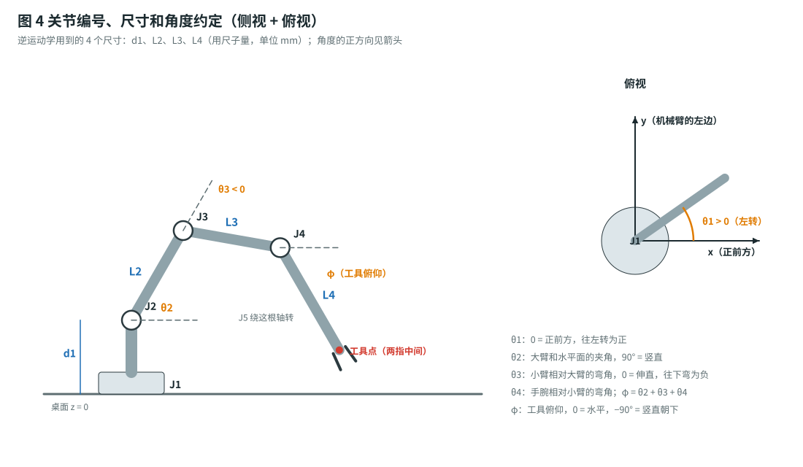
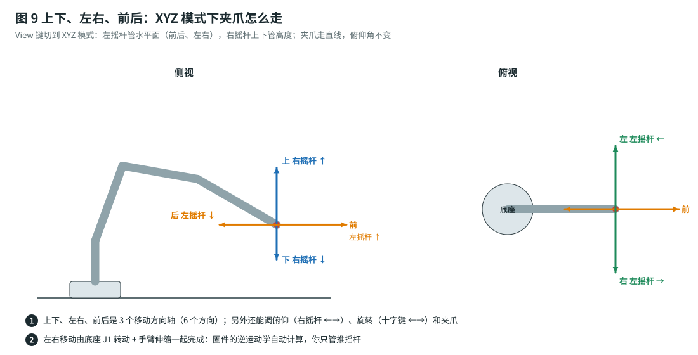
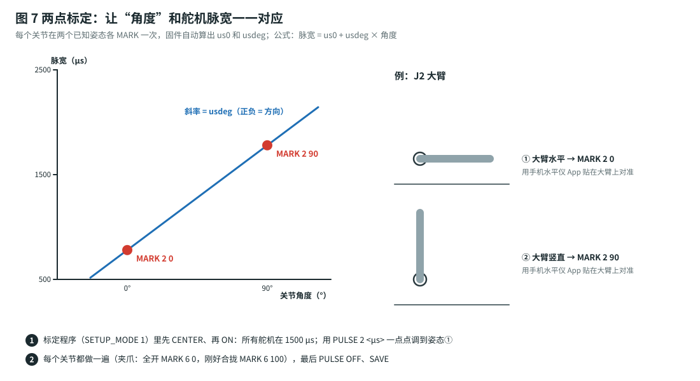

# 运动控制原理：逆运动学 · 平滑 · 示教 · 保护

这份文档解释固件（`firmware/arm_uno/`，Arduino Uno R3）里每个功能是怎么算的，参数应该怎么调。代码里的公式和这里一一对应，并有单元测试（`firmware/tests/test_core.cpp`）验证。



## 1. 控制循环

固件每 $20\ \text{ms}$（$50\ \text{Hz}$，和舵机的 PWM 周期一样）执行一次：

```
读手柄 / 串口指令 ─► 模式（关节 / XYZ / 自动动作 / 回放）─► 目标角度 q_t
                                                        │
  PCA9685 脉宽（I2C）◄─ 两点标定换算 ◄─ 速度·加速度限制器 ◄──┘
                                   ▲
                   A3 舵机电压 ─► 急停检测
```

Uno 用的 ATmega328P 没有硬件浮点，一次逆运动学（`atan2`、`acos`、`sqrt`、`sin`、`cos`）大约要 1–2 ms，在 20 ms 的周期里绰绰有余。

不管目标角度从哪里来（摇杆、示教回放、文字指令），最后都要经过**同一个限制器**。所以任何情况下，关节速度都不会超过 `vmax`，加速度都不会超过 `amax`。

## 2. 运动学

**先说“自由度”**：上下、左右、前后是夹爪在空间里的 3 个**移动**方向轴（6 个方向）；再加上手腕的俯仰、旋转，夹爪一共能独立控制 5 个量 $(x, y, z, \varphi, \psi)$，外加夹爪开合。这就是市面上说的“6 自由度（6 个舵机）”机械臂。



### 2.1 尺寸和角度

| 符号 | 参数名 | 含义 | 默认值 |
|---|---|---|---|
| $d_1$ | `GEO` 第 1 个 | 桌面到 J2 转轴的高度 | $75\ \text{mm}$ |
| $L_2$ | `GEO` 第 2 个 | J2 转轴到 J3 转轴 | $120\ \text{mm}$ |
| $L_3$ | `GEO` 第 3 个 | J3 转轴到 J4 转轴 | $130\ \text{mm}$ |
| $L_4$ | `GEO` 第 4 个 | J4 转轴到工具点（两指中间） | $180\ \text{mm}$ |

角度：$\theta_1$ 是底座转角（$0$ = 正前方，左转为正）；$\theta_2$ 是大臂和水平面的夹角；$\theta_3$ 是小臂相对大臂的弯角（伸直 = $0$，往下弯为负）；$\theta_4$ 是手腕相对小臂的弯角；$\theta_5$ 是手腕旋转。

工具的俯仰角（$0$ = 水平，$-90^\circ$ = 竖直朝下）：

$$
\varphi = \theta_2 + \theta_3 + \theta_4
$$

### 2.2 正运动学：角度 → 位置

先在机械臂所在的竖直平面里算水平距离 $r$ 和高度 $z$：

$$
\begin{aligned}
r &= L_2\cos\theta_2 + L_3\cos(\theta_2+\theta_3) + L_4\cos\varphi \\
z &= d_1 + L_2\sin\theta_2 + L_3\sin(\theta_2+\theta_3) + L_4\sin\varphi
\end{aligned}
$$

再用底座转角 $\theta_1$ 转到桌面坐标（$x$ 朝前，$y$ 朝机械臂的左边，$z$ 朝上）：

$$
x = r\cos\theta_1,\qquad y = r\sin\theta_1
$$

例：默认的 HOME 姿态 $\theta = (0^\circ, 90^\circ, -90^\circ, 0^\circ, 0^\circ)$，算出来 $r = L_3 + L_4 = 310\ \text{mm}$，$z = d_1 + L_2 = 195\ \text{mm}$。

### 2.3 逆运动学：位置 → 角度

给定目标 $(x, y, z)$ 和工具俯仰 $\varphi$：

**第 1 步，底座转角和水平距离：**

$$
\theta_1 = \operatorname{atan2}(y,\ x),\qquad r = \sqrt{x^2+y^2}
$$

**第 2 步，退回到手腕点。** 工具点沿着工具方向往回退 $L_4$，就得到 J4 转轴的位置（相对 J2 转轴）：

$$
r_w = r - L_4\cos\varphi,\qquad z_w = z - d_1 - L_4\sin\varphi
$$

**第 3 步，两连杆问题（余弦定理）：**

$$
\cos\theta_3 = \frac{r_w^2 + z_w^2 - L_2^2 - L_3^2}{2L_2L_3}
$$

如果 $\left|\cos\theta_3\right| > 1$，说明目标太远或太近，够不到（固件返回 `out of reach`）。取“肘朝上”的解：

$$
\theta_3 = -\arccos\!\left(\cos\theta_3\right)
$$

$$
\theta_2 = \operatorname{atan2}(z_w,\ r_w) - \operatorname{atan2}\!\big(L_3\sin\theta_3,\ L_2 + L_3\cos\theta_3\big)
$$

**第 4 步，手腕：**

$$
\theta_4 = \varphi - \theta_2 - \theta_3,\qquad \theta_5 = \psi\ (\text{手腕旋转，直接给定})
$$

算出来的角度还要检查：

- 5 个关节都在各自的软件限位以内（`LIM` 命令设置）；
- 工具点高度 $z \ge$ `z_min`（默认 $10\ \text{mm}$，防止撞桌面）；
- 水平距离 $r \ge$ `r_min`（默认 $60\ \text{mm}$）。在底座正上方 $r \to 0$，$\theta_1$ 没有定义，而且手臂会撞到自己。

单元测试随机取 2000 组角度，先做正运动学，再做逆运动学，最大误差小于 $0.05^\circ$。

## 3. 手柄输入整形

摇杆读数 $u \in [-1, 1]$ 先去掉死区 $d$（默认 $0.08$），再加 expo 曲线 $e$（默认 $0.3$），两个值在 `params.h` 里：

$$
u' = \operatorname{sign}(u)\cdot\frac{|u|-d}{1-d},\qquad
u'' = (1-e)\,u' + e\,u'^3
$$

expo 让摇杆推一点点时动得很慢，方便对准；推到底仍然是全速。

- **关节模式**：关节 $j$ 的目标角速度是 $\dot q_j = u''\cdot v_{\max,j}\cdot s$，其中 $s$ 是速度档（LB / RB 切换：$0.25$、$0.5$、$1.0$）。
- **XYZ 模式**：目标位置的速度是 $\dot{\mathbf p} = u''\cdot v_{\text{lin}}\cdot s$（$v_{\text{lin}}$ 默认 $80\ \text{mm/s}$）。每 $20\ \text{ms}$ 把目标点挪一小步，解一次逆运动学。

**边界滑动**：XYZ 模式下，如果整步走不通（超出范围、碰到限位），固件会把这一步拆成 $x, y, z, \varphi, \psi$ 五个分量分别试，能走的分量照走。效果是：推到边界时夹爪会**沿着边界滑动**，而不是整个卡死。另外，如果某一步让任何关节跳变超过 $15^\circ$（换了一种姿态解），这一步也会被拒绝。

## 4. 速度 / 加速度限制器

每个关节单独做一个“时间最优”跟踪器。设误差 $e = q_t - q$，最大加速度 $a$，最大速度 $v_{\max}$：

$$
v_{\text{want}} = \operatorname{sign}(e)\cdot\min\!\left(v_{\max},\ \sqrt{2a\,|e|}\right)
$$

每个周期，实际速度朝 $v_{\text{want}}$ 最多改变 $a\,\Delta t$。其中 $\sqrt{2a|e|}$ 是“按最大减速度刹车，正好停在目标上”的速度，所以**不会冲过头**（有单元测试验证）。

默认限制：

| 关节 | $v_{\max}$ | $a_{\max}$ |
|---|---|---|
| J1 底座 | $90^\circ/\text{s}$ | $180^\circ/\text{s}^2$ |
| J2 大臂 | $60^\circ/\text{s}$ | $120^\circ/\text{s}^2$ |
| J3 小臂 | $90^\circ/\text{s}$ | $180^\circ/\text{s}^2$ |
| J4 手腕俯仰 | $120^\circ/\text{s}$ | $300^\circ/\text{s}^2$ |
| J5 手腕旋转 | $150^\circ/\text{s}$ | $400^\circ/\text{s}^2$ |
| J6 夹爪 | $150\ \%/\text{s}$ | $400\ \%/\text{s}^2$ |

J2 扛着整条手臂，所以最慢。机械臂晃动、抖动，就把 `params.h` 里对应关节的加速度（`amax`）降低 30%，重新上传。

## 5. 自动动作：五次多项式轨迹

回原位（Y / `HOME`）、文字指令移动、示教回放，都用五次多项式。它的起点和终点速度、加速度都是 $0$，所以起步和停下都很柔和：

$$
s(\tau) = 10\tau^3 - 15\tau^4 + 6\tau^5,\qquad \tau = \frac{t}{T}\in[0,1]
$$

$$
q_j(t) = q_{j,0} + \big(q_{j,1} - q_{j,0}\big)\, s\!\left(\tfrac{t}{T}\right)
$$

$s(\tau)$ 的最大斜率是 $1.875$（在 $\tau = 0.5$ 处），最大二阶导数是 $\tfrac{10\sqrt3}{3}\approx 5.774$。要让关节 $j$ 的速度和加速度都不超限，时长必须满足：

$$
T_j = \max\!\left(\frac{1.875\,|\Delta q_j|}{v_{\max,j}\,s},\ \sqrt{\frac{5.774\,|\Delta q_j|}{a_{\max,j}\,s}}\right)
$$

所有关节取同一个时长 $T = \max_j T_j$（至少 $0.3\ \text{s}$）。这样**所有关节同时起步、同时到达**，动作看起来是协调的一整个动作，而不是一节一节地动。

**示教回放**：路点存在 Uno 的 EEPROM 里（每个关节 2 字节，单位 $0.1^\circ$，最多 60 个），断电不丢。路点之间逐段用五次多项式，每到一个路点停 $0.3\ \text{s}$。回放时动一下摇杆、扳机或十字键 ←→，回放立刻停止，控制权回到手柄。

## 6. 夹爪防堵转

Uno 版没有电流传感器，不知道夹爪什么时候夹到了东西。舵机夹住东西以后还会继续往里“使劲”，电流从空转的几百毫安升到 $1$–$2\ \text{A}$，时间长了会发烫甚至烧坏。

固件的做法很简单：**松开 RT 的那一刻，夹爪自动往回张开 3%**（`params.h` 里的 `grip_backoff`）。

- 夹住东西时：夹爪目标位置本来“顶”在物体里面一点，退 3% 后刚好贴着物体，夹持力变小，但一般还夹得住，舵机也不再堵转。
- 没夹东西时：退 3% 几乎看不出来。

另外，标定时 `MARK 6 100` 要记在“刚好合拢、不用力”的位置，这样 `CLOSE` 指令也不会让夹爪空夹时堵转。

## 7. 保护

| 情况 | 判断条件 | 固件动作 | 怎么恢复 |
|---|---|---|---|
| 超出关节范围 | 目标角度超出 `LIM` 设的范围 | 停在边界，手柄短震 | 反方向推摇杆 |
| 超出工作空间 | $z <$ 10 mm、$r <$ 60 mm，或够不到 | 这一步不执行（XYZ 模式沿边界滑动） | 往回走 |
| 按下急停 | 舵机已上电，但 A3 测到的舵机电压 $<3\ \text{V}$，持续 $0.1\ \text{s}$ | **E-STOP**：停止输出舵机信号，这样松开急停时舵机不会突然有劲乱动 | 松开急停，把手臂扶到停放姿态，按 Menu |
| 手柄拔掉 | USB 断开 | 手臂停在原地（正在播放的路点会播完） | 插回去；或串口 `STOP` |

A3 接的是电压检测模块（$30\,\text{k}\Omega + 7.5\,\text{k}\Omega$ 分压，缩小 5 倍）：

$$
V_{\text{舵机}} = \frac{\text{analogRead(A3)}}{1023}\times 5\ \text{V}\times 5
$$

6 V 时 A3 约 $1.2\ \text{V}$。分压比存在参数 `vdiv_x100` 里（默认 500）。

> 💡 只插 USB 调试、没接 6 V 舵机电时，按 Menu 上电会显示 E-STOP，这是正常的。

## 8. 舵机扭矩校核

最吃力的是 **J2（肩）**：手臂**完全水平伸直**时，后面所有舵机和支架的重量都压在它上面。按套件净重 875 g 估算 J2 以外各部分的质量：

| 质量 | 离 J2 的水平距离（伸直时） |
|---|---|
| J3 舵机 + 支架 $0.095\ \text{kg}$ | $0.12\ \text{m}$ |
| J4 舵机 + 支架 $0.085\ \text{kg}$ | $0.25\ \text{m}$ |
| J5、J6 舵机 + 机械爪 $0.21\ \text{kg}$ | $0.34\ \text{m}$ |
| 大臂支架 $0.075\ \text{kg}$ | $0.06\ \text{m}$ |
| 小臂法兰杆 + 支架 $0.045\ \text{kg}$ | $0.185\ \text{m}$ |

$$
\tau_{J2} = g\sum_i m_i\,r_i = 9.81\times 0.117 \approx 1.15\ \text{N·m} \approx 11.7\ \text{kg·cm}
$$

（$1\ \text{kg·cm} = 0.0981\ \text{N·m}$。）再加 30 g 负载（在 $0.43\ \text{m}$ 处）要 $+1.3\ \text{kg·cm}$，一共约 $13\ \text{kg·cm}$。

| 姿态 | J2 需要 | MG996R（6 V 约 $10$–$11\ \text{kg·cm}$） | DS3225MG（6 V 约 $22\ \text{kg·cm}$） |
|---|---|---|---|
| 完全水平伸直 + 30 g | $\approx 13\ \text{kg·cm}$ | ❌ 撑不住 | ✅ 安全系数约 1.7 |
| 大臂竖直、小臂水平（HOME）+ 30 g | $\approx 7\ \text{kg·cm}$ | ⚠️ 勉强（约 1.5） | ✅ 约 3 |
| 大臂前倾到 40°、小臂下垂抓桌面 + 30 g | $\approx 9\ \text{kg·cm}$ | ⚠️ 勉强（约 1.2） | ✅ 约 2.5 |

结论：

- 用套件自带的 MG996R 时，固件默认把 **J2 限制在 40°–170°**，不让大臂过分前倾；**负载 ≤ 30 g**。舵机长时间顶着会发热，不用时按 Menu 让手臂停放、断电。
- 把 J2 换成 **DS3225MG**（标准尺寸，套件支架能直接装）以后，可以放开限位（`LIM 2 10 170`），负载到约 50 g。
- J3（肘）在最坏情况下约需 $4\ \text{kg·cm}$，J4 约 $2\ \text{kg·cm}$，MG996R 都够用。

**为什么夹爪不能在低处竖直朝下？** J4 是 180° 舵机，只能在中位两边各转 90°，所以

$$
\theta_4 = \varphi - \theta_2 - \theta_3 \ge -90^\circ \quad\Rightarrow\quad \varphi = -90^\circ \text{ 需要 } \theta_2 + \theta_3 \ge 0
$$

也就是小臂要水平或往上翘。而这套手臂的手腕加夹爪 $L_4 \approx 180\ \text{mm}$ 比较长，这时指尖够不到靠近桌面的低处。所以在桌面上抓东西，用**斜向下 45°–60°** 的姿态（例如 `MOVE 220 0 40 -60`）。

**电源功率**：6 个舵机同时快速运动，峰值电流大约 $5$–$8\ \text{A}$。所以用 $6\ \text{V}\ 10\ \text{A}$（$60\ \text{W}$）的适配器，留有余量；$6\ \text{V}\ 5\ \text{A}$ 的也能用，但动作快时电压会往下掉。

## 9. 舵机脉宽换算（两点标定）



每个关节的角度和脉宽是线性关系：

$$
\text{us} = \texttt{us0}_j + \texttt{usdeg}_j\cdot\theta_j
$$

把关节摆到两个已知角度 $\theta_A$、$\theta_B$，分别记下脉宽 $p_A$、$p_B$（标定程序里的 `MARK` 命令），固件就会算出：

$$
\texttt{usdeg}_j = \frac{p_B - p_A}{\theta_B - \theta_A},\qquad
\texttt{us0}_j = p_A - \texttt{usdeg}_j\cdot\theta_A
$$

`usdeg` 的正负号就是舵机的安装方向。所以舵机不管正装还是反装，都**不需要改代码**。180° 舵机一般 $|\texttt{usdeg}|\approx 11.1\ \mu\text{s}/^\circ$（$2000\ \mu\text{s}$ 对应 $180^\circ$）。最后，所有输出脉宽还会被限制在 $500$–$2500\ \mu\text{s}$ 之间。
