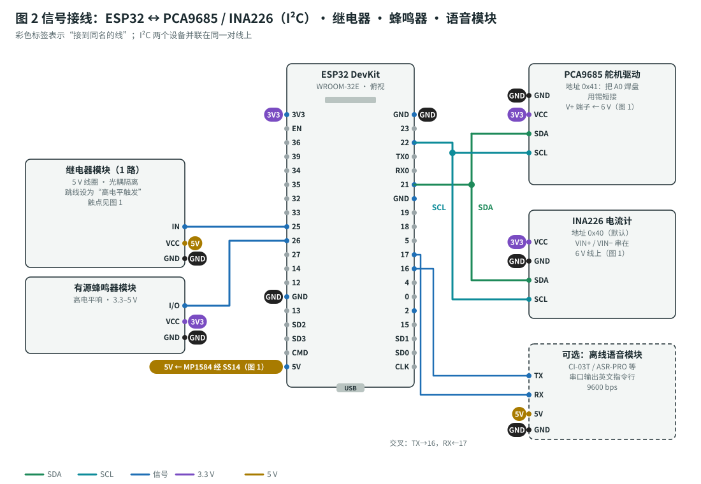
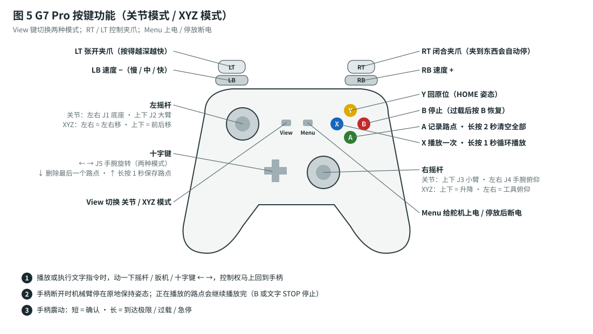

# 机械臂固件（Arduino Uno R3）

| 目录 / 文件 | 作用 |
|---|---|
| `arm_uno/` | **Uno 固件**：G7 Pro 手柄（经 USB Host Shield）、逆运动学、平滑运动、示教回放、急停检测、串口指令 |
| `tests/` | 电脑上运行的单元测试（运动学、限速限加速、回放、急停、指令、标定），不需要硬件 |
| `../tools/arm_client.py` | 电脑 / AI 通过 USB 串口发指令的小工具 |

原理见 [`docs/motion-control.md`](../docs/motion-control.md)，接线和组装见 [`docs/assembly-guide.md`](../docs/assembly-guide.md)，完整流程见 [`docs/build-plan.md`](../docs/build-plan.md)。

| 文件 | 内容 |
|---|---|
| `arm_uno.ino` | 主循环（50 Hz）、读手柄、舵机输出、EEPROM 存储 |
| `pca9685.h` | PCA9685 舵机驱动板的 I2C 代码（直接操作寄存器，不用 Wire 库，省 flash） |
| `config.h` | 引脚、`SETUP_MODE`（标定程序开关）、EEPROM 布局 |
| `motion.h` | 状态机：关节 / XYZ 点动、五次多项式轨迹、示教回放、急停（纯 C++，可单元测试） |
| `kinematics.h` | 正 / 逆运动学（纯 C++） |
| `commands.h` | 串口指令解析（纯 C++） |
| `params.h` | 参数和默认值（默认值放在 flash 里，标定结果存 EEPROM） |
| `pgm.h` | 字符串放 flash（省内存）的辅助代码 |

## 1. 开发环境

1. 安装 **Arduino IDE 2.x**。
2. **工具 → 管理库**，安装：
   - **USB Host Shield Library 2.0**（作者 Oleg Mazurov / Kristian Sloth Lauszus）
   - PCA9685 不用装库：代码在 `pca9685.h` 里
3. 打开 `firmware/arm_uno/arm_uno.ino`，**开发板选 Arduino Uno**，选对端口，上传。
4. 编译结果大约是：**程序空间 96%，全局变量 53%**。Uno 基本装满了，想加新功能请换 **Arduino Mega 2560**（开发板选 Mega，代码和接线不用改）。

> 💡 CI（`.github/workflows/firmware.yml`）每次提交都会编译正常程序和标定程序（`arduino:avr:uno`），并运行单元测试。

### 两个程序：正常程序和标定程序

Uno 的 32 KB 程序空间放不下“手柄库 + 全部标定命令”，所以分成两个程序，用 `config.h` 里的一行切换：

| `config.h` | 程序 | 有什么 |
|---|---|---|
| `#define SETUP_MODE 0` | **正常程序**（默认） | 手柄 + 运动指令 |
| `#define SETUP_MODE 1` | **标定程序** | 没有手柄；运动指令 + 标定指令（`CENTER` `PULSE` `OSC` `MARK` `LIM` `GEO` `POSE` `SHOW` `SAVE` `DEFAULTS`） |

标定结果存在 EEPROM 里，两个程序共用。标定完换回正常程序，数据不会丢。

## 2. 引脚



| Uno 引脚 | 接什么 |
|---|---|
| A4（SDA）/ A5（SCL） | PCA9685 舵机驱动板（I2C，地址 0x40）；J1–J6 插在通道 0–5 |
| 5V / GND | PCA9685 的 VCC / GND（Uno 本身用 USB 供电） |
| A3 | 舵机电压检测（电压检测模块 `S`，5 : 1 分压，接在急停后面） |
| D0（RX） | 语音模块 TX（可选；上传程序时要拔掉） |
| D9、D10、D11、D12、D13 | **USB Host Shield 占用** |
| D2–D8 | 空闲 |

## 3. 连接 G7 Pro

1. USB Host Shield 叠插在 Uno 上。
2. G7 Pro 背面的模式开关拨到 **PC 模式**（XInput），用 USB-C 数据线插到扩展板的 **USB-A 口**。也可以把 G7 Pro 的 **2.4G 接收器**插在 USB-A 口上试试无线。
3. 串口监视器（9600）显示 `gamepad connected` 就可以用了。

### 连不上怎么办（USB ID）

USB Host Shield 库的 Xbox 360（XInput）驱动只认识名单里的手柄。第三方手柄在 XInput 模式下通常会冒充成微软手柄（`045E:028E`），所以一般能直接用。如果不行：

1. 先试试按住 **Xbox 键 + Share 键 3 秒**：G7 Pro 会在 XInput / GIP 两种协议之间切换。本固件用的是 **XInput**。
2. 还不行，就查手柄的 USB ID：在 Arduino IDE 里打开 **文件 → 示例 → USB Host Shield Library 2.0 → USB_desc**，上传，插上手柄，串口里会打印 `Vendor ID` 和 `Product ID`（例如 `3537` 和 `1010`）。
3. 在电脑上找到库文件 `Arduino/libraries/USB_Host_Shield_Library_2.0/XBOXUSB.h`，找到 `VIDPIDOK` 这个函数，在 `return (` 后面加上你的 ID：

   ```cpp
   return ((vid == 0x3537 && pid == 0x1010) ||   // ← 加这一行，换成你查到的 ID
           ((vid == XBOX_VID || vid == MADCATZ_VID || ...
   ```

4. 重新上传 `arm_uno`。

> 按键对应关系：G7 Pro 的 **View（⧉）= BACK**，**Menu（≡）= START**。



## 4. 文字指令（电脑 / AI / 语音）

从 USB 串口（**9600**）或语音模块（接 D0）发送，一行一条，大小写都行。单位 mm 和度；夹爪 0 = 张开，100 = 合拢。

| 指令 | 作用 |
|---|---|
| `ON` / `OFF` | 舵机上电（先到停放姿态）/ 回停放姿态后断电 |
| `HOME` | 回原位 |
| `STOP` | 停止当前动作 |
| `MODE JOINT` / `MODE XYZ` | 切换手柄模式 |
| `SPEED 1` / `2` / `3` | 慢 / 中 / 快 |
| `J <1–6> <角度>` | 单个关节走到指定角度（J6 是 0–100 %） |
| `MOVE x y z [pitch]` | 工具点走到 $(x, y, z)$（mm），pitch 是夹爪俯仰角（不写就保持不变） |
| `UP` / `DOWN` / `LEFT` / `RIGHT` / `FORWARD` / `BACK` `[mm]` | 相对移动，默认 20 mm |
| `GRIP <0–100>` / `OPEN` / `CLOSE` | 夹爪 |
| `REC` / `CLEAR` | 记录路点 / 清空（自动存 EEPROM，最多 60 个） |
| `PLAY` / `PLAY LOOP` | 播放一次 / 循环播放 |
| `STATUS` | 状态、各关节角度、夹爪位置、舵机电压 |
| `HELP` | 列出指令 |

回复以 `ok` 或 `error:` 开头，例如：

```
> MOVE 220 0 40 -60
ok move to 220 0 40 -60
> MOVE 600 0 100
error: out of reach
```

坐标系：$x$ 朝前、$y$ 朝左、$z$ 朝上，原点在底座转轴和桌面的交点。

**手柄优先**：执行指令或回放时，只要动一下摇杆、扳机或十字键 ←→，动作马上停止，控制权回到手柄。

### 给 AI 用

AI 智能体只需要一个工具：“发送一条文字指令，返回回复”，用 `tools/arm_client.py` 实现即可：

```bash
pip install pyserial
python3 tools/arm_client.py COM5 ON "MOVE 220 0 40 -60" CLOSE "UP 50" HOME
```

在提示词里写清楚坐标系和单位；每次先 `STATUS` 看当前位置；够不到时会返回 `error`。

### 给语音模块用

语音模块（CI-03T / ASR-PRO）设成 **9600** 波特率，TX 接 Uno 的 **D0**。在它的配置工具里，给每个词条设置“识别后串口输出”一行文字（结尾 `\r\n`）：

| 说 | 串口输出 |
|---|---|
| 机械臂上电 | `ON` |
| 向上 / 向下 | `UP 30` / `DOWN 30` |
| 向左 / 向右 | `LEFT 30` / `RIGHT 30` |
| 向前 / 向后 | `FORWARD 30` / `BACK 30` |
| 抓住 / 松开 | `CLOSE` / `OPEN` |
| 回家 | `HOME` |
| 开始表演 | `PLAY` |
| 停 | `STOP` |

⚠️ D0 也是下载口：**上传程序时先拔掉语音模块的线**。

## 5. 标定指令（仅标定程序，`SETUP_MODE 1`）

| 指令 | 作用 |
|---|---|
| `CENTER` | 所有舵机 1500 µs（装配时的中位姿态）。在 `ON` 之前输入 |
| `PULSE <1–6> <µs>` | 给某个舵机直接发脉宽（400–2700） |
| `PULSE OFF` | 结束，关节重新按角度控制 |
| `OSC <Hz>` | 用万用表 Hz 档量到的舵机信号频率校准 PCA9685 的时钟（可选，例如 `OSC 53.4`），让脉宽更准；`SAVE` 保存 |
| `MARK <1–6> <角度>` | “这个关节现在就在这个角度”；同一个关节记两次（相差 ≥ 20°）就算出标定值 |
| `LIM <1–6> <最小> <最大>` | 软件限位（度；J6 是 %） |
| `GEO d1 L2 L3 L4` | 机械尺寸（mm，见图 4） |
| `POSE PARK` / `POSE HOME` | 把**当前姿态**记为停放姿态 / HOME 姿态 |
| `SHOW` | 显示全部标定数据 |
| `SAVE` | 存进 EEPROM |
| `DEFAULTS` | 恢复默认值（舵机断电时才能用；不自动保存） |

## 6. 其他参数（改 `params.h` 后重新上传）

| 参数 | 默认 | 含义 |
|---|---|---|
| `vmax` / `amax` | J2 60 °/s、120 °/s² 等 | 每个关节的最大速度 / 加速度 |
| `z_min` / `r_min` | 10 / 60 mm | 夹爪最低高度 / 离底座轴线的最小距离 |
| `deadband` / `expo` | 8 / 30 % | 摇杆死区 / 手感曲线 |
| `v_lin` / `v_ang` | 80 mm/s / 60 °/s | XYZ 模式最高速度 |
| `grip_backoff` | 3 % | 松开 RT 后夹爪回退量 |
| `dwell_ms` | 300 | 回放时每个路点停留时间 |
| `estop_mv` | 3000 | 舵机电压低于 3.0 V 判定急停；设成 0 关闭检测 |

> ⚠️ EEPROM 里保存的值优先。改了 `params.h` 的默认值以后，要把参数版本号 `PARAMS_VERSION` 加 1（或者在标定程序里执行 `DEFAULTS`），新默认值才会生效。**这样会清掉标定结果**，需要重新标定、`SAVE`。

## 7. 单元测试

```bash
g++ -std=gnu++11 -O1 -Wall -Wextra -Werror -I firmware/arm_uno firmware/tests/test_core.cpp -o test_core
./test_core
```

测试覆盖：正 / 逆运动学往返（2000 组随机姿态，误差 < 0.05°），限速限加速、不过冲，上电 / 停放 / 断电流程，关节和 XYZ 点动（走直线、边界滑动、不低于桌面），示教回放和手柄接管，急停，夹爪回退，两点标定，串口指令。
