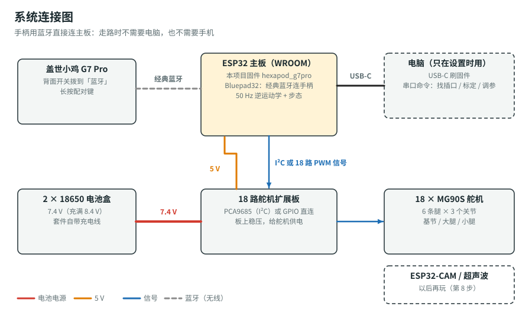

# 18 舵机六足机器人套件 + 盖世小鸡 G7 Pro 手柄

你买的是成品六足套件：18 个 MG90S 舵机（每条腿 3 个）、原版 ESP32 主板、18 路舵机扩展板、2 节 18650 电池盒。这个文件夹给它换一套**开源固件**，让它**直接用蓝牙连盖世小鸡 G7 Pro 手柄**遥控行走。走路时不需要电脑，也不需要手机。

> **纯新手从这里开始 → [新手计划（可打勾）](docs/beginner-plan.md)**，从第 0 步一步步做到用手柄遥控它走起来。

## 能做什么

- **G7 Pro 蓝牙直连**：原版 ESP32 带经典蓝牙，开源库 [Bluepad32](https://github.com/ricardoquesada/bluepad32) 负责连手柄。
- **三种步态**：三角步态（快）、涟漪步态（中）、波浪步态（最稳），按 X 切换。
- **全向行走**：前后走、横着走、原地转圈，也可以边走边转。
- **扭身模式**：按住 Y，脚不动，只让身体俯仰、侧倾、扭腰、前后平移。
- **机身高度、抬腿高度、3 档速度**都能在手柄上调。
- **安全**：
  - 开机时舵机是软的，按 A 才上电。
  - B 键急停。
  - 手柄断开会自动停下站稳。
  - 关节有限位，步子和加速度有上限。
- **两种扩展板都能用**：PCA9685 芯片的板子（I²C），或者舵机直接接 ESP32 引脚的板子。插口对应关系用串口命令现场找，不用改代码。

## 手柄按键

| G7 Pro | 功能 |
|---|---|
| 左摇杆 | 上下 = 前进 / 后退，左右 = 横着走 |
| 右摇杆 左右 | 原地转向（可以和左摇杆一起用：边走边转） |
| **A** | 起立 / 趴下；开机后第一次按 = 舵机上电 |
| **B** | 急停：原地站稳，松开两个摇杆后恢复 |
| **X** | 换步态：三角 → 涟漪 → 波浪（停下后生效） |
| **Y**（按住） | 扭身模式：左摇杆俯仰 / 侧倾，右摇杆扭腰 / 前后平移 |
| LB / RB | 速度档 − / +（3 档） |
| 十字键 上 / 下 | 机身升高 / 降低 |
| 十字键 左 / 右 | 抬腿降低 / 升高 |
| 手柄断开 | 自动停下站稳 |

配对方法和常见问题见 [G7 Pro 手柄](docs/gamepad.md)。

## 文件夹里有什么

| 路径 | 内容 |
|---|---|
| [docs/beginner-plan.md](docs/beginner-plan.md) | **新手计划**：第 0–9 步，每步都写了“成功的样子”和“卡住了怎么办” |
| [docs/servo-setup.md](docs/servo-setup.md) | 舵机回中、找插口、量腿长、调方向和中位 |
| [docs/gamepad.md](docs/gamepad.md) | G7 Pro 配对、按键、常见问题 |
| [docs/firmware.md](docs/firmware.md) | 串口命令、参数表、原理（逆运动学、步态公式） |
| [docs/links.md](docs/links.md) | 所有用到的网站和下载链接 |
| [firmware/hexapod_g7pro/](firmware/hexapod_g7pro) | Arduino 固件（打开 `hexapod_g7pro.ino` 上传） |
| [firmware/tests/](firmware/tests) | 电脑上跑的单元测试（逆运动学、步态、手柄逻辑） |
| [web/index.html](web/index.html) | 这些文档生成的网页 |

## 开始前一定要知道

> ⚠️ **刷这个固件会覆盖商家的原厂固件，手机 App 就不能用了。** 想保留的话，先按 [新手计划第 2 步](docs/beginner-plan.md#第-2-步备份原厂固件强烈推荐) 把原厂固件备份成 `.bin` 文件，以后随时能刷回去。也可以找商家要原厂固件。

> ⚠️ **只能用原版 ESP32**（套件里那块 WROOM 主板就是）。ESP32-S3、ESP32-C3 只有低功耗蓝牙（BLE），连不上 G7 Pro。

> ⚠️ **舵机不能只靠 USB 供电。** 18 个舵机要用电池（扩展板上稳压）。只插 USB 时可以刷固件、敲串口命令，但舵机不会动。

## 我还需要你提供（不影响开工）

从商品图看，扩展板很可能是 **GPIO 直连型**（中间插 ESP32，两边各一排 3 针舵机插座，没有 PCA9685 芯片），固件会自动识别。

请再拍一张扩展板的**丝印特写**：每个舵机插座旁边印的引脚编号（例如 `13`、`D13`、`IO13`）要看得清。背面有字也拍一张。有了它，我能把默认插口表改成跟你的板子一模一样。没有也没关系：[舵机接线与标定](docs/servo-setup.md) 里的 `findall` 命令能在桌上把每个插口找出来。

## 和 `hexapod/` 文件夹的关系

仓库里的 [`hexapod/`](../hexapod/README.md) 是另一条路线：XIAO ESP32S3 + ROS 2 + 12 舵机，需要电脑和雷达。你现在用的是 18 舵机套件，照这个文件夹做就行。以后想学 ROS，再看那边。
