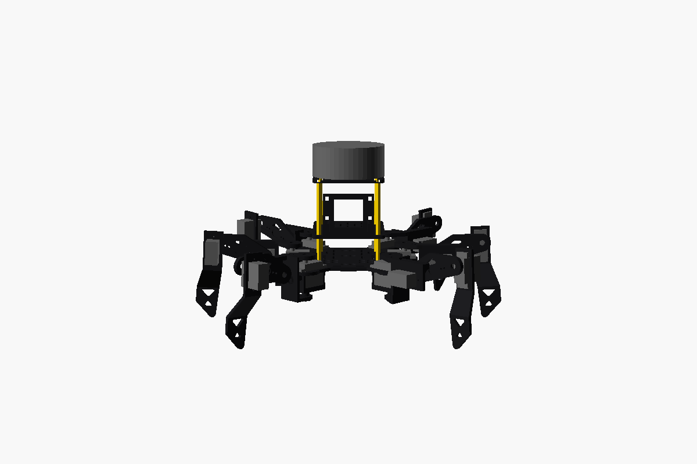
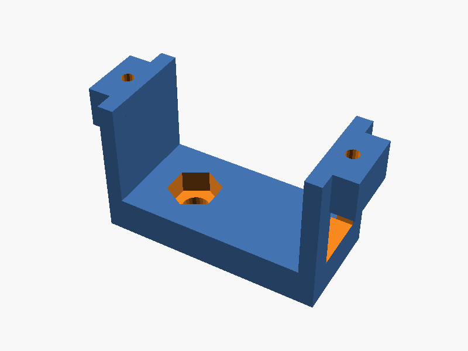
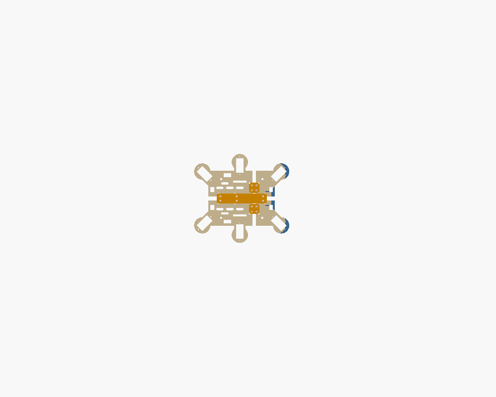

# 3D 打印机身（嘉立创直接下单）

给 18 舵机六足设计的一整套 3D 打印机身，可以代替套件里的碳板。套件里的电子件照用：
- 18 个 MG90S 舵机
- ESP32 主板 + 扩展板
- 电池盒

另外加了两样：
- 前面板上的**摄像头支架**，给亚博 ESP32-S3 WiFi 图传模块 Lite（YB-MEV04）用。
- 顶上的**激光雷达平台**，给 M1C1-Mini 雷达 + XIAO ESP32S3 用（雷达建图见 [雷达建图](../docs/lidar-mapping.md)）。

有了雷达就不用超声波了，前面板没有给超声波留位置。

**外形照套件的样子设计**（黑色、方形双层机身、U 形髋关节、拱形大腿、桁架小腿）：
- **机身**：上下两层长方形板，布满 M3 宽的长条孔（和套件铝板一样，任意位置都能拧 M3 螺丝、穿扎带）。
- **髋关节**：U 形支架从上、外、下三面包住基节舵机，底下的下摆臂套在舵机底部托架的转轴上。舵机上下两头都有支点，腿的重量不再只压在舵机输出轴上。
- **大腿**：上边拱起，中间开三角窗。
- **小腿**：外侧鼓起的桁架刀片，两个三角窗，脚尖收成一个点。

| 正面 | 侧面 |
|---|---|
|  |  |

**尺寸和固件默认参数完全一致**：腿长 28 / 50 / 75 mm，腿的安装位置 60 / 40 / 45° 和 55 mm。打印出来装好，固件只要改一个参数（第 5 节）就能走。


## 1. 要打印的零件

所有 STL 都在 [`stl/`](stl) 文件夹，可以直接上传嘉立创。**6 条腿的零件完全一样，不分左右。**
每个零件都按嘉立创**免费打印**的标准做好了（见下面的“嘉立创免费打印标准”）。

| 文件 | 零件 | 数量 | 外形尺寸 (mm) | 单件体积 | 推荐材料 |
|---|---|---|---|---|---|
| [`stl/coxa.stl`](stl/coxa.stl) | 基节 U 形支架：顶板压基节舵机的舵机臂，U 形背板 + 下摆臂绕到舵机底下；侧面竖板夹住大腿舵机 | 6 | 62.7 × 26.2 × 42.2 | 7.2 cm³ | 尼龙 |
| [`stl/hip_cradle.stl`](stl/hip_cradle.stl) | 基节舵机底部托架：托住舵机底部，底板里埋一颗 M3 螺母 | 6 | 33.0 × 12.6 × 17.4 | 2.2 cm³ | 尼龙 |
| [`stl/pivot_bushing.stl`](stl/pivot_bushing.stl) | 转轴套：穿过下摆臂顶到托架底下，下摆臂绕着它转 | 6 | 10 × 10 × 8.5 | 0.3 cm³ | 尼龙 |
| [`stl/femur.stl`](stl/femur.stl) | 大腿：拱形平板，两头各压一个舵机臂 | 6 | 67.0 × 24.5 × 4.0 | 4.2 cm³ | 尼龙 |
| [`stl/tibia.stl`](stl/tibia.stl) | 小腿：上半截装小腿舵机，下半截是桁架刀片和脚尖 | 6 | 88.9 × 25.8 × 17.3 | 4.1 cm³ | 尼龙 |
| [`stl/body_front_left.stl`](stl/body_front_left.stl) | 底板 前左块 | 1 | 52.9 × 52.8 × 3 | 4.2 cm³ | 树脂 |
| [`stl/body_front_right.stl`](stl/body_front_right.stl) | 底板 前右块 | 1 | 52.9 × 52.8 × 3 | 4.2 cm³ | 树脂 |
| [`stl/body_rear_left.stl`](stl/body_rear_left.stl) | 底板 后左块 | 1 | 92.9 × 67.8 × 3 | 9.0 cm³ | 树脂 |
| [`stl/body_rear_right.stl`](stl/body_rear_right.stl) | 底板 后右块 | 1 | 92.9 × 67.8 × 3 | 9.0 cm³ | 树脂 |
| [`stl/splice_long.stl`](stl/splice_long.stl) | 长拼接条：在底板下面沿中缝连接左右两半 | 1 | 80 × 16 × 3 | 3.7 cm³ | 树脂 |
| [`stl/splice_short.stl`](stl/splice_short.stl) | 短拼接条：连接前块和后块（左右各一，同一个零件） | 2 | 16 × 16 × 3 | 0.6 cm³ | 树脂 |
| [`stl/deck.stl`](stl/deck.stl) | 顶板（甲板）+ 前面板：装扩展板和摄像头 | 1 | 99.1 × 70 × 42.8 | 21.0 cm³ | 树脂 |
| [`stl/lidar_mount.stl`](stl/lidar_mount.stl) | 激光雷达平台：装在顶板上方，雷达和 XIAO 都绑在上面 | 1 | 72 × 68 × 3 | 12.6 cm³ | 树脂 |

一整套合计约 172 cm³，分成三单（见下面）。

### 嘉立创免费打印标准

嘉立创 3D 打印的免费券对模型有要求，这套零件全部满足：

| 要求 | 这套零件 |
|---|---|
| 单个模型不超过 100 × 100 × 100 mm | 最大的是顶板 99.1 × 70 × 42.8 mm。146 mm 宽的底板拆成 4 块 + 3 根拼接条 |
| 一单总体积不超过 70 cm³ | 分三单，最大的一单 67.2 cm³（见下表） |
| 壁厚 > 0.8 mm，孔径 > 1.5 mm | 最薄的筋 2 mm，最小的孔 Ø1.6 mm |
| 不能有拼接件、多壳体、反向三角面、坏边 / 孔洞 | 每个 STL 都是一个封闭、法线朝外的实体，没有碎边 |

这些规则由 [`tools/check_stl.py`](tools/check_stl.py) 自动检查（CI 每次都跑）：

```
python3 hexapod-kit/cad/tools/check_stl.py
```

| 订单 | 零件 × 数量 | 体积 |
|---|---|---|
| 第 1 单（髋关节） | coxa × 6、hip_cradle × 6、pivot_bushing × 6 | 57.9 cm³ |
| 第 2 单（腿 + 小板） | femur × 6、tibia × 6、splice_long × 1、splice_short × 2、lidar_mount × 1 | 67.2 cm³ |
| 第 3 单（机身） | body_front_left、body_front_right、body_rear_left、body_rear_right、deck 各 × 1 | 47.4 cm³ |

### 为什么是“镂空”而不是“空心”

嘉立创的树脂和尼龙都**按体积计价**，少用材料就省钱。但这些零件只有 3–4 mm 厚，做成里面空心不行：
- 壁会薄到不到 1 mm，打不出来。
- 封闭的空腔会困住没固化的树脂或尼龙粉，还要另外开排出孔。

所以用的是**镂空减重**：在不受力的地方打通孔，孔的样子照套件：

| 零件 | 怎么减 |
|---|---|
| 底板、顶板、雷达平台 | 一排排 3.4 × 12 mm 的圆头长条孔（宽度 = M3 通孔，只打完整的条孔） |
| 大腿 | 拱里开一个三角窗；两面各挖一个 1 mm 深的浅槽，中间留 2 mm 实心 |
| 小腿 | 桁架刀片上两个三角窗 |
| 基节 U 形背板 | 一个 Ø9 圆窗 |

以下地方都保持实心，条孔都离它们至少 2.5 mm：
- 舵机方孔周围、铜柱孔、扎带槽、走线孔；
- 前面板和摄像头托架的底座、底板拼缝两边；
- 外面一圈 3.5 mm 的边框。

想要全实心（更结实，也更贵）：把 [`parts.scad`](parts.scad) 开头的 `lighten = true` 改成 `false`，再重新导出。

> 想再省钱：
> - **全部用树脂**：尼龙比树脂贵，但树脂腿摔了容易断。
> - **机身继续用套件自带的碳板，只打雷达平台**：这样只要打 1 个零件。需要碳板上孔位的照片，我来改雷达平台的安装孔。

| 基节 U 形支架 | 基节舵机底部托架 |
|---|---|
|  |  |

| 大腿 | 小腿 |
|---|---|
|  |  |

| 底板（从下面看：4 块 + 3 根拼接条） | 顶板 + 前面板 |
|---|---|
|  |  |

| 激光雷达平台 |
|---|
|  |

## 2. 材料怎么选（帮你选好了）

| 零件 | 推荐 | 为什么 |
|---|---|---|
| 腿（基节、托架、转轴套、大腿、小腿，30 件） | **尼龙 PA12**（MJF 或 SLS，黑色） | 腿要受力、会撞，尼龙韧、不容易断。舵机臂螺丝拧进去也咬得住 |
| 底板 4 块、拼接条 3 根、顶板、雷达平台 | **光敏树脂**（选黑色，和套件一个颜色；白色也行） | 平板件用树脂便宜、平整、尺寸准。它们不直接受冲击 |

- **想省事**：全部选尼龙也可以，只是贵一点。
- **不建议腿用树脂**：树脂偏脆，摔一下小腿容易断。
- 价格以嘉立创网页上传后的**自动报价**为准。

## 3. 嘉立创下单步骤

1. 打开嘉立创 3D 打印下单页（嘉立创官网 → 3D 打印 → 在线下单），登录。
2. **分三单**下（每单不超过 70 cm³ 才能用免费券），见第 1 节的订单表：
   - 第 1 单：`coxa`、`hip_cradle`、`pivot_bushing`，数量各 **6**。
   - 第 2 单：`femur`、`tibia` 各 **6**，`splice_long` **1**，`splice_short` **2**，`lidar_mount` **1**。
   - 第 3 单：4 块 `body_*` 和 `deck`，数量各 **1**。
   - 想备用腿，就另外再下一单，别加进前面几单（会超 70 cm³）。
3. 每个文件分别设置：
   - **材料**：按第 2 节选。
   - **颜色 / 表面处理**：默认即可，不用打磨、不用上色。
4. 零件方向不用管，工厂会自己摆。**单位确认是毫米（mm）**，尺寸应该和第 1 节的表一致。
5. 下单。

> ⚠️ 零件上有几个很小的孔，用来拧自攻螺丝：舵机安装耳 Ø1.6、舵机臂螺丝 Ø2.0。打印出来可能偏小或被填住。用 **Ø1.5 / Ø2 的小钻头**手拧通一下就好。
>
> 嘉立创的“镶嵌螺母”服务这套零件用不上：它要求螺母孔壁厚 ≥ 3 mm、周围有 14 × 14 mm 平面，而 MG90S 的安装耳孔离机壳只有 2.6 mm、舵机臂两个孔只隔 4 mm。托架里那颗 M3 螺母自己放进六角槽就行。

## 4. 还要准备的小零件

| 东西 | 数量 | 用途 |
|---|---|---|
| M3 × 25 mm 铜柱（双通） | 4 | 底板和顶板之间 |
| M3 × 50 + 6 mm 铜柱（单通，一头公螺纹） | 4 | 顶板和雷达平台之间：公螺纹穿过顶板拧进下面的铜柱 |
| M3 × 6 mm 螺丝 | 8 | 固定铜柱 |
| M3 × 10 mm 沉头螺丝（十字或内六角） | 14 | 拼底板：从底板上面穿过沉头孔，穿过拼接条 |
| M3 螺母（对边 5.5 mm） | 14 | 在拼接条下面拧紧（加上托架的 6 颗，一共 20 颗） |
| M2 × 6 mm 自攻螺丝（PA 圆头） | 36（建议买 50） | 舵机臂固定到基节支架（12）和大腿板（24） |
| M2 × 10 mm 自攻螺丝 | 12 | 基节舵机的安装耳：穿过安装耳、底板，拧进底部托架（舵机自带的螺丝太短） |
| M3 × 12 mm 螺丝 | 6 | 下摆臂的转轴：从下面穿过转轴套，拧进托架里的 M3 螺母 |
| M3 螺母（对边 5.5 mm） | 6 | 放进托架底板的六角槽 |
| 舵机自带的配件：单边舵机臂、中心螺丝、自攻螺丝 | 18 套 | 每个舵机一套 |
| 20 mm 宽魔术贴扎带 | 1 条 | 把电池盒绑在底板上 |
| 小扎带 | 10 根 | 雷达、XIAO、摄像头、理线 |
| 6 mm 热缩管或硅胶脚套 | 6 个 | 套在脚尖上防滑 |
| M3 尼龙柱 + 螺丝（按扩展板孔位） | 4 套 | 把扩展板装在顶板上：条形孔任意位置都能拧 |

## 5. 装配

先按 [舵机接线与标定](../docs/servo-setup.md) 第 1 节，用 `centerall` 让所有舵机回中，然后在**通电回中**的状态下装舵机臂。

0. **拼底板**：
   - 4 块底板正面朝下放平，拼缝对齐（沉头孔在正面，从下面看是小孔）。
   - 长拼接条压住左右中缝，2 根短拼接条压住前后拼缝，孔对准。
   - 14 颗 M3 × 10 沉头螺丝从正面插进来，在拼接条下面拧 M3 螺母。螺丝头要和板面平齐，基节舵机才放得平。
1. **基节舵机 → 底板 + 底部托架**：
   - 每个托架的六角槽里放一颗 M3 螺母。
   - 6 个基节舵机从上往下插进底板的方孔。输出轴朝上，靠近底板外缘。
   - 从底板下面把托架套在舵机底部：舵机线从托架尾端的开口出来，托架两头的耳朵顶住底板下面。
   - 安装耳压在底板上面，每个安装耳一颗 **M2 × 10 自攻螺丝**，穿过安装耳、底板，拧进托架的耳朵。
2. **大腿舵机 → 基节支架**：
   - 大腿舵机从竖板带加强筋的一侧插进方孔：机壳底部先穿过去，安装耳贴住竖板。
   - 插好后输出轴朝加强筋这一侧（以后大腿板装在这边），用自攻螺丝固定安装耳。
3. **基节 U 形支架 → 基节舵机**：
   - 把单边舵机臂装进支架顶板下面的凹槽，从顶板上面拧两颗小螺丝，把舵机臂固定住。
   - 支架从外面套过来：顶板在舵机上面，下摆臂在托架下面（中间留 4 mm 空隙，就是为了能先抬高再往下压）。
   - 顶板压到基节舵机的花键上，让腿**垂直于机身边、指向正外面**。从中心孔拧上舵机中心螺丝。
   - 转轴套从下面穿过下摆臂的孔，顶到托架底面，**M3 × 12** 螺丝穿过转轴套拧进托架里的螺母，拧紧。
   - 用手转一下腿：应该很顺，不卡。卡的话看看下摆臂的孔里有没有打印残渣。
4. **大腿板**：
   - 一头的凹槽压大腿舵机的舵机臂，另一头的凹槽压小腿舵机的舵机臂。两头的凹槽在大腿板的两个面上。
   - 在大腿舵机上，大腿板要**水平**。
5. **小腿舵机 → 小腿**：
   - 小腿舵机从小腿斜着收回去的那一面插进安装板的方孔：机壳底部先穿过去，安装耳贴住安装板，用自攻螺丝固定。
   - 插好后输出轴和脚尖在同一侧。把小腿舵机的花键插进大腿板末端的舵机臂，让小腿**竖直朝下**，拧中心螺丝。
6. **铜柱 + 顶板**：
   - 底板上装 4 根 25 mm 铜柱，电池盒用魔术贴绑在底板中间。
   - 顶板装到铜柱上，扩展板用 M3 尼龙柱装在顶板的条形孔上（孔位对不上就用扎带）。
7. **摄像头**：放进前面板的托架，镜头朝前，背面的排针和杜邦线从窗口穿到后面，用两根扎带绑住。
8. **雷达平台**：
   - 4 根 50 mm 单通铜柱的公螺纹穿过顶板的 4 个角孔，拧进下面的 25 mm 铜柱。
   - 雷达用两根扎带横着绑在平台上面，雷达的“零度方向”标记对准平台上刻的箭头（机头）。
   - XIAO 用扎带绑在平台下面，雷达线从中间的圆孔穿下来。
   - 雷达底座的孔位量出来以后，可以在 `parts.scad` 的 `lidar_holes` 里填上，重新导出，改用螺丝固定。

侧视（站立姿态：机身离地约 60 mm）：


### 固件要改的参数

腿长和安装位置和固件默认值一样，不用改。只有小腿的折叠角要收小一点：默认 −80° 会让小腿撞到大腿舵机，这套机身最多折到 −60°。串口输入：

```text
set tibia_min -60
save
```

**趴下**（按 A）时，机身会落在 6 个下摆臂上，腿稍微离地。这是正常的，套件也是这样趴的。

6 条腿的零件一样，所以同一种关节（比如 6 个大腿舵机）的转动方向通常也一样。还是要按 [舵机接线与标定](../docs/servo-setup.md) 第 4 节，每个舵机用 `joint n 20` 确认一次方向。

## 6. 摄像头模块（亚博 ESP32-S3 WiFi 图传模块 Lite）

- **尺寸**：托架默认按 35 × 46 mm、厚 12 mm（含背面排针）设计，是从商品图估的。**拿到模块先用尺子量一下**：
  - 差 1 mm 以内：直接用。
  - 差得多：改 [`parts.scad`](parts.scad) 开头的 `cam_w`、`cam_h`、`cam_d`，按第 7 节重新导出 `deck.stl`。
- **供电**：模块的 `5V`、`GND` 接扩展板上的 5V、GND。
- **图传**：模块自己开 WiFi 传画面，用亚博的 App 看，**和手柄遥控互不影响**。
- **以后想让机器人和摄像头配合**：比如识别到东西就走过去。模块有串口（TX / RX）和 I²C，可以接到主板上。这需要改固件，想做的时候告诉我。

## 7. 改尺寸后重新导出

需要 [OpenSCAD](https://openscad.org/downloads.html)（免费）。

1. 所有尺寸都在 [`params.scad`](params.scad)（舵机、舵机臂、腿长）和 [`parts.scad`](parts.scad)（摄像头、雷达平台）的开头。
2. 改完打开对应的零件文件（`coxa.scad`、`deck.scad` 等），按 **F6** 渲染，然后点 **文件 → 导出 → STL**。
3. 在电脑上也可以一次导出全部，并检查干涉：

   ```bash
   python3 hexapod-kit/cad/tools/export.py            # 导出 stl/ 里的全部零件
   python3 hexapod-kit/cad/tools/check_stl.py         # 嘉立创免费打印标准：尺寸、网格、每单体积
   python3 hexapod-kit/cad/tools/check_clearance.py   # 干涉检查：运动范围内零件不相撞
   ```

> 改了腿长 `coxa_len`、`femur_len`、`tibia_len`，或者腿的安装位置，固件里也要 `set` 成一样的数字。

## 8. 设计检查

`tools/check_clearance.py` 用 OpenSCAD 求两组零件的交集，交集为空才算通过。检查了 62 种情况，全部不相撞：

- 每条腿的基节在 −60° / 0° / +60° 时，基节 U 形支架（包括下摆臂）和大腿舵机不碰底板、底部托架、顶板、雷达平台、铜柱、其他基节舵机。
- 大腿 −70°…+80° × 小腿 −60°…+70° 的组合，大腿、小腿不碰自己的基节和机身。脚会跑到机身下面的姿态，固件不会发出，所以跳过。
- 同一侧相邻的两条腿，在站立姿态下各往对方转 20° 和 30°，互不相碰。走路时基节大约只转 ±20°。转到 ±40° 时，相邻两条腿的脚会碰在一起，所有六足都是这样。
