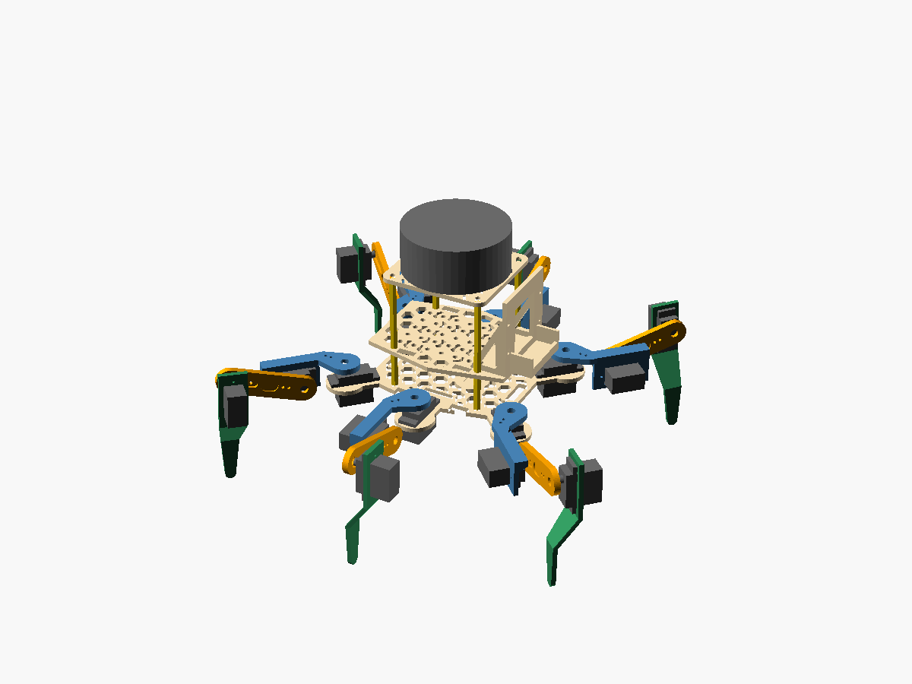
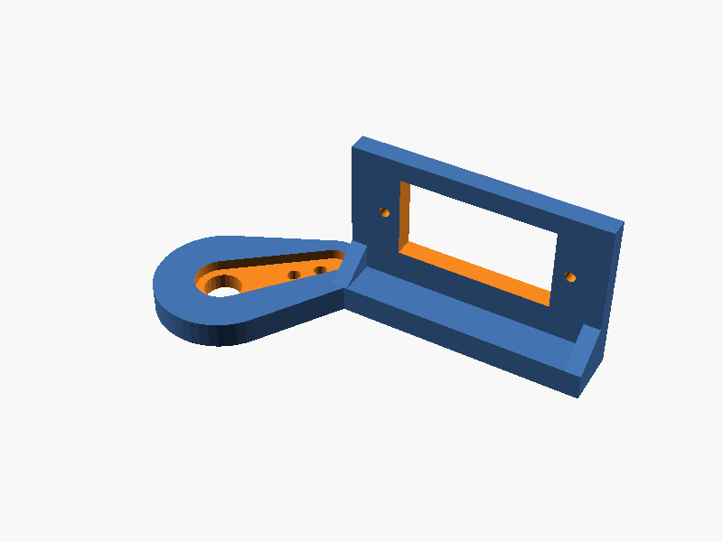
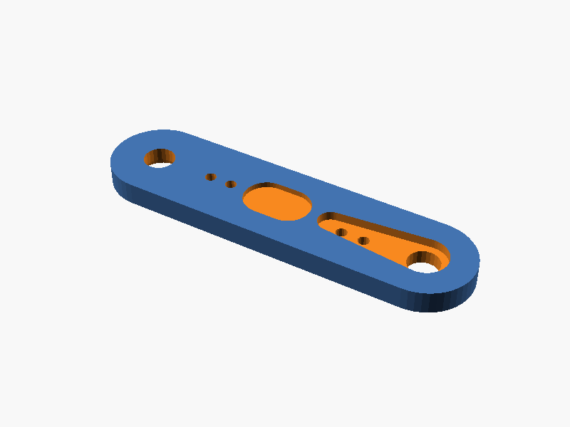
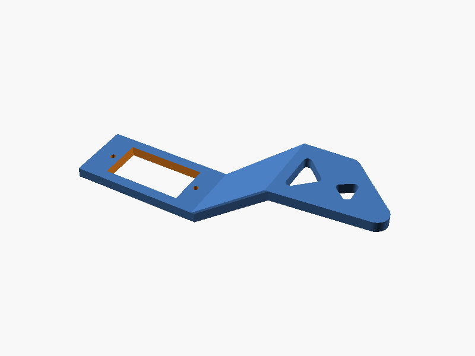
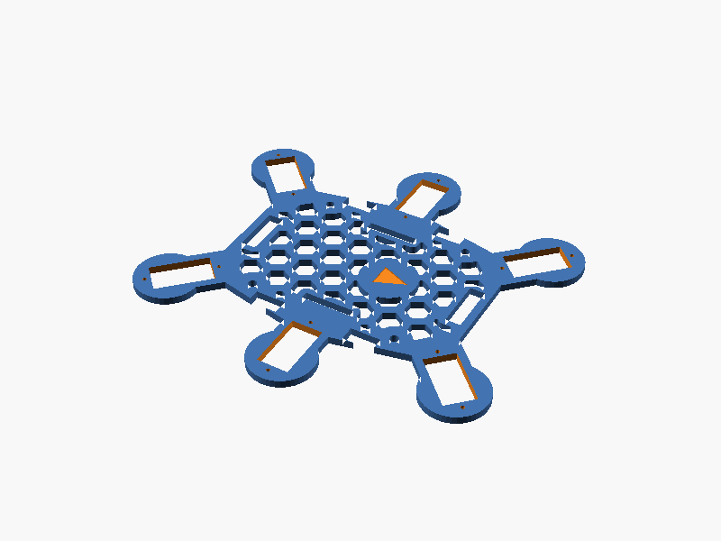
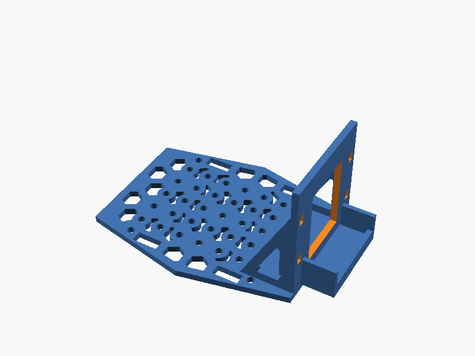
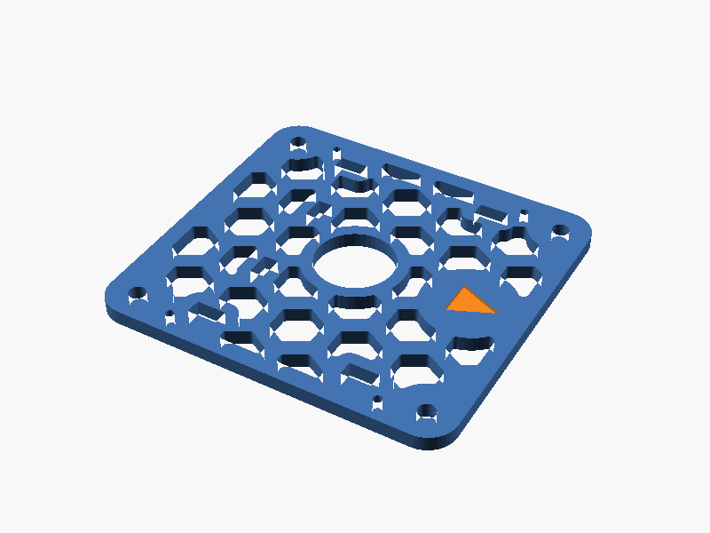
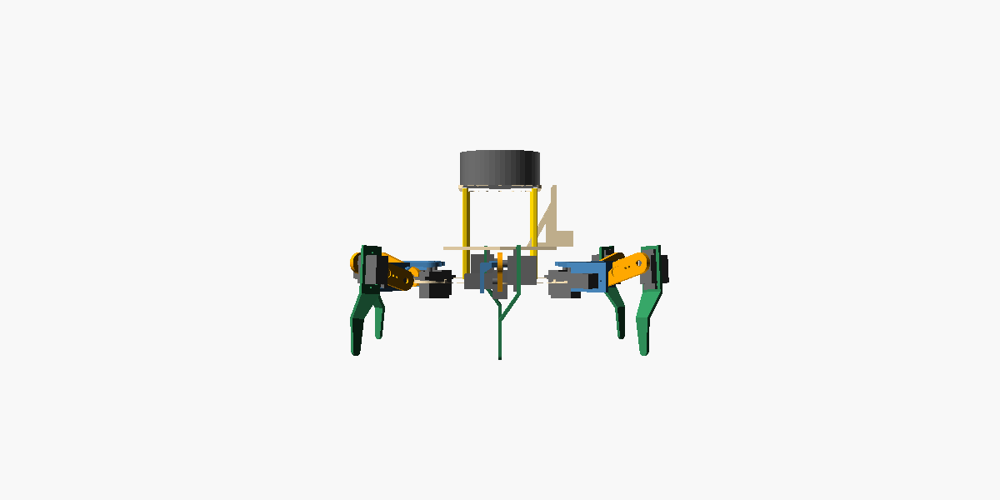

# 3D 打印机身（嘉立创直接下单）

给 18 舵机六足设计的一整套 3D 打印机身，可以代替套件里的碳板。套件里的电子件照用：
- 18 个 MG90S 舵机
- ESP32 主板 + 扩展板
- 电池盒

另外加了两样：
- 前面板上的**摄像头支架**，给亚博 ESP32-S3 WiFi 图传模块 Lite（YB-MEV04）用。
- 顶上的**激光雷达平台**，给 M1C1-Mini 雷达 + XIAO ESP32S3 用（雷达建图见 [雷达建图](../docs/lidar-mapping.md)）。

有了雷达就不用超声波了，前面板没有给超声波留位置。

**尺寸和固件默认参数完全一致**：腿长 28 / 50 / 75 mm，腿的安装位置 60 / 40 / 45° 和 55 mm。打印出来装好，固件只要改一个参数（第 5 节）就能走。



## 1. 要打印的零件

所有 STL 都在 [`stl/`](stl) 文件夹，可以直接上传嘉立创。**6 条腿的零件完全一样，不分左右。**

| 文件 | 零件 | 数量 | 外形尺寸 (mm) | 单件体积 | 推荐材料 |
|---|---|---|---|---|---|
| [`stl/coxa.stl`](stl/coxa.stl) | 基节支架：装在基节舵机的舵机臂上，侧面竖板夹住大腿舵机 | 6 | 62.6 × 26.2 × 24.3 | 4.3 cm³ | 尼龙 |
| [`stl/femur.stl`](stl/femur.stl) | 大腿：一块平板，两头各压一个舵机臂 | 6 | 67.0 × 17.0 × 4.0 | 3.6 cm³ | 尼龙 |
| [`stl/tibia.stl`](stl/tibia.stl) | 小腿：上半截装小腿舵机，下半截是脚 | 6 | 88.8 × 18.6 × 17.3 | 3.2 cm³ | 尼龙 |
| [`stl/body_plate.stl`](stl/body_plate.stl) | 底板：6 个基节舵机插在这里，电池绑在上面 | 1 | 146 × 136 × 3 | 20.0 cm³ | 树脂 |
| [`stl/deck.stl`](stl/deck.stl) | 甲板 + 前面板：装扩展板和摄像头 | 1 | 112.5 × 78 × 56 | 25.7 cm³ | 树脂 |
| [`stl/lidar_mount.stl`](stl/lidar_mount.stl) | 激光雷达平台：装在甲板上方，雷达和 XIAO 都绑在上面 | 1 | 72 × 68 × 3 | 9.4 cm³ | 树脂 |

一整套合计约 122 cm³。

### 为什么是“镂空”而不是“空心”

嘉立创的树脂和尼龙都**按体积计价**，少用材料就省钱。但这些零件只有 3–4 mm 厚，做成里面空心不行：
- 壁会薄到不到 1 mm，打不出来。
- 封闭的空腔会困住没固化的树脂或尼龙粉，还要另外开排出孔。

所以用的是**镂空减重**：在不受力的地方打六边形通孔，一整套从约 136 cm³ 降到约 122 cm³（少约 10%）：

| 零件 | 怎么减 | 效果 |
|---|---|---|
| 底板、甲板、雷达平台 | 中间打六边形孔 | 三块板合计少约 19% |
| 甲板加强筋 | 中间挖三角孔 | — |
| 大腿 | 两面各挖一个 1 mm 深的浅槽 | 中间留 2 mm 实心 |
| 基节、小腿 | 不动 | 它们几乎全是受力结构，再挖会不结实 |

以下地方都保持实心，孔都离它们至少 2.5 mm：
- 舵机方孔周围、铜柱孔、扎带槽、走线孔；
- 前面板和加强筋的底座；
- 外面一圈 3.5 mm 的边框。

想要全实心（更结实，也更贵）：把 [`parts.scad`](parts.scad) 开头的 `lighten = true` 改成 `false`，再重新导出。

> 想再省钱：
> - **全部用树脂**：尼龙比树脂贵，但树脂腿摔了容易断。
> - **机身继续用套件自带的碳板，只打雷达平台**：这样只要打 1 个零件。需要碳板上孔位的照片，我来改雷达平台的安装孔。

| 基节支架 | 大腿 | 小腿 |
|---|---|---|
|  |  |  |

| 底板 | 甲板 + 前面板 |
|---|---|
|  |  |

| 激光雷达平台 |
|---|
|  |

## 2. 材料怎么选（帮你选好了）

| 零件 | 推荐 | 为什么 |
|---|---|---|
| 腿（基节、大腿、小腿，18 件） | **尼龙 PA12**（MJF 或 SLS，黑色） | 腿要受力、会撞，尼龙韧、不容易断。舵机臂螺丝拧进去也咬得住 |
| 底板、甲板（2 件） | **光敏树脂**（白色，普通树脂即可） | 平板件用树脂便宜、平整、尺寸准。它们不直接受冲击 |

- **想省事**：全部选尼龙也可以，只是贵一点。
- **不建议腿用树脂**：树脂偏脆，摔一下小腿容易断。
- 价格以嘉立创网页上传后的**自动报价**为准。

## 3. 嘉立创下单步骤

1. 打开嘉立创 3D 打印下单页（嘉立创官网 → 3D 打印 → 在线下单），登录。
2. 点“上传文件”，选 `stl/` 里的 5 个 STL。可以一次多选。
3. 每个文件分别设置：
   - **材料**：按第 2 节选。
   - **数量**：`coxa`、`femur`、`tibia` 各 **6**；`body_plate`、`deck`、`lidar_mount` 各 **1**。
   - 想备用可以腿多打 1–2 套。
   - **颜色 / 表面处理**：默认即可，不用打磨、不用上色。
4. 零件方向不用管，工厂会自己摆。**单位确认是毫米（mm）**，尺寸应该和第 1 节的表一致。
5. 下单。

> ⚠️ 零件上有几个很小的孔，用来拧自攻螺丝：舵机安装耳 Ø1.6、舵机臂螺丝 Ø2.0。打印出来可能偏小或被填住。用 **Ø1.5 / Ø2 的小钻头**手拧通一下就好。

## 4. 还要准备的小零件

| 东西 | 数量 | 用途 |
|---|---|---|
| M3 × 25 mm 铜柱（双通） | 4 | 底板和甲板之间 |
| M3 × 50 + 6 mm 铜柱（单通，一头公螺纹） | 4 | 甲板和雷达平台之间：公螺纹穿过甲板拧进下面的铜柱 |
| M3 × 6 mm 螺丝 | 8 | 固定铜柱 |
| 舵机自带的配件：单边舵机臂、中心螺丝、自攻螺丝 | 18 套 | 每个舵机一套 |
| 20 mm 宽魔术贴扎带 | 1 条 | 把电池盒绑在底板上 |
| 小扎带 | 10 根 | 雷达、XIAO、摄像头、理线 |
| 6 mm 热缩管或硅胶脚套 | 6 个 | 套在脚尖上防滑 |
| M3 尼龙柱 + 螺丝（按扩展板孔位） | 4 套 | 把扩展板装在甲板的 10 mm 孔阵上 |

## 5. 装配

先按 [舵机接线与标定](../docs/servo-setup.md) 第 1 节，用 `centerall` 让所有舵机回中，然后在**通电回中**的状态下装舵机臂。

1. **基节舵机 → 底板**：
   - 6 个基节舵机从上往下插进底板的方孔。输出轴朝上，靠近底板外缘。
   - 安装耳压在底板上面，用舵机自带的自攻螺丝固定。
2. **大腿舵机 → 基节支架**：
   - 大腿舵机从竖板带加强筋的一侧插进方孔：机壳底部先穿过去，安装耳贴住竖板。
   - 插好后输出轴朝加强筋这一侧（以后大腿板装在这边），用自攻螺丝固定安装耳。
3. **基节支架 → 基节舵机**：
   - 把单边舵机臂装进基节支架顶板下面的凹槽，从顶板上面拧两颗小螺丝，把舵机臂固定住。
   - 支架套到基节舵机的花键上，让腿**垂直于机身边、指向正外面**。
   - 从中心孔拧上舵机中心螺丝。
4. **大腿板**：
   - 一头的凹槽压大腿舵机的舵机臂，另一头的凹槽压小腿舵机的舵机臂。两头的凹槽在大腿板的两个面上。
   - 在大腿舵机上，大腿板要**水平**。
5. **小腿舵机 → 小腿**：
   - 小腿舵机从小腿斜着收回去的那一面插进安装板的方孔：机壳底部先穿过去，安装耳贴住安装板，用自攻螺丝固定。
   - 插好后输出轴和脚尖在同一侧。把小腿舵机的花键插进大腿板末端的舵机臂，让小腿**竖直朝下**，拧中心螺丝。
6. **铜柱 + 甲板**：
   - 底板上装 4 根 25 mm 铜柱，电池盒用魔术贴绑在底板中间。
   - 甲板装到铜柱上，扩展板装在甲板的孔阵上。
7. **摄像头**：放进前面板的托架，镜头朝前，背面的排针和杜邦线从窗口穿到后面，用两根扎带绑住。
8. **雷达平台**：
   - 4 根 50 mm 单通铜柱的公螺纹穿过甲板的 4 个角孔，拧进下面的 25 mm 铜柱。
   - 雷达用两根扎带横着绑在平台上面，雷达的“零度方向”标记对准平台上刻的箭头（机头）。
   - XIAO 用扎带绑在平台下面，雷达线从中间的圆孔穿下来。
   - 雷达底座的孔位量出来以后，可以在 `parts.scad` 的 `lidar_holes` 里填上，重新导出，改用螺丝固定。

侧视（站立姿态：机身离地约 60 mm）：



### 固件要改的参数

腿长和安装位置和固件默认值一样，不用改。只有小腿的折叠角要收小一点：默认 −80° 会让小腿撞到大腿舵机，这套机身最多折到 −60°。串口输入：

```text
set tibia_min -60
save
```

6 条腿的零件一样，所以同一种关节（比如 6 个大腿舵机）的转动方向通常也一样。还是要按 [舵机接线与标定](../docs/servo-setup.md) 第 4 节，每个舵机用 `joint n 20` 确认一次方向。

## 6. 摄像头模块（亚博 ESP32-S3 WiFi 图传模块 Lite）

- **尺寸**：托架默认按 35 × 46 mm、厚 12 mm（含背面排针）设计，是从商品图估的。**拿到模块先用尺子量一下**：
  - 差 1 mm 以内：直接用。
  - 差得多：改 [`parts.scad`](parts.scad) 开头的 `cam_w`、`cam_h`、`cam_d`，按第 7 节重新导出 `deck.stl`。
- **供电**：模块的 `5V`、`GND` 接扩展板上的 5V、GND。
- **图传**：模块自己开 WiFi 传画面，用亚博的 App 看，**和手柄遥控互不影响**。
- **以后想让机器人和摄像头配合**：比如识别到东西就走过去。模块有串口（TX / RX）和 I²C，可以接到主板上。这需要改固件，想做的时候告诉我。

## 7. 改尺寸后重新导出

需要 [OpenSCAD](https://openscad.org/downloads.html)（免费）。

1. 所有尺寸都在 [`params.scad`](params.scad)（舵机、舵机臂、腿长）和 [`parts.scad`](parts.scad)（摄像头、雷达平台）的开头。
2. 改完打开对应的零件文件（`coxa.scad`、`deck.scad` 等），按 **F6** 渲染，然后点 **文件 → 导出 → STL**。
3. 在电脑上也可以一次导出全部，并检查干涉：

   ```bash
   python3 hexapod-kit/cad/tools/export.py            # 导出 stl/ 里的 5 个零件
   python3 hexapod-kit/cad/tools/check_clearance.py   # 干涉检查：运动范围内零件不相撞
   ```

> 改了腿长 `coxa_len`、`femur_len`、`tibia_len`，或者腿的安装位置，固件里也要 `set` 成一样的数字。

## 8. 设计检查

`tools/check_clearance.py` 用 OpenSCAD 求两组零件的交集，交集为空才算通过。检查了 62 种情况，全部不相撞：

- 每条腿的基节在 −60° / 0° / +60° 时，基节支架和大腿舵机不碰底板、甲板、雷达平台、铜柱、其他基节舵机。
- 大腿 −70°…+80° × 小腿 −60°…+70° 的组合，大腿、小腿不碰自己的基节和机身。脚会跑到机身下面的姿态，固件不会发出，所以跳过。
- 同一侧相邻的两条腿，在站立姿态下各往对方转 20° 和 30°，互不相碰。走路时基节大约只转 ±20°。转到 ±40° 时，相邻两条腿的脚会碰在一起，所有六足都是这样。
