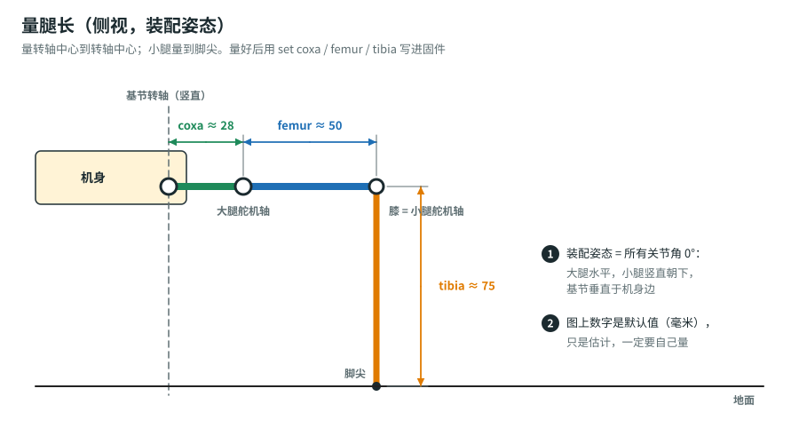
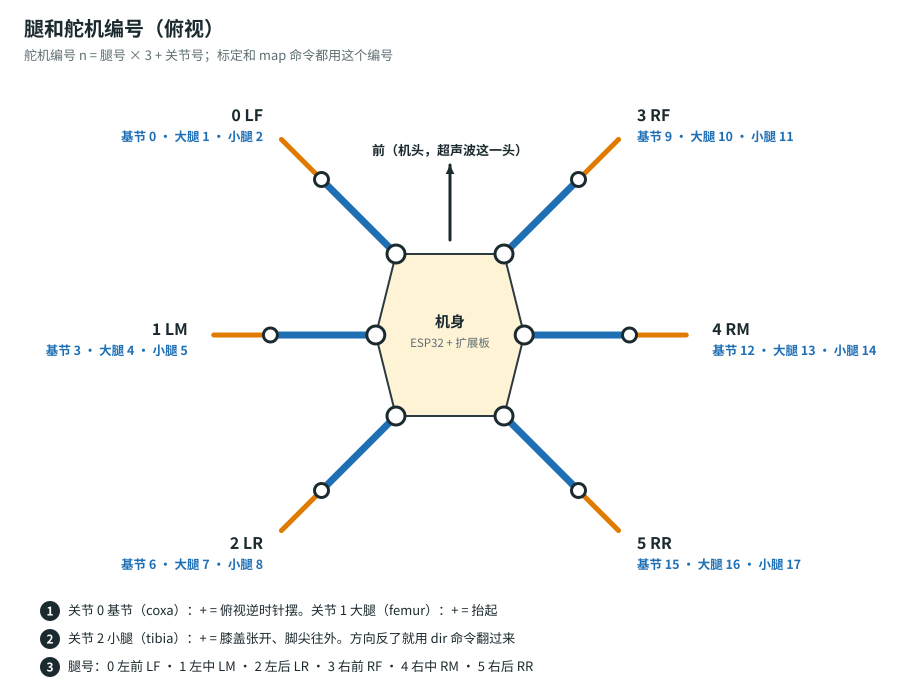

# 新手计划：从拆箱到用 G7 Pro 遥控六足机器人

一共 10 步（第 0–9 步），做完一项就打一个勾。网页版会记住你的勾选。每一步都写了 **✅ 成功的样子** 和 **❌ 卡住了怎么办**。不用会编程，只要会复制、粘贴、点鼠标。

**最终目标**：
- 打开电池开关，按手柄 A，机器人站起来。
- 左摇杆让它前进、后退、横着走；右摇杆让它原地转圈。
- 按 X 换步态，按 B 急停。
- 关掉手柄，它自己停下站稳。

| 步骤 | 内容 | 大约用时 |
|---|---|---|
| 0 | 认识套件、充电、安全 | 30 分钟 |
| 1 | 电脑装 Arduino IDE 和开发板包 | 30–60 分钟 |
| 2 | 备份原厂固件（强烈推荐） | 15 分钟 |
| 3 | 刷固件，第一次和机器人“对话” | 20 分钟 |
| 4 | 舵机回中，装机身 | 2–4 小时 |
| 5 | 找插口：哪个插口是哪个关节 | 30–60 分钟 |
| 6 | 量腿长、调方向、调中位 | 1 小时 |
| 7 | 用电脑命令让它站起来、走两步 | 20 分钟 |
| 8 | 🎯 G7 Pro 配对，手柄遥控 | 20 分钟 |
| 9 | 以后可以玩什么 | — |

---

## 第 0 步：认识套件、充电、安全

**目标**：知道每个零件叫什么、干什么用，电池充好电。

- [ ] 对照下表，把零件一样一样找出来：

  | 零件 | 数量 | 作用 |
  |---|---|---|
  | MG90S 舵机（金属齿） | 18 | 每条腿 3 个：基节（左右摆）、大腿（上下抬）、小腿（膝盖弯） |
  | ESP32 主板（WROOM，Type-C 口） | 1 | 大脑：连手柄、算腿怎么动 |
  | 18 路舵机扩展板 | 1 | 插 18 个舵机，给舵机供电 |
  | 2 节 18650 电池盒 + 充电线 | 1 | 电源，7.4 V |
  | 亚克力 / 碳板机身件、螺丝、铜柱 | 1 套 | 机身和腿 |
  | ESP32-CAM、超声波模块 | 各 1 | 这次先不用（第 9 步再玩） |
  | 螺丝刀 | 1 | 装配 |

- [ ] 给 18650 电池充满电。电池盒上的指示灯或充电器会显示充满。
- [ ] 读一遍安全规则：
  - 18650 装反会烧东西：**看清电池盒里的 + / − 标记**。
  - 不用的时候**关掉电池开关**。长时间不用，把电池取出来。
  - 第一次让舵机动的时候，**把机器人架空**：肚子下面垫个杯子或盒子，腿悬空，动错了也不会摔。
  - 舵机卡住、发烫、嗡嗡响，马上关电。

**✅ 成功的样子**：零件都认识，电池充满了。
**❌ 卡住了**：少零件，找商家补。电池盒不亮，检查电池方向和开关。

---

## 第 1 步：电脑装 Arduino IDE 和开发板包

**目标**：电脑能认出 ESP32 主板，Arduino IDE 能给它编译固件。

- [ ] 下载安装 **Arduino IDE 2**：<https://www.arduino.cc/en/software>（Windows / macOS / Linux 都有）。
- [ ] 打开 Arduino IDE → **文件 → 首选项**（macOS：Arduino IDE → Settings）→ “其他开发板管理器地址”，粘贴下面两行（每行一个）：

  ```text
  https://espressif.github.io/arduino-esp32/package_esp32_index.json
  https://raw.githubusercontent.com/ricardoquesada/esp32-arduino-lib-builder/master/bluepad32_files/package_esp32_bluepad32_index.json
  ```

- [ ] **工具 → 开发板 → 开发板管理器**，搜索 `esp32_bluepad32`，安装 **esp32_bluepad32 by Ricardo Quesada**。它自带 Bluepad32 手柄库。安装包比较大，耐心等。
- [ ] 用 **能传数据的** Type-C 线把 ESP32 主板插到电脑上。有些线只能充电，换一根试试。
- [ ] **工具 → 开发板 → esp32_bluepad32 → ESP32 Dev Module**。
- [ ] **工具 → 端口**：选新出现的那个。Windows 是 `COM3`、`COM5` 这种，macOS 是 `/dev/cu.usbserial-…` 或 `/dev/cu.wchusbserial…`，Linux 是 `/dev/ttyUSB0`。
- [ ] 下载本项目：打开 <https://github.com/ouhanjun-wq/ou/tree/claude/ros-esp32-s3-project-ypzx2b>，点绿色 **Code → Download ZIP**，然后解压。

**✅ 成功的样子**：插上主板，“端口”菜单里多出一个端口；拔掉，它就消失。
**❌ 卡住了**：
- 端口菜单是灰的，或者什么都没有：装 USB 驱动。看主板 USB 口旁边的小芯片：
  - 写着 `CH340` 或 `CH9102`：装 [沁恒 CH341SER 驱动](https://www.wch.cn/downloads/CH341SER_EXE.html)（macOS 装 [CH34XSER_MAC](https://www.wch.cn/downloads/CH34XSER_MAC_ZIP.html)）。
  - 写着 `CP2102`：装 [Silicon Labs CP210x 驱动](https://www.silabs.com/developers/usb-to-uart-bridge-vcp-drivers)。
- 开发板管理器下载失败：多试几次，或换个网络。

---

## 第 2 步：备份原厂固件（强烈推荐）

**目标**：把商家的原厂固件存成一个文件。以后想用回手机 App，刷回去就行。

- [ ] 安装 Python 3：<https://www.python.org/downloads/>（Windows 安装时勾选 “Add Python to PATH”）。
- [ ] 打开命令行（Windows：开始菜单搜 `cmd`；macOS：终端），安装乐鑫官方烧录工具 esptool：

  ```bash
  pip install esptool
  ```

- [ ] 看一下 flash 容量。把 `COM5` 换成你第 1 步看到的端口：

  ```bash
  esptool.py --port COM5 flash_id
  ```

  输出里有一行 `Detected flash size: 4MB`。
- [ ] 读出整片 flash。4MB 用 `0x400000`，8MB 用 `0x800000`，16MB 用 `0x1000000`：

  ```bash
  esptool.py --port COM5 read_flash 0 0x400000 kit-original.bin
  ```

- [ ] 把 `kit-original.bin` 存到网盘或 U 盘里。
- [ ] 以后想刷回原厂固件（刷回后手机 App 又能用了）：

  ```bash
  esptool.py --port COM5 write_flash 0 kit-original.bin
  ```

**✅ 成功的样子**：得到一个 4 MB（或 8 / 16 MB）的 `kit-original.bin` 文件。
**❌ 卡住了**：
- 提示 `Failed to connect`：按住主板上的 **BOOT** 键不放，再敲命令；看到 `Connecting...` 后松开。
- 新版 esptool 的命令名是 `esptool`（没有 `.py`）。上面的命令去掉 `.py` 再试。

---

## 第 3 步：刷固件，第一次和机器人“对话”

**目标**：主板跑上我们的固件，你能在串口里给它下命令。

- [ ] Arduino IDE：**文件 → 打开**，选解压出来的 `hexapod-kit/firmware/hexapod_g7pro/hexapod_g7pro.ino`。
- [ ] 点左上角 **→（上传）**。第一次编译要几分钟。
- [ ] 上传完成后，打开 **工具 → 串口监视器**。右下角选 **115200 baud**，旁边选 **换行（Newline）**。
- [ ] 按一下主板上的 **EN / RST** 键（重启），串口里应该出现：

  ```text
  === Hexapod + G7 Pro ===
  no saved parameters - using defaults
  ...
  Servos are OFF. Lay the robot on its belly, then press A (or type 'stand'). 'help' lists commands.
  ```

- [ ] 在串口监视器上面的输入框里输入 `help`，回车，看命令列表。
- [ ] 把扩展板插到主板上（如果还没插），**打开电池开关**，输入 `i2c`，回车：
  - 显示 `0x40  PCA9685 servo chip`（可能还有 `0x41`）→ 你的扩展板是 **PCA9685 型**。
  - 显示 `0 device(s)` → 你的扩展板多半是 **GPIO 直连型**。
  - 从商品图看，这个套件的扩展板中间插 ESP32、两边各一排 3 针舵机插座，看不到 PCA9685 芯片，所以**很可能是 GPIO 直连型**：`i2c` 显示 0 个设备是正常的，固件会自动用 GPIO 插口表。
  - 把结果记下来，第 5 步要用。

**✅ 成功的样子**：串口能看到欢迎信息，敲 `help`、`status`、`i2c` 都有回应。
**❌ 卡住了**：
- 上传卡在 `Connecting........`：按住 **BOOT** 键，直到开始写入（显示百分比）再松开。
- 编译报错 `Bluepad32.h: No such file`：开发板没选对，要选 **esp32_bluepad32** 下面的 ESP32 Dev Module，不是普通 esp32 下面的。
- 串口是乱码：波特率没选 115200。
- 敲命令没反应：右下角要选“换行”，不能选“没有行结束符”。

---

## 第 4 步：舵机回中，装机身

**目标**：每个舵机都在中间位置时装上舵机臂。这样“关节角 0°”就正好是装配姿态。

- [ ] 把 18 个舵机**全部插到扩展板上**（先不装舵机臂）。插头方向：棕线 = GND（−），红线 = 电源（+），橙线 = 信号（S）。和扩展板丝印对齐。
- [ ] 打开电池开关，串口输入 `centerall`，回车。所有舵机转到中间（1500 µs），然后保持不动。
- [ ] **保持通电**，按商家的装配视频或说明书装机身和腿。装舵机臂的时候，让腿摆成**装配姿态**：
  - **基节**：腿垂直于机身边，指向正外面。
  - **大腿**：水平。
  - **小腿**：竖直朝下。

  

- [ ] 舵机臂的齿对不准时，选最接近的那个齿，剩下的差别第 6 步用 trim 补。
- [ ] 全部装好后输入 `off`（舵机放松），关电池。
- [ ] 如果商家已经帮你装好了：直接输入 `centerall` 看一眼。偏差不大（10° 以内）就不用拆，第 6 步用 trim 修；偏很多的腿，拆下舵机臂重新对齿。

**✅ 成功的样子**：`centerall` 时 6 条腿都是装配姿态：大腿水平，小腿朝下。
**❌ 卡住了**：
- `centerall` 后有的舵机不动：插头插反了、没插紧，或者那一路没供电。
- 舵机一直嗡嗡响、发烫：说明它被机身卡住，拼命顶着。马上 `off`，检查装配。

---

## 第 5 步：找插口：哪个插口是哪个关节

**目标**：告诉固件“第几号舵机插在哪个插口”。舵机编号看下图。



- [ ] **架空**机器人：肚子垫高，腿悬空。打开电池。
- [ ] 输入 `maps`，看固件现在猜的插口表。
- [ ] 输入 `findall`：固件会让每个插口轮流摆动 3 秒，串口同时显示正在摆哪个插口，例如 `wiggling PCA9685 0x40 channel 3` 或 `wiggling GPIO 13`。
- [ ] 每看到一个关节在摆，就在纸上记下来，例如“0x40 ch3 → 右前腿大腿 = 10 号”。
- [ ] 按记录一条条输入 `map` 命令，格式如下：
  - PCA9685 板：`map 10 pca 0x40 3`
  - GPIO 板：`map 10 gpio 13`
- [ ] 全部改完，输入 `maps` 检查 18 行都对了，然后输入 `save`。

详细说明和例子见 [舵机接线与标定](servo-setup.md#2-找插口)。

**✅ 成功的样子**：`maps` 里 18 个舵机对应 18 个不同的插口。`joint 0 20` 时，动的是**左前腿的基节**。
**❌ 卡住了**：`findall` 走完一轮也没看到某个关节动，说明那个插口不在默认的扫描名单里。把扩展板照片发给我，我帮你看。

---

## 第 6 步：量腿长、调方向、调中位

**目标**：固件知道你的腿有多长；每个舵机转的方向对；装配姿态准确。

- [ ] 用尺子量 3 个长度（毫米），量法看第 4 步的图：
  - **coxa**：基节转轴 → 大腿舵机轴
  - **femur**：大腿舵机轴 → 膝盖（小腿舵机轴）
  - **tibia**：膝盖 → 脚尖
- [ ] 输入（数字换成你量的）：

  ```text
  set coxa 28
  set femur 50
  set tibia 75
  ```

- [ ] **调方向**：对 0–17 号每个舵机，输入 `joint 号码 20`，看它往哪边转。正确方向是：
  - 基节：俯视**逆时针**。
  - 大腿：**抬起**。
  - 小腿：脚尖**往外张**。

  方向反了就输入 `dir 号码 -1`。左右两边的舵机是镜像装的，通常一边要翻。
- [ ] **调中位**：输入 `center`，所有关节回到 0°。哪个关节没对准装配姿态，就用 `trim 号码 数值` 微调（单位 µs，大约 11 µs = 1°）。例如 `trim 7 -30`。
- [ ] 输入 `save` 保存。

详细步骤见 [舵机接线与标定](servo-setup.md#3-量腿长)。

**✅ 成功的样子**：`center` 时 6 条腿对称整齐。`joint n 20` 时，每个舵机都往正确方向转。
**❌ 卡住了**：某个舵机怎么调都偏很多，说明舵机臂装偏了不止一个齿。回第 4 步重新装那个舵机臂。

---

## 第 7 步：用电脑命令让它站起来、走两步

**目标**：先不用手柄，用串口命令确认步态没问题。

- [ ] 把机器人**肚子贴地**放在地上，打开电池。
- [ ] 输入 `stand`：它从趴着的姿势慢慢站起来。
- [ ] 输入 `walk 40 0 0 3`：以 40 mm/s 往前走 3 秒。
- [ ] 输入 `walk 0 0 30 3`：原地逆时针转 3 秒。
- [ ] 输入 `gait wave`，再 `walk 40 0 0 3`：用波浪步态走（一次只抬一条腿）。
- [ ] 输入 `sit`：趴下。然后输入 `off`：舵机放松。

**✅ 成功的样子**：站得稳，走的时候腿轮流抬起，不会摔、不会拖着脚。
**❌ 卡住了**：
- 站起来歪向一边：检查那一边的 trim 和 dir。
- 串口不停提示 `foot target is out of reach`：腿长量错了，或者 `stance`、`height` 设得太大。先试 `set height 50`。
- 往后走，或者往反方向转：说明某几个舵机的 dir 不对。回第 6 步。
- 抖得厉害：先 `set cycle_s 1.2` 放慢步子，再看是哪条腿有问题。

---

## 第 8 步：🎯 G7 Pro 配对，手柄遥控

**目标**：完成最终目标。

- [ ] G7 Pro 背面中间的**模式开关**拨到**蓝牙**档。
- [ ] 短按 **Xbox 键**开机，再**长按配对键**，直到指示灯快速循环闪烁。
- [ ] 机器人打开电池（主板上电），等几秒。串口显示 `gamepad connected: ...`，手柄震一下，就是连上了。
- [ ] 机器人肚子贴地，按 **A**：舵机上电，站起来。
- [ ] 推左摇杆：前进、后退、横着走。拨右摇杆：原地转。
- [ ] 按 **X** 换步态，**LB / RB** 调速度，十字键上下调高度。
- [ ] 按住 **Y** 推摇杆：身体扭来扭去，脚不动。
- [ ] 按 **B**：马上停住，松开摇杆后恢复。
- [ ] 关掉手柄：机器人自己停下站稳。
- [ ] 再按 **A** 趴下，关电池。

更多说明见 [G7 Pro 手柄](gamepad.md)。

**✅ 成功的样子（验收）**：只用手柄就能完成上面每一项，连续 3 次都成功。🎉
**❌ 卡住了**：
- 手柄连不上：
  - 确认模式开关在“蓝牙”档，不是 2.4G 档。
  - 串口输入 `pair`，然后重新长按配对键。
  - 离主板近一点再试。
- 连上了但机器人不动：先按 **A** 上电；如果按过 **B**，要先把两个摇杆都松开。
- 摇杆方向反了：说明舵机方向（dir）不对，回第 6 步。

---

## 第 9 步：以后可以玩什么

- [ ] **调手感**：`set max_vx 150`（最高速度）、`set cycle_s 0.6`（步子快慢）、`set step_h 35`（抬腿高度），调完 `save`。参数说明见 [固件与命令](firmware.md#参数表)。
- [ ] **ESP32-CAM 看画面**：用 Arduino 自带例子 `CameraWebServer`，手机连它的 Wi-Fi 看实时画面。可以用双面胶把它贴在机头。
- [ ] **超声波避障**：把超声波模块接到主板的空闲引脚，前方太近就自动停下。需要改固件，想做的时候告诉我。
- [ ] **学 ROS 2**：看仓库里的 [`hexapod/`](../../hexapod/README.md) 路线（XIAO ESP32S3 + micro-ROS + 雷达建图）。
