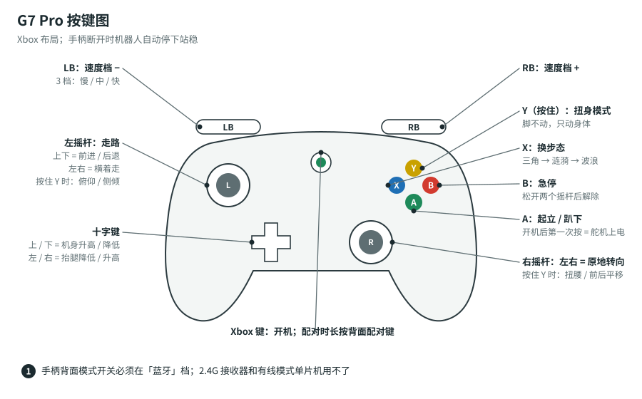

# G7 Pro 手柄：配对、按键、常见问题

## 为什么能直连

G7 Pro 有三种连接模式：Xbox 有线、PC 2.4G 接收器、安卓蓝牙。单片机只能用**蓝牙模式**。

G7 Pro 的蓝牙是“经典蓝牙”（Classic Bluetooth）：
- 原版 ESP32 同时支持经典蓝牙和低功耗蓝牙（BLE）。套件主板是 ESP32 WROOM，所以能连。
- ESP32-S3、ESP32-C3 只支持 BLE，所以连不上。

固件里负责连手柄的是开源库 **Bluepad32**，它已经装在第 1 步的 `esp32_bluepad32` 开发板包里，不用另外装。

## 第一次配对

1. G7 Pro 背面中间的**模式开关**拨到**蓝牙**。
2. 短按 **Xbox 键**开机。
3. **长按配对键**，直到指示灯快速循环闪烁，表示进入配对状态。
4. 机器人打开电池（或用 USB 给主板供电），等几秒。
5. 串口显示下面这行，同时手柄震一下，就是连上了：

   ```text
   gamepad connected: ... (battery 80%)
   ```

以后开机会**自动回连**，不用再长按配对键：先开机器人，再按 Xbox 键开手柄就行。

### 换一个手柄，或者连不上时重新配对

串口输入：

```text
pair
```

固件会忘掉以前配对过的所有手柄，然后等待新手柄。接着在手柄上重新长按配对键。

## 按键表



| 按键 | 功能 | 说明 |
|---|---|---|
| 左摇杆 上 / 下 | 前进 / 后退 | 推得越多越快 |
| 左摇杆 左 / 右 | 横着走 | 可以斜着推：斜着走 |
| 右摇杆 左 / 右 | 原地转向 | 和左摇杆一起用 = 边走边转 |
| **A** | 起立 / 趴下 | 开机后舵机是软的，第一次按 A 才上电，从趴着的姿势站起来 |
| **B** | 急停 | 马上原地站住；**松开两个摇杆**后才能再走 |
| **X** | 换步态 | 三角 → 涟漪 → 波浪 → 三角…；走路时按，停下后才生效。震动时间越长 = 第几种步态 |
| **Y**（按住） | 扭身模式 | 脚不动，只动身体。左摇杆：俯仰 / 侧倾；右摇杆：左右 = 扭腰，上下 = 身体前后平移 |
| LB / RB | 速度档 − / + | 3 档，开机是第 2 档 |
| 十字键 上 / 下 | 机身升高 / 降低 | 每按一下 5 mm，按住连续变 |
| 十字键 左 / 右 | 抬腿降低 / 升高 | 每按一下 5 mm；地面不平时抬高一点 |
| 手柄关机或断开 | 自动停下站稳 | 安全保护 |

## 速度档

设 $k$ 为速度档系数，$s_x, s_y, s_r \in [-1, 1]$ 分别是左摇杆上下、左摇杆左右、右摇杆左右的推杆量。满杆时：

$$
v_x = s_x \cdot v_{x,\max} \cdot k, \qquad
v_y = -s_y \cdot v_{y,\max} \cdot k, \qquad
\omega = -s_r \cdot \omega_{\max} \cdot k
$$

| 档位 | $k$ | 前进最快（默认 $v_{x,\max} = 120$ mm/s） | 转向最快（默认 $\omega_{\max} = 60^\circ$/s） |
|---|---|---|---|
| 1 | 0.4 | 48 mm/s | 24°/s |
| 2 | 0.7 | 84 mm/s | 42°/s |
| 3 | 1.0 | 120 mm/s | 60°/s |

- 速度还受步长限制：一步最远 `stride_max` = 50 mm。步态越稳（波浪步态），一步的时间越长，所以最高速度会自动变低。
- 摇杆中间有 10% 的死区（`deadband`），轻轻碰到不会乱走。

## 三种步态

| 步态 | 同时抬起的腿 | 着地的腿 | 特点 |
|---|---|---|---|
| 三角（tripod） | 3 | 3 | 最快，最常用 |
| 涟漪（ripple） | 2 | 4 | 中速，更稳 |
| 波浪（wave） | 1 | 5 | 最慢，最稳；适合地面不平或爬坡 |

## 常见问题

**串口一直显示 `gamepad: none`**
- 模式开关要在**蓝牙**档。2.4G 档要插接收器，那是给电脑用的。
- 手柄进入配对状态了吗？指示灯应该快速循环闪烁。
- 手柄以前连过手机或电脑，可能会先去连它们。关掉那边的蓝牙，或者在主板串口输入 `pair` 后重新配对。
- 主板要是**原版 ESP32**。如果换成了 ESP32-S3 板子，是连不上的。

**连上了但是按键没反应**
- 刚开机舵机是 OFF：先按 **A**。
- 按过 **B** 急停：先把两个摇杆都松开。
- 串口输入 `status`，看 `mode` 那一行。

**连上一会儿就断**
- 手柄没电了：`status` 会显示手柄电量。
- 距离太远，或者中间隔着墙。
- 电池电压低时主板会复位，串口会重新出现欢迎信息。给 18650 充电。

**推摇杆往前，它却往后走或者歪着走**
- 这是舵机方向（`dir`）或插口表（`map`）不对，不是手柄的问题。回 [舵机接线与标定](servo-setup.md) 检查。

**想换成别的手柄**
- Bluepad32 支持大部分蓝牙手柄：Xbox 无线手柄、PS4 / PS5 手柄、Switch Pro、8BitDo 等。换手柄后输入 `pair` 重新配对即可，按键位置按 Xbox 布局对应。
