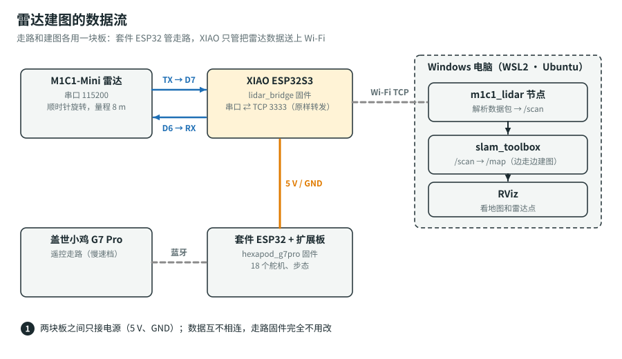

# 雷达建图：M1C1-Mini + XIAO ESP32S3 + Windows

目标：机器人背着 M1C1-Mini 激光雷达，你用 G7 Pro 手柄遥控它在房间里慢慢走一圈，Windows 电脑上实时画出房间的平面地图，最后存成图片文件。



**为什么多加一块 XIAO**：
- 套件 ESP32 继续只管走路和手柄，固件一行不改，稳定。
- XIAO 只做一件事：把雷达的串口数据原样通过 Wi-Fi 转给电脑。
- 解析数据、建图都在电脑上做，出问题容易查。
- XIAO 开一个 TCP 服务器，由电脑主动去连它。Windows 的 WSL2 默认是 NAT 网络，从 WSL2 连出去一定通；反过来局域网连进 WSL2 很麻烦。

## 1. 准备

| 东西 | 数量 | 说明 |
|---|---|---|
| M1C1-Mini 激光雷达 | 1 | 已买 |
| Seeed XIAO ESP32S3 | 1 | 普通版就行（不用 Sense 版），约 ¥30 |
| 杜邦线（母对母） | 4–6 根 | 雷达 ↔ XIAO，电源 |
| 1 kΩ、2 kΩ 电阻 | 各 1 | **只有雷达 TX 是 5 V 时才要**（见第 3 节） |
| 3D 打印的雷达平台 + M3 × 50 + 6 单通铜柱 × 4 | 1 套 | 见 [3D 打印机身](../cad/README.md)；用碳板机身也可以自己找地方架高 |
| 2.4 GHz Wi-Fi | — | ESP32 **不支持 5 GHz**。路由器双频合一时一般没问题，连不上就单独开一个 2.4G |
| Windows 11 电脑 | — | Windows 10 也行，但要多装一个显示程序（见第 5 节） |

## 2. 雷达的参数（来自国科光芯开发手册）

| 项目 | 值 |
|---|---|
| 串口 | 115200 波特率，8N1 |
| 启动转动 | 发送 `AA 55 F0 0F`（上电默认不转，**必须发这条命令**） |
| 停止 | 发送 `AA 55 F5 0A` |
| 转向 | 顺时针（从上往下看） |
| 量程 | 最远约 8 m |
| 数据包 | `AA 55` 开头：包类型 CT、点数 LSN、起始角 FSA、结束角 LSA、校验 CS、LSN 个距离 |

距离和角度的算法（手册第 5 页），$S_i$ 是第 $i$ 个采样值，距离单位 mm，角度单位度：

$$
d_i = \frac{S_i}{4}, \qquad
\theta_{\text{FSA}} = \frac{\text{FSA} \gg 1}{64}, \qquad
\theta_{\text{LSA}} = \frac{\text{LSA} \gg 1}{64}
$$

$$
\theta_i = \theta_{\text{FSA}} + \frac{\theta_{\text{LSA}} - \theta_{\text{FSA}}}{\text{LSN} - 1}\,(i - 1) - \Delta\theta(d_i),
\qquad
\Delta\theta(d) = \arctan\!\left(19.16 \cdot \frac{d - 90.15}{90.15\, d}\right)
$$

- $\Delta\theta$ 是三角测距雷达的角度修正，$d = 0$（没测到）时取 0。
- 这些公式都写在 [`protocol.py`](../ros2/m1c1_lidar/m1c1_lidar/protocol.py) 里。单元测试用手册里的例子核对过：FSA = 0x1839、LSA = 0x2397，算出 $37.49^\circ$ 和 $59.31^\circ$。

## 3. 接线

**先看雷达线上的丝印**：一般是 4 根线，标 `5V` / `VCC`、`GND`、`TX`、`RX`（有的转接板标 `RXD`、`TXD`）。

> ⚠️ **XIAO 的引脚只能接 3.3 V 信号。** 接线前先量雷达 TX 线的电压：
> 1. 雷达接上 5 V 和 GND 通电。
> 2. 万用表打到直流电压档，黑表笔接 GND，红表笔接 TX。
>
> 结果：
> - 读数约 **3.3 V**：直接接。
> - 读数约 **5 V**：TX 要先分压再接 XIAO。接法：雷达 TX → 1 kΩ → XIAO D7；XIAO D7 → 2 kΩ → GND。这样 D7 上是 $5 \times \frac{2}{1+2} \approx 3.3$ V。

| 雷达 | 接到 |
|---|---|
| 5V | 扩展板上标 `5V` 的排针（一般在 ESP32 插座旁边） |
| GND | 扩展板 GND |
| TX | XIAO **D7**（RX） |
| RX | XIAO **D6**（TX） |

| XIAO | 接到 |
|---|---|
| 5V | 扩展板 5 V（和雷达并在一起） |
| GND | 扩展板 GND |

> ⚠️ 接之前用万用表量一下这个 5V 排针，要在 4.8–5.2 V 之间。
> - **不要**用舵机插座的电源针：舵机那一路可能是 6 V 甚至电池电压。
> - **不要**把 7.4 V 电池直接接到雷达或 XIAO 上。
>
> 扩展板上找不到 5V 排针，就把板子照片发给我。

## 4. 给 XIAO 刷桥接固件

- [ ] Arduino IDE：**工具 → 开发板 → esp32 → XIAO_ESP32S3**。
  - 这次选 Espressif 官方的 `esp32`，**不是** `esp32_bluepad32`。
  - 官方开发板包在新手计划第 1 步已经加了地址；没装的话在开发板管理器里搜 `esp32` 安装。
- [ ] 打开 `hexapod-kit/firmware/lidar_bridge/lidar_bridge.ino`，上传。上传卡住的话，按住 XIAO 的 **B** 键再插 USB。
- [ ] 打开串口监视器（115200，换行），输入你家 Wi-Fi：

  ```text
  wifi 你的WiFi名 你的WiFi密码
  ```

  XIAO 会重启，然后打印：

  ```text
  Wi-Fi "你的WiFi名", IP 192.168.1.57, port 3333  (use this IP as host:=...)
  ```

  **记下这个 IP**，第 6 节要用。
- [ ] 试一下雷达：输入 `start`，雷达开始转；输入 `stop`，雷达停。
- [ ] 没有 Wi-Fi 也能用：输入 `wifi off`，XIAO 自己开热点 `hexapod-lidar`（密码 `hexapod123`，IP 固定 `192.168.4.1`）。电脑连这个热点，但连着它的时候电脑就上不了网了。

**✅ 成功的样子**：`start` 后雷达转起来，XIAO 的黄灯常亮（有数据在流）。
**❌ 卡住了**：
- 雷达不转：检查 5 V 供电；检查 D6 → 雷达 RX 这根线。
- 灯不亮：多半是 TX / RX 接反了，把两根交换一下。

## 5. Windows 装 WSL2 + ROS 2 Jazzy

### 5.1 装 Ubuntu（WSL2）

- [ ] 开始菜单搜 **PowerShell**，右键 **以管理员身份运行**：

  ```powershell
  wsl --install -d Ubuntu-24.04
  ```

- [ ] 重启电脑。开始菜单打开 **Ubuntu 24.04**，按提示设用户名和密码。
- [ ] 显示界面：
  - **Windows 11** 自带 WSLg，RViz 窗口直接能弹出来。
  - **Windows 10** 要先 `wsl --update`；还弹不出窗口，就装 [VcXsrv](https://sourceforge.net/projects/vcxsrv/)。

### 5.2 装 ROS 2 Jazzy 和建图软件

在 Ubuntu 窗口里一段一段复制执行：

```bash
sudo apt update && sudo apt install -y curl software-properties-common
sudo add-apt-repository -y universe
sudo curl -sSL https://raw.githubusercontent.com/ros/rosdistro/master/ros.key -o /usr/share/keyrings/ros-archive-keyring.gpg
echo "deb [arch=$(dpkg --print-architecture) signed-by=/usr/share/keyrings/ros-archive-keyring.gpg] http://packages.ros.org/ros2/ubuntu $(. /etc/os-release && echo $UBUNTU_CODENAME) main" | sudo tee /etc/apt/sources.list.d/ros2.list > /dev/null
sudo apt update
sudo apt install -y ros-jazzy-desktop ros-jazzy-slam-toolbox ros-jazzy-nav2-map-server python3-colcon-common-extensions git
echo "source /opt/ros/jazzy/setup.bash" >> ~/.bashrc && source ~/.bashrc
```

> 国内下载慢，可以换清华镜像：把上面第 4 行里的 `http://packages.ros.org/ros2/ubuntu` 换成 `https://mirrors.tuna.tsinghua.edu.cn/ros2/ubuntu`。`raw.githubusercontent.com` 打不开的话，搜“ROS 2 Jazzy 安装 鱼香ROS 一键安装”，用国内的一键脚本也可以。

### 5.3 编译本项目的雷达节点

```bash
mkdir -p ~/ros2_ws/src && cd ~/ros2_ws/src
git clone -b claude/ros-esp32-s3-project-ypzx2b https://github.com/ouhanjun-wq/ou.git
ln -s ~/ros2_ws/src/ou/hexapod-kit/ros2/m1c1_lidar m1c1_lidar
touch ou/COLCON_IGNORE          # 仓库里别的东西不用编译
cd ~/ros2_ws && colcon build --symlink-install
echo "source ~/ros2_ws/install/setup.bash" >> ~/.bashrc && source ~/.bashrc
```

### 5.4 先不接雷达，用“假雷达”试一遍

这一步不需要任何硬件，用来确认电脑这边全部装好了。开两个 Ubuntu 窗口：

```bash
ros2 run m1c1_lidar fake_bridge                              # 窗口 1：模拟一个 3.5 m × 2.4 m 的房间
ros2 launch m1c1_lidar mapping.launch.py host:=127.0.0.1     # 窗口 2：雷达节点 + 建图 + RViz
```

**✅ 成功的样子**：
- RViz 窗口里出现一圈红点，围成一个长方形。
- 几秒后灰色的地图画出来。
- 窗口 2 每 5 秒打印一次 `10.0 scans/s` 左右。

## 6. 接上真雷达

- [ ] 机器人和雷达上电，XIAO 连上 Wi-Fi。在 Ubuntu 里先 `ping 192.168.1.57`（换成 XIAO 打印的 IP），能通再继续。
- [ ] 启动：

  ```bash
  ros2 launch m1c1_lidar mapping.launch.py host:=192.168.1.57
  ```

- [ ] **校准方向**：在机器人正前方 0.5 m 放一个盒子，看 RViz 里盒子的红点在不在机器人前方（红色 X 轴方向）。
  - 不在就调 `angle_offset_deg`，每次试一个值：`12`、`-12`、`90`、`-90`、`180`。直到盒子出现在正前方。
  - 手册说雷达的数据零度和外壳标记差 $12^\circ$，所以先试 ±12。

  ```bash
  ros2 launch m1c1_lidar mapping.launch.py host:=192.168.1.57 angle_offset_deg:=12
  ```

## 7. 建图

1. 把机器人放在房间中间，启动第 6 节的命令。
2. 用 G7 Pro 手柄把速度档调到最低（LB 按到底）。慢慢走：先原地慢慢转一圈，再沿着墙走一圈，最后回到起点。
   - 转弯要慢：这个机器人没有里程计，全靠雷达前后两帧对比算出自己走了多远。走太快、转太快，地图会“拖影”。
3. 地图满意了，开一个新窗口保存：

   ```bash
   mkdir -p ~/maps && ros2 run nav2_map_server map_saver_cli -f ~/maps/my_room
   ```

   得到 `my_room.pgm`（地图图片）和 `my_room.yaml`（比例尺）。在 Windows 资源管理器地址栏输入 `\\wsl$\Ubuntu-24.04\home\你的用户名\maps` 就能找到。

## 8. 常见问题

**`lidar bridge ...: timed out; retrying`**
- 电脑和 XIAO 不在同一个网络：`ping` 一下 XIAO 的 IP。
- XIAO 串口输入 `status`，看 IP 有没有变。建议在路由器里给它固定 IP。

**连上了，但 `0.0 scans/s`**
- 雷达没转：检查 5 V，检查 D6 → 雷达 RX。
- 雷达在转但没数据：TX / RX 接反了，或者 TX 没有分压导致 D7 被烧。XIAO 串口输入 `status`，看 `to PC` 字节数涨不涨。

**地图歪、重影**
- 走慢一点、转慢一点。步态换成波浪（X 键）更稳，机身晃得少。
- 以后可以加一个 IMU（比如 BNO085），或者装 `rf2o_laser_odometry` 做激光里程计。

**RViz 窗口不出来 / 黑屏**
- Windows 11：先在 PowerShell 里 `wsl --update`。
- 还是黑屏：在 Ubuntu 里 `export LIBGL_ALWAYS_SOFTWARE=1` 再启动。

**以后想让它按地图自己走（导航）**
- 需要把电脑发的速度命令传回套件 ESP32：XIAO 用一根串口线接套件 ESP32，固件再加几行代码。
- 这一步等建图跑顺了再做，想做的时候告诉我。
