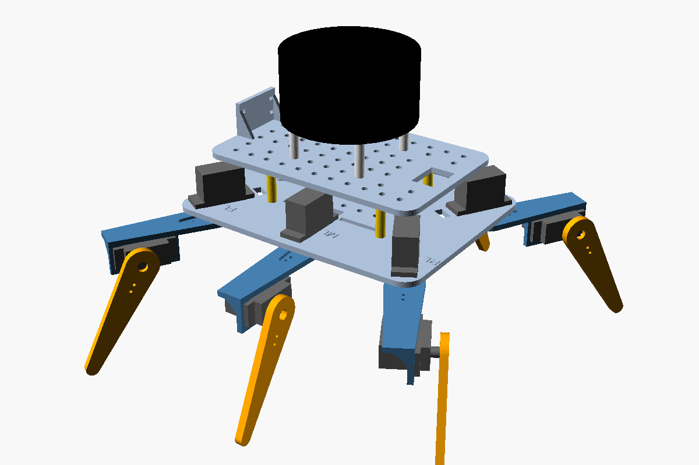
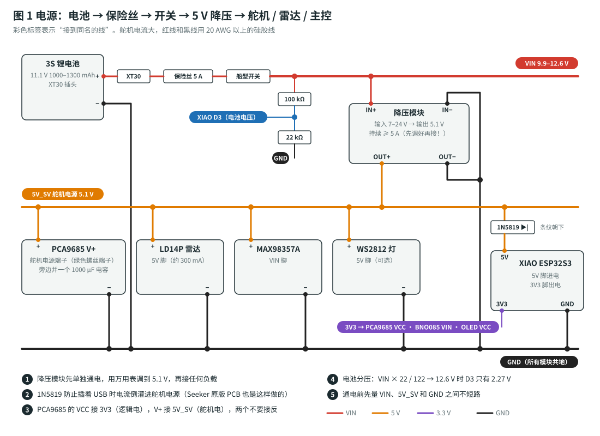
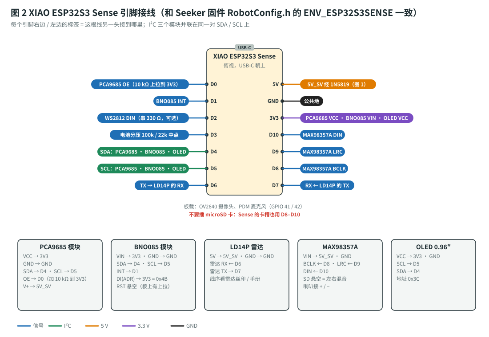

# ROS 2 六足机器人（XIAO ESP32S3 Plus / Sense）

> 这个文件夹是 ROS 2 六足机器人项目（仓库根目录是 6 自由度机械臂项目）。
> 软件用开源项目 **[SeekerRobot/seeker-robot](https://github.com/SeekerRobot/seeker-robot)**（Apache-2.0），这里补上它没有的：**中文材料清单、模块化接线方案、可打印的机身、分步骤的安装和测试流程**。

Seeed **XIAO ESP32S3 Plus**（或 Sense）做主控，跑 **micro-ROS**，通过 Wi-Fi 连到电脑上的 **ROS 2 Jazzy**：12 个舵机三角步态行走，BNO085 姿态 + LD14P 360° 雷达，用 SLAM Toolbox 建图、Nav2 自主导航；加一块摄像头板还能用 YOLO “找东西”。不接硬件也能先在 Gazebo 里仿真。

| 从这里开始 | 内容 |
|---|---|
| 🖥️ [`web/index.html`](web/index.html) | **网页版**：下面所有文档合成一页，材料清单可勾选并实时算剩余花费，步骤清单记进度。由 [`web/build_site.py`](web/build_site.py) 从文档生成 |
| 🧾 [`docs/bom.md`](docs/bom.md) | **详细材料清单**：每一项的型号、规格参数、数量、价格、淘宝搜索词、注意事项（现成模块优先） |
| 📱 [`docs/phone-control.md`](docs/phone-control.md) | **手机控制**：手机浏览器通过 Wi-Fi 打开网页摇杆遥控，不用买手柄 |
| 📋 [`docs/build-plan.md`](docs/build-plan.md) | **总计划**：材料清单（名称 / 规格 / 数量 / 价格 / 搜索词）、预算、分阶段步骤、验收标准、校核计算、故障排查 |
| 🔌 [`docs/wiring-guide.md`](docs/wiring-guide.md) | **接线指南**：接线总表、电源图、XIAO 引脚图、12 个舵机的通道表、洞洞板布局、机械装配、通电检查 |
| 💻 [`docs/software-setup.md`](docs/software-setup.md) | **软件安装**：Ubuntu + Docker + ROS 2 Jazzy、Wi-Fi 配置、改固件参数、仿真、逐项烧录测试、舵机标定、建图导航 |
| 🌐 [`docs/links.md`](docs/links.md) | **所有网站汇总**：项目仓库、安装页面、模块接线资料、购买页面 |
| 🔎 [`docs/project-research.md`](docs/project-research.md) | GitHub 开源项目调研与选型 |
| 🧩 [`cad/README.md`](cad/README.md) | 3D 打印件：底板、甲板、大腿 A / B、小腿（OpenSCAD 参数化 + STL） |

## 硬件一览

| 部分 | 型号 |
|---|---|
| 主控 | Seeed XIAO ESP32S3 **Plus**（D0–D10 引脚和 Sense 完全一样；Sense 也能用），micro-ROS over Wi-Fi |
| 舵机 | 12 × MG90S 180°，PCA9685 16 路驱动（I²C 0x40） |
| 传感器 | BNO085 姿态（I²C 0x4B）、LDROBOT LD14P 360° 激光雷达（UART 230400）；摄像头（可选）用第二块 XIAO ESP32S3 Sense 或 ESP32-CAM |
| 其他 | 0.96″ OLED、MAX98357A 功放 + 喇叭、WS2812 状态灯（都可选） |
| 电源 | 3S 11.1 V 锂电 → 5 A 保险丝 → 开关 → 5.1 V ≥ 5 A 降压（舵机 / 雷达）→ 1N5819 → XIAO |
| 结构 | 3D 打印底板 + 甲板 + 6 条腿（大腿 45 mm、小腿 65 mm），M3 × 25 铜柱 |
| 电脑 | Ubuntu 24.04 + Docker（ROS 2 Jazzy、Gazebo、Nav2、SLAM Toolbox、PlatformIO 都在容器里） |
| 控制 | 手机浏览器（Wi-Fi）打开 `http://电脑IP:8080` 的触屏摇杆 |
| 预算 | 约 ¥620–1130（已有 XIAO ESP32S3 Plus；含 2 块电池和充电器；不含电脑、打印机、工具） |

| 电源接线 | XIAO 引脚接线 |
|---|---|
|  |  |

接线图由 [`docs/img/make_diagrams.py`](docs/img/make_diagrams.py) 生成（纯 Python 标准库）：改了以后运行 `python3 hexapod/docs/img/make_diagrams.py`。
