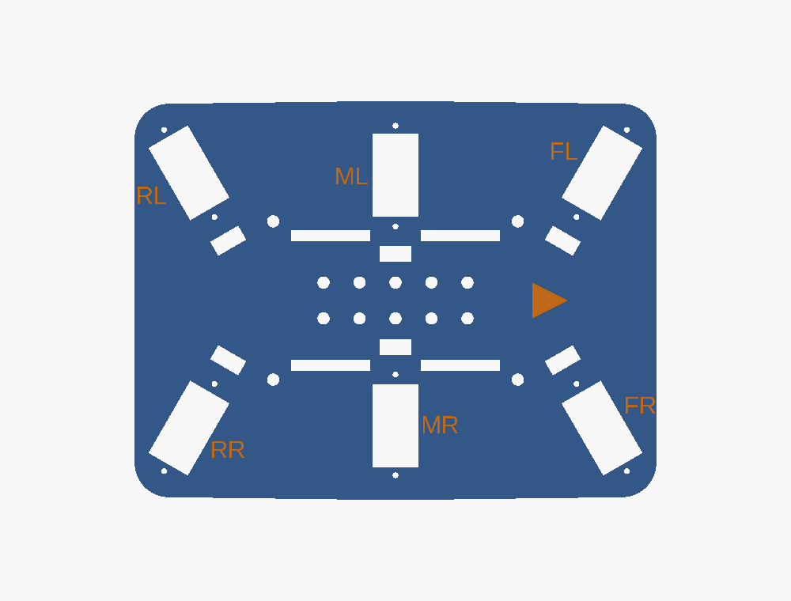
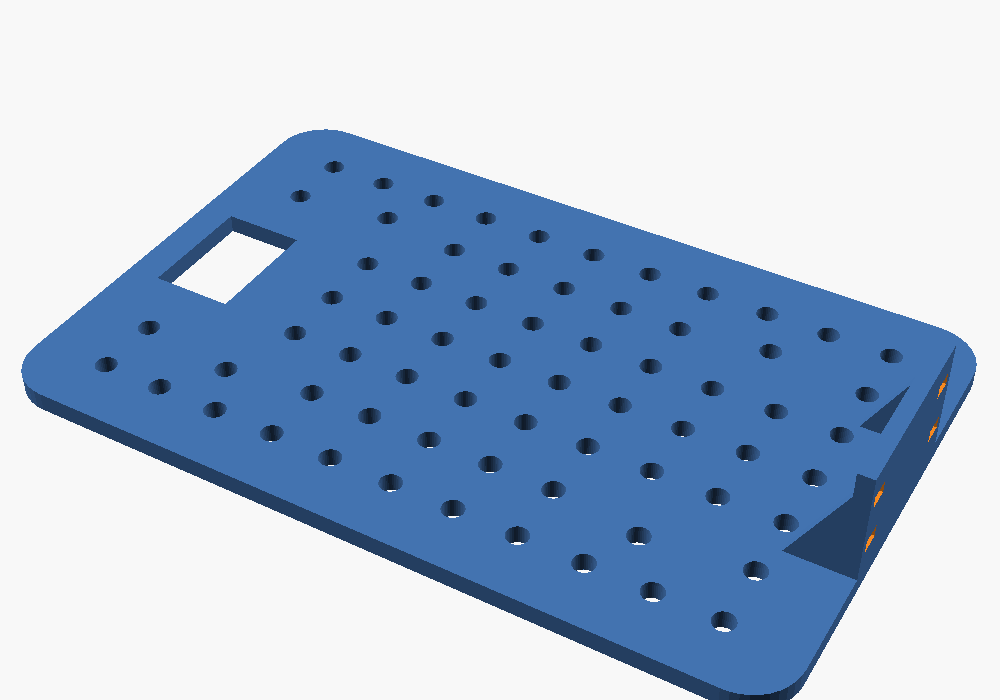
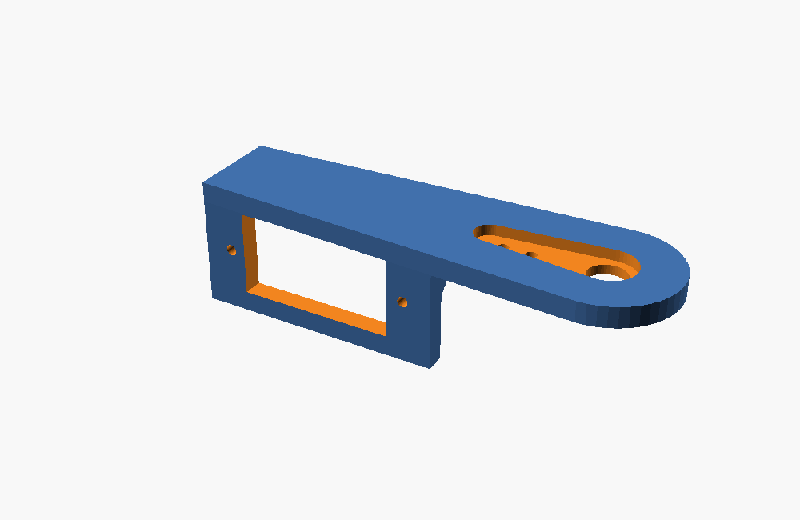
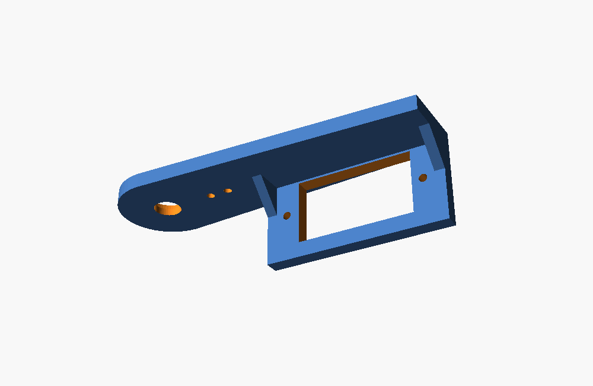
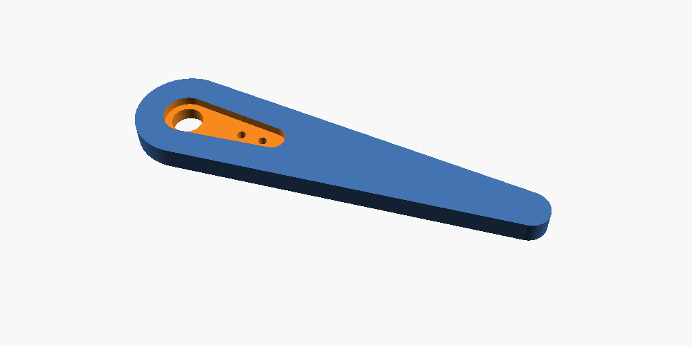
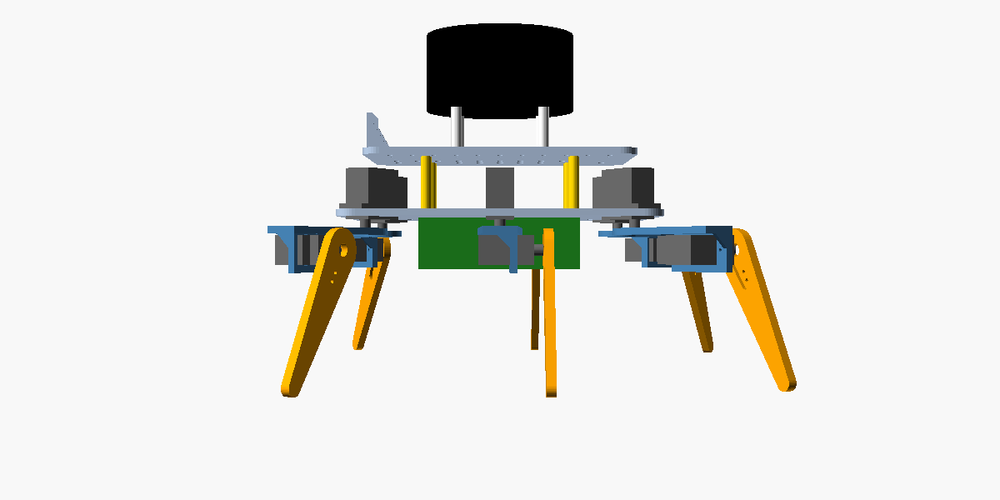

# 3D 打印件：底板 · 甲板 · 大腿 · 小腿

Seeker 原项目没有公开机身结构件，这里按它固件 `HexapodConfig.h` 的几何参数画了一套。全部是 **OpenSCAD 参数化模型**：共享尺寸都在 [`params.scad`](params.scad)，量好自己的舵机和舵机臂，改几个数字，就能重新导出 STL。


| 文件 | 零件 | 数量 | 外形尺寸 | 打印重量* |
|---|---|---|---|---|
| [`body_plate.scad`](body_plate.scad) → [`stl/body_plate.stl`](stl/body_plate.stl) | 底板：6 个髋舵机方孔（刻了 FL/FR/ML/MR/RL/RR 腿名和前进箭头）、4 个 M3 铜柱孔、电池扎带槽、走线槽、中间孔阵 | 1 | 145 × 111 × 3 mm | ≈ 38 g |
| [`deck.scad`](deck.scad) → [`stl/deck.stl`](stl/deck.stl) | 甲板：10 mm 间距 M3 孔阵、船型开关方孔（后）、摄像头竖板（前，带扎带孔） | 1 | 124 × 80 × 21 mm | ≈ 27 g |
| [`femur.scad`](femur.scad) → [`stl/femur_a.stl`](stl/femur_a.stl) | 大腿 A：顶面压髋舵机臂，侧板装膝舵机 | 3（左边 FL / ML / RL） | 68 × 20 × 19 mm | ≈ 5 g |
| 同上 → [`stl/femur_b.stl`](stl/femur_b.stl) | 大腿 B（A 的镜像） | 3（右边 FR / MR / RR） | 68 × 20 × 19 mm | ≈ 5 g |
| [`tibia.scad`](tibia.scad) → [`stl/tibia.stl`](stl/tibia.stl) | 小腿：一头压膝舵机臂，一头是脚尖；右边三条腿翻过来装 | 6（+2 备用） | 74 × 18 × 4 mm | ≈ 4 g |
| [`params.scad`](params.scad) | 共享参数（被上面几个文件引用，不单独导出） | — | — | — |
| [`assembly.scad`](assembly.scad) | 整机装配预览（只出图，检查干涉用，不打印） | — | — | — |

\* 按 PETG、3–4 圈壁、20–30 % 填充估算，一套约 130 g；以切片软件显示为准。

> ⚠️ **STL 里是默认尺寸**，按常见 MG90S（机身 22.8 × 12.2 mm、安装耳总长 32.5 mm、孔距 28 mm）和它自带的单边舵机臂画的。**不同厂家的舵机和舵机臂差 1–2 mm 很常见**，打印前一定先量。

---

## 1. 零件长什么样

| 底板（俯视，箭头 = 机头） | 甲板 |
|---|---|
|  |  |

| 大腿 A（顶面：髋舵机臂凹槽） | 大腿 A（背面：膝舵机方孔 + 加强筋） | 小腿 |
|---|---|---|
|  |  |  |

整机侧视（站立膝角 60°，底板下表面离地约 71 mm，雷达架在 20 mm 尼龙柱上）：



几何关系（和固件一致）：

| 参数 | 值 | 固件里的名字 |
|---|---|---|
| 前 / 后腿髋轴到中心的 X 距离 | 60 mm | `kBodyHalfLength` |
| 左 / 右腿髋轴到中心的 Y 距离 | 40 mm | `kBodyHalfWidth` |
| 腿的朝向 | FL +60°、FR −60°、ML +90°、MR −90°、RL +120°、RR −120° | `mount_angle_deg` |
| 大腿（髋轴 → 膝轴） | 45 mm | `kL1` |
| 小腿（膝轴 → 脚尖） | 65 mm | `kL2`（原值 50，要改，见软件文档 §4） |

站立时脚尖离髋轴的水平距离：

$$
r = L_1 + L_2\cos\theta_k = 45 + 65\cos 60^\circ = 77.5\ \text{mm}
$$

---

## 2. 打印前先量尺寸

用游标卡尺量，改 [`params.scad`](params.scad) 开头的数字：

| 参数 | 含义 | 默认值 |
|---|---|---|
| `servo_w` / `servo_l` | 舵机机身宽 / 长 | 12.2 / 22.8 mm |
| `ear_span` / `ear_hole_spacing` | 安装耳总长 / 两个孔的中心距 | 32.5 / 28.0 mm |
| `ear_z` | 机身底面 → 安装耳下表面 | 15.9 mm |
| `case_h` | 机身底面 → 机壳顶面（不含输出轴） | 22.7 mm |
| `shaft_off` | 输出轴中心 → 机身中心（沿长度方向） | 5.4 mm |
| `horn_hub_d` / `horn_len` / `horn_w_hub` / `horn_w_tip` / `horn_t` | 单边舵机臂：中心圆盘直径 / 中心到臂尖 / 臂根宽 / 臂尖宽 / 厚 | 7.6 / 18.5 / 6.2 / 4.2 / 1.6 mm |
| `horn_holes` | 用来固定舵机臂的两个孔到中心的距离 | 10.5, 14.5 mm |
| `clearance` | 方孔比舵机大多少；太紧加到 0.5 | 0.4 mm |
| `L1` / `L2` | 大腿 / 小腿长度（**改了要同步改固件**） | 45 / 65 mm |

改完以后：OpenSCAD 里按 **F6** 渲染、**F7** 导出 STL；或者用命令行：

```bash
cd hexapod/cad
openscad -o stl/body_plate.stl body_plate.scad
openscad -o stl/deck.stl deck.scad
openscad -o stl/femur_a.stl -D 'side="a"' femur.scad
openscad -o stl/femur_b.stl -D 'side="b"' femur.scad
openscad -o stl/tibia.stl tibia.scad
# 预览整机（要先导出上面的 STL）
openscad -o img/assembly.png --imgsize=1200,800 --camera=0,0,-15,62,0,215,620 assembly.scad
```

> 💡 **先打 1 个大腿试装**：膝舵机能推进方孔、舵机臂能压进凹槽，再打全套。

---

## 3. 打印设置

| 项目 | 底板 / 甲板 | 大腿 / 小腿 |
|---|---|---|
| 材料 | PETG 或 PLA+ | **PETG**（韧，不容易断） |
| 层高 | 0.2 mm | 0.2 mm |
| 墙 / 填充 | 3 圈 / 20 % | 4 圈 / 30 % |
| 支撑 | 不需要 | 不需要 |
| 摆放 | 大平面贴热床（甲板竖板朝上） | 大腿：**顶面（有凹槽的一面）贴热床**，侧板朝上；小腿：平放，凹槽朝上 |

底板 145 × 111 mm，普通 220 × 220 mm 的打印机就能放下。没有打印机：把 `stl/` 里的文件发给淘宝搜 `3D打印代打 PETG` 的店铺。

---

## 4. 安装

装配顺序、舵机回中、走线见 [`../docs/wiring-guide.md` 第 6 节](../docs/wiring-guide.md#6-机械装配)。要点：

- 髋舵机**从上往下**插进底板，**输出轴朝下、靠底板外边缘**。
- 膝舵机从大腿侧板**外面**插进去，**输出轴朝外、在远离髋的那一头**。
- 左边三条腿用大腿 A，右边三条用大腿 B；小腿右边三条翻过来装（凹槽始终朝舵机）。
- **装舵机臂之前所有舵机先回中**（1500 µs）：大腿沿方孔方向笔直朝外，小腿朝下斜 45°。
