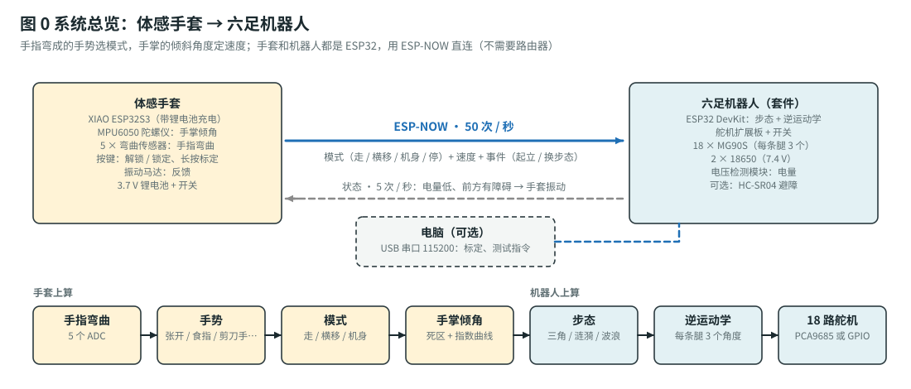
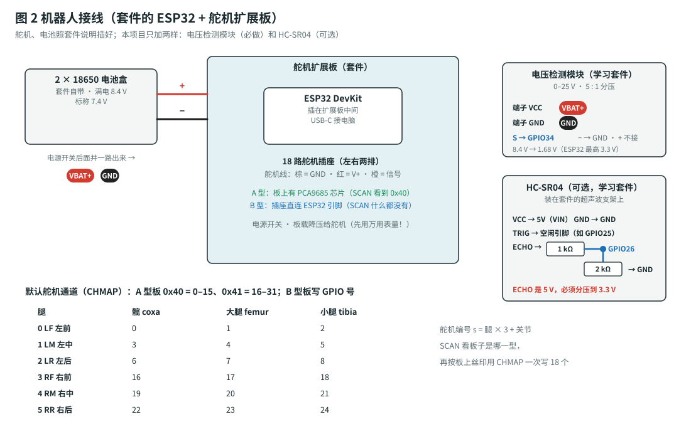
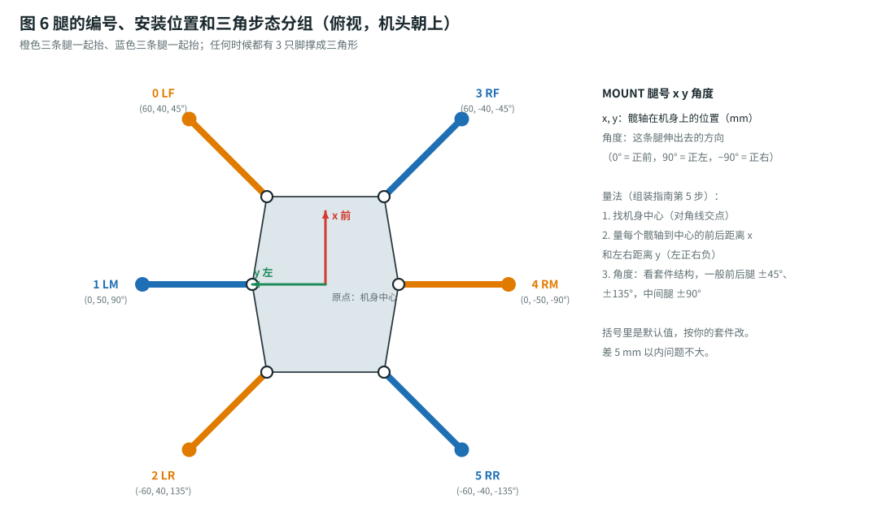
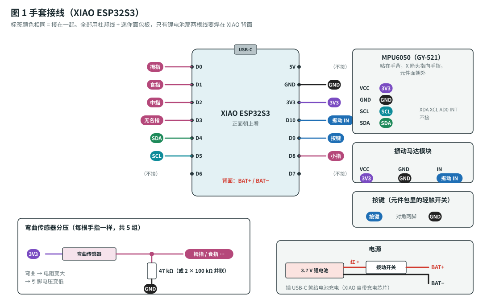
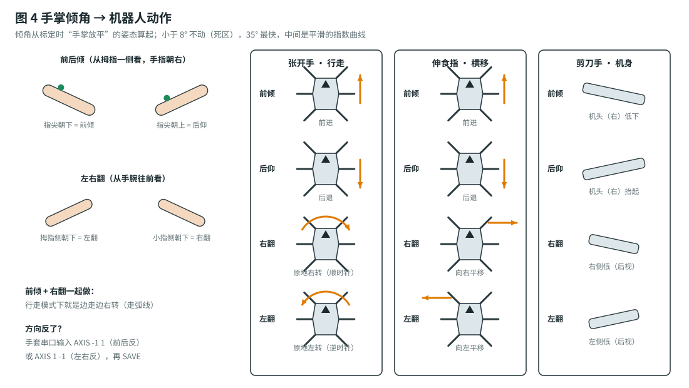

# 体感手套 + 六足机器人：组装指南（接线 · 装腿 · 标定 · 做手套）

> 按顺序做，每一步末尾都有 ✅ **检查点**，通过了再做下一步。⚠️ 是容易出错、或者可能损坏零件 / 伤到人的地方。
> 材料编号（G1、K1、R2 …）对应[总计划的材料清单](build-plan.md#1-材料清单bom)。串口命令的完整说明在 [firmware/README.md](../firmware/README.md)。

## 图例（所有接线图通用）

| 颜色 | 含义 |
|---|---|
| 🟥 红 | 电池正极（机器人 7.4 V / 手套 3.7 V） |
| 🟪 紫 | 3.3 V |
| ⬛ 黑 | GND（地） |
| 🟩 绿 / 青 | I2C（SDA / SCL） |
| 🟦 蓝 | 信号 |
| 🩷 玫红 | 弯曲传感器信号 |

**彩色圆角标签**（例如 `3V3`、`食指`）表示“接到同名的那根线上”。

## 系统总览



- **手套**：XIAO ESP32S3 每秒读 100 次手指和手掌角度，认出手势，每秒 50 次用 ESP-NOW 把“模式 + 速度”发给机器人。
- **机器人**：套件的 ESP32 收到后，用步态算法算出六只脚该在哪，再用逆运动学算出 18 个舵机的角度。
- 机器人每秒 5 次回报电量和障碍，手套用振动告诉你。
- 两边都能插 USB 线到电脑上看状态、输命令（115200 波特率）。

---

## 第 0 步：准备

### 工具

万用表、钢尺或游标卡尺、**直角尺 / 三角板**、套件的小十字螺丝刀、剪刀、针线或布胶。电烙铁只有焊手套电池时用（也可以不焊，见[总计划 1.2](build-plan.md#12-还要买手套)）。

### 软件

1. 安装 **Arduino IDE 2.x**。**文件 → 首选项 → 附加开发板管理器网址**填：
   `https://espressif.github.io/arduino-esp32/package_esp32_index.json`
2. **工具 → 开发板 → 开发板管理器**，搜索 `esp32`，安装 **esp32 by Espressif Systems**（3.x 版）。**不需要装任何库。**
3. 两个程序分别验证：

   | 程序 | 开发板 | 编译结果（约） |
   |---|---|---|
   | `hexapod/firmware/hexapod/hexapod.ino` | **ESP32 Dev Module** | flash 72%，内存 14% |
   | `hexapod/firmware/glove/glove.ino` | **XIAO_ESP32S3** | flash 26%，内存 14% |

4. 串口监视器：**115200**，行尾选“**换行**”。

---

## 第 1 步：认识舵机扩展板



18 个舵机的扩展板有两种做法，固件都支持，但**通道号的意思不一样**：

| | A 型：板上有 PCA9685 | B 型：直连 ESP32 引脚 |
|---|---|---|
| 怎么认 | 板上有一两个 28 脚的小芯片，丝印 `PCA9685`；`SCAN` 看到 `0x40` | 没有这种芯片；插座旁边印着 `IO13`、`D25` 这样的引脚号；`SCAN` 什么都没有 |
| 舵机脉冲 | PCA9685 硬件产生 | ESP32 硬件定时器产生（3 路一组、6 组轮流，每 20 ms 刷新一次） |
| `CHMAP` 填什么 | 0–15 = 0x40 那块的通道，16–31 = 0x41 那块 | ESP32 的 GPIO 号 |

1. **不插舵机、不装电池**。ESP32 插在扩展板上，USB 线连电脑，上传 `hexapod.ino`。
2. 串口看到：

   ```
   servos: PCA9685 at 0x40 and 0x41      ← A 型（或 “(no 0x41)”：只有一块 16 路芯片）
   servos: direct GPIO (CHMAP = GPIO numbers)   ← B 型
   hexapod ready | link 7 | MAC ... | HELP for commands
   ```

3. 输入 `SCAN` 再确认一次。
4. **按腿写通道表**。舵机编号 $s = 3 \times \text{腿} + \text{关节}$，腿 0–5 = 左前、左中、左后、右前、右中、右后，关节 0–2 = 髋、大腿、小腿（图 6）。`CHMAP` 一次写 18 个，顺序就是
   `左前髋 左前大腿 左前小腿  左中髋 … 右后小腿`。

   - A 型、两块芯片：默认值（左边三条腿在 0x40 的 0–8，右边三条在 0x41 的 0–8，即 16–24）。**看板上的丝印**：插座上印的是 `S0`…`S15` 这类编号，按你的实际插法改。
   - A 型、只有一块 16 路芯片：16 路装不下 18 个舵机，说明板上还有别的办法（比如有 2 个舵机直连 GPIO）。**把板子正反面照片发给卖家要接线表**，或者发给我，我帮你改。
   - B 型：例如 `CHMAP 13 12 14 27 26 25 33 32 15 4 16 17 5 18 19 23 2 0`（**这只是例子**，照你板上的丝印写）。

5. `SAVE`，按 ESP32 上的 **EN** 键重启，`SHOW` 看 `CHMAP` 那行对不对。

> ⚠️ B 型板：**GPIO 6–11**（接了 flash）、**1 / 3**（USB 串口）、**34–39**（只能输入）不能接舵机，固件会自动跳过这些引脚。GPIO 0、2、12、15 是启动引脚：接舵机一般没问题，但如果**插着舵机上传失败**，拔掉这几个舵机再上传。

✅ **检查点**：18 个舵机分别接哪个通道 / 引脚，你有一张表（贴在机身上），`SHOW` 里的 `CHMAP` 和它一样。

---

## 第 2 步：电源

### 2.1 量舵机电压

1. 18650 充满，**按电池盒上的 + / − 放**。
2. 电池盒接扩展板的电源输入（照套件说明），打开开关。
3. 万用表直流 20 V 档，量**舵机插座**的 V+（中间那排，红线）和 GND（棕线那排）。

| 读数 | 说明 | 怎么办 |
|---|---|---|
| **4.8–6.2 V** | 扩展板有降压 ✅ | 直接用 |
| 3.3 V 左右 | 量到了逻辑电源排 | 换一排量 |
| **6.5–8.4 V** | 电池直接给了舵机 ⚠️ | MG90S 最高 6 V，长期超压会烧：加 **R2（6 V UBEC）**，见 2.2 |

### 2.2 （只在超压时）加 6 V UBEC

UBEC 的输入接电池（开关后面），输出 6 V 接扩展板的**舵机电源**。很多板子有一个“舵机电源 / 逻辑电源”跳线帽或者单独的舵机电源端子，照卖家的说明接。拿不准就把板子照片发给卖家问：“舵机电源在哪里单独输入？”

### 2.3 电压检测模块（K1，强烈建议）

它让机器人知道电池还剩多少：低了手套会振，过低（< 6.3 V 持续 3 秒）会自己趴下断电，**保护 18650 不过放**。

1. 模块的**输入端子**（蓝色螺丝端子，`VCC` / `GND`）并在**扩展板开关后面**的电池正负极上。开关关掉时模块也没电，不会一直耗电池。
2. 模块的输出排针：`S` → ESP32 **GPIO34**，`−` → ESP32 **GND**，`+` 不接。
3. 分压比 5 : 1：满电 8.4 V → GPIO34 上 1.68 V，远低于 ESP32 的 3.3 V 上限。

> ⚠️ 输入端子**别接反**：模块上印着 `VCC`（接 +）和 `GND`（接 −）。

✅ **检查点**：串口每 5 秒打印 `link -- (0 packets) | 7.95 V`，和万用表量的电池电压差 ≤ 0.2 V。

---

## 第 3 步：舵机回中（装腿之前必须做）

舵机没有“零点”：同一个角度指令，舵盘装偏一个齿就差十几度。所以**先让舵机停在中位，再按规定的姿态装舵盘**。

1. 18 个舵机按第 1 步的表插好：**棕线 = GND、红线 = V+、橙线 = 信号**。
2. 扩展板开关打开，串口输入 `CAL`。所有舵机转到 1500 µs（中位），并**保持有力**。
3. 逐个用手轻轻拧舵机输出轴：应该拧不动。

> ⚠️ 以后**任何时候**要重新装舵盘，都先 `CAL`。
> ⚠️ 舵盘上的中心螺丝会“吃”进塑料齿，最多拆装两三次；套件的舵盘多备几个。

✅ **检查点**：18 个舵机都有力，都停在中位。

---

## 第 4 步：按标定姿态装腿


**标定姿态 = 所有关节 0°**：

- **髋（coxa）**：腿垂直于机身侧边伸出去（前后腿是 45° 斜着出去的，就沿那个斜方向）。
- **大腿（femur）**：**水平**。
- **小腿（tibia）**：**竖直向下**（和大腿成 90°）。

1. 如果套件已经按卖家视频装好了：保持 `CAL`，把 18 个舵盘的中心螺丝拧下，舵盘拔下来。
2. 按套件说明装机身、髋架、大腿、小腿，**装舵盘时保持 `CAL`**，把腿摆成标定姿态再把舵盘插上去。插不进正好的角度时，选最接近的齿（MG90S 输出轴 20 齿，一个齿 $360° / 20 = 18°$，所以最多差 $9°$），差的部分下一步用 `TRIM` 补。
3. 拧紧中心螺丝。
4. 腿要能自由转：髋左右 ±45°、大腿上下 −60° ~ +80°、小腿 ±60° 不碰机身、不碰隔壁的腿。
5. 理线：舵机线顺着腿走，用缠绕管收好，**转弯处留松量**。

> 💡 “腿”编号从机器人**背后往前看**：左手边是 L，右手边是 R（图 6）。别从正面看，左右会反。

✅ **检查点**：`CAL` 状态下六条腿看起来一模一样。

---

## 第 5 步：精细标定和量尺寸



### 5.1 TRIM：把每个关节的 0° 对准

机身架在一个比腿高的盒子上（**脚悬空**），`CAL`。

对每条腿（0–5）：

1. **髋**：从上往下看，腿应该沿安装方向伸出去。偏了就 `TRIM 腿 0 微秒`，比如 `TRIM 3 0 -30`。
2. **大腿**：直角尺的一边贴机身侧板（竖直），看大腿是否水平；或者手机水平仪贴在大腿上。`TRIM 腿 1 微秒`。
3. **小腿**：直角尺比着大腿，看小腿是否和大腿成 90°。`TRIM 腿 2 微秒`。

$11\ \mu\text{s} \approx 1°$（MG90S：$2000\ \mu\text{s}$ 对应 $180°$）。TRIM 是**绝对值**，每次都写总的偏移量，不是累加。

### 5.2 DIR：确认每个舵机的方向

还是 `CAL` 状态，每条腿：

| 命令 | 应该看到 | 反了就 |
|---|---|---|
| `JOINT 腿 0 20` | 腿**逆时针**转 20°（从上往下看） | `DIR 腿 0 -1` |
| `JOINT 腿 1 20` | 大腿**抬起** 20° | `DIR 腿 1 -1` |
| `JOINT 腿 2 20` | 小腿**往外张**（脚尖远离机身） | `DIR 腿 2 -1` |

每条测完输入 `JOINT 腿 关节 0` 回到 0°。左右两边的舵机是镜像装的，所以**一边是 1、另一边是 −1 很正常**。

### 5.3 量尺寸

| 命令 | 量什么（mm） | 默认 |
|---|---|---|
| `GEO L1 L2 L3` | L1：髋轴到大腿轴（水平距离）；L2：大腿轴到膝轴；L3：膝轴到**脚尖**（图 5） | 28 45 75 |
| `MOUNT 腿 x y 角度` | 髋轴在机身上的位置，原点 = 机身中心，x 向前、y 向左（右边的 y 是负数）；角度 = 腿伸出去的方向（图 6） | 见图 6 |

量完 `SAVE`。

> 💡 轴的位置 = 舵机输出轴的中心（舵盘中心螺丝）。量 L3 时量到**脚尖着地的那个点**。

✅ **检查点**：`CAL` 状态下每个关节误差 ≤ 3°；`SHOW` 里的 GEO、MOUNT、TRIM、DIR 都是你调好的值，**重启后还在**。

---

## 第 6 步：第一次站起来

1. 机器人**趴**在地上（机身贴地），腿摆成趴下的样子。
2. `STAND`：先 0.4 秒把腿摆好，再 1.2 秒把机身抬到 `HEIGHT`（默认 55 mm：髋平面离地的高度）。
3. 站好后 `STATUS`：

   ```
   READY gait TRIPOD | cmd 0 0 0 % | height 55 tilt 0 0 | vbat 7.92 V
     LF q    0.0   26.0  -21.0  us 1500 1788 1266
     ...
   ```

   六条腿的角度应该一样（左右 `us` 因为 DIR 不同会镜像）。**出现 `LIMIT`**：说明够不着，把 `REACH`（脚离髋轴的水平距离）或 `HEIGHT` 调小。
4. 走：`WALK 50 0 0`（半速前进 2 秒）、`WALK 0 0 50`（左转）、`WALK 0 -50 0`（右移）。参数：前进 / 左移 / 左转的百分比，最后可以加毫秒数。
5. 调参数（都在站着的时候可以直接改，看效果，满意了 `SAVE`）：

   | 命令 | 作用 | 默认 | 建议范围 |
   |---|---|---|---|
   | `HEIGHT` | 站立高度 | 55 | 40–70 |
   | `REACH` | 脚离髋轴多远：越大越稳，但舵机越吃力 | 75 | 60–85 |
   | `LIFT` | 抬脚高度 | 22 | 15–35 |
   | `STRIDE` | 最大步长（决定最高速度） | 34 | 20–45 |

6. `SIT`：停下、慢慢趴下、舵机断电。

✅ **检查点**：前后左右、转弯都能走，松开（2 秒到了）自己停，六只脚回到原位站稳。**机器人部分完成。**

---

## 第 7 步：手套电路



### 7.1 先在大面包板上试

1. XIAO 插在学习套件的大面包板上（USB-C 朝外）。
2. **5 组弯曲传感器分压**：每根手指一样——`3V3` → 弯曲传感器一只脚；另一只脚 → XIAO 的引脚（拇指 D0、食指 D1、中指 D2、无名指 D3、小指 **D8**）；同一点再接 47 kΩ 到 `GND`。
   - 弯曲传感器的两只脚是 2.54 mm 间距，**直接插母头杜邦线**，不用焊。
   - 没买 47 kΩ：两个 100 kΩ 并联（= 50 kΩ）。
   - 读数跳：在 47 kΩ 上再并一个 104 瓷片电容（K7）。
3. **MPU6050**：VCC → 3V3，GND → GND，SCL → **D5**，SDA → **D4**。其余脚不接。
4. **按键**：对角两只脚，一只 → D9，一只 → GND。
5. **振动马达模块**：VCC → 3V3，GND → GND，IN → **D10**。

> ⚠️ **只能用图上的引脚**：弯曲传感器必须接 ESP32-S3 的 **ADC1**（D0–D3、D8–D10），无线开着的时候 ADC2 不能用。
> ⚠️ MPU6050 的 VCC 接 **3V3**，不要接 5V。

### 7.2 测试

1. USB 连电脑，上传 `glove.ino`（开发板 **XIAO_ESP32S3**）。串口：`glove ready | link 7 | MPU6050 ok`，振动马达振一下（振 5 下 = MPU6050 没找到）。
2. 输入 `SHOW`，每 0.2 秒一行：

   ```
   raw 2410 2388 2402 2375 2420 | bend 0.01 ... | OPEN    | pitch  1.2 roll -0.8 | x 0 ...
   ```

   逐个弯传感器：对应的 `raw` 应该**变小 300 以上**。倾斜面包板，`pitch`（前后）和 `roll`（左右）跟着变。
3. 再输入 `SHOW` 关掉。

### 7.3 搬到手背上：迷你面包板

1. 电路确认无误后，照同样的接法搬到 **SYB-170 迷你面包板**上，线尽量剪短、贴平。
2. **电池**（G6）：
   - 焊：电池红线 → 拨动开关（G7）中间脚；开关一侧脚 → XIAO 背面 **BAT+**；电池黑线 → **BAT−**。焊盘很小，先给焊盘上锡，再把镀好锡的线头贴上去点一下。
   - 不焊：口红充电宝 + 短 USB-C 线，插在 XIAO 上。
3. 插着 USB-C 时 XIAO 会给电池充电（充电时 XIAO 旁边的红灯亮，充满灭）。

> ⚠️ 锂电池红黑线**绝对不能碰在一起**：先剪一根、剥一根、焊一根，再弄另一根。焊好用热缩管或胶布包住。

### 7.4 （没买振动模块时）用三极管自己搭

元件包里的 PN2222：D10 → 1 kΩ → 基极；发射极 → GND；集电极 → 马达负极；马达正极 → 3V3；二极管（1N4148 / 1N4007）反并在马达两端（白条那头接 3V3）。

✅ **检查点**：拔掉 USB、打开开关，XIAO 能工作（灯闪，`SHOW` 用 USB 插回去看）；5 根手指、倾角都正常。

---

## 第 8 步：把传感器装到手套上

1. **弯曲传感器装在手指背面**，**印字 / 条纹的一面朝外**（朝向弯曲的外侧，这样读数变化最大）。
2. **根部固定、指尖能滑动**：传感器的针脚那头缝 / 粘在手背指根处；手指上缝两三个小布环（或用热缩管剪一段粘在手套上当“隧道”），传感器从里面穿过去。弯手指时传感器会被拉长一点，**指尖那头一定要能滑**，否则会折断。
3. 针脚处用**热缩管**包住，杜邦线从这里顺着手背走到面包板，用针线或布胶固定几处。
4. **迷你面包板 + MPU6050** 用魔术贴绑在**手背中间**。MPU6050 的 **X 箭头指向手指**、元件面朝外（图 1）。装歪一点没关系，标定会把“平放”的姿态记下来。
5. 电池和开关绑在手腕内侧（或手背面包板旁边）。按键放在拇指能按到的地方（比如食指侧面）。

> ⚠️ 弯曲传感器**最怕根部反复折**：根部（针脚上方约 5 mm）一定要用热缩管或胶加固。

✅ **检查点**：戴上手套，手指来回弯 20 次，`SHOW` 的读数稳定、不断线。

---

## 第 9 步：标定手套、和机器人配对

### 9.1 标定（每次换人、重新缝过传感器后都要做）

1. 戴好手套，**长按按键 2 秒** → 长振一下，灯快闪。
2. **手张开、手指并拢伸直、手掌放平**（手背朝上，像按在桌上一样），保持不动 → 约 3.5 秒后**振两下**。这个姿态就是“中立”：以后倾角都从这里算。
3. **握拳**（握紧），保持 → 约 3.5 秒后**长振一下 = 保存成功**；**振三下 = 失败**（某根手指变化太小），串口会打印是哪根，检查后重来。

### 9.2 配对

两边默认链路号都是 7，**不用配对**。家里有好几套时：手套串口 `LINK 12`、`SAVE`；机器人串口 `LINK 12`、`SAVE`。

### 9.3 第一次用手套开

1. 机器人趴着、开机；手套开机。
2. 短按按键 → 振一下 = **解锁**（灯常亮）；再短按 = 锁定（振两下，灯慢闪）。
3. **竖大拇指 1 秒** → 机器人站起来。
4. 张开手，**慢慢**前倾 → 前进。**方向不对**：手套串口 `AXIS -1 1`（前后反了）或 `AXIS 1 -1`（左右反了），`SAVE`。
5. 灵敏度：`DEAD 10`（死区加大，不容易误动）、`FULL 30`（倾斜少一点就到最快），`SAVE`。



✅ **检查点**：完成[总计划阶段 9](build-plan.md#阶段-9手套--机器人联调1-天) 的全部测试。
