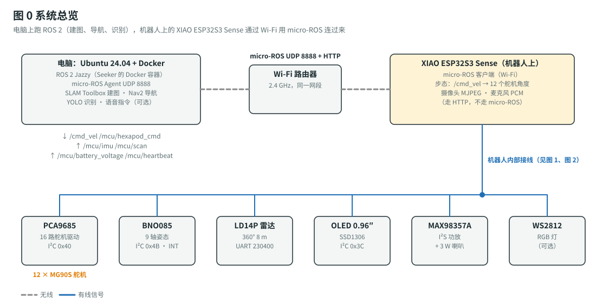
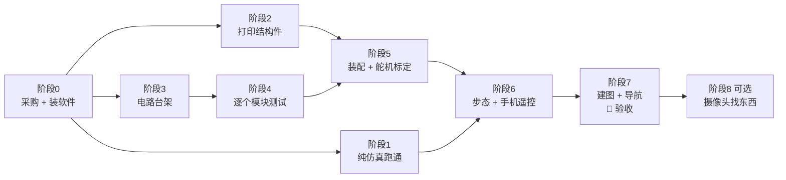

# ROS 2 六足机器人（XIAO ESP32S3 Plus）：总计划 + 材料清单

> **最终目标（验收标准）**：电脑上跑 ROS 2 Jazzy，六足机器人通过 Wi-Fi 连上来。
> 1. 用键盘（`teleop_twist_keyboard`）遥控它**前进、后退、左右平移、原地转圈**，连续走 3 m 不摔倒；
> 2. RViz 里能看到 `/mcu/scan`（雷达）和 `/mcu/imu`（姿态），用 SLAM Toolbox **建出房间地图**；
> 3. 在地图上点一个目标点，Nav2 让它**自己走过去**（误差 ≤ 30 cm）；
> 4. 可选：加一块摄像头卫星板，对它说 / 输入 “find teddy bear”，它会在房间里找泰迪熊。
>
> 这份计划是总入口，其他文档分工如下：
> - 开源项目调研和选型：[`project-research.md`](project-research.md)
> - **接线、焊接、机械装配、舵机标定**：[`wiring-guide.md`](wiring-guide.md)
> - **电脑软件安装、烧录、逐项测试**：[`software-setup.md`](software-setup.md)
> - **所有网站 / 下载链接汇总**：[`links.md`](links.md)
> - 3D 打印件：[`../cad/README.md`](../cad/README.md)

---

## 0. 用的是哪个开源项目

**[SeekerRobot/seeker-robot](https://github.com/SeekerRobot/seeker-robot)**（Apache-2.0）——目前 GitHub 上**唯一一个完整的、用 Seeed XIAO ESP32S3 Sense 做主控的 ROS 2 机器人**：

| 部分 | 内容 |
|---|---|
| 机器人 | 六足（hexapod），每条腿 2 个舵机（髋 hip 左右摆 + 膝 knee 上下抬），共 12 个 MG90S |
| 主控 | 原项目用 Seeed Studio **XIAO ESP32S3 Sense**；**你的 XIAO ESP32S3 Plus 可以直接替换**（D0–D10 引脚、8 MB PSRAM 完全一样，见 [`software-setup.md` §4.1](software-setup.md#41-用-xiao-esp32s3-plus-做主板)），跑 **micro-ROS**，Wi-Fi（UDP 8888）连到电脑 |
| 电脑端 | **ROS 2 Jazzy**（Docker 容器）：SLAM Toolbox 建图、Nav2 导航、EKF 姿态融合、YOLO 找东西、语音指令 |
| 传感器 | BNO085 姿态（IMU）、LDROBOT LD14P 360° 激光雷达、OV2640 摄像头、PDM 麦克风 |
| 仿真 | Gazebo Harmonic，**不接硬件也能先跑** |

它缺两样东西，这个文件夹补上了：

| 原项目缺的 | 这里怎么补 |
|---|---|
| 没有公开**机身结构件**（只写了 “Sesame-based hexapod”） | [`../cad/`](../cad/README.md)：按它固件里的腿长和安装位置，画了一套可打印的底板、甲板、大腿、小腿（OpenSCAD 参数化） |
| 电路是**自己画的贴片 PCB**（Sesame V2），没有成品卖，BOM 里立创编号是空的 | 用**现成模块 + 洞洞板**搭出**同样的电路**（引脚和原版 PCB 的网表逐根核对过，固件一行不用改），见 [`wiring-guide.md`](wiring-guide.md)。想做原版 PCB 的做法也写了 |

---

## 1. 全局路线图

| 阶段 | 内容 | 预计耗时（业余时间） | 出口条件 |
|---|---|---|---|
| 0 | 采购、装 Ubuntu / Docker、下载 Seeker | 1–2 周（主要等快递） | 物料到齐，`docker compose build` 成功 |
| 1 | 不接硬件，Gazebo 里遥控仿真六足 | 1 天 | `sim_teleop` 里能用键盘走 |
| 2 | 打印 1 块底板、1 块甲板、6 个大腿、6 个小腿 | 1–2 天 | 舵机塞进方孔松紧合适 |
| 3 | 面包板接线（或洞洞板焊接），电源链路调好 | 1–2 天 | 5V_SV = 5.0–5.2 V，XIAO 能上电 |
| 4 | 按顺序刷测试固件：闪灯 → Wi-Fi → 心跳 → IMU → 雷达 → 舵机 | 1–2 天 | 每项的 “期望结果” 都对 |
| 5 | 机械装配，12 个舵机逐个标定 | 1–2 天 | `neutral` 站姿六条腿对称，机身水平 |
| 6 | `test_sub_gait` 串口步态 → 手机网页遥控 | 1–3 天 | 走 3 m 不摔 |
| 7 | 刷 `main` 固件，SLAM 建图、Nav2 导航 | 1–3 天 | **最终验收通过** |
| 8（可选） | 第二块板当摄像头，YOLO 找东西 | 1–2 天 | `find teddy_bear` 能找到 |

总计大约 **4–7 周**。

---

## 2. 材料清单（BOM）

**完整的逐条清单（型号、规格参数、数量、价格、淘宝搜索词、注意事项）在 [`bom.md`](bom.md)**。原则是能买现成模块就买模块，尽量少焊接。这里只列最关键的几样：

| 部分 | 选什么 | 为什么 |
|---|---|---|
| 主控 | **XIAO ESP32S3 Plus**（已有） | D0–D10 和原项目的 Sense 完全一样，固件不用改 |
| 舵机 | **MG90S 金属齿 180°** × 14（12 + 2 备用） | 金属齿扛得住；一定要 180° 版 |
| 舵机驱动 | **PCA9685 16 路模块** | 现成模块，I²C 两根线控制 16 个舵机 |
| 姿态 | **BNO085 九轴模块** | 芯片内部直接算好姿态，固件原生支持 |
| 雷达 | **乐动 LD14P**（带转接板套装） | 固件原生支持，360° 8 m |
| 电池 | **3S 11.1 V 1300 mAh XT30** × 2 | 和原项目固件的电量报警一致 |
| 5 V 电源 | **12 V 转 5 V 5 A 灌胶降压模块**（固定输出） | 不用调电压，拿到就能用；12 个舵机峰值要 4–5 A |
| 电池检测 | **0–25 V 电压检测模块**（学习套件里有） | 现成分压小板，免得自己搭电阻 |
| 连接 | **学习套件的面包板 + 杜邦线**（免焊），跑通后可换洞洞板 | 只有电源线和 1 个二极管需要焊 |
| 控制 | **手机浏览器**（Wi-Fi） | 不用买手柄，见 [`phone-control.md`](phone-control.md) |
| 结构 | 本仓库 3D 打印件 + M3 铜柱 + M2 自攻螺丝 | 见 [`../cad/README.md`](../cad/README.md) |

### 2.1 预算合计

| 类别 | 约 |
|---|---|
| 电子模块（A2–A5；主控、电压检测模块已有） | ¥380–590 |
| 电源（B1–B9，含 2 块电池和充电器；二极管用元件包的） | ¥165–360 |
| 连接线材（C5 电源线、C7 热缩管；面包板、杜邦线、排针、电阻用套件的） | ¥15–20 |
| 结构件（D1–D8） | ¥50–135 |
| **合计（不含已有的主控和两个套件、可选项、电脑、工具）** | **约 ¥600–1110** |
| 可选：OLED、功放、摄像头板等 | + ¥60–175 |

## 3. 设计校核（为什么这样选）

### 3.1 整机重量

| 部分 | 重量 |
|---|---|
| 12 × MG90S（13.4 g / 个） | 161 g |
| LD14P 雷达 | ≈ 100 g |
| 3S 1300 mAh 电池 | ≈ 105 g |
| 打印件（PETG） | ≈ 120 g |
| 电子模块 + 洞洞板 + 线 | ≈ 45 g |
| 螺丝、铜柱 | ≈ 20 g |
| **合计** $m$ | **≈ 0.55 kg** |

### 3.2 膝舵机扭矩够不够

三角步态（tripod gait）任何时候都有 3 条腿着地。每条支撑腿分到的力：

$$
F = \frac{m\,g}{3} = \frac{0.55 \times 9.81}{3} \approx 1.8\ \text{N}
$$

膝舵机要扛的力矩 = 力 × 脚尖到膝轴的**水平距离**。小腿长 $L_2 = 65\ \text{mm}$，膝角 $\theta_k$（0° = 小腿水平，90° = 竖直向下）：

$$
\tau_{\text{knee}} = F \cdot L_2 \cos\theta_k
$$

| 站立膝角 $\theta_k$ | 力臂 $L_2\cos\theta_k$ | 力矩 $\tau_{\text{knee}}$ | MG90S 堵转 1.8 kg·cm（4.8 V）的倍数 |
|---|---|---|---|
| 45° | 46 mm | 0.083 N·m ≈ **0.85 kg·cm** | 2.1 × |
| **60°（推荐）** | 32.5 mm | 0.059 N·m ≈ **0.60 kg·cm** | **3.0 ×** |

所以固件里的站立膝角 `kNeutralKnee` 建议从默认 45° 改成 **60°**（软件文档 §4 有一行命令），站得更高、舵机更轻松。

### 3.3 电流和续航

走路时每个舵机平均约 0.15–0.25 A，峰值（12 个同时起步）可以到 4–5 A，所以降压模块要**持续 ≥ 5 A**。平均功率：

$$
P \approx 5.1\ \text{V} \times \big(\underbrace{2.5}_{\text{舵机}} + \underbrace{0.3}_{\text{雷达}} + \underbrace{0.25}_{\text{XIAO}}\big)\ \text{A} \approx 15.6\ \text{W}
$$

3S 1300 mAh 电池的能量 $E = 11.1\ \text{V} \times 1.3\ \text{Ah} = 14.4\ \text{Wh}$，降压效率 $\eta \approx 0.85$，只用到 80 % 电量：

$$
t \approx \frac{E \cdot \eta \cdot 0.8}{P} = \frac{14.4 \times 0.85 \times 0.8}{15.6} \approx 0.63\ \text{h} \approx 38\ \text{min}
$$

建议买 **2 块电池**轮换。

### 3.4 电池电压检测

电池电压经过**现成的 0–25 V 电压检测模块**（内部 30 kΩ / 7.5 kΩ 分压）接到 XIAO 的 D3：

$$
V_{D3} = V_{\text{IN}} \times \frac{7.5}{30 + 7.5} = 0.2\,V_{\text{IN}}
$$

3S 充满 $12.6\ \text{V}$ 时 $V_{D3} = 2.52\ \text{V}$，低于 ESP32-S3 ADC 的上限（约 3.1 V），安全。原版 PCB 用的是 100 kΩ / 22 kΩ（比例 0.18），自己搭电阻也行。原项目 `main` 固件的标定点就是按 3S 写的（2432 ↔ 11.52 V、2648 ↔ 12.62 V），但每块板的 ADC 有偏差，要按你的实测重新填（软件文档 §7.8）。

### 3.5 相邻两条腿会不会撞

大腿 45 mm + 小腿 65 mm，前腿和中腿的髋轴只隔 60 mm。按腿的实际宽度（膝舵机 + 小腿，约 25 mm）算，**髋关节摆角超过 ±25° 时相邻两条腿会碰到**。所以固件里的髋关节限位 `kHipMin / kHipMax` 要从 ±60° 改成 **±25°**（软件文档 §4）。±25° 时一步最远：

$$
s_{\max} \approx 2\,(L_1 + L_2\cos\theta_k)\sin 25^\circ \approx 2 \times 77.5 \times 0.42 \approx 65\ \text{mm}
$$

对 20 cm 长的机器人足够了。

---

## 4. 分阶段步骤

每一步的**具体操作**在对应文档里，这里只列顺序和检查点。

### 阶段 0：采购 + 装软件

1. 按第 2 节下单。**舵机、雷达、XIAO** 到货最慢，先买。
2. 电脑装 Ubuntu 24.04、Git + Git LFS、Docker、VS Code → [`software-setup.md` §1–2](software-setup.md#1-电脑准备)。
3. 下载 Seeker 仓库、复制配置文件 → [`software-setup.md` §3](software-setup.md#3-下载-seeker-并填配置)。
4. 按这里的机身改 4 个固件参数 → [`software-setup.md` §4](software-setup.md#4-按本仓库的机身改固件参数)。

- [ ] `docker compose build` 成功，`docker compose exec ros2 bash` 能进容器

### 阶段 1：纯仿真跑通（不需要任何硬件）

1. 容器里 `colcon build` → [`software-setup.md` §5](software-setup.md#5-构建-docker-容器和-ros-2-工作空间)。
2. `ros2 launch seeker_gazebo sim_teleop.launch.py`，另开终端 `teleop_twist_keyboard` → [`software-setup.md` §6](software-setup.md#6-先在仿真里跑通不接硬件)。

- [ ] Gazebo 里的六足能被键盘遥控走动

### 阶段 2：打印结构件

1. **先量舵机**，改 [`cad/params.scad`](../cad/params.scad)，导出 STL → [`cad/README.md`](../cad/README.md)。
2. 先打 1 个大腿试装，舵机能塞进方孔、舵机臂能压进凹槽，再打全套。

- [ ] 1 块底板、1 块甲板、3 个大腿 A、3 个大腿 B、6 个小腿

### 阶段 3：电路台架（先不装到机身上）

1. 降压模块**单独**通电，调到 5.1 V → [`wiring-guide.md` §2](wiring-guide.md#2-电源接线)。
2. 焊洞洞板：XIAO 排母、1N5819、分压电阻、OE 上拉、BNO085、I²C 线 → [`wiring-guide.md` §3–5](wiring-guide.md#3-信号接线)。
3. 通电检查清单 → [`wiring-guide.md` §7](wiring-guide.md#7-第一次通电检查清单)。

- [ ] 5V_SV = 5.0–5.2 V；D3 电压 = 电池电压 × 0.2；XIAO 插电脑能识别

### 阶段 4：逐个模块测试（按顺序，前一步不过不要往下）

刷测试固件的具体命令见 [`software-setup.md` §7](software-setup.md#7-烧录和逐项测试)：

| 顺序 | 固件 | 期望结果 |
|---|---|---|
| 1 | `test_threaded_blink` | 板载灯闪 |
| 2 | `test_sub_wifi` | 串口打印 `WiFi: CONNECTED` 和 IP |
| 3 | `test_sub_heartbeat` | 电脑 `ros2 topic echo /mcu/heartbeat` 每秒加 1 |
| 4 | `test_sub_gyro_nondma` | BNO085 初始化成功，转动时四元数变化 |
| 5 | `test_sub_lidar` | 每圈约 720 个点、约 6 Hz |
| 6 | `test_sub_battery` | 读数和万用表差 ≤ 0.1 V（标定后） |
| 7 | `test_sub_servo` | 12 个通道逐个能转 |

### 阶段 5：机械装配 + 舵机标定

1. **舵机先回中再装舵机臂**（极其重要）→ [`wiring-guide.md` §6.2](wiring-guide.md#62-舵机回中装舵机臂之前必须做)。
2. 装髋舵机、大腿、膝舵机、小腿、铜柱、甲板、电池 → [`wiring-guide.md` §6](wiring-guide.md#6-机械装配)。
3. 用 `test_sub_servo` 逐个标定 12 个舵机的 `min_pwm / max_pwm / inverted` → [`software-setup.md` §7.7](software-setup.md#77-舵机标定最花时间的一步)。

- [ ] `test_sub_gait` 里 `neutral`：六条腿对称，机身水平，离地约 70 mm

### 阶段 6：步态 + 手机遥控

1. `test_sub_gait`：`neutral` → `start` → `vel 0.03` → `halt`。
2. 刷 `test_bridge_gait`，电脑上启动 `seeker_web`，**手机浏览器打开 `http://电脑IP:8080`**，用触屏摇杆遥控 → [`phone-control.md`](phone-control.md)。键盘备用：`teleop_twist_keyboard`。

- [ ] 连续走 3 m 不摔，能原地转

### 阶段 7：建图 + 导航（验收）

1. 刷 `main` 固件（`esp32s3sense_offload` 环境：步态 + 雷达 + IMU + 麦克风 + 喇叭）。
2. `real_slam_ekf.launch.py` 建图 → 保存地图 → `real_ball_search.launch.py` 或 Nav2 点目标。

- [ ] **最终验收：第 0 节的第 1–3 条全部通过**

### 阶段 8（可选）：摄像头找东西

1. 一块 XIAO ESP32S3 Sense 刷 `main_satellite` 的 `esp32s3sense_satellite` 环境（或 ESP32-CAM 刷 `esp32cam_satellite`），绑在甲板前面的竖板上。
2. `real_object_seek.launch.py`，然后 `ros2 run seeker_navigation find teddy_bear`。

---

## 5. 故障排查

| 现象 | 最可能的原因 | 怎么查 / 怎么修 |
|---|---|---|
| XIAO 插电脑没反应 / 刷不进去 | 线是充电线；或者板子进不了下载模式 | 换数据线；按住 **B（BOOT）** 键再插 USB，松开后再刷 |
| 串口一直打 `WiFi: CONNECTING` | 5 GHz Wi-Fi；密码错；信号差 | 用 **2.4 GHz**；检查 `network_config.ini`；RSSI < −75 dBm 就靠近路由器 |
| Wi-Fi 连上了但 micro-ROS 一直不连 | `agent_ip` 不是电脑 IP；Agent 没开；防火墙 | 先开 `micro_ros_agent udp4 --port 8888`；`ip addr` 看电脑 IP；`sudo ufw allow 8888/udp` |
| `BNO08x not detected` | 地址不对（0x4A / 0x4B）；SDA / SCL 接反 | 刷 I²C 扫描确认地址；Adafruit 板 DI 接 3V3 = 0x4B，或改固件 `gyro_addr` |
| 雷达不转 / 没数据 | TX / RX 接反；5 V 不够 | 雷达 **TX → XIAO D7**，雷达 **RX ← XIAO D6**；量雷达 5V 脚 |
| 舵机一动 XIAO 就重启 | 5 V 电源掉压；地线太细 | 降压模块换 ≥ 5 A；电源线用 20 AWG；PCA9685 V+ 旁并 1000 µF |
| 舵机不动但 PCA9685 有反应 | 没 `arm`；OE 脚一直是高电平 | `test_sub_servo` 里先 `arm`；查 D0 → OE 的线 |
| 某条腿方向反了 | 舵机装反 | 该舵机的 `inverted` 改成相反值 |
| 走路时两条腿打架 | 髋关节限位太大 | `kHipMin / kHipMax` 改 ±25°（§3.5） |
| 站起来就趴下 / 舵机发烫 | 膝角太小（腿太平），扭矩不够 | `kNeutralKnee` 改 60°；检查电池电压 |
| 改了 `HexapodConfig.h` 没生效 | 旧参数存在闪存（NVS）里 | `pio run -e esp32s3sense_offload -t erase` 后重新刷 |
| RViz 里地图是歪的 / 墙会动 | 没开 EKF；IMU 方向装错 | 用 `real_slam_ekf`；BNO085 的 X 箭头朝机头、芯片面朝上 |

---

## 6. 安全规则

1. **锂电池**：不过充（3S 充满 12.6 V）、不过放（每节不低于 3.3 V，即整包 ≥ 9.9 V，接 BB 响报警器）、不在无人时充电、鼓包立刻停用。
2. **先量降压再接负载**：降压模块单独通电，万用表确认输出 5.0–5.2 V 再接 XIAO 和舵机。用可调模块时更要注意，出厂输出可能是 12 V 以上。
3. **不要同时插 USB 和开电池开关调试舵机**：1N5819 能防倒灌，但舵机的大电流不能走 USB。刷固件时建议**关掉电池开关**。
4. 舵机标定时**不要装舵机臂**，确认角度对了再装；第一次 `arm` 时手离开腿。
5. 雷达是 Class 1 激光，正常使用安全，但不要长时间盯着看。
