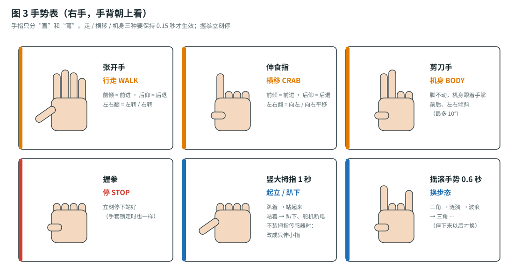

# 体感手套控制六足机器人：总计划

> 📋 本文：**材料清单 + 分阶段步骤 + 验收标准 + 故障排查 + 安全规则**
> 🔌 接线、装腿、标定、做手套的详细方法：[组装指南](assembly-guide.md)
> 🧮 手势识别、倾角、步态、逆运动学的原理和公式：[手势与步态原理](gait-and-gestures.md)
> 🔧 两个固件、所有串口命令、参数：[firmware/README.md](../firmware/README.md)

## 做成以后是什么样

戴上手套，**手势选动作，手掌倾斜的角度决定快慢**：

| 手势 | 机器人 | 手掌怎么动 |
|---|---|---|
| ✋ **张开手** | **行走** | 往前倾（指尖朝下）= 前进，往后仰 = 后退；往右翻（小指朝下）= 右转，往左翻 = 左转 |
| ☝️ **只伸食指** | **横移**（螃蟹步） | 前倾 / 后仰 = 前进 / 后退；右翻 / 左翻 = 向右 / 向左平移 |
| ✌️ **剪刀手** | **机身模式** | 六只脚不动，机身跟着手掌前后左右倾斜（跳舞、“点头”） |
| ✊ **握拳** | **立刻停下**，站稳 | — |
| 👍 **竖大拇指 1 秒** | **起立 / 趴下**（趴下后舵机断电） | — |
| 🤘 **摇滚手势 0.6 秒** | **换步态**：三角 → 涟漪 → 波浪 | — |

手套上有一个**按键**：短按 = 解锁 / 锁定（锁定时机器人不理手势，只站着），长按 2 秒 = 标定。每次手势切换、起立、低电量，手套都会**振动**提示。

三种步态：

| 步态 | 同时抬几条腿 | 着地脚数 | 最高速度（默认参数） | 适合 |
|---|---|---|---|---|
| **三角 TRIPOD** | 3 | 3 | 约 75 mm/s | 平地，快 |
| **涟漪 RIPPLE** | 2 | 4 | 约 43 mm/s | 稍不平的地面 |
| **波浪 WAVE** | 1 | 5 | 约 20 mm/s | 最稳，爬坡、地毯 |

## 最终目标（验收标准）

1. **行走**：张开手前倾，机器人直线走 1 m，左右偏差 ≤ 15 cm；右翻手掌，原地转一整圈（360°）。
2. **横移**：伸食指右翻，机器人向右平移 30 cm，机头方向基本不变（≤ 20°）。
3. **机身模式**：剪刀手，机身能跟着手掌前后、左右倾斜（约 ±10°），脚不打滑。
4. **起立 / 趴下 / 换步态**：竖大拇指 1 秒起立、再 1 秒趴下；摇滚手势换到波浪步态并能走。
5. **安全**（阶段 9 的测试全部通过）：
   - 握拳 → 立刻开始减速，0.5 秒内停下；
   - 按键锁定 → 机器人不动；
   - **手套关机 / 走出信号范围** → 机器人 0.3 秒后开始减速、1 秒内停稳，手套振动报警；
   - 电池低 → 手套振动；电池过低 → 机器人自己趴下、断舵机电。

## 硬件方案（为什么这样选）

| 部分 | 方案 | 理由 |
|---|---|---|
| 机器人主控 | **套件自带的 ESP32 DevKit + 舵机扩展板** | 不换板；ESP32 算步态和逆运动学绰绰有余（固件约占 72% flash） |
| 舵机驱动 | 两种扩展板都支持：**A 型**板上有 PCA9685 芯片（I2C）；**B 型**舵机插座直连 ESP32 引脚（固件用硬件定时器同时产生 18 路脉冲） | 还不知道你的板子是哪一型，上电后用 `SCAN` 命令一查就知道 |
| 手套主控 | **Seeed XIAO ESP32S3** | 拇指大小，**自带锂电池充电**，有足够的模拟输入（ADC1）给 5 根弯曲传感器 |
| 无线 | **ESP-NOW**（ESP32 之间直连） | 不需要路由器、不需要配对，延迟约 1–2 ms，距离室内 20 m 以上 |
| 手掌角度 | **MPU6050**（GY-521） | 最常见、最便宜；互补滤波算俯仰和横滚 |
| 手指 | **5 根弯曲传感器**（Flex Sensor 2.2 寸） | 每根手指一根；**先买 4 根也行**（不装拇指，起立改成“只伸小指”） |

> 💡 两个 ESP32 之间用 **ESP-NOW 广播 + 链路号（`LINK`，默认 7）**。家里有第二套一样的手套时，把两边的链路号改成别的数字就不会串台。

---

## 1. 材料清单（BOM）

价格是 2026 年淘宝常见价，仅供参考；“搜索关键词”可以直接复制到淘宝或拼多多。

### 1.1 已经有的（不用买）

**六足机器人套件（标准版）**：到货后对照下表点一遍。

| 零件 | 数量 | 用在哪 |
|---|---|---|
| **ESP32 DevKit**（Type-C 口） | 1 | 机器人主控：插在舵机扩展板上 |
| **舵机扩展板**（带电源开关、18 路以上舵机插座） | 1 | 给舵机供电和信号 |
| **MG90S** 金属齿小舵机 | 18 | 每条腿 3 个：髋（coxa）、大腿（femur）、小腿（tibia） |
| 2 节 18650 电池 + USB 充电座 | 1 套 | 机器人电源（7.4 V） |
| 电池盒 | 1 | 装 18650 |
| 机身上下板、6 套腿（髋架 / 大腿 / 小腿）、支架 | 1 套 | 结构 |
| 超声波支架（“眼睛”那块） | 1 | 可选：装 HC-SR04 |
| 螺丝刀、USB 线、缠绕管、螺丝包 | 1 套 | — |

**Arduino 学习套件（顶配豪华版）+ 电子元件包**：里面用得上的零件如下，其余这次用不到。

| 编号 | 零件 | 从哪来 | 数量 | 用在哪 |
|---|---|---|---|---|
| K1 | **电压检测模块**（0–25 V，蓝色小板，`S` `+` `−` 三针） | 学习套件 | 1 | 机器人测电池电压 → GPIO34（**强烈建议装**：没它就没有低电量保护） |
| K2 | **HC-SR04** 超声波模块 | 学习套件 | 1 | 可选：前方有障碍自动不让往前走 |
| K3 | 杜邦线（公对母、母对母、公对公） | 学习套件 | 约 30 根 | 手套和机器人的连线 |
| K4 | **轻触按键** | 元件包 | 1 | 手套上的按键 |
| K5 | 电阻 **100 kΩ**（两个并联 = 50 kΩ，可以代替 47 kΩ） | 元件包 | 10 | 弯曲传感器分压（没买 47 kΩ 时用） |
| K6 | 电阻 **1 kΩ、2 kΩ** 各 1 | 元件包 | 2 | HC-SR04 的 ECHO 分压（5 V → 3.3 V） |
| K7 | 瓷片电容 **104**（100 nF） | 元件包 | 5 | 可选：并在 47 kΩ 上，弯曲传感器读数更稳 |
| K8 | 面包板、排针 | 学习套件 / 元件包 | — | 先在大面包板上试手套电路 |
| K9 | PN2222 三极管 + 二极管 + 1 kΩ | 元件包 | 各 1 | **只在没买振动马达模块时**：自己搭驱动（见组装指南 7.4） |

> ⚠️ 学习套件里有 MPU6050（GY-521）的话就不用买 G2。套件里的 Arduino Uno、Sensor Shield、ESP8266 这次**用不上**：手套需要 ESP32 才能和机器人用 ESP-NOW 直连，还要 5 路模拟输入。

### 1.2 还要买：手套

| 编号 | 名称 | 规格 / 型号 | 数量 | 用途 | 搜索关键词 | 约价（元） |
|---|---|---|---|---|---|---|
| G1 | **XIAO ESP32S3** | Seeed Studio 原厂，**排针已焊**（下单备注“焊好排针”），带天线 | 1 | 手套主控 + 锂电池充电 | `XIAO ESP32S3 焊排针` | 40–55 |
| G2 | **MPU6050 模块** | **GY-521**，排针已焊 | 1 | 测手掌倾角 | `GY-521 MPU6050 焊好排针` | 6–10 |
| G3 | **弯曲传感器** | **2.2 寸**（约 56 mm 有效长度），平直约 25 kΩ、弯 90° 约 60–100 kΩ；**4.5 寸太长**，别买错 | 5（最少 4） | 测手指弯曲 | `弯曲传感器 2.2寸 flex sensor` | 50–125 |
| G4 | 电阻 | **47 kΩ** 1/4 W（没有就用 K5：两个 100 kΩ 并联） | 5 | 弯曲传感器分压 | `47K 电阻` | 1 |
| G5 | **迷你面包板** | **SYB-170**（170 孔，约 45 × 35 mm，背面带胶） | 1 | 手背上的“电路板”，**不用焊** | `SYB-170 迷你面包板` | 2–4 |
| G6 | **锂电池** | 3.7 V **400–500 mAh**（如 502535），**带保护板**，引出红黑线 | 1 | 手套电源（约 5–6 小时） | `502535 锂电池 3.7V 带保护板` | 10–15 |
| G7 | 拨动开关 | **SS12D00**（3 脚，2.54 mm，能插面包板） | 1 | 手套电源开关 | `SS12D00 拨动开关` | 1 |
| G8 | **振动马达模块** | 3 脚（VCC GND IN），3.3 V 能驱动 | 1 | 手套振动反馈 | `振动马达模块 3.3V` | 3–6 |
| G9 | 手套 | 薄款弹力手套 / 骑行全指手套，**贴手不松垮** | 1 | — | `薄款弹力手套` | 10–20 |
| G10 | 固定材料 | 魔术贴扎带 20 cm × 2、**热缩管**（3 mm）、针线 / 布胶 | 1 套 | 固定传感器和面包板 | `魔术贴扎带` | 10 |

> 🔧 **唯一要焊的地方**：锂电池的红黑线要焊在 XIAO 背面的 `BAT+` / `BAT−` 两个焊盘上（2 个焊点）。**不想焊**：改用一个**口红充电宝** + 20 cm 的 USB-C 短线，绑在手腕上，效果一样（就是重一点）。

### 1.3 还要买：机器人（大多数是“以防万一”）

| 编号 | 名称 | 规格 | 数量 | 什么时候需要 | 约价（元） |
|---|---|---|---|---|---|
| R1 | **备用 MG90S** | 180°，金属齿 | 2 | 建议买：调试时最容易坏的就是舵机齿轮 | 15–20 |
| R2 | 6 V 降压模块（UBEC） | **5 A，6 V 输出** | 1 | **只在阶段 2 量到舵机插座电压 > 6.5 V 时**（说明扩展板直接把电池电压给了舵机） | 15–25 |
| R3 | 18650 电池（备用一对） | 高倍率动力电池（标 “10 A 放电”） | 2 | 可选：套件电池续航短或者一走路就重启时 | 25–40 |

### 1.4 工具

万用表（✅ 必需）、小十字螺丝刀（✅ 套件有）、钢尺或游标卡尺（✅ 必需，量腿长）、**三角板 / 直角尺**（✅ 必需，标定“大腿水平、小腿竖直”）、手机水平仪 App（建议）、电烙铁（只有焊电池时用；也可以不焊，见 1.2）。

### 1.5 费用汇总（还要买的）

| 部分 | 约价（元） |
|---|---|
| 手套（G1–G10） | 135–260 |
| 备用舵机（R1） | 15–20 |
| **合计** | **约 150–280** |
| 可能需要：6 V UBEC（R2） | + 15–25 |
| 可选：备用 18650（R3） | + 25–40 |

---

## 2. 分阶段步骤

每个阶段都有**出口条件**，达不到就先别往下做，按第 3 节排查。**先做机器人（阶段 1–6），再做手套（阶段 7–8），最后连起来（阶段 9）**：这样手套出问题时，机器人已经确定是好的。

### 阶段 0：准备（半天）

- [ ] 按第 1 节下单。
- [ ] 电脑装 **Arduino IDE 2.x**。**文件 → 首选项 → 附加开发板管理器网址** 填 `https://espressif.github.io/arduino-esp32/package_esp32_index.json`，然后在**开发板管理器**里安装 **esp32 by Espressif Systems**（3.x 版）。不需要装任何库。
- [ ] 打开 `hexapod/firmware/hexapod/hexapod.ino`，开发板选 **ESP32 Dev Module**，点“验证”。
- [ ] 打开 `hexapod/firmware/glove/glove.ino`，开发板选 **XIAO_ESP32S3**，点“验证”。
- [ ] Windows 电脑：套件的 ESP32 一般是 **CH340** 串口芯片，插上后设备管理器里没有 COM 口就装 CH340 驱动。

**出口**：两个程序都编译通过。

### 阶段 1：认识你的舵机扩展板（1 小时）

按[组装指南第 1 步](assembly-guide.md#第-1-步认识舵机扩展板)操作。

- [ ] **先不插舵机、不装电池**。ESP32 插在扩展板上，USB 线连电脑，上传 `hexapod.ino`。
- [ ] 串口监视器（**115200**，换行符选“换行”）看到 `hexapod ready`。
- [ ] 输入 `SCAN`：
  - 看到 `0x40`（可能还有 `0x41`）→ **A 型板（PCA9685）**，固件已经自动用 PCA9685，默认通道表见图 2。
  - 什么都没有 → **B 型板（直连 GPIO）**：看板子上每个舵机插座旁边印的引脚号，按“左前髋、左前大腿、左前小腿、左中…右后小腿”的顺序用 `CHMAP` 一次写 18 个，`SAVE`，按 ESP32 的 EN 键重启。
- [ ] 记下来：板子型号、18 个插座分别是什么通道 / 引脚（拍照 + 贴标签）。

**出口**：知道 18 个舵机各插在哪个通道；`SHOW` 显示的 `CHMAP` 和你记的一致。

### 阶段 2：电源检查（1 小时）

- [ ] 18650 充满（充电座灯变绿）。**正负极按电池盒上的标记放**，放反会烧板子。
- [ ] 电池接到扩展板，打开开关。**先不插舵机**，用万用表量**舵机插座的 V+ 和 GND**（红线和棕线的位置）：
  - **4.8–6.2 V**：正常，扩展板有降压。
  - **> 6.5 V**（接近电池电压 7–8.4 V）：扩展板没降压，**MG90S 最高只能 6 V**，要加 R2（6 V UBEC），见组装指南 2.2。
- [ ] **电压检测模块**（学习套件）：输入端子并在扩展板开关后面的电池正负极上，`S` → **GPIO34**，`−` → GND（图 2）。
- [ ] 串口每 5 秒打印一次电压，和万用表量的电池电压差 ≤ 0.2 V。

**出口**：舵机电压在 4.8–6.2 V；串口电压读数正确。

### 阶段 3：舵机回中（半天）

按[组装指南第 3 步](assembly-guide.md#第-3-步舵机回中装腿之前必须做)操作。**装腿之前必须做**，否则舵机的零位是乱的。

- [ ] 18 个舵机按阶段 1 的通道表插好（**棕线 = GND**，插反了舵机不动但一般不会坏）。
- [ ] 串口输入 `CAL`：所有舵机转到 1500 µs（中位）并锁住。
- [ ] 用手轻轻拧每个舵机的输出轴，应该拧不动（有力）。

**出口**：18 个舵机都有力，停在中位。

### 阶段 4：装腿（1–2 天）

按[组装指南第 4 步](assembly-guide.md#第-4-步按标定姿态装腿)和图 5 操作。**舵机保持 `CAL` 状态**（通电锁在中位）的时候装舵盘。

- [ ] 如果套件已经按卖家教程装好了：把 18 个舵盘的中心螺丝拧下，舵盘拔出来，**在 `CAL` 状态下重新插上**。
- [ ] 每条腿按“**标定姿态**”装：髋关节垂直于机身侧边、**大腿水平**、**小腿竖直向下**（图 5）。舵盘齿对不准时，选最接近的一个齿位，差的角度下一阶段用 `TRIM` 补。
- [ ] 舵盘中心螺丝拧紧；腿不要干涉机身。
- [ ] 理线：舵机线用缠绕管扎好，**别挡住关节转动**。

**出口**：`CAL` 状态下六条腿看起来一模一样，都是“大腿平、小腿直”。

### 阶段 5：精细标定 + 量尺寸（半天）

按[组装指南第 5 步](assembly-guide.md#第-5-步精细标定和量尺寸)操作。

- [ ] 机身架在一个盒子上（**脚悬空**）。
- [ ] 每个舵机：用直角尺比着，`TRIM 腿 关节 微秒` 调到正好水平 / 竖直（每 11 µs ≈ 1°）。
- [ ] 每个舵机测方向：`JOINT 腿 1 20` → 这条大腿应该**抬起来**；`JOINT 腿 2 20` → 小腿应该**往外张**；`JOINT 腿 0 20` → 腿应该**逆时针**（俯视）转。反了就 `DIR 腿 关节 -1`。测完 `JOINT 腿 关节 0` 回零。
- [ ] 量腿长：`GEO L1 L2 L3`（髋轴到大腿轴、大腿轴到膝轴、膝轴到脚尖，单位 mm，图 5）。
- [ ] 量 6 个髋轴的位置：`MOUNT 腿 x y 角度`（图 6）。
- [ ] `SAVE`。

**出口**：`SHOW` 里的参数都是你量的；`CAL` 状态下每条腿误差 ≤ 3°。

### 阶段 6：用串口让它站起来、走起来（半天）

- [ ] 机器人放在地上（**趴着**：机身贴地，腿大致摆好）。
- [ ] `STAND`：1.6 秒内站起来，机身离地约 40 mm。
- [ ] `WALK 50 0 0`：半速前进 2 秒后自己停下。`WALK -50 0 0` 后退，`WALK 0 50 0` 向左横移，`WALK 0 0 50` 原地左转。
- [ ] `GAIT RIPPLE`、`GAIT WAVE` 各走一次。
- [ ] `SIT`：慢慢趴下，舵机断电。
- [ ] 走路时 `STATUS` 不出现 `LIMIT`（出现就说明够不着：把 `REACH`、`HEIGHT`、`STRIDE` 调小一点）。

**出口**：前后左右、转弯都能走，走完能自己停稳。**机器人部分完成。**

### 阶段 7：做手套电路（1 天）

按[组装指南第 7 步](assembly-guide.md#第-7-步手套电路)和图 1 操作。

- [ ] **先在学习套件的大面包板上**把全部电路插一遍：XIAO、MPU6050、5 组“弯曲传感器 + 47 kΩ”、按键、振动模块。
- [ ] USB 线连电脑，上传 `glove.ino`（开发板 **XIAO_ESP32S3**）。串口（115200）看到 `glove ready … MPU6050 ok`。
- [ ] 输入 `SHOW`：每秒 5 行。弯一根传感器，对应的 `raw` 数字要**明显变小**（变化 ≥ 300）；倾斜面包板，`pitch` / `roll` 跟着变。
- [ ] 电路没问题后，**搬到迷你面包板上**（SYB-170），线剪短。
- [ ] 焊电池（或用口红充电宝），接开关；拔掉 USB，开关打开，XIAO 灯闪。

**出口**：`SHOW` 里 5 根手指和倾角都正常；电池供电能工作；插 USB 时电池在充电。

### 阶段 8：缝手套 + 标定（1 天）

按[组装指南第 8 步](assembly-guide.md#第-8-步把传感器装到手套上)和第 9 步操作。

- [ ] 弯曲传感器装在手指**背面**（印字面朝外），根部对准指根关节，**只固定根部**，指尖那头放在一个布套里能滑动。
- [ ] 迷你面包板 + MPU6050 用魔术贴绑在**手背**，MPU6050 的 **X 箭头指向手指**。
- [ ] 戴上手套，**长按按键 2 秒** → 振一下：**手张开、放平**（这就是“中立姿态”）→ 振两下：**握拳** → 长振一下 = 标定成功（振三下 = 失败，重来）。
- [ ] `SHOW` 检查：张开手时手势是 `OPEN`，握拳 `FIST`，伸食指 `POINT`，剪刀手 `VICTORY`，摇滚 `ROCK`，竖拇指 `STAND`；每个都稳定、不跳。

**出口**：6 种手势都能稳定识别。

### 阶段 9：手套 + 机器人联调（1 天）

- [ ] 机器人开机（趴着），手套开机。机器人串口显示 `link ok`。
- [ ] 短按手套按键 → 振一下 = 解锁（手套的灯常亮）。
- [ ] **竖大拇指 1 秒** → 机器人站起来。
- [ ] 张开手，**慢慢**前倾 → 前进；后仰 → 后退；左右翻 → 转弯。方向反了用手套的 `AXIS` 命令改（见图 4）。
- [ ] 伸食指横移；剪刀手机身模式；摇滚手势换步态。
- [ ] **安全测试**（全部要过）：
  - [ ] 走的时候**握拳** → 立刻停。
  - [ ] 走的时候**短按按键**（锁定）→ 停。
  - [ ] 走的时候**关掉手套电源** → 机器人 0.3 秒后开始减速、1 秒内停稳（ESP32 的蓝灯快闪）。
  - [ ] 走到 20 m 外 / 隔两堵墙 → 同上，手套振动报警（三短）。
  - [ ] 电池快没电时：手套每 5 秒长振一次；电压 < 6.3 V 持续 3 秒：机器人自己趴下断电。
- [ ] 完成验收标准 1–5。🎉

### 阶段 10（可选）：超声波避障

- [ ] HC-SR04 装到套件的超声波支架上。按图 2 接线：**ECHO 必须经 1 kΩ / 2 kΩ 分压**再接 ESP32。
- [ ] `config.h` 里把 `PIN_TRIG`、`PIN_ECHO` 改成你用的两个空闲引脚（A 型板一般很多空闲引脚；B 型板要选没接舵机的），重新上传。
- [ ] 手挡在前方 10 cm：`STATUS` 显示 `OBSTACLE`；这时前倾手套，机器人不往前走（能后退、能转），手套每 0.5 秒振两下。
- [ ] 距离阈值用 `OBST 毫米` 改（默认 150，`OBST 0` = 关闭）。

---

## 3. 故障排查

| 现象 | 可能原因 | 解决 |
|---|---|---|
| 上传失败 `Failed to connect to ESP32` | 没进下载模式；CH340 驱动没装；USB 线只能充电 | 上传时按住 ESP32 的 **BOOT** 键，看到 `Connecting...` 后松开；装 CH340 驱动；换数据线 |
| XIAO 上传失败 / 电脑认不到 | XIAO 睡死了 | 按住 XIAO 的 **B**（BOOT）键再插 USB，然后上传 |
| `SCAN` 找到 0x40，但舵机不动 | 扩展板开关没开；舵机插在了 0x41 那一组但板上只有 0x40 | 开开关；串口开机提示 `no 0x41` 时，用 `CHMAP` 把 16–31 的通道改成 0–15 |
| `SCAN` 什么都没有，`CHMAP` 写了也不动 | 引脚号写错；舵机插反 | 对照板上丝印重新 `CHMAP`；棕线对 GND |
| 一动就重启（串口打印一堆乱码后 `hexapod ready`） | 电池没电 / 电池放电能力差；舵机和 ESP32 同一路电压跌落 | 充满电；换高倍率 18650（R3）；舵机电压由 R2 单独供 |
| 舵机发烫、嗡嗡响 | 腿够不着（LIMIT）；机身太重、腿伸太远 | `STATUS` 看有没有 `LIMIT`；`REACH` 调小（≤ 80）、`HEIGHT` 调低 |
| 走路原地踏步不前进 | 地面太滑；`STRIDE` 太小 | 换地毯 / 木地板；`STRIDE 40` |
| 走路往一边偏 | 某条腿标定不准；`MOUNT` 量错 | 重新 `CAL` 检查六条腿是否一样；重新量 `MOUNT` |
| 某条腿动作反了 | 舵机方向 | `DIR 腿 关节 -1`，再 `SAVE` |
| 机器人收不到手套（`link --`） | 链路号不一样；手套没开 | 两边 `SHOW` / 开机信息看 `link`，用 `LINK` 改成一样的，`SAVE` |
| 手指手势乱跳 | 传感器没固定好；标定时没用力握拳 | 根部固定牢；重新标定，握拳要握紧 |
| 某根手指一直是“直” | 传感器坏了 / 线松了；接到了 ADC2 引脚 | `SHOW` 看 `raw` 弯的时候变不变；只能用图 1 的引脚（ADC1） |
| `MPU6050 NOT FOUND`（手套一开机振 5 下） | SDA / SCL 接反；VCC 接了 5 V | SDA → D4、SCL → D5、VCC → 3V3 |
| 前倾却后退 / 右翻却左转 | MPU6050 装的方向不一样 | 手套串口 `AXIS -1 1`（前后反）或 `AXIS 1 -1`（左右反），`SAVE` |
| 站着不动也慢慢往前走 | 中立姿态偏了 | 重新标定（长按 2 秒），标定时手掌要放平；或 `DEAD 10` 加大死区 |

## 4. 安全规则

1. **每次上电前**，机器人要**趴着**、腿大致摆在趴下的位置：舵机上电瞬间会全速转到目标角度。
2. 第一次站起来、走路时，手离远一点：MG90S 力气不大，但齿轮夹手指会疼。
3. **18650 和锂电池**：不要短路、不要戳破、不要在没人的时候充电；鼓包立刻停用。充电用套件自带的充电座，手套电池用 XIAO 的 USB-C 充。
4. **急停**：握拳（最快）、短按手套按键、关扩展板开关（最彻底）。三种都练一遍。
5. 舵机卡住嗡嗡响超过 2 秒就关机检查，MG90S 堵转容易烧。连续玩 20 分钟以上摸一下舵机，烫手就休息。
6. 长时间不用，把 18650 从电池盒里取出来。
