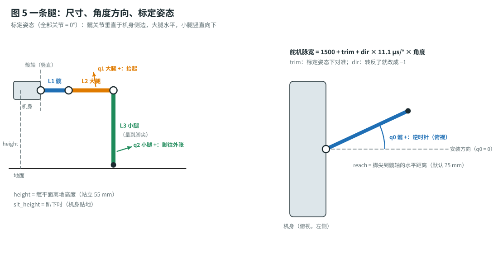
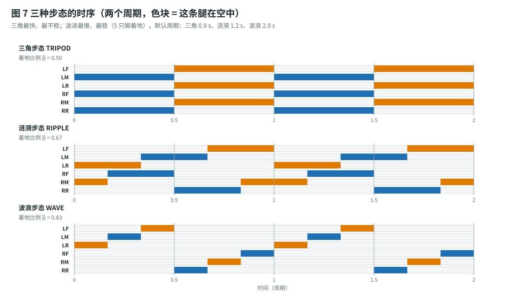

# 手势与步态原理（Gesture Recognition & Hexapod Gait）

> 这篇讲“为什么这样算”。只想做出来的话看[总计划](build-plan.md)和[组装指南](assembly-guide.md)就够了。
> 对应代码：手套 `firmware/glove/gesture.h`；机器人 `firmware/hexapod/leg_ik.h`、`gait.h`、`robot.h`。全部有单元测试（`firmware/tests/test_core.cpp`，144 项）。

## 1. 坐标系和符号

手套和机器人用**同一套右手坐标系**：

| 轴 | 机器人（机身） | 手套（手背，右手手心朝下） |
|---|---|---|
| $x$ | 向前（机头） | 指向指尖 |
| $y$ | 向左 | 指向拇指一侧 |
| $z$ | 向上 | 从手背朝外 |

- **俯仰** pitch $\theta$：绕 $y$ 轴转，$\theta > 0$ = **机头 / 指尖朝下**。
- **横滚** roll $\phi$：绕 $x$ 轴转，$\phi > 0$ = **右侧（小指一侧）朝下**。
- **转向** turn $\omega$：绕 $z$ 轴转，$\omega > 0$ = **逆时针（向左转）**，从上往下看。

因为手和机身的轴一样，“机身模式”里机身直接照抄手掌的 $\theta$、$\phi$ 就是镜像跟随，不需要任何换算。

## 2. 手指：弯曲传感器 → “直 / 弯”

### 2.1 分压电路和电阻怎么选

弯曲传感器是个可变电阻：平直时 $R_\text{flat} \approx 25\ \text{k}\Omega$，弯 $90°$ 时 $R_\text{bent} \approx 60\text{–}100\ \text{k}\Omega$。它和固定电阻 $R$ 串联（图 1），ADC 读中间点：

$$
V_\text{out} = 3.3\ \text{V} \cdot \frac{R}{R + R_\text{flex}}
$$

弯曲 → $R_\text{flex}$ 变大 → $V_\text{out}$ 变小。我们要的是**平直和弯曲两种状态的电压差最大**：

$$
\Delta V(R) = 3.3 \left( \frac{R}{R + R_\text{flat}} - \frac{R}{R + R_\text{bent}} \right)
$$

对 $R$ 求导令其为零，得到

$$
R^{*} = \sqrt{R_\text{flat} \cdot R_\text{bent}}
$$

取 $R_\text{flat} = 25\ \text{k}\Omega$、$R_\text{bent} = 80\ \text{k}\Omega$：$R^{*} = \sqrt{25 \times 80} \approx 44.7\ \text{k}\Omega$，所以选 **47 kΩ**（或两个 100 kΩ 并联 = 50 kΩ）。这时

$$
\Delta V = 3.3 \left( \tfrac{47}{72} - \tfrac{47}{127} \right) \approx 0.93\ \text{V}
$$

约 1200 个 ADC 码（12 位，满量程约 3.1 V），足够分辨。

> 💡 你买到的传感器阻值可能不一样：万用表量一下平直和弯 90° 的电阻，代进 $R^{*}$ 的公式就知道配多大的电阻。

### 2.2 归一化

每只手的传感器位置、手指粗细都不一样，所以**不用绝对电压**，而是标定两次（张开 $v_\text{open}$、握拳 $v_\text{fist}$），把读数归一化成弯曲度：

$$
b = \frac{v - v_\text{open}}{v_\text{fist} - v_\text{open}}, \qquad b \in [-0.2,\ 1.2]
$$

$b = 0$ 就是张开，$b = 1$ 就是握拳。读数先经过一阶低通（$v \leftarrow v + 0.3\,(v_\text{new} - v)$，100 Hz）去掉 ADC 噪声。

### 2.3 滞回（防止手指在门槛附近乱跳）

一个门槛会让“半弯”的手指在直 / 弯之间来回跳。所以用两个门槛：

$$
\text{直} \xrightarrow{\ b > 0.60\ } \text{弯}, \qquad \text{弯} \xrightarrow{\ b < 0.35\ } \text{直}
$$

$b$ 在 $0.35$–$0.60$ 之间时保持原来的状态。

### 2.4 手势和防抖

5 根手指的“直 / 弯”组合查表得到手势（拇指只用来区分“握拳”和“竖拇指”）：

| 食指 | 中指 | 无名指 | 小指 | 拇指 | 手势 | 模式 / 事件 |
|:-:|:-:|:-:|:-:|:-:|---|---|
| 直 | 直 | 直 | 直 | 任意 | OPEN | 行走 WALK |
| 直 | 弯 | 弯 | 弯 | 任意 | POINT | 横移 CRAB |
| 直 | 直 | 弯 | 弯 | 任意 | VICTORY | 机身 BODY |
| 直 | 弯 | 弯 | 直 | 任意 | ROCK | 保持 0.6 s → 换步态 |
| 弯 | 弯 | 弯 | 直 | 任意 | STAND | 保持 1 s → 起立 / 趴下 |
| 弯 | 弯 | 弯 | 弯 | 直 | STAND（竖拇指） | 同上 |
| 弯 | 弯 | 弯 | 弯 | 弯 | FIST | 停 |
| 其他 | | | | | NONE | 停 |

**防抖规则**（`GestureFilter`）：

- 三种**会动**的手势（OPEN、POINT、VICTORY）要连续保持 $150\ \text{ms}$ 才生效。
- **其他手势立刻生效**。所以握拳、或者手势变到一半（认不出来 = NONE），机器人都会马上停：安全优先。
- ROCK、STAND 是“保持触发”：保持够时间触发**一次**，一直保持也不重复。

## 3. 手掌：MPU6050 → 倾角 → 速度

### 3.1 互补滤波

加速度计静止时测到的是重力方向，能算出绝对倾角，但手一动就被运动加速度干扰；陀螺仪积分很平滑，但会慢慢漂。互补滤波取两者之长：

$$
\phi_k = \alpha \left( \phi_{k-1} + \omega_x \,\Delta t \right) + (1 - \alpha)\, \operatorname{atan2}(a_y,\ a_z)
$$

$$
\theta_k = \alpha \left( \theta_{k-1} + \omega_y \,\Delta t \right) + (1 - \alpha)\, \operatorname{atan2}\!\left(-a_x,\ \sqrt{a_y^2 + a_z^2}\right)
$$

其中 $\Delta t = 10\ \text{ms}$，$\alpha = 0.98$。等效时间常数

$$
\tau = \frac{\alpha\,\Delta t}{1 - \alpha} = \frac{0.98 \times 0.01}{0.02} \approx 0.49\ \text{s}
$$

也就是说：比 0.5 秒快的动作信陀螺仪，比 0.5 秒慢的信加速度计。

标定时（手张开放平）同时记下 $\theta_0$、$\phi_0$ 和陀螺仪零偏；以后都用**相对角度** $\theta - \theta_0$、$\phi - \phi_0$。

### 3.2 倾角 → 速度：死区 + 指数曲线

$$
u(\theta) =
\begin{cases}
0, & |\theta| \le \theta_d \\[4pt]
\operatorname{sgn}(\theta) \cdot \min\!\left(1,\ \dfrac{|\theta| - \theta_d}{\theta_f - \theta_d}\right)^{e}, & |\theta| > \theta_d
\end{cases}
$$

默认 $\theta_d = 8°$（死区：手自然抖动、放得不太平都不会让机器人动），$\theta_f = 35°$（到这里就是最快），$e = 1.5$（小角度更细腻）。例如前倾 $20°$：

$$
u = \left( \frac{20 - 8}{35 - 8} \right)^{1.5} = 0.444^{1.5} \approx 0.30
$$

即 30% 速度。各模式的映射：

| 模式 | 前进 $x$ | 横移 $y$ | 转向 $\omega$ | 机身 $\theta_b$ / $\phi_b$ |
|---|---|---|---|---|
| WALK | $u(\theta)$ | 0 | $-u(\phi)$ | 0 |
| CRAB | $u(\theta)$ | $-u(\phi)$ | 0 | 0 |
| BODY | 0 | 0 | 0 | $\theta / \theta_f$、$\phi / \theta_f$（线性，不要死区） |

$\phi$ 前面的负号：手往右翻（$\phi > 0$）要**右**转 / **右**移，而 $\omega$ 和 $y$ 的正方向是左。

## 4. 一条腿的逆运动学

腿坐标系：原点在髋轴上、大腿轴的高度；$x$ 沿腿的安装方向向外，$z$ 向上。给定脚尖位置 $(x, y, z)$，求三个关节角 $q_0$（髋）、$q_1$（大腿）、$q_2$（小腿）。

**髋**：俯视图里就是脚尖的方位角

$$
q_0 = \operatorname{atan2}(y,\ x)
$$

**大腿和小腿**：在腿所在的竖直平面里，是一个二连杆问题。脚尖到大腿轴的水平距离和直线距离：

$$
r = \sqrt{x^2 + y^2} - L_1, \qquad d = \sqrt{r^2 + z^2}
$$

余弦定理（大腿 $L_2$、小腿 $L_3$、对边 $d$）：

$$
q_1 = \operatorname{atan2}(z,\ r) + \arccos\frac{L_2^2 + d^2 - L_3^2}{2 L_2 d}
$$

$$
\gamma = \arccos\frac{L_2^2 + L_3^2 - d^2}{2 L_2 L_3}, \qquad q_2 = \gamma - 90°
$$

$\gamma$ 是膝盖的内角。$q_2 = 0$ 对应膝盖 $90°$（小腿垂直于大腿），这就是标定姿态。验证一下：标定姿态下脚尖在 $r = L_2$、$z = -L_3$，于是

$$
d = \sqrt{L_2^2 + L_3^2}, \quad q_1 = -\arctan\frac{L_3}{L_2} + \arctan\frac{L_3}{L_2} = 0, \quad \gamma = 90° \Rightarrow q_2 = 0 \checkmark
$$

够不着（$d > L_2 + L_3$ 或 $d < |L_2 - L_3|$）时，把 $d$ 夹到边界上，照样算出最接近的姿态，并报 `LIMIT`。关节角再夹到限位内（髋 $\pm 45°$、大腿 $-60°$ ~ $+80°$、小腿 $\pm 60°$）。

最后变成舵机脉宽（MG90S：$2000\ \mu\text{s}$ 对应 $180°$）：

$$
t_\text{pulse} = 1500 + \text{trim} + \text{dir} \cdot \frac{2000}{180} \cdot q \quad [\mu\text{s}]
$$

**机身 → 腿坐标**：髋轴装在机身 $(m_x, m_y)$、朝向 $\psi$ 的腿，

$$
\begin{pmatrix} x_\ell \\ y_\ell \end{pmatrix} =
\begin{pmatrix} \cos\psi & \sin\psi \\ -\sin\psi & \cos\psi \end{pmatrix}
\begin{pmatrix} x - m_x \\ y - m_y \end{pmatrix}
$$

## 5. 步态

### 5.1 相位和着地比例

一个步态周期 $T$ 里相位 $\varphi$ 从 0 走到 1。第 $i$ 条腿的相位是 $\varphi_i = (\varphi + o_i) \bmod 1$：

- $\varphi_i < \beta$：**支撑相**（脚着地）；
- $\varphi_i \ge \beta$：**摆动相**（脚在空中）。

$\beta$ 叫**着地比例**（duty factor）。三种步态：

| 步态 | $\beta$ | 相位偏移 $o_i$（LF LM LR RF RM RR） | 同时着地 |
|---|---|---|---|
| 三角 TRIPOD | $\tfrac12$ | $0,\ \tfrac12,\ 0,\ \tfrac12,\ 0,\ \tfrac12$ | 3 |
| 涟漪 RIPPLE | $\tfrac23$ | $0,\ \tfrac13,\ \tfrac23,\ \tfrac12,\ \tfrac56,\ \tfrac16$ | 4 |
| 波浪 WAVE | $\tfrac56$ | $\tfrac36,\ \tfrac46,\ \tfrac56,\ 0,\ \tfrac16,\ \tfrac26$ | 5 |

三角步态的两组 {LF, LR, RM} 和 {LM, RF, RR} 各自撑成一个三角形（图 6），重心在三角形里就不会倒。

### 5.2 支撑相：脚“反着”机身滑

机身以速度 $\mathbf v = (v_x, v_y)$ 前进、以 $\omega$ 转动时，着地的脚相对机身的速度是

$$
\dot{\mathbf p} = -\left( \mathbf v + \boldsymbol\omega \times \mathbf p \right), \qquad
\boldsymbol\omega \times \mathbf p = \omega \begin{pmatrix} -p_y \\ p_x \end{pmatrix}
$$

代码里每一拍（$\Delta t = 20\ \text{ms}$）先把脚绕机身中心转 $-\omega\Delta t$（精确旋转，不是小角度近似），再平移 $-\mathbf v \Delta t$。

### 5.3 摆动相：落在“下一步的中点之前”

脚抬起的那一刻记下起点 $\mathbf p_s$；落点选在

$$
\mathbf p_\text{land} = \mathbf p_\text{home} + \left( \mathbf v + \boldsymbol\omega \times \mathbf p_\text{home} \right) \frac{\beta T}{2}
$$

这样接下来的支撑相里，脚会**正好在中点经过原位** $\mathbf p_\text{home}$，前后对称，不会越走越偏。摆动中（$k$ 从 0 到 1）：

$$
\mathbf p_{xy} = \mathbf p_s + \left( \mathbf p_\text{land} - \mathbf p_s \right) \frac{1 - \cos \pi k}{2}, \qquad
z = h_\text{lift} \sin \pi k
$$

余弦插值让脚起落时水平速度为零，不打滑；正弦抬脚让脚垂直离地、垂直落地。**落点每一拍都重新算**，所以走到一半改方向，下一只落地的脚就跟着变了。

### 5.4 速度上限

一个支撑相里脚最多滑过一个步长 $S$（`STRIDE`，默认 34 mm）：

$$
v_\text{max} = \frac{S}{\beta T}
$$

| 步态 | $T$ | $v_\text{max}$ |
|---|---|---|
| 三角 | 0.9 s | $\dfrac{34}{0.5 \times 0.9} \approx 75.6\ \text{mm/s}$ |
| 涟漪 | 1.2 s | $\dfrac{34}{\tfrac23 \times 1.2} \approx 42.5\ \text{mm/s}$ |
| 波浪 | 2.0 s | $\dfrac{34}{\tfrac56 \times 2.0} \approx 20.4\ \text{mm/s}$ |

转向时离中心最远的脚 $R_\text{max}$（默认约 146 mm）走得最多，所以 $\omega_\text{max} = v_\text{max} / R_\text{max} \approx 0.52\ \text{rad/s} \approx 30°/\text{s}$，原地转一圈约 12 秒。直行 + 转弯同时有时，把 $(\mathbf v, \omega)$ 按比例缩小，保证**每只脚** $|\mathbf v + \boldsymbol\omega \times \mathbf p_\text{home}| \le v_\text{max}$。

指令先限加速度（默认从 0 到最快 0.5 秒），起步停步都柔和。

### 5.5 停下来

指令归零后，着地的脚不再滑；每条腿轮到摆动时落回原位；**已经在原位的腿就不抬了**。所有脚都回到原位（误差 < 1.5 mm）后相位暂停，六只脚都着地站稳。重新起步时，已经处在摆动窗口中间的腿先不抬，等下一个窗口，避免“半空起跳”。

## 6. 机身姿态（BODY 模式）

脚在地面上不动，机身绕中心转 $\theta_b$（俯仰）、$\phi_b$（横滚）。脚在机身坐标里的位置：

$$
\mathbf p_b = R_y(-\theta_b)\, R_x(-\phi_b)\, \mathbf p
$$

其中 $\mathbf p = (x,\ y,\ z_\text{foot} - h)$，$h$ 是站立高度。机头低下（$\theta_b > 0$）时前脚离机身更近，前面的大腿会抬高——单元测试专门检查了这一点。角度变化限速 $40°/\text{s}$，最大 $\pm 10°$（`body_tilt`；再大前腿就会顶到限位）。

## 7. 舵机够不够力（MG90S 扭矩校核）

估算整机质量：

| 部分 | 质量 |
|---|---|
| 18 × MG90S（13.4 g） | 241 g |
| 2 × 18650 + 电池盒 | 约 110 g |
| ESP32 + 扩展板 | 约 40 g |
| 机身板、腿、螺丝 | 约 170 g |
| **合计** | $m \approx 0.56$–$0.6\ \text{kg}$ |

最坏的是三角步态：只有 3 只脚着地，每只承担

$$
F = \frac{m g}{3} = \frac{0.6 \times 9.81}{3} \approx 1.96\ \text{N}
$$

大腿舵机的力臂是脚尖到大腿轴的水平距离 $r = \text{reach} - L_1 = 75 - 28 = 47\ \text{mm}$：

$$
\tau_\text{femur} = F \cdot r = 1.96 \times 0.047 \approx 0.092\ \text{N·m} \approx 0.94\ \text{kg·cm}
$$

MG90S 堵转扭矩约 $1.8\ \text{kg·cm}$（4.8 V）/ $2.2\ \text{kg·cm}$（6 V），**静态余量约 2 倍**。走路时有冲击（按 1.5 倍算约 $1.4\ \text{kg·cm}$），仍在范围内但不宽裕，所以：

- `REACH` 别超过 80 mm（每加 10 mm，扭矩加约 20%）；
- 慢速、地毯上用**涟漪 / 波浪**：4–5 只脚分担，每只只有 $mg/4$ 甚至 $mg/5$；
- 舵机电压在 5–6 V（阶段 2）；
- 别往机器人上加重物。

小腿舵机的力臂是脚尖相对膝盖的水平偏移（站立时只有约 7 mm），很轻松。

## 8. 无线链路和失控保护

| 项目 | 数值 | 理由 |
|---|---|---|
| 手套发送 | 50 Hz，15 字节，带 CRC-8 和链路号 | 延迟 < 20 ms；广播不需要配对 |
| 机器人回报 | 5 Hz，11 字节 | 电量 / 障碍 / 限位 → 手套振动 |
| **超时** | 300 ms（连丢 15 包） | 超时后速度指令归零，按加速度限制减速、站稳 |
| 事件（起立、换步态） | 带序号，每包都重发 | 丢几包也不会漏；机器人每个序号只执行一次；重新连上时第一包只对齐序号，不会“补执行”旧事件 |
| 手套锁定 | 包里的 ARMED 标志 = 0 | 机器人只站着，事件也不执行 |

最快速度（三角步态 75.6 mm/s）时手套突然断电，机器人还会走：

$$
s = v_\text{max} \cdot t_\text{timeout} + \frac{v_\text{max}^2}{2 a} = 75.6 \times 0.3 + \frac{75.6 \times 0.5}{2} \approx 42\ \text{mm}
$$

4 厘米就停下来了。
