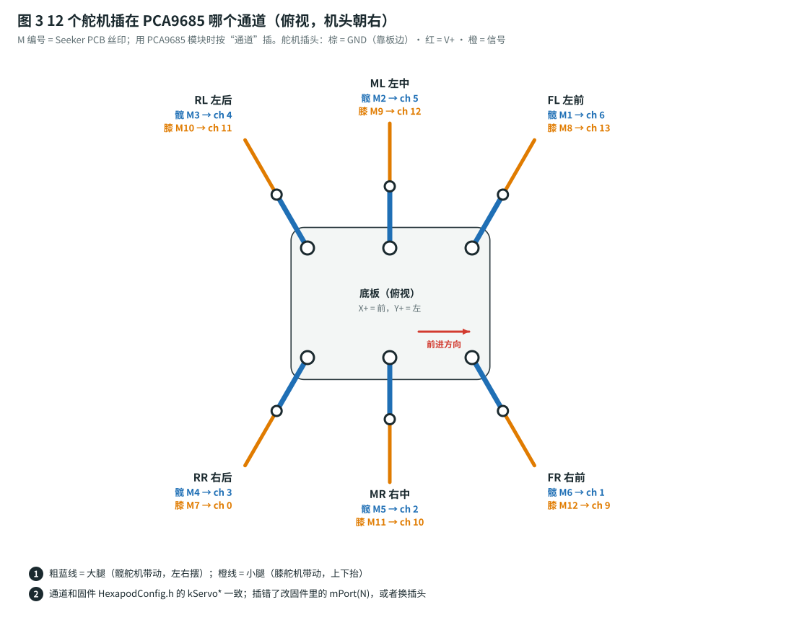

# 接线、焊接、机械装配、舵机标定

> 这份指南用**现成模块 + 洞洞板**搭出和 Seeker 原版 PCB（Sesame V2）**完全相同的电路**。
> 每根线的去向都和原版 PCB 的网表（`doc/pcb/sesamepcb/production/netlist.ipc`）逐根核对过，
> 也和固件 `mcu_ws/lib/RobotConfig/RobotConfig.h` 里 `ENV_ESP32S3SENSE` 的引脚定义一致，**固件引脚一行都不用改**。
>
> 想做原版贴片 PCB 的，看第 8 节。

---

## 1. 接线总表（先看这张）

| XIAO 引脚 | GPIO | 接到哪里 | 原版 PCB 上的网络 | 说明 |
|---|---|---|---|---|
| **D0** | GPIO1 | PCA9685 **OE**，并接 **10 kΩ 上拉到 3V3** | `OE`（R8 上拉） | 舵机总开关。高电平 = 所有舵机不出力（上电默认安全），固件 `arm` 时拉低 |
| **D1** | GPIO2 | BNO085 **INT** | `/G_INT` | 姿态数据就绪中断 |
| **D2** | GPIO3 | **330 Ω** → WS2812 **DIN** | `/RGBADDR`（原版经 SN74LV1T34 升到 5 V） | 状态灯，可选 |
| **D3** | GPIO4 | 电池分压中点：**100 kΩ 到 VIN、22 kΩ 到 GND** | R7 100k / R6 22k | 电池电压检测 |
| **D4** | GPIO5 | **SDA**：PCA9685、BNO085、OLED 三个并联 | `SDA`（R4 4.7k 上拉） | I²C 数据 |
| **D5** | GPIO6 | **SCL**：PCA9685、BNO085、OLED 三个并联 | `SCL`（R5 4.7k 上拉） | I²C 时钟 |
| **D6** | GPIO43 | LD14P 的 **RX** | `/TX` → J4 第 3 脚 | XIAO 发 → 雷达收（启动 / 调转速命令） |
| **D7** | GPIO44 | LD14P 的 **TX** | `/RX` → J4 第 4 脚 | 雷达发 → XIAO 收（230400 bps） |
| **D8** | GPIO7 | MAX98357A **BCLK** | 原版 PCB 没布线，外接 | I²S 位时钟 |
| **D9** | GPIO8 | MAX98357A **LRC** | 同上 | I²S 左右声道时钟 |
| **D10** | GPIO9 | MAX98357A **DIN** | 同上 | I²S 数据 |
| **5V** | — | 5V_SV 经 **1N5819**（条纹端朝 XIAO） | D1 1N5819 | XIAO 从舵机电源取电，同时防止 USB 倒灌 |
| **3V3** | — | PCA9685 **VCC**、BNO085 **VIN**、OLED **VCC** | `3V3` | 逻辑电源，总电流 < 100 mA |
| **GND** | — | 所有模块的 GND | `GND` | 必须共地 |

> ⚠️ **XIAO ESP32S3 Sense 的 microSD 卡槽也用 D8–D10**，所以**不要插 SD 卡**（固件也不用）。
> 摄像头（GPIO 10–18、38–40、47、48）和 PDM 麦克风（GPIO 41 / 42）在扩展板上，不占这些引脚。

---

## 2. 电源接线


### 2.1 电源链路

```
3S 电池 ─XT30─ 保险丝 5A ─ 船型开关 ─┬─ VIN ──────────── 100k/22k 分压 → D3
                                     └─ 降压模块 IN+ ── OUT+ 5.1 V = 5V_SV ─┬─ PCA9685 V+（舵机）+ 1000 µF
                                                                            ├─ LD14P 5V
                                                                            ├─ MAX98357A VIN
                                                                            ├─ WS2812 5V
                                                                            └─ 1N5819 ▶| ─ XIAO 5V ─ XIAO 3V3 ─┬─ PCA9685 VCC
                                                                                                               ├─ BNO085 VIN
                                                                                                               └─ OLED VCC
```

### 2.2 步骤

1. **先调降压模块（最重要）**：降压模块**什么都不接**，输入接电池（或 9–12 V 电源），万用表量输出，拧电位器调到 **5.10 V**。确认后再往下做。
2. 电池 XT30 母头线（红）→ 保险丝座 → 船型开关的一个脚；开关的另一个脚 = **VIN**。电池黑线 = **GND**。全部用 **20 AWG** 线。
3. VIN、GND → 降压模块 IN+、IN−。
4. 降压模块 OUT+ → **PCA9685 的 V+ 螺丝端子**（绿色的那个，不是排针上的 VCC），OUT− → 端子 GND。端子旁边焊一个 **1000 µF 电容**（长脚 +）。
5. OUT+ 同时引一根 22–24 AWG 线到洞洞板的 **5V_SV** 焊盘，洞洞板上再分到雷达、功放、灯、1N5819。
6. **1N5819**：带**白色条纹**的一端（阴极）朝 XIAO 的 5V 脚，另一端接 5V_SV。
7. **分压电阻**：VIN → 100 kΩ → 中点 → 22 kΩ → GND；中点 → XIAO D3。中点和 GND 之间可以再并一个 100 nF 小电容滤波（可选）。

> 💡 为什么要 1N5819？插着 USB 刷固件时，USB 的 5 V 会从 XIAO 的 5V 脚流出去，给 12 个舵机供电，可能把电脑 USB 口拉垮。二极管只让电流从舵机电源流向 XIAO，反方向不通。Seeker 原版 PCB 也是这样做的。

---

## 3. 信号接线


### 3.1 PCA9685 舵机驱动板

| PCA9685 脚 | 接到 | 注意 |
|---|---|---|
| VCC | XIAO **3V3** | 逻辑电，**不是 5 V** |
| GND | GND | |
| SDA | XIAO **D4** | |
| SCL | XIAO **D5** | |
| OE | XIAO **D0**，并接 **10 kΩ 到 3V3** | 模块上 OE 默认是下拉（常开），加上拉后上电时舵机不会乱动 |
| V+（螺丝端子） | 5V_SV（降压模块 OUT+） | 舵机大电流走这里 |
| A0–A5 地址焊盘 | **都不焊** | 地址 0x40 |

### 3.2 BNO085 姿态传感器

| BNO085 脚 | 接到 | 注意 |
|---|---|---|
| VIN | XIAO **3V3** | |
| GND | GND | |
| SDA / SCL | XIAO **D4 / D5** | |
| INT | XIAO **D1** | |
| **DI**（ADR） | **3V3** | 固件用地址 **0x4B**。Adafruit 4754 默认 0x4A，DI 接 3V3 变成 0x4B；国产模块很多默认就是 0x4B，先用 I²C 扫描确认 |
| RST | 不接 | 板上有上拉 |
| PS0 / PS1（如果有） | **都接 GND / 不焊** | 两个都是低电平 = I²C 模式 |

**安装方向**：芯片面朝上，模块上印的 **X 箭头朝机头**（固件的 `imu_link` 和 `base_link` 同向）。要装在机身中心附近，用尼龙柱固定牢，不能晃。

### 3.3 LD14P 激光雷达

| LD14P 脚 | 接到 | 注意 |
|---|---|---|
| 5V（P5V） | 5V_SV | 约 300 mA |
| GND | GND | |
| **TX** | XIAO **D7**（RX） | 交叉接：雷达发 → XIAO 收 |
| **RX** | XIAO **D6**（TX） | 交叉接：XIAO 发 → 雷达收 |

> ⚠️ LD14P 的 4 针线**线序以雷达板上的丝印或说明书为准**（厂家手册：[乐动 LD14P 数据手册](https://www.ldrobot.com/images/2023/03/02/LDROBOT_LD14P%20DataSheet_CN_v0.4_Wlmrp6QT.pdf)、[微雪 D200 Wiki](https://www.waveshare.com/wiki/D200_LiDAR_Kit)）。雷达端插座是 JST GH 1.25 mm 4P。
> 雷达是 3.3 V 电平，可以直接接 XIAO。
> 💡 如果雷达带 USB 转接板，可以**先插电脑**用官方的 [ldlidar_sl_ros2](https://github.com/ldrobotSensorTeam/ldlidar_sl_ros2) 看一下点云，确认雷达是好的，再接 XIAO。

### 3.4 MAX98357A 功放（可选）

| MAX98357A 脚 | 接到 |
|---|---|
| VIN | 5V_SV |
| GND | GND |
| BCLK | XIAO **D8** |
| LRC | XIAO **D9** |
| DIN | XIAO **D10** |
| GAIN | 不接（9 dB） |
| SD | 不接（左右声道混音输出） |
| 喇叭 + / − | 8 Ω 喇叭 |

### 3.5 OLED 显示屏（可选）

VCC → **3V3**，GND → GND，SCL → **D5**，SDA → **D4**。地址 0x3C。

### 3.6 WS2812 状态灯（可选）

5V → 5V_SV，GND → GND，DIN ← **330 Ω** ← XIAO **D2**。
大多数灯珠用 3.3 V 数据线能亮；不稳定就学原版 PCB 加一片电平转换（SN74LV1T34 / 74AHCT1G125），或者灯珠的 5V 串一个 1N5819 降到约 4.7 V。

### 3.7 I²C 上拉电阻

PCA9685、BNO085、OLED 模块**板上一般都自带上拉电阻**（4.7–10 kΩ），三个并联后已经够用，**不用再加**。如果你的模块都没有上拉（背面找不到 SDA / SCL 旁边的 472 / 103 电阻），就在洞洞板上加 2 个 **4.7 kΩ** 分别从 SDA、SCL 接到 3V3（和原版 PCB 的 R4 / R5 一样）。

---

## 4. 12 个舵机插哪个通道



| 腿 | 固件编号 | 髋舵机（左右摆） | 膝舵机（上下抬） |
|---|---|---|---|
| FL 左前 | leg 0 | M1 → **PCA9685 通道 6** | M8 → **通道 13** |
| FR 右前 | leg 1 | M6 → **通道 1** | M12 → **通道 9** |
| ML 左中 | leg 2 | M2 → **通道 5** | M9 → **通道 12** |
| MR 右中 | leg 3 | M5 → **通道 2** | M11 → **通道 10** |
| RL 左后 | leg 4 | M3 → **通道 4** | M10 → **通道 11** |
| RR 右后 | leg 5 | M4 → **通道 3** | M7 → **通道 0** |

- “M 编号” 是原版 PCB 上的丝印，“通道” 是 PCA9685 模块上印的 0–15。用模块就**按通道插**。通道 7、14、15 不用。
- 舵机插头方向：**棕线 = GND**、红线 = V+、橙线 = 信号，对准 PCA9685 排针旁印的 `GND / V+ / PWM`。
- 对应关系来自固件 `HexapodConfig.h` 的 `kServoFL_Hip = Config::mPort(1)` 等 12 行 + `RobotConfig.h` 的 `kMPortToChannel`。想换插法就改这 12 行。
- 每根舵机线插好后贴上标签（如 “FL-髋”），以后查线省很多事。

---

## 5. 洞洞板布局与焊接

建议一块 5 × 7 cm 洞洞板装：XIAO（插在排母上）、BNO085（插在排母上，保证水平）、1N5819、分压电阻、10 kΩ OE 上拉、330 Ω、100 µF，再引出几组排针：

```
            ┌──────────────── 5 × 7 cm 洞洞板（俯视，上方 = 机头）────────────────┐
            │  [5V_SV 2P]   [VIN 2P]            [雷达 4P: 5V GND D6 D7]            │
            │                                                                     │
            │   1N5819 ▶|        ┌──────────────┐     100k ─┬─ 22k                 │
            │   100µF            │ XIAO 排母 ×2  │           └→ D3                  │
            │                    │  USB-C 朝后   │     10k (OE 上拉)                 │
            │                    └──────────────┘     330Ω (灯)                     │
            │                                                                     │
            │   ┌──────────┐                                                      │
            │   │ BNO085   │ X 箭头 → 机头                                          │
            │   └──────────┘                                                      │
            │  [I²C 5P: 3V3 GND SDA SCL OE → PCA9685]  [OLED 4P]  [功放 5P]  [灯 3P] │
            └─────────────────────────────────────────────────────────────────────┘
```

焊接要点：

1. **先焊排母**，XIAO 插上去对齐，再焊其他。XIAO 的 USB-C 朝机尾方向，装好后插线方便。
2. 3V3、GND、5V_SV 用板子背面的**焊锡拉线**或单芯线走成 3 条 “母线”，所有模块从母线上取电。
3. 信号线用 26 AWG 硅胶线，**每焊一根，就在总表（第 1 节）上打个勾**。
4. 焊完先**不插 XIAO**，用万用表：3V3–GND、5V_SV–GND、VIN–GND 三组之间都**不能短路**（电阻 > 1 kΩ）。

---

## 6. 机械装配

先看整机长什么样（[`cad/img/assembly.png`](../cad/img/assembly.png)）：


### 6.1 装配前准备

1. 打印件去毛刺，方孔用小锉刀修一下。舵机应该**稍微用力就能推进方孔**，太松就改 `params.scad` 的 `clearance` 重打。
2. M2 自攻螺丝第一次拧进塑料会很紧，**先拧一次再退出来**，装舵机时就顺了。

### 6.2 舵机回中（装舵机臂之前必须做）

**舵机臂的初始角度决定了腿能不能走**。所有舵机在装舵机臂之前都要先转到**中位（1500 µs）**：

- 方法 A（推荐）：淘宝买一个 ¥5 的 **“舵机测试仪”**（CCPM Servo Tester），接 5 V，拨到 **中位 / Neutral** 档，舵机插上去就转到中位。
- 方法 B：用 Seeker 的 `test_sub_servo` 固件（见软件文档 §7.7）：`arm`，`attach <通道>`，把舵机转到中间位置。

### 6.3 装配步骤

| 步骤 | 做什么 | 检查点 |
|---|---|---|
| 1 | **髋舵机装进底板**：从**上往下**插进 6 个方孔，**输出轴朝下**、**输出轴靠近底板外边缘**那一头；安装耳压在底板上面，每个用 2 颗 M2 × 6 自攻螺丝固定 | 6 个输出轴都在底板边缘附近，从下面能看到 |
| 2 | **膝舵机装进大腿**：左边三条腿用**大腿 A**，右边三条用**大腿 B**。舵机从侧板**外面**插进方孔，**输出轴朝外、靠远离髋端的那一头**，安装耳贴侧板外表面，2 颗 M2 自攻螺丝 | 从大腿顶面看，舵机在横板下面，输出轴朝侧板外 |
| 3 | **舵机臂压进凹槽**：大腿顶面、小腿有凹槽的一面，各压一个**单边舵机臂**（花键凸台朝外），用 2 颗 M2 自攻螺丝穿过舵机臂的孔拧进塑料。孔位对不上就用 1.5 mm 钻头补孔 | 舵机臂和零件表面平齐，不晃 |
| 4 | **回中**（6.2 节）：12 个舵机全部转到中位 | |
| 5 | **装大腿**：从底板下面把大腿的舵机臂按到髋舵机花键上，大腿**沿方孔方向笔直朝外**；从大腿下面的中心孔拧进舵机臂螺丝 | 6 条大腿都朝外，左右对称 |
| 6 | **装小腿**：把小腿的舵机臂按到膝舵机花键上，**小腿朝下斜 45°**；拧舵机臂螺丝 | 6 条小腿角度一致 |
| 7 | **走线**：膝舵机的线沿大腿走到髋附近，从底板上的**走线槽**穿到上面；髋附近**留 3–4 cm 余量**（髋要左右摆 ±25°），用扎带固定在大腿上 | 手动转大腿到两头，线都不绷紧 |
| 8 | **铜柱**：4 根 M3 × 25 铜柱拧在底板的 4 个 M3 孔上（中间孔阵旁边那 4 个，坐标 ±34, ±22） | |
| 9 | **电池**：两条魔术贴扎带穿过底板的 4 个长槽，把电池绑在**底板下面正中间**，XT30 线从旁边绕上来 | 电池不碰任何大腿 |
| 10 | **降压模块、保险丝**：用双面胶 + 扎带固定在底板**上面**中间的孔阵上（离电池近，大电流线短） | |
| 11 | **甲板**：船型开关卡进甲板**后面**的方孔；PCA9685、洞洞板用尼龙柱固定在孔阵上；甲板用 4 颗 M3 螺丝拧在铜柱上 | BNO085 的 X 箭头朝前（甲板竖板那边 = 前） |
| 12 | **雷达**：用 4 根 **M3 × 20 尼龙柱**把雷达架在甲板中间（柱子拧在孔阵上，雷达底座用双面泡棉胶或扎带固定），下面的空间放模块。**雷达的扫描面必须高于前面所有东西**（包括竖板和摄像头板） | 从侧面看，雷达镜头那一圈是整机最高的 |
| 13 | **摄像头板（可选）**：第二块 XIAO ESP32S3 Sense（或 ESP32-CAM）用扎带绑在甲板前沿的竖板上，镜头朝前 | |
| 14 | **12 根舵机线**按第 4 节插到 PCA9685 | 棕线对 GND |

> 💡 **标定时的一个小细节**：小腿装在膝舵机的外侧，比大腿中心线偏出去约 18 mm，所以脚尖比大腿 “歪” 约 13°。标定髋关节 0° 时，让**脚尖**（而不是大腿）落在腿的安装方向上，走起来更直。

---

## 7. 第一次通电检查清单

按顺序做，每一步都对了再往下：

| # | 操作 | 期望 |
|---|---|---|
| 1 | 电池开关**关**，万用表量 VIN–GND、5V_SV–GND、3V3–GND | 都不短路（> 1 kΩ） |
| 2 | 拔掉 XIAO 和所有舵机线，只开电池开关 | 5V_SV = 5.0–5.2 V；D3 焊盘 = 电池电压 × 0.18（12.0 V 电池 → 2.16 V） |
| 3 | 关开关，插上 XIAO，再开开关 | XIAO 电源灯亮；XIAO 的 5V 脚 ≈ 4.8 V（二极管压降约 0.3 V） |
| 4 | 量 XIAO 3V3 脚 | 3.25–3.35 V |
| 5 | 关开关，插 1 个舵机到通道 0，开开关 | 舵机**不动**（OE 被上拉，所有输出关闭）——这是对的 |
| 6 | 刷 `test_sub_servo`（软件文档 §7.7）测这个舵机 | `arm` 以后能转 |
| 7 | 12 个舵机全部插上，逐个测 | 每个都能转，转的时候 5V_SV 不低于 4.8 V |

---

## 8. 另一种做法：做原版 Sesame V2 PCB（进阶）

Seeker 仓库 `doc/pcb/sesamepcb/` 里是完整的 **KiCad** 工程（原理图、PCB、Gerber、BOM、贴片坐标），用 **Git LFS** 存的：

```bash
git clone https://github.com/SeekerRobot/seeker-robot.git
cd seeker-robot
git lfs install && git lfs pull        # 不 pull 的话文件只有 130 字节的指针
ls doc/pcb/sesamepcb/production/       # SesameV2.zip (Gerber)、SesameV2_bom.csv、SesameV2_positions.csv
```

| 项目 | 说明 |
|---|---|
| 主要芯片 | TPS54427 降压（4 A）、PCA9685PW（TSSOP-28）、BNO085（LGA，**手焊很难**）、SN74LV1T34（电平转换）、XIAO ESP32S3 以**贴片方式**焊在板上 |
| 接口 | BT1 = XT30 电池；J2 = OLED（JST ZH 1.5 mm 4P：1 = 3V3、2 = GND、3 = SCL、4 = SDA）；J4 = LD14P（JST ZH 1.5 mm 4P：1 = 5V、2 = GND、3 = XIAO TX、4 = XIAO RX）；M1–M13 舵机排针；SW1 电源拨动开关；SW2 复位 |
| 下单 | [嘉立创 JLCPCB](https://jlcpcb.com/) 上传 `SesameV2.zip` 做 PCB，用 `SesameV2_bom.csv` + `SesameV2_positions.csv` 做 SMT 贴片。**BOM 里的立创编号（LCSC Part #）是空的**，要自己在立创商城一个个选料 |
| 注意 | 喇叭的 D8–D10 在原版 PCB 上**没有布线**，功放要飞线接到 XIAO 焊盘上；BNO085 建议让工厂贴 |
| 工具 | [KiCad](https://www.kicad.org/download/) 8 或 9；工程里配了 [Fabrication Toolkit](https://github.com/bennymeg/Fabrication-Toolkit) 插件，可以一键重新导出生产文件 |

没有贴片经验的话，**先用第 1–7 节的模块方案**把机器人做出来，走通以后再考虑换 PCB。
